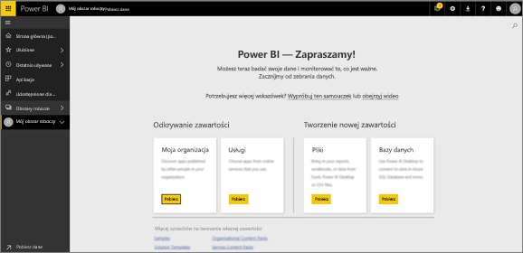
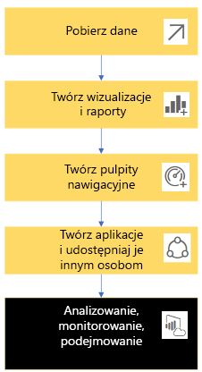
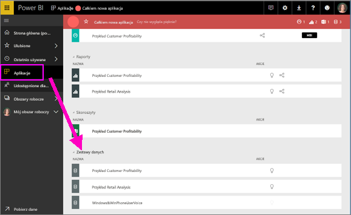
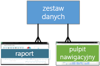
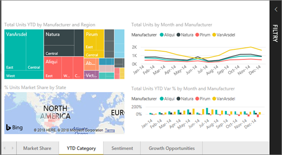
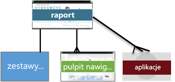
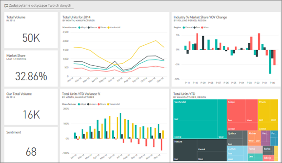
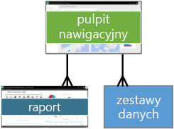
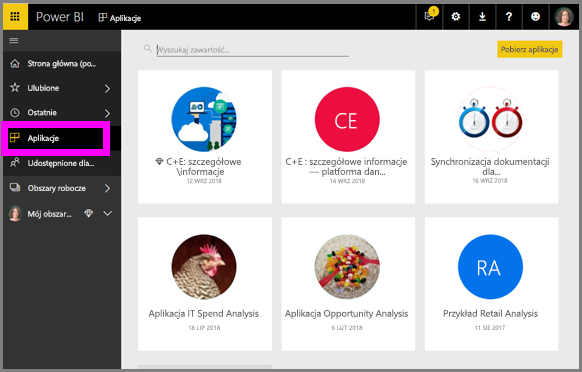
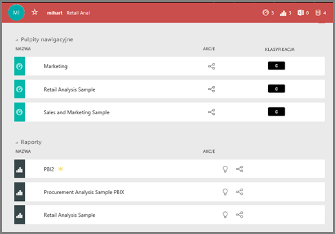

# Podstawowe pojęcia dla ***użytkowników*** usługi Power BI

## *Użytkownicy* i *projektanci* usługi Power BI
W tym artykule przyjęto założenie, że przeczytano wcześniej [omówienie usługi Power BI](../power-bi-overview.md) i na podstawie tego artykułu dokonano przyporządkowania do roli ***użytkownika*** usługi Power BI. Użytkownicy otrzymują od swoich współpracowników zawartość usługi Power BI, na przykład pulpity nawigacyjne i raporty. Użytkownicy korzystają z usługi Power BI, czyli wersji internetowej programu Power BI. 

Na pewno znany jest Ci termin „Power BI Desktop” lub po prostu „Desktop” oznaczający autonomiczne narzędzie używane przez *projektantów*, którzy tworzą i udostępniają użytkownikom pulpity nawigacyjne oraz raporty. Dobrze jest wiedzieć, że istnieją inne narzędzia Power BI, ale dopóki jesteś użytkownikiem, będziesz pracować tylko z usługą Power BI. Z tego powodu ten artykuł dotyczy tylko usługi Power BI. 

## Terminy i pojęcia
Ten artykuł nie jest ani przewodnikiem wizualnym po usłudze Power BI, ani praktycznym samouczkiem. Zamiast tego jest to artykuł zawierający przystępny opis pojęć i terminów dotyczących usługi Power BI. Jego zadaniem jest zapoznanie Cię z terminologią i architekturą usługi. Jeśli szukasz przewodnika po usłudze Power BI i chcesz wiedzieć, jak można z niej korzystać, [zapoznaj się z produktem](end-user-experience.md).

## Otwieranie usługi Power BI po raz pierwszy
Większość użytkowników spotyka się z usługą Power BI w następujących okolicznościach: 1) firma kupuje licencję i 2) administrator przypisuje te licencje do pracowników, takich jak Ty. 

Aby rozpocząć pracę, po prostu otwórz przeglądarkę i wpisz **app.powerbi.com**. Przy pierwszym otwarciu usługi Power BI zobaczysz ekran podobny do poniższego.

W trakcie korzystania z usługi Power BI spersonalizujesz ekran wyświetlany każdorazowo po otwarciu tej witryny internetowej.  Na przykład niektóre osoby wolą, aby usługa Power BI otwierała się na Stronie głównej, a inni mają swoje ulubione pulpity nawigacyjne i chcą, aby były one wyświetlane najpierw. Nie martw się. Pokażemy Ci, jak się to robi. 
- [Podgląd Strony głównej](https://powerbi.microsoft.com/en-us/blog/introducing-power-bi-home-and-global-search)    
- [Ustawianie zawartości jako **wyróżnionej**](end-user-featured.md) 

Zanim jednak przejdziemy dalej, omówimy bloki konstrukcyjne, z których składa się usługa Power BI.

## ***Zawartość*** usługi Power BI
### Wprowadzenie do bloków konstrukcyjnych
Użytkownik usługi Power BI może korzystać z pięciu bloków konstrukcyjnych: ***wizualizacji***, ***pulpitów nawigacyjnych***, ***raportów***, ***aplikacji*** i  ***zestawów danych***. Są one czasami określane jako ***zawartość*** usługi *Power BI*. *Zawartości* istnieje w ***obszarach roboczych***. Typowy przepływ pracy obejmuje wszystkie te bloki konstrukcyjne:  *Projektant* usługi Power BI (oznaczony kolorem żółtym na diagramie poniżej) zbiera dane z *zestawów danych*, przekazuje je do usługi Power BI do analizy, tworzy *raporty* pełne *wizualizacji* podkreślających interesujące fakty i szczegółowe informacje, przypina wizualizacje z raportów do pulpitu nawigacyjnego i udostępnia raporty oraz pulpity nawigacyjne *użytkownikom* takim jak Ty (oznaczonym kolorem czarnym na diagramie poniżej) w formie *aplikacji* lub innych rodzajów zawartości udostępnionej. 

Tak to wygląda w największym uproszczeniu. 
*  ***wizualizacja*** (lub *visual*) jest typem wykresu utworzonego przez *projektantów* usługi Power BI przy użyciu danych z *raportów* i *zestawów danych*. Zwykle *projektanci* tworzą wizualizacje w programie Power BI Desktop. 

    Aby uzyskać więcej informacji, zobacz [Visualizations for Power BI *consumers*](end-user-visualizations.md) (Wizualizacje dla użytkowników usługi Power BI)

*  *zestaw danych* jest kontenerem danych. Może to być na przykład plik programu Excel ze Światowej Organizacji Zdrowia, należąca do firmy baza danych klientów lub plik platformy Salesforce.  

*  *pulpit nawigacyjny* to pojedynczy ekran z interaktywnymi wizualizacjami, tekstem i grafiką. Pulpit nawigacyjny umożliwia zebranie na jednym ekranie najważniejszych metryk w celu przekazania informacji lub udzielenia odpowiedzi na pytanie. Zawartość pulpitu nawigacyjnego pochodzi z co najmniej jednego raportu i z co najmniej jednego zestawu danych.

    Aby uzyskać więcej informacji, zobacz [Pulpity nawigacyjne dla *użytkowników* usługi Power BI](end-user-dashboards.md)

*  *raport* to jedna lub większa liczba stron zawierających interaktywne wizualizacje, tekst i grafikę, które razem składają się na pojedynczy raport. Raport bazuje na jednym zestawie danych. Często strony raportu są ułożone w taki sposób, aby każda z nich odnosiła się do kluczowego obszaru zainteresowań lub odpowiadała na jedno pytanie.

    Aby uzyskać więcej informacji, zobacz [Raporty dla *użytkowników* usługi Power BI](end-user-reports.md)

*  *aplikacja* to sposób, w jaki *projektanci* łączą razem i udostępniają powiązane pulpity nawigacyjne i raporty. *Użytkownicy* automatycznie otrzymują niektóre aplikacje, ale mogą też wyszukiwać inne aplikacje utworzone przez współpracowników lub przez społeczność. Aplikacje usługi Power BI oferują na przykład usługi zewnętrzne, których być może już używasz, takie jak Google Analytics i Microsoft Dynamics CRM.

Dla ścisłości, nowi użytkownicy, którzy logują się do usługi Power BI po raz pierwszy, nie mają jeszcze żadnych pulpitów nawigacyjnych, aplikacji ani raportów. 
_______________________________________________________

## Zestawy danych
*Zestaw danych* jest kolekcją danych, którą *projektanci* importują lub z którą się łączą, aby przy jej użyciu tworzyć raporty i pulpity nawigacyjne. Jako użytkownik nie będziesz korzystać bezpośrednio z zestawów danych, ale warto wiedzieć, jaką pełnią one rolę w całym środowisku.  

Każdy z zestawów danych reprezentuje jedno źródło danych, np. skoroszyt programu Excel w usłudze OneDrive, lokalny tabelaryczny zestaw danych SSAS lub zestaw danych programu Salesforce. Obsługiwanych jest wiele różnych źródeł danych.

Gdy projektant udostępni Ci aplikację, możesz zobaczyć, które zestawy danych są do niej dołączone. 

**JEDNEGO** zestawu danych...

* Można używać wiele razy.
* Można używać w wielu różnych raportach.
* Wizualizacje z tego jednego zestawu danych można wyświetlać w wielu różnych pulpitach nawigacyjnych.
  
  

Przejdźmy do następnego bloku konstrukcyjnego — wizualizacji.
__________________________________________________________

## Wizualizacje
Wizualizacje prezentują szczegółowe informacje, które zostały odnalezione w danych. Wizualizacje ułatwiają interpretowanie szczegółowych informacji, ponieważ mózg potrafi szybciej zrozumieć dane w postaci obrazu niż arkusza kalkulacyjnego pełnego liczb.

W usłudze Power BI można napotkać różne wizualizacje, na przykład kaskadowe, wstążkowe, w postaci mapy drzewa, kołowe, lejkowe, kartowe, punktowe i w postaci miernika. Zobacz [pełną listę wizualizacji dostępnych w usłudze Power BI](../power-bi-visualization-types-for-reports-and-q-and-a.md).

   

Wizualizacje są także dostępne za pośrednictwem społeczności. Są one wtedy nazywane *wizualizacjami niestandardowymi*. Jeśli otrzymasz raport z wizualizacją, której nie rozpoznajesz, najprawdopodobniej jest to wizualizacja niestandardowa. Jeśli będziesz potrzebować pomocy w zinterpretowaniu wizualizacji niestandardowej, <!--[look up the name of the report or dashboard *designer*](end-user-owner.md)-->wyszukaj nazwę *projektanta* raportu lub pulpitu nawigacyjnego i skontaktuj się z nim.

**JEDNEJ** wizualizacji w raporcie...

* Można używać wiele razy w tym samym raporcie, korzystając z opcji kopiowania/wklejania.
* Można używać na wielu różnych pulpitach nawigacyjnych.
__________________________________________________
## Raporty
Raport usługi Power BI składa się z jednej lub większej liczby stron z wizualizacjami, grafiką i tekstem. Wszystkie wizualizacje w raporcie pochodzą z jednego zestawu danych. *Projektanci* udostępniają raporty *użytkownikom*, którzy [wchodzą w interakcje z raportami w *widoku do czytania*](end-user-reading-view.md).

**JEDEN** raport...

* Może być skojarzony z wieloma pulpitami nawigacyjnymi (kafelki przypięte z tego raportu mogą pojawiać się na wielu pulpitach nawigacyjnych).
* Jest tworzony przy użyciu danych pochodzących tylko z jednego zestawu danych.  
* Może być częścią wielu aplikacji.
  
  

________________________________________________

## Pulpity nawigacyjne
Pulpit nawigacyjny reprezentuje dostosowany widok przedstawiający podzbiór bazowych zestawów danych. *Projektanci* tworzą pulpity nawigacyjne i udostępniają je *użytkownikom* — indywidualnie lub jako część aplikacji. Pulpit nawigacyjny to jedna kanwa zawierająca *kafelki*, grafiki i tekst. 

  

Kafelek to renderowanie wizualizacji, które *projektant* *przypina* na przykład z raportu do pulpitu nawigacyjnego.  Każdy przypięty kafelek wyświetla [wizualizację](end-user-visualizations.md), która została utworzona na podstawie zestawu danych i przypięta do pulpitu nawigacyjnego. Kafelek może również zawierać całą stronę raportu, dane transmisji strumieniowej na żywo lub wideo. Istnieje wiele sposobów, na które *projektanci* mogą dodawać kafelki do pulpitów nawigacyjnych; zbyt wiele, aby uwzględnić je w tym temacie. Aby dowiedzieć się więcej, zobacz [Kafelki pulpitu nawigacyjnego w usłudze Power BI](end-user-tiles.md). 

Z punktu widzenia użytkownika pulpitów nawigacyjnych nie można edytować. Można jednak dodawać do nich komentarze, wyświetlać powiązane z nimi dane, ustawiać je jako ulubione, subskrybować i nie tylko. 

Jakie są zastosowania pulpitów nawigacyjnych?  Poniżej przedstawiono kilka z nich:

* Aby zobaczyć, na pierwszy rzut oka, wszystkie informacje wymagane do podejmowania decyzji.
* Aby monitorować najważniejsze informacje dotyczące firmy.
* Aby upewnić się, że wszyscy współpracownicy są na tej samej stronie i używają tych samych informacji.
* Aby monitorować kondycję firmy, produktu, jednostki biznesowej lub kampanii marketingowej itd.
* Aby tworzyć spersonalizowany widok większego pulpitu nawigacyjnego — zawierający wszystkie ważne metryki.

**JEDEN** pulpit nawigacyjny...

* Może wyświetlać wizualizacje z wielu różnych zestawów danych.
* Może wyświetlać wizualizacje z wielu różnych raportów.
* Może wyświetlać wizualizacje przypięte z innych narzędzi (np. programu Excel).
  
  

________________________________________________

## Aplikacje
Te kolekcje pulpitów nawigacyjnych i raportów organizują powiązaną zawartość w jeden pakiet. *Projektanci* usługi Power BI tworzą je i udostępniają użytkownikom indywidualnym, grupom, całej organizacji lub publicznej społeczności. Jako użytkownik możesz mieć pewność, że Ty i Twoi współpracownicy pracujecie z tymi samymi danymi — jedną zaufaną wersją faktów. 

Aplikacje można łatwo znaleźć i zainstalować w usłudze Power BI (https://powerbi.com) i na urządzeniu przenośnym. Gdy zainstalujesz aplikację, nie musisz pamiętać nazw wielu różnych pulpitów nawigacyjnych, ponieważ są one wszystkie razem w jednej aplikacji, w przeglądarce lub na urządzeniu przenośnym. 

Ta aplikacja ma trzy powiązane pulpity nawigacyjne i trzy powiązane raporty, które tworzą pojedynczą aplikację.

Kiedy autor aplikacji udostępnia aktualizację, zmiany są automatycznie widoczne w aplikacji. Autor ustala również harmonogram odświeżania danych, dzięki czemu nie musisz się martwić o zachowywanie ich aktualności.

Aplikacje można uzyskać na kilka różnych sposobów. Projektant aplikacji może automatycznie zainstalować aplikację na Twoim koncie usługi Power BI lub może wysłać Ci bezpośredni link do aplikacji. Możesz też wyszukać aplikację w usłudze Microsoft AppSource, gdzie są widoczne wszystkie aplikacje, do których masz dostęp. W usłudze Power BI na urządzeniu przenośnym aplikacje można instalować tylko za pomocą linku bezpośredniego, a nie z usługi AppSource. Jeśli projektant aplikacji zainstaluje ją automatycznie, zobaczysz ją na swojej liście aplikacji.

Po zainstalowaniu aplikacji wystarczy wybrać ją na liście aplikacji i zdecydować, który pulpit nawigacyjny lub raport ma być otwierany i eksplorowany jako pierwszy.   

Mam nadzieję, że ten artykuł był pomocny w zrozumieniu bloków konstrukcyjnych tworzących usługę Power BI dla użytkowników. 

## Następne kroki
- Przejrzyj [słownik](end-user-glossary.md) i dodaj do niego zakładki    
- Zapoznaj się z [przewodnikiem po usłudze Power BI](end-user-experience.md)
- Przeczytaj [omówienie usługi Power BI napisane specjalnie dla użytkowników](end-user-consumer.md)    
- Obejrzyj wideo, w którym Will omawia podstawowe pojęcia i przedstawia przewodnik po usłudze Power BI. <iframe width="560" height="315" src="https://www.youtube.com/embed/B2vd4MQrz4M" frameborder="0" allowfullscreen></iframe>