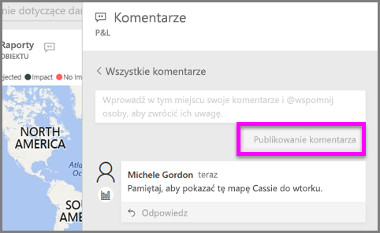
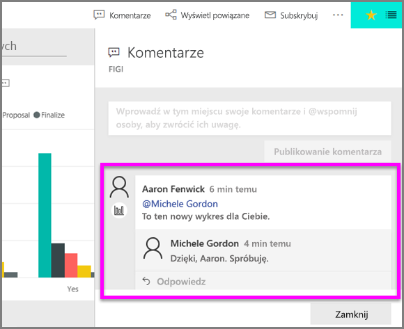

# Dodawanie komentarzy do wizualizacji
Dodaj osobisty komentarz lub rozpocznij konwersację o wizualizacji ze współpracownikami. Funkcja **komentarzy** to tylko jeden ze sposobów, w jakie *użytkownik* może wchodzić w interakcje z wizualizacją. 

## Sposób użycia funkcji komentarzy

1. Umieść kursor na wizualizacji i wybierz wielokropek (...).    
2. Z listy rozwijanej wybierz opcję **Dodaj komentarz**.

      

3.  Wpisz swój komentarz i wybierz opcję **Opublikuj komentarz**. Jest to komentarz do siebie — kompletny, z nieprawidłową pisownią.

      

4. Oto rozmowa, którą prowadzę z *projektantem* wizualizacji. Używa on symbolu @, aby upewnić się, że zobaczę komentarz. Wiem, że ten komentarz jest przeznaczony dla mnie. Po otwarciu pulpitu nawigacyjnego tej aplikacji w usłudze Power BI mogę wybrać opcję **Komentarze** z nagłówka. Okienko **Komentarze** wyświetla naszą konwersację. 

      

5. Kliknij przycisk **Zamknij**, aby powrócić do pulpitu nawigacyjnego lub raportu.

## Następne kroki
Powrót do [wizualizacji dla użytkowników](end-user-visualizations.md)    
<!--[Select a visualization to open a report](end-user-open-report.md)-->