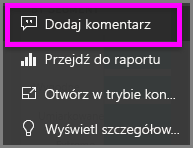

# Dodawanie komentarzy do pulpitu nawigacyjnego
Dodaj osobisty komentarz lub rozpocznij konwersację o pulpicie nawigacyjnym ze współpracownikami. Funkcja **komentarzy** to tylko jedna z możliwych metod komunikowania się *użytkownika* z innymi osobami. 

## Jak używać funkcji komentarzy
Komentarze można dodawać do całego pulpitu nawigacyjnego lub do poszczególnych wizualizacji na pulpicie nawigacyjnym. Można dodać komentarz ogólny lub skierowany do określonych współpracowników.  

### Dodawanie ogólnego komentarza do pulpitu nawigacyjnego
1. Otwórz pulpit nawigacyjny usługi Power BI i wybierz ikonę **Komentarze**. Spowoduje to otwarcie okna dialogowego Komentarze.

    

    Tutaj widać, że twórca pulpitu nawigacyjnego dodał już ogólny komentarz.  Każda osoba mająca dostęp do tego pulpitu nawigacyjnego może zobaczyć ten komentarz.

    

2. Aby odpowiedzieć, wybierz pozycję **Odpowiedz**, wpisz odpowiedź i wybierz pozycję **Opublikuj**.  

    

    Domyślnie usługa Power BI kieruje odpowiedź do współpracownika, który utworzył wątek komentarzy, w tym przypadku do użytkownika Aaron F. 

    

 3. Jeśli chcesz dodać komentarz do pulpitu nawigacyjnego, który nie należy do istniejącego wątku, wprowadź komentarz w polu tekstowym u góry.

    

    Komentarze do tego pulpitu nawigacyjnego wyglądają teraz następująco.

    

### Dodawanie komentarza do określonej wizualizacji pulpitu nawigacyjnego
1. Umieść kursor na wizualizacji i wybierz wielokropek (...).    
2. Z listy rozwijanej wybierz opcję **Dodaj komentarz**.

      

3.  Zostanie otwarte okno dialogowe **Komentarze**. Ta wizualizacja nie ma jeszcze żadnych komentarzy. 

      

4. Wpisz swój komentarz i wybierz pozycję **Opublikuj**.

      

    Ikona wykresu  informuje o tym, że ten komentarz jest związany z określoną wizualizacją. Wybierz tę ikonę, aby wyróżnić powiązaną wizualizację na pulpicie nawigacyjnym.

    

5. Wybierz pozycję **Zamknij**, aby wrócić do pulpitu nawigacyjnego lub raportu.

### Przyciąganie uwagi współpracowników przy użyciu znaku @
Gdy komentujesz pulpit nawigacyjny czy konkretną wizualizację, możesz przyciągnąć uwagę współpracowników przy użyciu symbolu „@”.  Gdy wpiszesz symbol „@”, usługa Power BI otworzy listę rozwijaną, na której możesz wyszukać i wybrać osoby z organizacji. Wszystkie zweryfikowane nazwy poprzedzone symbolem „@” są wyświetlane przy użyciu niebieskiej czcionki. 

Oto rozmowa, którą prowadzę z *projektantem* wizualizacji. Używa on symbolu @, aby upewnić się, że zobaczę komentarz. Wiem, że ten komentarz jest przeznaczony dla mnie. Po otwarciu pulpitu nawigacyjnego tej aplikacji w usłudze Power BI mogę wybrać opcję **Komentarze** z nagłówka. Okienko **Komentarze** wyświetla naszą konwersację.

  

## Następne kroki
Powrót do [wizualizacji dla użytkowników](end-user-visualizations.md)    
<!--[Select a visualization to open a report](end-user-open-report.md)-->