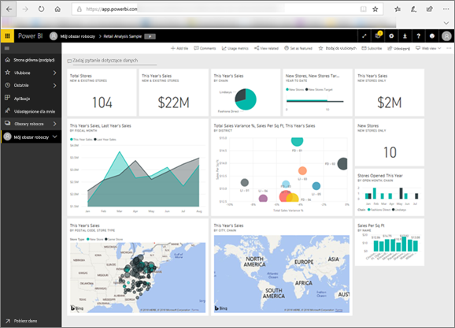

# Usługa Power BI dla użytkowników
Sposób interakcji z usługą Power BI będzie zależeć od Twojego stanowiska. Jako *użytkownik końcowy* lub *użytkownik* jesteś osobą, która otrzymuje od współpracowników pulpity nawigacyjne, raporty i aplikacje. Pracujesz w ***usłudze Power BI***, aby przeglądać i korzystać z tej zawartości w celu podejmowania decyzji biznesowych.

Jeśli jesteś nowym użytkownikiem usługi Power BI, zalecamy przeczytanie najpierw [omówienia usługi Power BI](../power-bi-overview.md). Poznasz tam zestaw narzędzi, które tworzą usługę Power BI.

Jako użytkownik nie będziesz mieć dostępu do pełnych możliwości usługi Power BI — i jest to właściwe, ponieważ Twoim zadaniem nie jest tworzenie pulpitów nawigacyjnych i raportów. Twoim zadaniem jest używanie usługi Power BI do analizy, monitorowania, eksplorowania i podejmowania decyzji.

W miarę czytania artykułów dla użytkowników poznasz terminologię, skorzystasz z samouczka dotyczącego usługi Power BI, dowiesz się, jak można przejść do zawartości, a następnie dowiesz się, jak korzystać z tej zawartości.  Zaczynajmy!

## Następne kroki

[Terminologia i pojęcia dotyczące *użytkowników* usługi Power BI](end-user-basic-concepts.md)

<!-- [Get started guide for *consumers*] -->
[Wprowadzenie do korzystania z usługi Power BI](../service-get-started.md)

