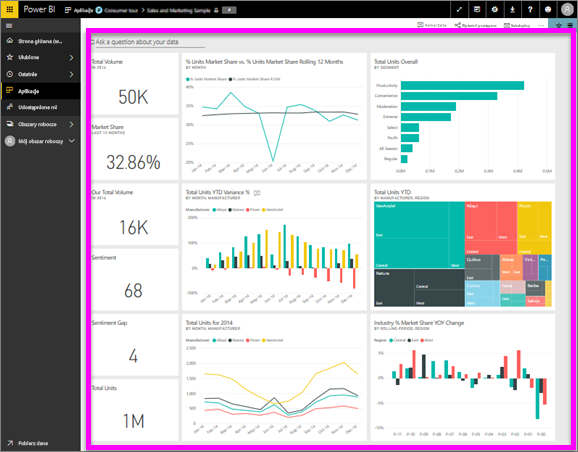

# Wyświetlanie pulpitu nawigacyjnego
Użytkownicy usługi Power BI poświęcają mnóstwo czasu na wyświetlanie pulpitów nawigacyjnych. Pulpity nawigacyjne mają za zadanie wyróżniać określone informacje z bazowych raportów i zestawów danych. Użytkownicy usługi Power BI używają tych informacji do śledzenia, monitorowania, odpowiadania na pytania, testowania, itp. — w celu podejmowania decyzji biznesowych opartych na danych.

Usługa Power BI Pro jest wymagana w przypadku udostępniania pulpitu nawigacyjnego oraz wyświetlania udostępnionego pulpitu nawigacyjnego.

## Otwarcie pulpitu nawigacyjnego
Pulpity nawigacyjne można otworzyć z wielu lokalizacji w usłudze Power BI.  Najważniejsze jest, by ustalić, która zawartość jest pulpitem nawigacyjnym (na przykład w przeciwieństwie do raportu). Po zidentyfikowaniu pulpitu nawigacyjnego można go łatwo otworzyć — wystarczy kliknąć, a pulpit nawigacyjny wypełni kanwę usługi Power BI.

|              |         |
|------------|--------------------------------|
|      |Najprostszym sposobem na zidentyfikowanie pulpitu nawigacyjnego jest wyszukanie tej  ikony pulpitu nawigacyjnego. Po znalezieniu zawartości oznaczonej tą ikoną wybierz ją, aby otworzyć pulpit nawigacyjny. |
|                    |          |

 

<!--insert aGIF-->

Pulpity nawigacyjne znajdują się we wszystkich kontenerach na lewym pasku nawigacji. 
- **Strona główna** (wersja zapoznawcza)
- **Ulubione** — jeśli [pulpit nawigacyjny został ustawiony jako ulubiony](end-user-favorite.md)
- **Ostatnie** — jeśli pulpit nawigacyjny był niedawno otwierany
- **Aplikacje** — większość aplikacji zawiera zarówno pulpity nawigacyjne jak i raporty
- **Udostępnione mi** — jeśli współpracownik [udostępnił Tobie pulpit nawigacyjny](end-user-shared-with-me.md)
- **Mój obszar roboczy** — jeśli pobrano jakieś [przykłady dla usługi Power BI](../sample-datasets.md)

## Następne kroki
* Dobrze poznaj pulpity nawigacyjne, eksperymentując na jednym z naszych [przykładowych pulpitów nawigacyjnych](../sample-tutorial-connect-to-the-samples.md).
* Dowiedz się więcej na temat [kafelków pulpitu nawigacyjnego](end-user-tiles.md) i tego, co się stanie, gdy wybierzesz jeden z nich.
* Chcesz śledzić wybrany kafelek pulpitu nawigacyjnego i otrzymać wiadomość e-mail po osiągnięciu przez niego określonego progu? [Utwórz alerty kafelków](end-user-alerts.md).
* Baw się, zadając pytania pulpitowi nawigacyjnemu. Dowiedz się, jak używać funkcji [pytań i odpowiedzi w usłudze Power BI](end-user-q-and-a.md), aby zadawać pytania dotyczące danych i uzyskiwać odpowiedzi w formie wizualizacji. 