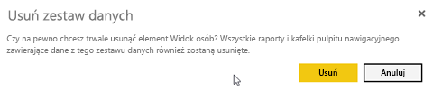

# Usuwanie niemal dowolnego elementu z usługi Power BI
Ten artykuł nauczy Cię, jak usunąć pulpit nawigacyjny, raport, skoroszyt, zestaw danych, aplikację, wizualizację i obszar roboczy z usługi Power BI.

## Usuwanie pulpitu nawigacyjnego
Pulpity nawigacyjne można usuwać. Usunięcie pulpitu nawigacyjnego nie powoduje usunięcia podstawowego zestawu danych ani żadnych raportów skojarzonych z tym pulpitem nawigacyjnym.

* Jeśli jesteś właścicielem pulpitu nawigacyjnego, możesz go usunąć. Jeśli udostępniasz pulpit nawigacyjny współpracownikom, usunięcie pulpitu nawigacyjnego z obszaru roboczego usługi Power BI spowoduje usunięcie pulpitu nawigacyjnego z ich obszarów roboczych usługi Power BI.
* Jeśli już nie chcesz, aby udostępniony Ci pulpit nawigacyjny był widoczny, możesz go usunąć.  Usunięcie pulpitu nawigacyjnego nie spowoduje usunięcia go z obszaru roboczego usługi Power BI żadnej innej osoby.
* Jeśli pulpit nawigacyjny jest częścią [organizacyjnego pakietu zawartości](../service-organizational-content-pack-disconnect.md), jedynym sposobem usunięcia go jest usunięcie skojarzonego zestawu danych.

### Aby usunąć pulpit nawigacyjny
1. W obszarze roboczym wybierz kartę **Pulpity nawigacyjne**.
2. Znajdź pulpit nawigacyjny do usunięcia i wybierz ikonę Usuń .

    

## Usuwanie raportu
Nie martw się. Usunięcie raportu nie powoduje usunięcia zestawu danych, na podstawie którego został utworzony.  Wszelkie wizualizacje, które zostały przypięte z raportu także są bezpiecznie — pozostaną na pulpicie nawigacyjnym, dopóki nie usuniesz ich oddzielnie.

### Aby usunąć raport
1. W obszarze roboczym wybierz kartę **Raporty**.
2. Znajdź raport do usunięcia i wybierz ikonę Usuń   .   

    
3. Potwierdź usunięcie.

   

   > [!NOTE]
   > Jeśli raport jest częścią [pakietu zawartości](../service-organizational-content-pack-introduction.md), nie można go usunąć za pomocą tej metody.  Zobacz [Usuwanie połączenia z organizacyjnym pakietem zawartości](../service-organizational-content-pack-disconnect.md).
   >
   >

## Usuwanie skoroszytu
Skoroszyty można usuwać. Jednak usunięcie skoroszytu spowoduje również usunięcie wszystkich raportów i kafelków pulpitów nawigacyjnych, które zawierają dane z tego skoroszytu.

Jeśli skoroszyt jest przechowywany w usłudze OneDrive dla Firm, usunięcie go z usługi Power BI nie spowoduje usunięcia go z usługi OneDrive.

### Aby usunąć skoroszyt
1. W obszarze roboczym wybierz kartę **Skoroszyty**.
2. Znajdź skoroszyt do usunięcia i wybierz ikonę Usuń  .

    
3. Potwierdź usunięcie.

   

## Usuwanie zestawu danych
Zestawy danych można usuwać. Jednak usunięcie zestawu danych spowoduje również usunięcie wszystkich raportów i kafelków pulpitu nawigacyjnego, które zawierają dane z tego zestawu danych.

Jeśli zestaw danych jest częścią co najmniej jednego [organizacyjnego pakietu zawartości](../service-organizational-content-pack-disconnect.md), jedynym sposobem usunięcia zestawu danych jest usunięcie go z pakietów zawartości, w których jest używany, zaczekanie na przetworzenie usunięcia, a następnie ponowienie próby usunięcia zestawu danych.

### Aby usunąć zestaw danych
1. W obszarze roboczym wybierz kartę **Zestawy danych**.
2. Znajdź zestaw danych do usunięcia i wybierz wielokropek (...).  

    
3. Z listy rozwijanej wybierz polecenie **Usuń**.

   
4. Potwierdź usunięcie.

   

## Usuwanie obszaru roboczego aplikacji
> [!WARNING]
> Podczas tworzenia obszaru roboczego aplikacji jest tworzona grupa usługi Office 365. Natomiast podczas usuwania obszaru roboczego aplikacji ta grupa usługi Office 365 jest usuwana. Oznacza to, że ta grupa zostanie także usunięta z innych produktów Office 365, takich jak SharePoint i Microsoft Teams.
>
>

Obszar roboczy aplikacji może zostać usunięty przez jego autora. Po usunięciu skojarzona aplikacja zostanie również usunięta dla wszystkich członków grupy oraz z Twojej usługi AppSource, jeśli aplikacja została opublikowana dla całej organizacji. Usunięcie obszaru roboczego aplikacji różni się od opuszczenia obszaru roboczego aplikacji.

### Aby usunąć obszar roboczy aplikacji — jeśli jesteś administratorem
1. W okienku nawigacji po lewej stronie wybierz pozycję **Obszary robocze**

    
2. Wybierz wielokropek (...) po prawej stronie obszaru roboczego do usunięcia, a następnie wybierz polecenie **Edytuj obszar roboczy**.

   
3. W oknie **Edycja obszaru roboczego** wybierz pozycję **Usuń obszar roboczy** > **Usuń**.

    

### Aby usunąć obszar roboczy aplikacji z listy
Jeśli nie chcesz już być członkiem obszaru roboczego aplikacji, możesz go ***opuścić***. Zostanie on wtedy usunięty z Twojej listy. Opuszczenie obszaru roboczego nie powoduje wprowadzenia w nim żadnych zmian dla innych członków obszaru roboczego.  

> [!IMPORTANT]
> Jeśli jesteś jedynym administratorem obszaru roboczego aplikacji, usługa Power BI nie pozwoli Ci go opuścić.
>
>

1. Rozpocznij w obszarze roboczym aplikacji, który chcesz usunąć.
2. W prawym górnym rogu wybierz wielokropek (...), a następnie wybierz pozycję **Opuść obszar roboczy** > **Opuść**.

      

   > [!NOTE]
   > Opcje widoczne na liście rozwijanej zależą od tego, czy jesteś administratorem, czy członkiem tego obszaru roboczego aplikacji.
   >
   >

## Kasowanie lub usuwanie aplikacji
Aplikacje można łatwo usunąć ze strony listy aplikacji. Jednak tylko administrator aplikacji może ją usunąć trwale.

### Usuwanie aplikacji ze strony listy aplikacji
Usunięcie aplikacji ze strony listy aplikacji nie powoduje usunięcia jej dla innych członków.

1. W okienku nawigacji po lewej stronie wybierz pozycję **Aplikacje**, aby otworzyć stronę listy aplikacji.
2. Najedź kursorem na aplikację do usunięcia i wybierz ikonę Usuń .

   

   Jeśli przypadkowo usuniesz aplikację, możesz ją odzyskać na kilka sposobów.  Poproś twórcę aplikacji o jej ponowne wysłanie, znajdź oryginalną wiadomość e-mail z linkiem do aplikacji, sprawdź, czy w Twoim [centrum powiadomień](end-user-notification-center.md) nadal znajduje się powiadomienie dotyczące tej aplikacji, lub sprawdź usługę [AppSource](end-user-apps.md) Twojej organizacji.

## Istotne zagadnienia i rozwiązywanie problemów
W tym artykule opisano sposób usuwania głównych bloków konstrukcyjnych usługi Power BI. Jednak w usłudze Power BI istnieje więcej elementów, które można usunąć.  

* [Usuwanie proponowanego pulpitu nawigacyjnego](end-user-featured.md#change-the-featured-dashboard)
* [Usuwanie (usuwanie z Ulubionych) pulpitu nawigacyjnego](end-user-favorite.md)
* [Usuwanie strony raportu](end-user-delete.md)
* [Usuwanie kafelka pulpitu nawigacyjnego](../service-dashboard-edit-tile.md)
* [Usuwanie wizualizacji raportu](end-user-delete.md)

Masz więcej pytań? [Odwiedź społeczność usługi Power BI](http://community.powerbi.com/)
