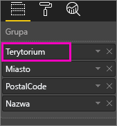
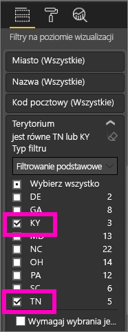
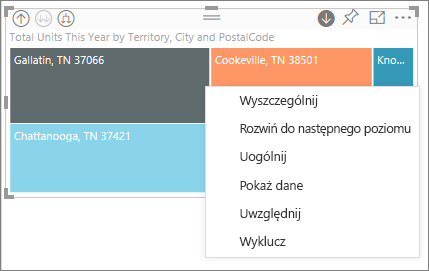
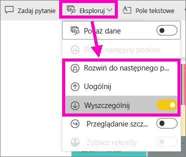
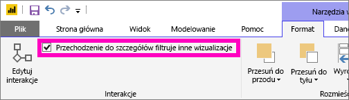
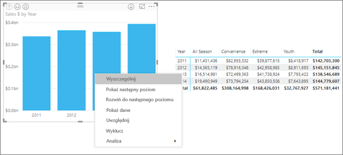
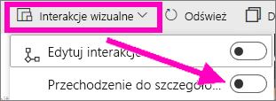
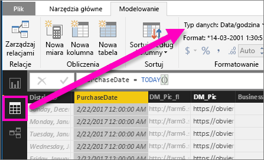

# Tryb przechodzenia do szczegółów w wizualizacji w usłudze Power BI

## Przechodzenie do szczegółów wymaga hierarchii
Jeśli wizualizacja ma hierarchię, przejście do szczegółów pozwala ujawnić dodatkowe szczegóły. Wizualizacja może na przykład dotyczyć liczby medali olimpijskich z uwzględnieniem hierarchii składającej się ze sportu, dyscypliny i rodzaju konkurencji. Domyślnie wizualizacja będzie wyświetlać liczbę medali według rodzaju sportu — gimnastyka, narciarstwo, sporty wodne itp. Ponieważ ma ona jednak hierarchię, po wybraniu jednego z elementów wizualizacji (np. słupka, linii lub bąbelka) zostanie wyświetlony bardziej szczegółowy obraz. Wybierz element **sporty wodne**, aby wyświetlić dane dotyczące pływania, skoków do wody oraz piłki wodnej.  Wybierz element **skoki do wody**, aby wyświetlić szczegóły dla konkurencji skoków z trampoliny, wieży oraz synchronicznych.

Możesz dodawać hierarchie do raportów, których jesteś właścicielem, ale nie do raportów, które zostały Ci udostępnione.
Nie masz pewności, które wizualizacje usługi Power BI zawierają hierarchię?  Umieść kursor na wizualizacji i jeśli w rogach na górze wyświetlone zostaną poniższe kontrolki przechodzenia do szczegółów, oznacza to, że wizualizacja ma hierarchię.

  
   

Daty są wyjątkowym typem hierarchii. Po dodaniu pola daty do wizualizacji usługa Power BI automatycznie dodaje hierarchię czasu, która zawiera rok, kwartał, miesiąc i dzień. Aby uzyskać więcej informacji, zobacz [Hierarchie wizualizacji i zachowanie przechodzenia do szczegółów](../guided-learning/visualizations.yml?tutorial-step=18) lub obejrzyj poniższy klip wideo.

  <iframe width="560" height="315" src="https://www.youtube.com/embed/MNAaHw4PxzE?list=PL1N57mwBHtN0JFoKSR0n-tBkUJHeMP2cP" frameborder="0" allowfullscreen></iframe>

> [!NOTE]
> Aby dowiedzieć się, jak tworzyć hierarchie przy użyciu programu Power BI Desktop, obejrzyj klip wideo [Sposób tworzenia i dodawania hierarchii](https://youtu.be/q8WDUAiTGeU)
> 

## Wymagania wstępne

1. W usłudze Power BI lub programie Desktop przechodzenie do szczegółów wymaga wizualizacji z hierarchią. 
   
2. Aby to sprawdzić, [otwórz przykładową analizę Retail Analysis](../sample-datasets.md) i utwórz mapę drzewa wyświetlającą pozycję **Total Units This Year**  (Wartości) według pozycji **Territory** (terytorium), **City** (miasto), **PostalCode** (kod pocztowy) i **Name** (nazwa) (Grupa).  Mapa drzewa zawiera hierarchię, w skład której wchodzi terytorium, miasto, kod pocztowy i nazwa miejscowości. Każde terytorium posiada co najmniej jedno miasto, każde miasto co najmniej jeden kod pocztowy itd. Domyślnie wizualizacja wyświetla tylko dane terytorium, ponieważ pozycja *Territory* wyświetlana jest na początku listy.
   
   

2. Sposób współdziałania różnych ikon przechodzenia do szczegółów może być niezrozumiały, dlatego mapa drzewa zostanie przefiltrowana w celu wyświetlania tylko 2 mniejszych terytoriów: **KY** i **TN**. Wybierz mapę drzewa i w obszarze **Filtry na poziomie wizualizacji** rozwiń pozycję **Territory**, a następnie wybierz pozycje **KY** i **TN**.

        

   Teraz na mapie drzewa są wyświetlane tylko dwa terytoria.

   

## Trzy sposoby uzyskiwania dostępu do funkcji przechodzenia do szczegółów
Istnieje kilka sposobów uzyskiwania dostępu do funkcji drążenia wskroś, uogólniania i rozwijania w przypadku wizualizacji z hierarchiami. W tym artykule przedstawiono poniżej sposób użycia pierwszej funkcji. Wszystkie trzy metody umożliwiają osiągnięcie tego samego celu, dlatego po zapoznaniu się z podstawowymi informacjami na temat drążenia wskroś i rozwijania wypróbuj te metody i wybierz tę, która najbardziej Ci odpowiada.

- Umieść kursor na wizualizacji, aby wyświetlić ikony i ich użyć.  

    

- Kliknij prawym przyciskiem myszy wizualizację, aby wyświetlić menu i go użyć.
    
    

- Na pasku menu usługi Power BI wybierz przycisk **Eksploruj**.

   

## Ścieżki przechodzenia do szczegółów
### Przechodzenie do szczegółów
Istnieje kilka sposobów przechodzenia do szczegółów wizualizacji. Funkcja ***przechodzenia do szczegółów*** umożliwia przejście do następnego poziomu w hierarchii, więc w przypadku poziomu **Territory** można przejść do szczegółów do poziomu miejscowości, a następnie do poziomu kodu pocztowego i do poziomu nazwy. Każdy krok w ścieżce zawiera nowe informacje.

### Rozwiń

Funkcja ***rozwijania*** umożliwia dodanie poziomu hierarchii do bieżącego widoku. Dlatego w przypadku poziomu **Territory** można go rozwinąć i dodać miejscowość, kod pocztowy oraz nazwę do mapy drzewa. Każdy krok w ścieżce zawiera te same informacje i dodaje jeden poziom nowych informacji.

Możesz też określić, czy przechodzenie do szczegółów lub rozwijanie ma odbywać się dla jednego pola czy wszystkich pól jednocześnie. 

## Przechodzenie do szczegółów wszystkich pól jednocześnie

1. Rozpocznij od najwyższego poziomu mapy drzewa z danymi dla stanów KY i TN. Poszerz mapę drzewa przez wybranie jednego z uchwytów i przeciągnięcie w prawo. 

     .

2. Aby przechodzić do szczegółów ***wszystkich pól jednocześnie***, wybierz podwójną strzałkę w lewym górnym rogu wizualizacji . Teraz na mapie drzewa są wyświetlane dane dla miast w stanach Kentucky i Tennessee. 

    
   
5. Jeszcze raz przejdź do szczegółów poziomu kodu pocztowego w hierarchii.

    

3. Aby zwinąć szczegóły, wybierz strzałkę w górę w lewym górnym rogu wizualizacji .

## Przechodzenie do szczegółów jednego pola w tym samym czasie
Ta metoda używa ikony przechodzenia do szczegółów wyświetlanej w prawym górnym rogu wizualizacji. 

1. Wybierz ikonę przechodzenia do szczegółów, aby je włączyć . Teraz jest dostępna opcja przechodzenia do szczegółów ***jedno pole w tym samym czasie***. 
   
   

   Jeśli przechodzenie do szczegółów nie zostanie włączone, wybranie elementu wizualizacji (np. słupka, bąbelka lub liścia) nie spowoduje przejścia do szczegółów, tylko przefiltrowanie krzyżowe innych wykresów na stronie raportu.

2. Wybierz *liść* dla stanu **TN**. Mapa drzewa zawiera teraz wszystkie miejscowości w stanie Tennessee, w których jest sklep. 

    

2. Teraz możesz kontynuować przechodzenie do szczegółów dla stanu Tennesee, przejść do szczegółów określonej miejscowości w stanie Tennesee lub rozwinąć pole (zobacz **Rozwijanie wszystkich pól jednocześnie** poniżej). Przejdźmy do szczegółów jednego pola w tym samym czasie.  Wybierz pozycję **Knoxville, TN**. Na mapie drzewa jest teraz wyświetlany kod pocztowy sklepu w Knoxville. 

   

    Zwróć uwagę, że tytuł zmienia się podczas przechodzenia do szczegółów i z powrotem.  

## Rozwijanie wszystkich pól i jednego pola w tym samym czasie
Mapa drzewa zawierająca tylko kod pocztowy nie ma wartości informacyjnej.  Dlatego rozwiniemy pola o jeden poziom w dół w hierarchii.  

1. Gdy mapa drzewa jest aktywna, wybierz ikonę *rozwijania w dół* . Mapa drzewa zawiera teraz dwa poziomy hierarchii: kod pocztowy i nazwę sklepu. 

    

2. Aby wyświetlić wszystkie cztery poziomy hierarchii danych dla stanu Tennesee, wybieraj strzałkę uogólniania do momentu osiągnięcia drugiego poziomu **Total units this year by territory and city** (Całkowita liczba jednostek w tym roku według terytorium i miasta) na mapie drzewa. 

    

3. Upewnij się, że przechodzenie do szczegółów jest nadal włączone , i wybierz ikonę *rozwijania w dół* . Mapa drzewa zawiera teraz dodatkowe szczegóły — zamiast tylko miejscowości i stanu jest też wyświetlany kod pocztowy. 

    

4. Wybierz jeszcze raz ikonę *rozwijania w dół*, aby wyświetlić wszystkie cztery poziomy hierarchii szczegółów dla stanu Tennesee na mapie drzewa. Umieść kursor na liściu, aby wyświetlić jeszcze więcej szczegółów.

   

## Przechodzenie do szczegółów filtruje inne wizualizacje
Podczas pracy w trybie przechodzenia do szczegółów można określić wpływ przechodzenia do szczegółów i rozszerzania na inne wizualizacje na stronie. 

Domyślnie przechodzenie do szczegółów nie filtruje innych wizualizacji w raporcie. Jednak tę funkcję można włączyć w programie Power BI Desktop i usłudze Power BI. 

1. W programie Desktop wybierz kartę **Format** i zaznacz pole wyboru **Przechodzenie do szczegółów filtruje inne wizualizacje**.

    

2. Teraz przejście do szczegółów (albo uogólnienie lub rozwinięcie) w wizualizacji z hierarchią powoduje filtrowanie innych wizualizacji na stronie. 

    

    

> [!NOTE]
> Aby włączyć to ustawienie w usłudze Power BI, na górnym pasku menu wybierz pozycję **Interakcje wizualne > Przechodzenie do szczegółów filtruje inne wizualizacje**.
>
> 

## Opis osi hierarchii i grupy hierarchii
Oś hierarchii i grupa hierarchii to mechanizmy, których można użyć do zwiększenia lub zmniejszenia poziomu szczegółowości danych, które chcesz wyświetlić. Wszelkie dane, które można podzielić na kategorie i podkategorie, kwalifikują się jako dane zawierające hierarchię. W tym oczywiście dane dotyczące daty i godziny.

Możesz utworzyć wizualizację w usłudze Power BI, aby użyć hierarchii, wybierając jedno lub więcej pól danych do dodania do listy **Oś** lub listy **Grupa** wraz z danymi, które chcesz zbadać jako pola danych na liście **Wartości**. Użytkownik wie, czy jego dane są hierarchiczne, jeśli ikony *trybu szczegółów* pojawiają się w lewym lub prawym górnym rogu wizualizacji. 

Zasadniczo dobrze jest myśleć o dwóch typach danych hierarchicznych:
- Dane daty i godziny — jeśli masz pole danych z typem danych DateTime, masz już dane hierarchiczne. Usługa Power BI automatycznie tworzy hierarchię dla dowolnego pola danych, którego wartości można przeanalizować w ramach struktury [DateTime](https://msdn.microsoft.com/library/system.datetime.aspx). Należy dodać tylko jedno pole DateTime do listy **Oś** lub **Grupa**.
- Dane podzielone na kategorie — jeśli dane pochodzą z kolekcji zawierających podkolekcje lub w innym wypadku zawierają wiersze danych współużytkujące wspólne wartości, masz dane hierarchiczne.

Usługa Power BI umożliwia rozszerzenie o jeden lub wszystkie podzbiory. Możesz przejść do szczegółów w danych, aby zobaczyć jeden podzbiór na każdym poziome lub aby zobaczyć wszystkie podzbiory jednocześnie na każdym poziomie. Na przykład możesz przejść do szczegółów dla konkretnego roku lub wyświetlić wszystkie wyniki dla każdego roku, przechodząc w dół hierarchii. Ponadto nadal możesz działać w ten sam sposób w drugą stronę.

W poniższych sekcjach opisano przechodzenie do szczegółów od najwyższego widoku, średniego widoku i najniższego widoku.

### Dane hierarchiczne oraz dane czasu
W tym przykładzie postępuj zgodnie z sekcją [Próbka analizy handlu detalicznego](../sample-datasets.md) i utwórz wizualizację skumulowanego wykresu kolumnowego korzystającą z wartości **Month** (oś) względem wartości **TotalSales** (wartości).  

Chociaż pole danych osi to **Month** (miesiąc), nadal tworzy kategorię **Year** (rok) na liście **Oś**. Dzieje się tak, ponieważ usługa Power BI zapewnia pełną strukturę danych DateTime dla wszystkich odczytywanych wartości. Na początku hierarchii znajdują się dane dotyczące roku.

Przy włączonym trybie przechodzenia do szczegółów kliknij słupek na wykresie, aby przejść w dół o jeden poziom w hierarchii. Zostaną wyświetlone trzy słupki danych dla dostępnych kwartałów. Następnie z ikon w lewym górnym rogu wybierz opcję **Rozwiń wszystko w dół o jeden poziom w hierarchii**. Następnie wykonaj ten krok ponownie, aby osiągnąć najniższy poziom w hierarchii, który pokazuje wyniki dla każdego miesiąca.

Oprócz wizualizacji możemy zobaczyć hierarchię odzwierciedloną w danych renderowanych dla każdego raportu. W poniższej tabeli przedstawiono wyniki opcji **Pokaż dane** w przechodzeniu do szczegółów w raporcie od jednego miesiąca lub wszystkich miesięcy. 

Zwróć uwagę, że dane są takie same w przypadku raportów kwartalnych i rocznych, ale po przejściu do szczegółów na poziomie określonym dla pozycji **Wartości** możesz zobaczyć, jak jeden raport staje się bardziej szczegółowy, a raport „wszystkie miesiące” zawiera więcej danych.

|Tryb rozwijania|Rok|Quarter|Month|Dzień|
| ---|:---:|:---:|:---:|---|
|Jeden|||||
|Wszystkie|||||

### Dane kategorii hierarchicznej
Dane, które zostały wymodelowane na podstawie kolekcji i podkolekcji, są hierarchiczne. Dobrym przykładem będą dane lokalizacji. Należy wziąć pod uwagę tabelę w źródle danych, której kolumny to Country (kraj), State (stan), City (miasto) oraz Zip (kod pocztowy). Dane współużytkujące te same wartości w kolumnach Country (kraj), State (stan) i City (miasto) są hierarchiczne.

W tym przykładzie postępuj zgodnie z sekcją [Próbka analizy handlu detalicznego](../sample-datasets.md). Utwórz wizualizację skumulowanego wykresu kolumnowego sprawdzającego pozycję **Total Units This Year** (całkowita liczba jednostek w bieżącym roku) (wartości) względem pozycji **Territory** (terytorium), **City** (miasto), **PostalCode** (kod pocztowy) oraz **Name** (nazwa) (grupa).  

Przy włączonym trybie przechodzenia do szczegółów z ikon w lewym górnym rogu wybierz opcję **Rozwiń wszystko w dół o jeden poziom w hierarchii** trzy razy.
Teraz powinien być wyświetlany najniższy poziom hierarchii, w którym znajdują się wyniki dla pozycji Territory (terytorium), City (miasto) oraz Postal Code (kod pocztowy).

Oprócz wizualizacji możemy zobaczyć hierarchię odzwierciedloną w danych renderowanych dla każdego raportu. W poniższej tabeli przedstawiono wyniki użycia opcji **Pokaż dane** w przechodzeniu do szczegółów w raporcie dla jednego terytorium lub wszystkich terytoriów. Podczas przechodzenia do szczegółów możesz zobaczyć, jak jeden raport staje się bardziej szczegółowy, a raport „wszystkie terytoria” zawiera więcej danych.

| Tryb rozwijania|Terytorium|Miasto|Kod pocztowy|Nazwa|
| ---|:---:|:---:|:---:|---|
|Jeden|||||
|Wszystkie|||||

## Istotne zagadnienia i ograniczenia
* Jeśli dodanie pola daty do wizualizacji nie spowoduje utworzenia hierarchii, może to oznaczać, że to pole „data” nie jest w rzeczywistości zapisane jako data. Jeśli jesteś właścicielem zestawu danych, otwórz go w widoku *Dane* w programie Power BI Desktop, wybierz kolumnę zawierającą datę, a następnie na karcie Modelowanie zmień **Typ danych** na **Data** lub **Data/godzina**. Jeśli raport został Ci udostępniony, skontaktuj się z właścicielem i poproś o dokonanie zmiany.  
  
  

## Następne kroki
[Wizualizacje w raportach usługi Power BI](../visuals/power-bi-report-visualizations.md)

[Raporty usługi Power BI](end-user-reports.md)

[Power BI — podstawowe pojęcia](end-user-basic-concepts.md)

Masz więcej pytań? [Odwiedź społeczność usługi Power BI](http://community.powerbi.com/)

