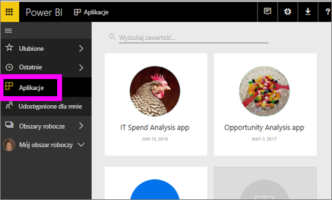
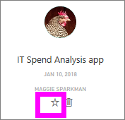
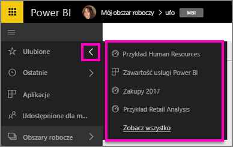
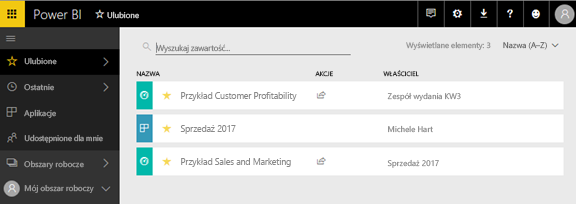
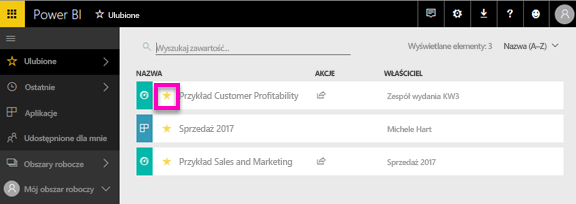

# Ulubione pulpity nawigacyjne, raporty i aplikacje w usłudze Power BI
Po ustawieniu zawartości jako *ulubionej* można uzyskiwać do niej dostęp we wszystkich obszarach roboczych.  Ulubione to zwykle zawartość odwiedzana najczęściej.

> [!NOTE]
> Ten temat dotyczy usługi Power BI, a nie programu Power BI Desktop.
> 
> 

Możesz również wybrać pojedynczy pulpit nawigacyjny jako [proponowany pulpit nawigacyjny](end-user-featured.md) w usłudze Power BI.

## Dodawanie pulpitu nawigacyjnego lub raportu jako *ulubionego*
Obejrzyj, jak Amanda dodaje ulubione do swojego obszaru roboczego, a następnie wykonaj szczegółowe instrukcje wyświetlane poniżej filmu wideo, aby przećwiczyć tę procedurę samodzielnie.

<iframe width="560" height="315" src="https://www.youtube.com/embed/G26dr2PsEpk" frameborder="0" allowfullscreen></iframe>

1. Otwórz pulpit nawigacyjny lub raport, z którego często korzystasz. Nawet udostępnioną Ci zawartość możesz ustawić jako *ulubioną*.
2. W prawym górnym rogu w usłudze Power BI wybierz pozycję **Dodaj do ulubionych** lub ikonę gwiazdki .
   
   
   
   Możesz również dodać pulpit nawigacyjny lub raport do ulubionych z obszaru roboczego **Pulpity nawigacyjne** lub **Raporty** karty Widok zawartości.
   
   

## Dodawanie aplikacji jako *ulubionej*

1. Z lewego okienka nawigacji wybierz pozycję **Aplikacje**.

   

2. Zatrzymaj wskaźnik myszy nad aplikacją, aby wyświetlić więcej szczegółów.  Wybierz ikonę gwiazdki   w celu ustawienia jej jako ulubionej.
   
   

## Praca z *ulubionymi*
1. Aby uzyskać dostęp do ulubionych, w dowolnym obszarze roboczym kliknij strzałkę po prawej stronie przycisku **Ulubione**.  W tym miejscu można wybrać ulubiony element, aby go otworzyć. Wyświetlana jest lista zawierająca tylko pięć elementów ulubionych (w porządku alfabetycznym). Jeśli masz ich więcej niż pięć, wybierz pozycję **Pokaż wszystkie**, aby otworzyć ekran Ulubione (zobacz punkt 2 poniżej). 
   
   
2. Aby wyświetlić **całą** zawartość, która została dodana jako ulubione, w lewym okienku nawigacyjnym wybierz pozycję **Ulubione** lub ikonę Ulubione .  
   
    
   
   W tym miejscu możesz wykonać akcję: otworzyć, zidentyfikować właścicieli, a nawet udostępniać współpracownikom.

## Usuwanie zawartości z ulubionych
Nie korzystasz już tak często z raportu?  Możesz usunąć go z ulubionych. Usunięcie zawartości z ulubionych spowoduje jej usunięcie z listy ulubionych, ale nie z usługi Power BI.

1. W lewym okienku nawigacji wybierz pozycję **Ulubione**, aby otworzyć ekran **Ulubione**.
   
   
2. Wybierz żółtą gwiazdkę obok zawartości, aby usunąć ją z ulubionych.

> **UWAGA**: Możesz również usunąć pulpit nawigacyjny, raport lub aplikację z ulubionych z poziomu samego elementu. Wystarczy otworzyć i usunąć zaznaczenie żółtej ikony.   
> 
> 

## Następne kroki
[Co to jest usługa Power BI?](../power-bi-overview.md)

[Power BI — podstawowe pojęcia](end-user-basic-concepts.md)

Masz więcej pytań? [Odwiedź społeczność usługi Power BI](http://community.powerbi.com/)

