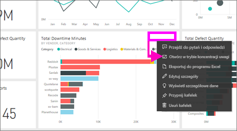

# Wyświetlanie zawartości z większą liczbą szczegółów: tryb koncentracji uwagi i tryb pełnoekranowy

<iframe width="560" height="315" src="https://www.youtube.com/embed/dtdLul6otYE" frameborder="0" allowfullscreen></iframe>

Tryb koncentracji uwagi i tryb pełnoekranowy to dwa różne sposoby wyświetlania większej liczby szczegółów w wizualizacjach, raportach i pulpitach nawigacyjnych.  Główna różnica polega na tym, że w trybie pełnoekranowym są usuwane wszystkie okienka otaczające zawartość, a w trybie koncentracji uwagi można nadal korzystać z wizualizacji. Przyjrzyjmy się bliżej podobieństwom i różnicom.  

|Zawartość    | Tryb koncentracji uwagi  |Tryb pełnoekranowy  |
|---------|---------|----------------------|
|Pulpit nawigacyjny     |   Niemożliwe     | tak |
|Strona raportu   | Niemożliwe  | tak|
|Wizualizacja raportu | tak    | tak |
|Kafelek pulpitu nawigacyjnego | tak    | tak |
|Windows 10 Mobile | Niemożliwe | Tak |

## Co to jest tryb pełnoekranowy?

Wyświetlaj zawartość usługi Power BI (pulpity nawigacyjne, strony raportu, kafelki i wizualizacje) bez naruszania menu i pasków nawigacji.  Możesz wyświetlać nieskażony, pełny widok Twojej zawartości jak na dłoni przez cały czas. Jest to czasami określane jako tryb TV (telewizyjny).   

Aby otworzyć tryb pełnoekranowy, wybierz ikonę **pełnego ekranu**  na pasku menu usługi Power BI nad pulpitem nawigacyjnym, raportem lub kafelkiem w trybie koncentracji uwagi albo wizualizacją w trybie koncentracji uwagi.  Wybrana zawartość wypełni cały ekran.
Jeśli używasz usługi Power BI dla urządzeń przenośnych, [tryb pełnoekranowy jest dostępny w przypadku aplikacji mobilnych systemu Windows 10](./mobile/mobile-windows-10-app-presentation-mode.md). 

Do niektórych zastosowań trybu pełnoekranowego należą:

* prezentowanie pulpitu nawigacyjnego, kafelka, elementu wizualnego lub raportu podczas spotkania lub konferencji
* wyświetlanie w biurze na dedykowanym dużym ekranie lub projektorze
* wyświetlanie na małym ekranie
* sprawdzanie w trybie zablokowanym — możesz dotknąć ekranu lub ustawić kursor myszy nad kafelkiem bez otwierania raportu źródłowego lub pulpitu nawigacyjnego

## Co to jest tryb koncentracji uwagi?
Tryb ***koncentracji uwagi*** umożliwia rozwijanie (otwieranie w okienku wyskakującym) wizualizacji lub kafelka w celu wyświetlenia większej liczby szczegółów.  Być może masz pulpit nawigacyjny lub raport, który jest nieco zatłoczony, i chcesz powiększyć tylko jedną wizualizację.  Jest to doskonały moment na użycie trybu koncentracji uwagi.  

W trybie koncentracji uwagi *użytkownik* usługi Power BI może wchodzić w interakcję z filtrami, które zostały zastosowane podczas tworzenia danej wizualizacji.  W usłudze Power BI można używać trybu koncentracji uwagi na kafelku pulpitu nawigacyjnego lub w wizualizacji raportu.

## Praca w trybie pełnoekranowym
Aby otworzyć stronę pulpitu nawigacyjnego lub raportu w trybie pełnoekranowym, wybierz ikonę pełnego ekranu  na górnym pasku nawigacyjnym. Gdy jesteś w trybie pełnoekranowym, przeniesienie myszy lub kursora spowoduje wyświetlenie menu kontekstowego. Ponieważ tryb pełnoekranowy jest dostępny w wielu różnych typach zawartości, opcje w menu kontekstowym są nieco inne dla każdego z nich, ale generalnie nie wymagają dodatkowych wyjaśnień.  Wystarczy umieścić kursor na ikonie w celu wyświetlenia definicji.

Menu dla pulpitów nawigacyjnych    
    

Menu dla stron raportu    
    

  *     
  Użyj przycisku **Wstecz**, aby przejść do poprzedniej strony w przeglądarce. Jeśli poprzednią stroną była strona usługi Power BI, ona też zostanie wyświetlona w trybie pełnoekranowym.  Tryb pełnoekranowy zostanie utrzymany do chwili zamknięcia.

  *     
  Ten przycisk służy do drukowania pulpitu nawigacyjnego lub strony raportu w trybie pełnoekranowym.

  *     
    Użyj przycisku **Dopasuj do ekranu**, aby wyświetlić swój pulpit nawigacyjny w największym możliwym rozmiarze bez używania pasków przewijania.  

    

  *        
    Czasami nie interesują Cię paski przewijania, ale chcesz, aby pulpit nawigacyjny wypełnił całe dostępne miejsce. Wybierz przycisk **Dopasuj do szerokości**.    

    

  *        
    W raportach pełnoekranowych użyj tych strzałek do przechodzenia między stronami w raporcie.    
  * Aby wyjść z trybu pełnoekranowego, wybierz ikonę **Zakończ tryb pełnoekranowy**.

      

## Praca w trybie koncentracji uwagi
Istnieją dwa sposoby otwierania trybu koncentracji uwagi. Jeden z nich to sposób dla kafelków pulpitu nawigacyjnego,a drugi — dla wizualizacji raportu.

### Tryb koncentracji uwagi na pulpitach nawigacyjnych
1. Otwórz pulpit nawigacyjny w usłudze Power BI.

2. Umieść kursor na kafelku pulpitu nawigacyjnego lub wizualizacji raportu, wybierz wielokropek (...) i wybierz pozycję **Otwórz w trybie koncentracji uwagi**.

    .

2. Spowoduje to otwarcie kafelka, który wypełni całą kanwę raportu.

   

3. Rozwiń okienko Filtry, aby zobaczyć wszystkie filtry zastosowane do danej wizualizacji.

   

4. Zapoznaj się z dalszymi szczegółami, [modyfikując filtry](end-user-report-filter.md) i wyszukując ciekawe informacje w swoich danych.  

5. Aby opuścić tryb koncentracji uwagi i wrócić do pulpitu nawigacyjnego, wybierz pozycję **Wyjdź z trybu koncentracji uwagi** (w lewym górnym rogu wizualizacji).

        

## Tryb koncentracji uwagi dla wizualizacji raportu
1. Otwórz raport w usłudze Power BI.  W tym przykładzie użyjemy przykładu Retail Analysis.

1. Po otwarciu raportu wybierz **kartę District Monthly Sales**.

2. Najedź kursorem na wykresach warstwowych w lewym dolnym rogu i wybierz ikonę **trybu koncentracji uwagi** .  

   
2. Spowoduje to otwarcie wizualizacji i wypełnienie nią całej kanwy.

   
3. Opcjonalnie rozwiń okienko Filtry, aby przeprowadzić interakcję z filtrami zastosowanymi do danej wizualizacji. Zagłębiaj się w dane, szukając nowych szczegółowych informacji oraz odpowiedzi na pytania. Jako *użytkownik* nie możesz dodawać nowych filtrów, zmieniać pól używanych w wizualizacjach ani tworzyć nowych wizualizacji.  Jednak wszystkie wprowadzone modyfikacje istniejących filtrów są zapisywane podczas zamykania usługi Power BI. Jeśli nie chcesz, aby usługa Power BI zapamiętała Twoje modyfikacje, wybierz pozycję **Przywróć domyślne**.   

   

5. Aby opuścić tryb koncentracji uwagi i wrócić do raportu, wybierz pozycję **Powrót do raportu** (w lewym górnym rogu wizualizacji).

      

## Istotne zagadnienia i rozwiązywanie problemów
* Podczas korzystania z trybu koncentracji uwagi dla wizualizacji w raporcie możesz wyświetlać wszystkie filtry i wchodzić z nimi w interakcję: na poziomie wizualizacji, na poziomie strony, przeglądania szczegółowego i na poziomie raportu.    
* Podczas korzystania z trybu koncentracji uwagi dla wizualizacji na pulpicie nawigacyjnym możesz wyświetlać jedynie filtry na poziomie wizualizacji i wchodzić z nimi w interakcję.

## Następne kroki
[Wyświetlanie ustawień raportów](end-user-report-view.md)