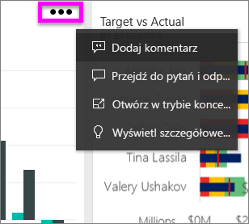
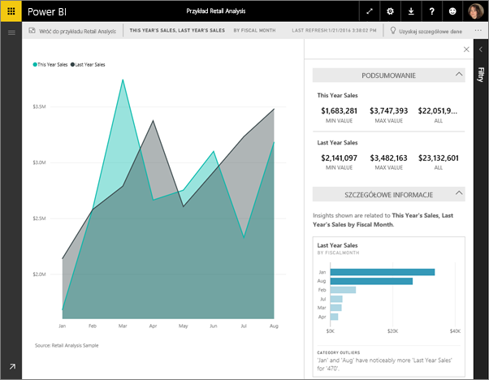
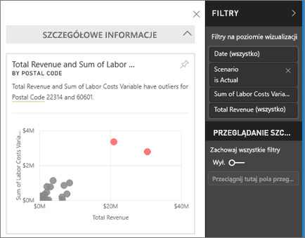
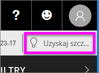
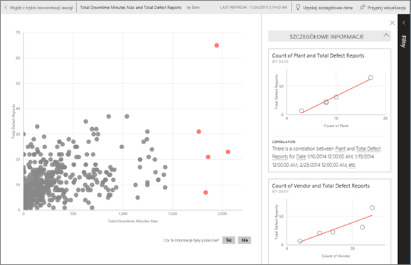

# Wyświetlanie szczegółowych informacji dotyczących kafelków pulpitu nawigacyjnego w usłudze Power BI
Każdy kafelek wizualizacji na pulpicie nawigacyjnym umożliwia rozpoczęcie eksploracji danych. Wybranie kafelka powoduje otwarcie raportu, w którym można filtrować i sortować oraz analizować zestaw danych będący podstawą raportu. Po uruchomieniu wglądu w szczegółowe dane usługa Power BI przeprowadza dla Ciebie eksplorację danych.

Uruchom szybki wgląd w szczegółowe dane, aby generować interesujące, interaktywne wizualizacje na podstawie danych. Szybki wgląd w szczegółowe dane można uruchamiać na określonym kafelku pulpitu nawigacyjnego. Można nawet uruchamiać wgląd w szczegółowe dane na wglądzie w szczegółowe dane!

Wgląd w szczegółowe dane działa w oparciu o rosnący [zestaw zaawansowanych algorytmów analitycznych](end-user-insight-types.md), opracowywany we współpracy z działem badań firmy Microsoft. Będziemy z niego nadal korzystać, aby umożliwić większej liczbie użytkowników uzyskiwanie przydatnego wglądu w dane na nowe i intuicyjne sposoby.

## Uruchamianie wglądu w szczegółowe dane dla kafelka pulpitu nawigacyjnego
Po uruchomieniu wglądu w szczegółowe dane na kafelku pulpitu nawigacyjnego usługa Power BI wyszukuje tylko te dane, które zostały użyte do utworzenia tego kafelka pulpitu nawigacyjnego. 

1. [Otwórz pulpit nawigacyjny](end-user-dashboards.md).
2. Zatrzymaj wskaźnik myszy nad kafelkiem. Wybierz wielokropek (...) i wybierz pozycję **Wyświetl szczegółowe dane**. 

    

3. Kafelek zostanie otwarty w [trybie koncentracji uwagi](end-user-focus.md) z kartami wglądu w szczegółowe dane widocznymi z prawej strony.    
   
        
4. Czy jeden z wglądów przykuł Twoje zainteresowanie? Wybierz kartę tego wglądu, aby dokładniej go zbadać. Wybrany wgląd w szczegółowe dane jest wyświetlany po lewej stronie i na nowych kartach wglądu, wyłącznie na podstawie danych w tym pojedynczym wglądzie w szczegółowe dane, wyświetlanym wzdłuż prawej strony.    

 ## Praca z kartami wglądu w szczegółowe dane
Po otwarciu szczegółowych informacji kontynuuj eksplorowanie.

   * Filtruj wizualizację na kanwie.  Aby wyświetlić filtry, w prawym górnym rogu wybierz strzałkę, aby rozwinąć okienko Filtry.

     
   
   * Uruchom wgląd w szczegółowe dane na samej karcie wglądu w szczegółowe dane. To działanie jest często określane jako **powiązane wglądy w szczegółowe dane**. W prawym górnym rogu wybierz ikonę żarówki  lub pozycję **Uzyskaj szczegółowe dane**.
     
     
     
     Wgląd w szczegółowe dane jest wyświetlany po lewej stronie i na nowych kartach, wyłącznie na podstawie danych w tym pojedynczym wglądzie w szczegółowe dane, wyświetlanym wzdłuż prawej strony.
     
     

Aby wrócić do oryginalnej kanwy wglądu w szczegółowe dane, w lewym górnym rogu wybierz pozycję **Wyjdź z trybu koncentracji uwagi**.

## Istotne zagadnienia i rozwiązywanie problemów
- Opcja **Wyświetl szczegółowe dane** nie działa w przypadku trybu DirectQuery — działa tylko z danymi przekazanymi do usługi Power BI.
- Opcja **Wyświetl szczegółowe dane** nie działa ze wszystkimi typami kafelka pulpitu nawigacyjnego. Na przykład nie jest dostępna dla wizualizacji niestandardowych.<!--[custom visuals](end-user-custom-visuals.md)-->

## Następne kroki
Dowiedz się więcej na temat [dostępnych typów szybkiego wglądu w szczegółowe dane](end-user-insight-types.md)

