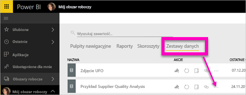
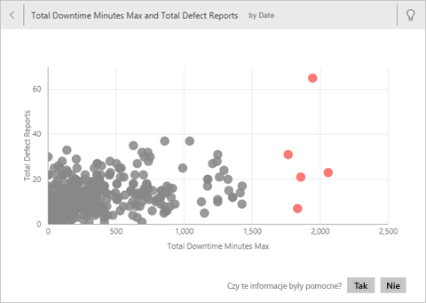
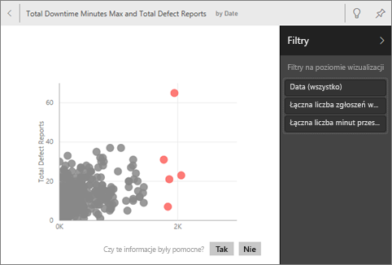
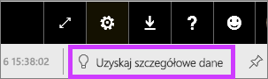

# Automatyczne generowanie wglądu w szczegółowe dane przy użyciu usługi Power BI
Masz nowy zestaw danych i nie bardzo wiesz, gdzie zacząć?  Musisz szybko utworzyć pulpit nawigacyjny?  Chcesz wyszukać szczegółowe informacje, które mogły zostać pominięte?

Uruchom szybki wgląd w szczegółowe dane, aby generować interesujące, interaktywne wizualizacje na podstawie danych. Szybki wgląd w szczegółowe dane można uruchamiać na całym zestawie danych (szybki wgląd w szczegółowe dane) lub na konkretnym kafelku pulpitu nawigacyjnego (wgląd w szczegółowe informacje dla zakresu). Możesz nawet uruchamiać wgląd w szczegółowe dane wewnątrz wglądu w szczegółowe dane.

> **UWAGA**: wgląd w szczegółowe dane nie działa w przypadku zapytania bezpośredniego — działa tylko z danymi przekazanymi do usługi Power BI.
> 

Wgląd w szczegółowe dane działa w oparciu o rosnący [zestaw zaawansowanych algorytmów analitycznych](end-user-insight-types.md), opracowywany we współpracy z działem badań firmy Microsoft. Będziemy z niego nadal korzystać, aby umożliwić większej liczbie użytkowników uzyskiwanie przydatnego wglądu w dane na nowe i intuicyjne sposoby.

## Uruchamianie szybkiego wglądu w szczegółowe dane dla zestawu danych
Obejrzyj, jak Amanda uruchamia szybki wgląd na zestawie danych, otwiera wgląd w trybie koncentracji uwagi, przypina jeden z wglądów jako kafelek na swoim pulpicie nawigacyjnym, a następnie uzyskuje wgląd w szczegółowe dane dla kafelka pulpitu nawigacyjnego.

<iframe width="560" height="315" src="https://www.youtube.com/embed/et_MLSL2sA8" frameborder="0" allowfullscreen></iframe>

Teraz Twoja kolej. Poznaj funkcję wglądu w szczegółowe dane za pomocą [próbki danych do analizy jakości dostawców](../sample-supplier-quality.md).

1. Na karcie **Zestawy danych** wybierz wielokropek (...) i wybierz pozycję **Uzyskaj szczegółowe dane**.
   
    
   
    
2. Usługa Power BI wykorzystuje [wiele zaawansowanych algorytmów](end-user-insight-types.md) do wyszukiwania trendów w zestawie danych.
   
    
3. W ciągu kilku szczegółowe informacje będą gotowe.  Wybierz pozycję **Wyświetl szczegółowe dane**, aby wyświetlić wizualizacje.
   
    
   
   > **UWAGA**: Niektóre zestawy danych nie mogą wygenerować wglądu w szczegółowe dane, ponieważ dane nie są statystycznie istotne.  Aby dowiedzieć się więcej, zobacz [Optymalizacja danych na potrzeby wglądu w szczegółowe dane](../service-insights-optimize.md).
   > 
   > 
1. Wizualizacje są wyświetlane w specjalnej kanwie **Szybki wgląd w szczegółowe dane**, z maksymalnie 32 oddzielnymi kartami wglądów. Każda karta zawiera wykres lub wykres i krótki opis.
   
    

## Praca z kartami wglądu w szczegółowe dane
  

1. Umieść kursor nad kartą i wybierz ikonę pinezki, aby dodać wizualizację do pulpitu nawigacyjnego.
2. Zatrzymaj wskaźnik myszy nad kartą, wybierz wielokropek (...) i wybierz pozycję **Wyświetl szczegółowe dane**. Spowoduje to otwarcie szczegółowych danych na pełnym ekranie.
   
    
3. W trybie koncentracji uwagi możesz wykonywać następujące czynności:
   
   * Filtrowanie wizualizacji.  Aby wyświetlić filtry, w prawym górnym rogu wybierz strzałkę, aby rozwinąć okienko Filtry.
        
   * Przypnij kartę wglądu do pulpitu nawigacyjnego, wybierając ikonę pinezki  lub pozycję **Przypnij wizualizację**.
   * Uruchom wgląd w szczegółowe dane na samej karcie. To działanie jest często określane jako **wgląd w szczegółowe dane w zakresie**. W prawym górnym rogu wybierz ikonę żarówki  lub pozycję **Uzyskaj szczegółowe dane**.
     
       
     
     Wgląd w szczegółowe dane jest wyświetlany po lewej stronie i na nowych kartach, wyłącznie na podstawie danych w tym pojedynczym wglądzie w szczegółowe dane, wyświetlanym wzdłuż prawej strony.
     
       
4. Aby wrócić do oryginalnej kanwy wglądu w szczegółowe dane, w lewym górnym rogu wybierz pozycję **Wyjdź z trybu koncentracji uwagi**.

## Uruchamianie wglądu w szczegółowe dane dla kafelka pulpitu nawigacyjnego
Zamiast wyszukiwać szczegółowe informacje dla całego zestawu danych, możesz zawęzić kryteria wyszukiwania do danych używanych do utworzenia pojedynczego kafelka pulpitu nawigacyjnego. To działanie jest też często określane jako **wgląd w szczegółowe dane w zakresie**.

1. Otwórz pulpit nawigacyjny.
2. Zatrzymaj wskaźnik myszy nad kafelkiem. Wybierz wielokropek (...) i wybierz pozycję **Wyświetl szczegółowe dane**. Kafelek zostanie otwarty w [trybie koncentracji uwagi](end-user-focus.md) z kartami wglądu w szczegółowe dane widocznymi z prawej strony.    
   
        
4. Czy jeden z wglądów przykuł Twoje zainteresowanie? Wybierz kartę tego wglądu, aby dokładniej go zbadać. Wybrany wgląd w szczegółowe dane jest wyświetlany po lewej stronie i na nowych kartach wglądu, wyłącznie na podstawie danych w tym pojedynczym wglądzie w szczegółowe dane, wyświetlanym wzdłuż prawej strony.    
6. Możesz dalej przeszukiwać dane, a po znalezieniu interesującego wglądu przypiąć go do pulpitu nawigacyjnego, wybierając pozycję **Przypnij wizualizację** w prawym górnym rogu.

## Następne kroki
Jeśli jesteś właścicielem zestawu danych, [zoptymalizuj go pod kątem szybkiego wglądu w szczegółowe dane](../service-insights-optimize.md)

Dowiedz się więcej na temat [dostępnych typów szybkiego wglądu w szczegółowe dane](end-user-insight-types.md)

Masz więcej pytań? [Odwiedź społeczność usługi Power BI](http://community.powerbi.com/)

