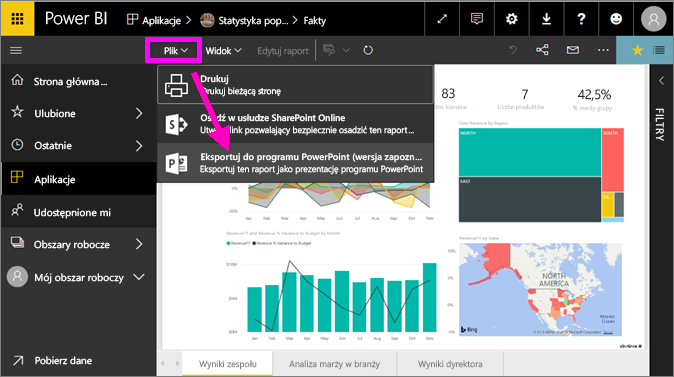

# Eksportowanie raportów z usługi Power BI do programu PowerPoint
Usługa Power BI umożliwia publikowanie raportów w programie **Microsoft PowerPoint** oraz łatwe tworzenie pokazu slajdów na podstawie raportu usługi Power BI. Podczas **eksportowania do programu PowerPoint** zachodzą następujące zmiany:

* Każda strona w raporcie usługi Power BI staje się pojedynczym slajdem w programie PowerPoint
* Każda strona w raporcie usługi Power BI jest eksportowana jako jeden obraz o wysokiej rozdzielczości w programie PowerPoint <!-- * The filters and slicers settings that you added to the report are preserved. -->
* W programie PowerPoint jest tworzony link prowadzący do raportu usługi Power BI 

Eksportowanie **raportu usługi Power BI** do programu **PowerPoint** jest szybkie. Wystarczy wykonać kroki opisane w następnej sekcji.

## Jak wyeksportować raport usługi Power BI do programu PowerPoint
W usłudze Power BI wybierz raport do wyświetlenia na kanwie. Możesz również wybrać raport ze **strony głównej**, obszaru **Aplikacje** lub innej sekcji w okienku nawigacji po lewej stronie.

Gdy raport, który chcesz wyeksportować do programu PowerPoint, zostanie wyświetlony na kanwie, wybierz pozycję **Plik > Eksportuj do programu PowerPoint** na pasku menu w usłudze Power BI.

W prawym górnym rogu okna przeglądarki usługi Power BI zostanie wyświetlony transparent powiadomienia z informacją, że raport jest eksportowany do programu PowerPoint. Może to potrwać kilka minut. Podczas eksportowania raportu możesz kontynuować pracę w usłudze Power BI.

Po zakończeniu na transparencie powiadomienia zostanie wyświetlona informacja, że usługa Power BI zakończyła proces eksportowania.

Plik będzie dostępny w miejscu, gdzie przeglądarka wyświetla pobrane pliki. Na poniższej ilustracji widać transparent pobierania wzdłuż dolnej części okna przeglądarki.

To wszystko. Teraz możesz pobrać ten plik, otworzyć go za pomocą programu PowerPoint, a następnie modyfikować go i ulepszać, tak jak każdą inną prezentację programu PowerPoint.

## Sprawdzanie wyeksportowanego pliku programu PowerPoint
Po otworzeniu pliku programu PowerPoint wyeksportowanego przez usługę Power BI znajdziesz w nim kilka fajnych i przydatnych elementów. Przyjrzyj się poniższej ilustracji, a następnie zapoznaj się z ponumerowanymi elementami poniżej, opisującymi niektóre z tych użytecznych funkcji.

1. Pierwsza strona pokazu slajdów zawiera nazwę raportu oraz link umożliwiający **wyświetlenie w usłudze Power BI** raportu, na którym oparto ten pokaz slajdów.
2. Widoczne są także pewne przydatne informacje dotyczące raportu, takie jak *ostatnie odświeżanie danych*, na których oparty jest wyeksportowany raport, oraz data i godzina *pobrania*, czyli data i godzina wyeksportowania raportu usługi Power BI do pliku programu PowerPoint.
3. Każda strona raportu jest osobnym slajdem, jak pokazano w okienku nawigacji po lewej stronie. 
4. Opublikowany raport jest renderowany w języku zgodnym z ustawieniami usługi Power BI lub ustawieniami regionalnymi przeglądarki. Aby zobaczyć lub ustawić preferencje dotyczące języka, wybierz ikonę z kołem zębatym  **> Ustawienia > Ogólne > Język**. Informacje dotyczące ustawień regionalnych znajdują się w temacie [Języki i kraje/regiony obsługiwane w usłudze Power BI](../supported-languages-countries-regions.md).
5. Prezentacja programu PowerPoint zawiera slajd tytułowy z wyeksportowaną godziną w prawidłowej strefie czasowej.

Gdy przejdziesz do pojedynczego slajdu, zauważysz, że każda strona raportu jest niezależnym obrazem.

>[!NOTE]
> Zastosowanie jednej wizualizacji dla każdej strony raportu to nowe zachowanie. Poprzednie zachowanie, które udostępniało niezależny obraz dla każdej wizualizacji, nie jest już zaimplementowane. 
 

To, co teraz zrobisz z pokazem slajdów programu PowerPoint, lub z dowolnym obrazem o wysokiej rozdzielczości, zależy wyłącznie od Ciebie!

## Ograniczenia
Pracując z funkcją **Eksportuj do programu PowerPoint**, należy wziąć pod uwagę kilka zagadnień i ograniczeń.

* Interakcyjność podczas sesji, taka jak wyróżnianie i filtrowanie, przechodzenie do szczegółów i inne funkcje, nie jest na razie obsługiwana podczas eksportowania do programu PowerPoint. Wyeksportowany plik programu PowerPoint pokazuje oryginalne wizualizacje tak, jak zostały zapisane w raporcie. Jeśli zastosowano filtry i fragmentatory i chcesz je zachować podczas eksportu, musisz zapisać raport, a następnie przeprowadzić eksportowanie.
* **Wizualizacje języka R** nie są obecnie obsługiwane. Każda taka wizualizacja jest eksportowana do programu PowerPoint jako pusty obraz z komunikatem o błędzie informującym, że wizualizacja nie jest obsługiwana.
* **Wizualizacje niestandardowe**, które posiadają **certyfikat**, są obsługiwane. Aby uzyskać więcej informacji na temat certyfikowanych wizualizacji niestandardowych, w tym jak uzyskać certyfikat dla wizualizacji niestandardowej, zobacz [Certyfikowanie wizualizacji niestandardowej](../power-bi-custom-visuals-certified.md). Wizualizacje niestandardowe, które nie mają certyfikatu, nie są obsługiwane i są eksportowane do programu PowerPoint jako puste obrazy z komunikatem o błędzie informującym, że wizualizacja nie jest obsługiwana.
* Obecnie nie można eksportować raportów zawierających więcej niż 30 stron.
* Proces eksportowania raportu do programu PowerPoint może potrwać kilka minut, dlatego prosimy o cierpliwość. Czynniki, które mogą mieć wpływ na czas eksportowania, obejmują strukturę raportu oraz bieżące obciążenie usługi Power BI.
* Jeśli element menu **Eksportuj do programu PowerPoint** nie jest dostępny w usłudze Power BI, prawdopodobnie administrator dzierżawy wyłączył tę funkcję. Aby uzyskać więcej informacji, skontaktuj się z administratorem dzierżawy.
* Obrazy tła zostaną przycięte do obszaru ograniczającego wykres. Zdecydowanie zalecamy, aby usunąć obrazy tła przed rozpoczęciem eksportowania do programu PowerPoint.
* Strony w programie PowerPoint są zawsze tworzone w standardowym rozmiarze 9:16, niezależnie od oryginalnych wymiarów i rozmiarów stron w raporcie usługi Power BI.
* Raporty, które są własnością użytkownika spoza Twojej domeny dzierżawy usługi Power BI (na przykład raporty należące do osoby spoza organizacji i udostępnione Tobie), nie mogą być publikowane w programie PowerPoint.
* Jeśli udostępniasz pulpit nawigacyjny osobie spoza organizacji (czyli użytkownikowi, który nie należy do Twojej dzierżawy usługi Power BI), ta osoba nie będzie mogła wyeksportować raportów skojarzonych z udostępnionym pulpitem nawigacyjnym do programu PowerPoint. Jeśli na przykład jesteś użytkownikiem aaron@contoso.com, możesz udostępnić pulpit nawigacyjny użytkownikowi david@cohowinery.com. Ale użytkownik david@cohowinery.com nie może wyeksportować skojarzonych raportów do programu PowerPoint.
* Jak wspomniano wcześniej, każda strona raportu jest eksportowana jako jeden obraz w pliku programu PowerPoint.
* Usługa Power BI używa ustawień języka użytkownika usługi Power BI jako języka eksportu do programu PowerPoint. Aby zobaczyć lub ustawić preferencje dotyczące języka, wybierz ikonę z kołem zębatym  **> Ustawienia > Ogólne > Język**.
* Czas **Pobrano** na slajdzie okładki wyeksportowanego pliku programu PowerPoint jest ustawiony na strefę czasową komputera obowiązującą w czasie eksportu.

## Następne kroki
[Drukowanie raportu](end-user-print.md)