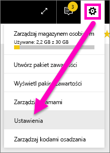
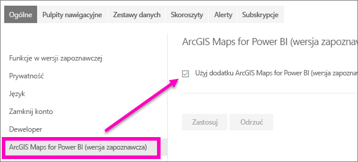

# Włączanie funkcji usługi Power BI w wersji zapoznawczej
## Co to są *funkcje w wersji zapoznawczej*?
W miarę wprowadzania ulepszeń usługi Power BI udostępnimy nową funkcjonalność w postaci *funkcji w wersji zapoznawczej*. Funkcje w wersji zapoznawczej można włączać i wyłączać, co umożliwia ich wypróbowanie.

> [!TIP]
> Funkcje w wersji zapoznawczej są również dostępne dla programu Power BI Desktop. Aby uzyskać więcej informacji, [odwiedź forum społeczności programu Power BI Desktop](https://community.powerbi.com/t5/Desktop/bd-p/power-bi-designer).
> 
> 

## Wyszukiwanie wersji zapoznawczych i ich włączanie (i wyłączanie)
1. Otwórz menu Ustawienia, wybierając ikonę koła zębatego w prawym górnym rogu ekranu usługi Power BI i wybierając opcję **Ustawienia**.
   
   .
2. Wybierz kartę **Ogólne**. Jeśli wersje zapoznawcze istnieją, zobaczysz opcję **Funkcje w wersji zapoznawczej** lub na liście z lewej strony pojawi się funkcja w wersji zapoznawczej.  W tym przykładzie na liście znajduje się wersja zapoznawcza funkcji ArcGIS Maps. 
   
   
3. Wybierz przycisk radiowy **Włącz** lub zaznacz pole wyboru, aby wypróbować nowe środowisko. Następnie wybierz pozycję **Zastosuj**.
4. Aby wyłączyć funkcje w wersji zapoznawczej, wykonaj kroki 1–3 powyżej, w kroku 3 wybierz pozycję **Wyłącz** lub usuń znacznik wyboru, a następnie wybierz pozycję **Zastosuj**.

Masz pytania lub opinię? [Odwiedź forum społeczności usługi Power BI](http://community.powerbi.com/t5/Navigation-Preview-Forum/bd-p/NavigationPreview).

