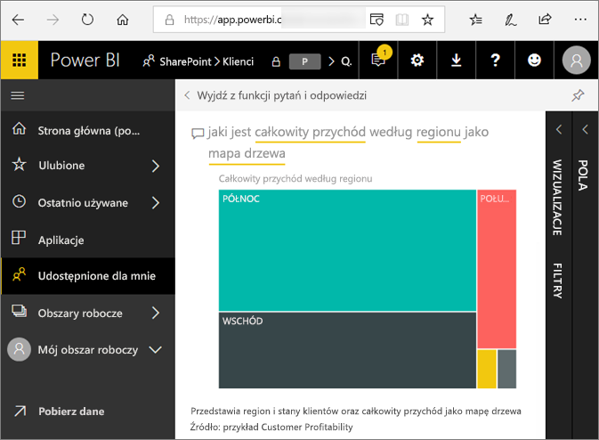
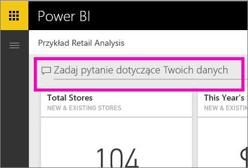
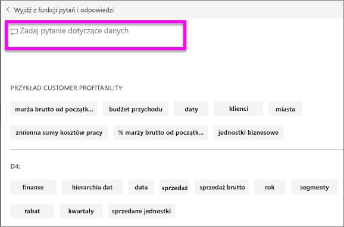
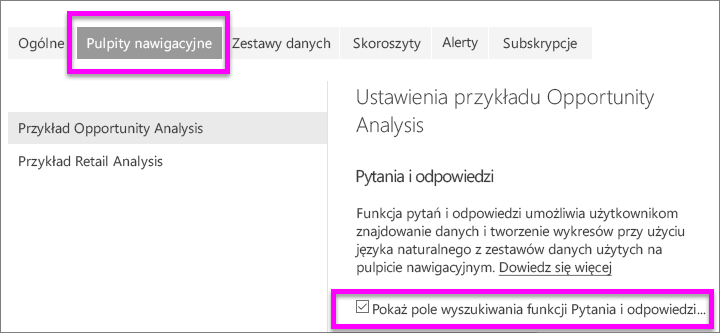
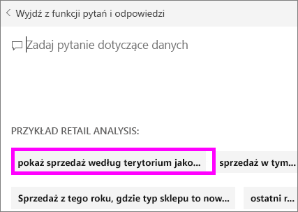

# Funkcja pytań i odpowiedzi dla **użytkowników** usługi Power BI
## Co to jest funkcja pytań i odpowiedzi?
Czasem najszybszym sposobem uzyskania odpowiedzi na podstawie danych jest zadanie pytania przy użyciu języka naturalnego. Na przykład „what were total sales last year” (ile wynosiła łączna sprzedaż w zeszłym roku).  
Pytania i odpowiedzi pozwalają eksplorować dane, korzystając z intuicyjnych możliwości języka naturalnego, oraz uzyskiwać odpowiedzi w formie wykresów i schematów. Funkcja Pytania i odpowiedzi różni się od wyszukiwarki — Pytania i odpowiedzi zwraca tylko wyniki dotyczące danych w usłudze Power BI.

Funkcja **pytań i odpowiedzi w usłudze Power BI** obsługuje tylko udzielanie odpowiedzi na zapytania w języku naturalnym zadawane w języku angielskim. Dostępna jest wersja zapoznawcza dla języka hiszpańskiego, którą może włączyć administrator usługi Power BI.

**Funkcja pytań i odpowiedzi dla usługi Power BI** jest dostępna tylko w przypadku licencji Pro lub Premium. 
>

Zadanie pytania to dopiero początek.  Pobaw się, przeglądając dane, poprawiając lub rozszerzając pytania, odkrywając nowe wiarygodne informacje, przybliżając szczegóły lub oddalając, aby uzyskać szersze spojrzenie. Zachwycą Cię szczegółowe informacje oraz dokonane obserwacje.

Środowisko jest w pełni interaktywne i szybkie! Obsługa za pośrednictwem magazynu w pamięci zapewnia niemal natychmiastowe odpowiedzi.

## Gdzie można używać funkcji pytań i odpowiedzi?
Funkcję pytań i odpowiedzi znajdziesz na pulpitach nawigacyjnych w usłudze Power BI, w dolnej części pulpitu nawigacyjnego usługi Power BI dla urządzeń przenośnych oraz nad wizualizacją w usłudze Power BI Embedded. Funkcji pytań i odpowiedzi będzie można używać do eksplorowania danych, ale nie będzie można zapisywać żadnych wizualizacji utworzonych za jej pomocą, chyba że projektant udzieli uprawnień do edycji.

## Skąd funkcja pytań i odpowiedzi wie, jak odpowiadać na pytania?
Funkcja pytań i odpowiedzi wyszukuje odpowiedzi we wszystkich zestawach danych skojarzonych z pulpitem nawigacyjnym. Jeśli zestaw danych ma kafelek na pulpicie nawigacyjnym, funkcja pytań i odpowiedzi będzie szukać odpowiedzi w tym zestawie danych. 

## Jak rozpocząć?
Najpierw zapoznaj się z zawartością. Przyjrzyj się wizualizacjom na pulpicie nawigacyjnym i w raporcie. Zapoznaj się z dostępnym typem i zakresem danych. Wróć do pulpitu nawigacyjnego i umieść kursor w polu pytania. Spowoduje to otwarcie ekranu funkcji pytań i odpowiedzi.

 

* Jeśli etykiety osi i wartości wizualizacji zawierają terminy „sprzedaż”, „konto”, „miesiąc” i „możliwości”, możesz bezpiecznie zadawać pytania, takie jak: „Które *konto* ma największe *możliwości* lub pokaż *sprzedaż* według miesiąca jako wykres słupkowy”.

* Jeśli masz dane wydajności witryny internetowej w usłudze Google Analytics, możesz zadać pytanie o czas pozostawania na stronie internetowej, liczbę unikatowych odwiedzin strony i stopień zaangażowania użytkownika. Lub, jeśli zadajesz zapytanie do danych demograficznych, możesz zadawać pytania na temat wieku i przychodu gospodarstwa domowego według lokalizacji.

W dolnej części ekranu są widoczne inne przydatne elementy. Funkcja pytań i odpowiedzi wyświetla dla każdego zestawu danych słowa kluczowe, a czasami nawet przykładowe lub sugerowane pytania. Wybierz dowolne z nich, aby dodać je do pola pytania. 

Funkcja pytań i odpowiedzi pomaga zadawać pytania także przy użyciu monitów, autouzupełniania i podpowiedzi wizualnych. 

 

### Jakich wizualizacji używa funkcja pytań i odpowiedzi?
Funkcja pytań i odpowiedzi wybiera najlepsze wizualizacje na podstawie wyświetlanych danych. Niekiedy dane w źródłowych zestawach danych są definiowane jako określony typ lub kategoria i pomaga to funkcji pytań i odpowiedzi określić sposób ich wyświetlania. Na przykład, jeśli dane są zdefiniowane jako typ Data, najprawdopodobniej będą wyświetlane jako wykres liniowy. Dane, które należą do kategorii miejscowość, najprawdopodobniej będą wyświetlane jako mapa.

Można określić funkcji pytań i odpowiedzi, której wizualizacji użyć, dodając ją do na swojego pytania. Jednak należy pamiętać, że nie zawsze może być możliwe wyświetlenie w funkcji pytań i odpowiedzi danych w żądanym typie wizualizacji. Funkcja pytań i odpowiedzi wyświetli listę typów wizualizacji, z którymi można pracować.

## Istotne zagadnienia i rozwiązywanie problemów
**Pytanie**: Nie widzę funkcji pytań i odpowiedzi na tym pulpicie nawigacyjnym.    
**Odpowiedź 1**: Jeśli nie widzisz pola pytania, najpierw sprawdź ustawienia. Aby to zrobić, wybierz ikonę koła zębatego w prawym górnym rogu paska narzędzi usługi Power BI.   

Następnie wybierz pozycję **Ustawienia** > **Pulpity nawigacyjne**. Upewnij się, że przy opcji **Pokaż pole wyszukiwania funkcji Pytania i odpowiedzi na tym pulpicie nawigacyjnym** znajduje się znacznik wyboru.
  

**Odpowiedź 2**: Projektant *pulpitów nawigacyjnych* lub administrator czasami wyłączają funkcję pytań i odpowiedzi. Skontaktuj się z nimi, aby sprawdzić, czy można ją ponownie włączyć.   

**Pytanie**: Gdy wpisuję pytanie, nie są wyświetlane odpowiednie wyniki.    
**Odpowiedź**: Skontaktuj się z *projektantem* pulpitu nawigacyjnego. Projektant może ulepszyć wyniki funkcji pytań i odpowiedzi na wiele sposobów. Projektant może na przykład zmienić nazwy kolumn w zestawie danych, aby używane były łatwe do zrozumienia terminy (`CustomerFirstName` zamiast `CustFN`). Ponieważ projektant bardzo dobrze zna zestaw danych, może także utworzyć przydatne pytania i dodać je do kanwy funkcji pytań i odpowiedzi.

## Następne kroki

