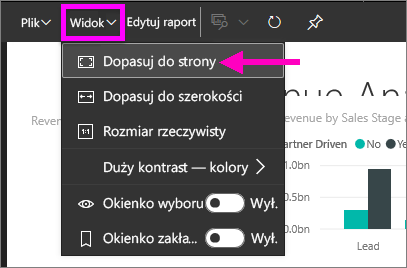

<!-- once the sample aps are live, change this so consumers can follow along -->
# Szybki start: informacje o możliwościach usługi Power BI dla ***użytkowników***
W tym przewodniku Szybki start dowiesz się, jak korzystać z usługi Power BI, aby znajdować szczegółowe informacje biznesowe oparte na danych. Ten artykuł nie zawiera szczegółowego objaśnienia funkcji, ale raczej krótkie przedstawienie wielu akcji dostępnych w usłudze Power BI dla **użytkowników**.

Jeśli nie masz konta usługi Power BI, na początku [zacznij korzystać z bezpłatnej wersji próbnej](https://app.powerbi.com/signupredirect?pbi_source=web).

## Wymagania wstępne
- Usługa Power BI (app.powerbi.com) <!-- app from AppSource -->

## Widok do czytania
Widok do czytania jest dostępny w usłudze Power BI dla *użytkowników* raportów. Kiedy współpracownik udostępni Ci raport, widok do czytania umożliwia eksplorowanie raportu i korzystanie z niego. 

Inny tryb raportów usługi Power BI to [Widok do edycji](../service-interact-with-a-report-in-editing-view.md), który jest dostępny dla *projektantów* raportów.  

Widok do czytania to zaawansowany i bezpieczny sposób poznawania pulpitów nawigacyjnych i raportów. Kiedy przeglądasz udostępnione Ci pulpity nawigacyjne i raporty oraz z nich korzystasz, bazowe zestawy danych pozostają nienaruszone i niezmienione. 

W widoku do czytania możesz krzyżowo zaznaczać i krzyżowo filtrować wizualizacje na stronie.  Po prostu zaznacz lub wybierz wartość w jednym elemencie wizualnym i natychmiast zobacz jej wpływ na inne elementy wizualne. Okienko Filtr umożliwia dodawanie i modyfikowanie filtrów na stronie raportu oraz zmianę sposobu sortowania wartości w wizualizacji. To tylko kilka funkcji dla *użytkowników* w usłudze Power BI.  Czytaj dalej, aby dowiedzieć się więcej na ich temat oraz poznać inne.

 
### Wyświetlanie aplikacji
W usłudze Power BI *aplikacje* łączą ze sobą w jednym miejscu wszystkie powiązane pulpity nawigacyjne i raporty.

1. Wybierz pozycję **Aplikacje**  > **Pobierz aplikacje**. 
   
     
2. W usłudze AppSource w obszarze **Moja organizacja** wykonaj wyszukiwanie, aby zawęzić wyniki i znaleźć odpowiednią aplikację.
   
     
3. Wybierz pozycję **Pobierz teraz**, aby dodać wybraną aplikację do swojego kontenera Aplikacje. 

### Wyświetlanie pulpitu nawigacyjnego
Ta aplikacja jest otwierana w widoku pulpitu nawigacyjnego. ***Pulpit nawigacyjny*** usługi Power BI to pojedyncza strona, często nazywana kanwą, umożliwiająca przekazywanie informacji za pomocą wizualizacji. Ponieważ jest to tylko jedna strona, dobrze zaprojektowany pulpit nawigacyjny zawiera tylko najistotniejsze informacje.

Wizualizacje wyświetlane na pulpicie nawigacyjnym nazywane są *kafelkami* i są *przypinane* do pulpitu nawigacyjnego z poziomu raportów.

### Subskrybowanie pulpitu nawigacyjnego (lub raportu)
Aby monitorować pulpit nawigacyjny, nie trzeba koniecznie otwierać usługi Power BI.  Zamiast tego możesz włączyć subskrypcję, a usługa Power BI będzie wysyłać Ci wiadomości e-mail z migawką danego pulpitu nawigacyjnego zgodnie z ustawionym przez Ciebie harmonogramem. 

.

1. Z górnego menu wybierz pozycję **Subskrybuj** lub wybierz ikonę koperty .
   
   

3. Aby włączyć/wyłączyć subskrypcję, użyj żółtego suwaka.  Możesz również dodać szczegóły wiadomości e-mail. 

    Na poniższych zrzutach ekranu widać, że subskrybowanie raportu polega w rzeczywistości na zasubskrybowaniu *strony* raportu.  Aby zasubskrybować więcej niż jedną stronę raportu, wybierz pozycję **Dodaj kolejną subskrypcję** i wybierz inną stronę. 
      
   
   
    Odświeżenie strony raportu nie powoduje odświeżenia zestawu danych. Tylko właściciel zestawu danych może ręcznie odświeżyć zestaw danych. Aby wyszukać nazwy źródłowych zestawów danych, wybierz opcję **Wyświetl powiązane** na górnym pasku menu.

### Wyświetl zawartość pokrewną
Okienko **Powiązana zawartość** wyświetla sposób połączenia między różnymi zawartościami usługi Power BI — pulpitami nawigacyjnymi, raportami i zestawami danych. Okienko nie tylko wyświetla powiązaną zawartość, ale też umożliwia podejmowanie działań wobec zawartości i łatwe nawigowanie wśród powiązanych zawartości.

Z poziomu pulpitu nawigacyjnego lub raportu wybierz pozycję **Wyświetl powiązane** na górnym pasku menu.

### Zadawanie pytań przy użyciu języka naturalnego za pomocą funkcji Pytania i odpowiedzi
Czasem najszybszym sposobem uzyskania odpowiedzi na podstawie danych jest zadanie pytania przy użyciu języka naturalnego. Pole Pytania i odpowiedzi jest dostępne u góry pulpitu nawigacyjnego. Na przykład „pokaż liczbę dużych szans sprzedaży według etapu sprzedaży w formie wykresu lejkowego”. 

### Dodanie pulpitu nawigacyjnego do ulubionych
Po ustawieniu zawartości jako *ulubionej* można uzyskiwać do niej dostęp na lewym pasku nawigacyjnym. Lewy pasek nawigacyjny jest widoczny z niemal każdego obszaru usługi Power BI. Elementy ulubione to zazwyczaj pulpity nawigacyjne, strony raportu i aplikacje, które odwiedzasz najczęściej.

1. Zamknij okno Pytania i odpowiedzi, aby powrócić do pulpitu nawigacyjnego.    
2. W prawym górnym rogu w usłudze Power BI wybierz pozycję **Dodaj do ulubionych** lub ikonę gwiazdki .
   
   

### Otwieranie i wyświetlanie raportów i stron raportów
Raport zawiera co najmniej jedną stronę wizualizacji. Raporty są tworzone przez *projektantów raportów* usługi Power BI i [udostępniane *użytkownikom* bezpośrednio](end-user-shared-with-me.md) lub jako część [aplikacji](end-user-apps.md). 

Raporty można otwierać z poziomu pulpitu nawigacyjnego. Większość kafelków pulpitu nawigacyjnego jest *przypiętych* z raportów. Wybranie kafelka powoduje otwarcie raportu, który został użyty do utworzenia kafelka. 

1. Na pulpicie nawigacyjnym wybierz kafelek. W tym przykładzie wybraliśmy kafelek wykresu kolumnowego „Revenue” (Przychód).

    

2.  Skojarzony raport zostanie otwarty. Zwróć uwagę, że jesteśmy na stronie „Revenue overview” (Omówienie przychodu). Jest to strona raportu zawierająca wykres kolumnowy, który wybraliśmy na pulpicie nawigacyjnym.

    

### Dostosowywanie wymiarów wyświetlania
Raporty są wyświetlane na wielu różnych urządzeniach mających różne rozmiary ekranu i współczynniki proporcji.  Domyślne renderowanie może nie być tym, co chcesz zobaczyć na swoim urządzeniu.  

1. Aby dopasować widok, na pasku menu u góry wybierz pozycję **Widok**.

    

2.  Wybierz jedną z opcji wyświetlania. W tym przykładzie wybraliśmy opcję **Dopasuj do strony**.

        

### Używanie okienka filtrów raportu
Jeśli autor raportu dodał filtry do strony w raporcie, możesz wchodzić z nimi w interakcje i zapisać swoje zmiany w raporcie.

1. Wybierz ikonę **Filtry** w prawym górnym rogu.
   
     

2. Wybierz wizualizację, aby ją uaktywnić. Zobaczysz wszystkie filtry, które zostały zastosowane do tej wizualizacji (filtry na poziomie wizualizacji), do całej strony raportu (filtry na poziomie strony) i do całego raportu (filtry na poziomie raportu).
   
   

3. Umieść kursor nad filtrem i rozwiń go, wybierając strzałkę w dół.
   
   

4. Wprowadź zmiany do filtrów i zobacz ich wpływ na elementy wizualne.  
   
     
     

### Sprawdzanie, jak są ze sobą połączone wszystkie wizualizacje na stronie
Możesz krzyżowo wyróżniać i krzyżowo filtrować powiązane wizualizacje na stronie. Wizualizacje na pojedynczej stronie raportu są wszystkie „połączone” ze sobą.  Oznacza to, że w przypadku wybrania przynajmniej jednej wartości w jednej wizualizacji inne wizualizacje, które używają tej samej wartości, ulegną zmianie na podstawie Twojego wyboru.

> 
### Wyświetlanie szczegółów w wizualizacji
Umieszczanie kursora nad elementami wizualnymi, aby wyświetlić szczegóły

### Sortowanie wizualizacji
Wizualizacje na stronie raportu można sortować i zapisywać z zastosowanymi przez Ciebie zmianami. 

1. Umieść wskaźnik myszy na wizualizacji, aby ją uaktywnić.    
2. Wybierz wielokropek (...), aby otworzyć opcje sortowania.

     

###  Otwieranie okienka **Wybór**
Łatwo przechodź między wizualizacjami na stronie raportu. 

1. Wybierz pozycję **Widok > Okienko wyboru**, aby otworzyć okienko wyboru. Ustaw przełącznik dla **okienka wyboru** na pozycji Włączone.

    

2. Okienko wyboru zostanie otwarte na kanwie raportu. Wybierz wizualizację z listy, aby ją uaktywnić.

    

### Powiększanie poszczególnych elementów wizualnych
Umieść kursor na elemencie wizualnym i wybierz ikonę **trybu koncentracji uwagi** . Po wyświetleniu wizualizacji w trybie koncentracji uwagi rozszerza on ją tak, aby wypełniła całą kanwę raportu, jak pokazano poniżej.

Aby wyświetlić tę samą wizualizację bez przeszkadzającego paska menu, okienka filtra i innych elementów, wybierz ikonę **Pełny ekran** z najwyższego paska menu .

### Wyświetlanie danych użytych do utworzenia wizualizacji
Wizualizację usługi Power BI tworzy się przy użyciu danych z podstawowych zestawów danych. Jeśli interesują Cię informacje niewidoczne na pierwszym planie, usługa Power BI umożliwia *wyświetlenie* danych używanych do tworzenia wizualizacji. Po wybraniu pozycji **Pokaż dane** usługa Power BI wyświetli dane poniżej (lub obok) wizualizacji.

1. W usłudze Power BI otwórz raport, a następnie wybierz wizualizację.  
2. Aby wyświetlić dane, na których wizualizacja jest oparta, wybierz wielokropek (...), a następnie wybierz pozycję **Pokaż dane**.
   
   

W tym artykule przedstawiliśmy szybki przegląd kilku rzeczy, które mogą robić **użytkownicy** za pomocą usługi Power BI.  

## Czyszczenie zasobów
- Jeśli połączono się z aplikacją, na lewym pasku nawigacyjnym wybierz pozycję **Aplikacje**, aby otworzyć listę zawartości Aplikacje. Najedź kursorem na aplikację do usunięcia i wybierz ikonę kosza na śmieci.

- Jeśli zaimportowano przykładowy raport usługi Power BI lub połączono się z nim, na lewym pasku nawigacyjnym wybierz pozycję **Mój obszar roboczy**. Korzystając z kart u góry, znajdź pulpit nawigacyjny, raport i zestaw danych, a następnie wybierz ikonę kosza na śmieci dla każdego z tych elementów.

## Następne kroki

