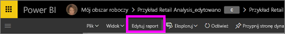
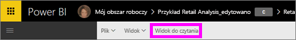

# Widok do czytania i widok do edycji w raportach usługi Power BI
W usłudze Power BI (nie w programie Power BI Desktop) są dostępne dwa tryby wyświetlania raportów i korzystania z nich: widok do czytania i widok do edycji. Widok do czytania jest dostępny dla wszystkich osób, a w szczególności jest przeznaczony dla *użytkowników* danych, natomiast widok do edycji jest dostępny tylko dla *twórców* i właścicieli raportu.

## Widok do czytania raportu

 Widok do czytania umożliwia eksplorowanie raportu i korzystanie z niego — jest to przyjemny i bezpieczny sposób poznawania i używania danych. Widok do czytania jest przeznaczony dla *konsumentów* raportu, czyli osób, które otwierają raporty z aplikacji lub którym [udostępniono](../service-share-dashboards.md) raporty. Widok do czytania gwarantuje, że każdy konsument konkretnego raportu widzi ten sam raport i te same wizualizacje oraz (opcjonalnie) z zastosowaniem tych samych filtrów.  Konsumenci mogą wchodzić w interakcje z raportami, mogą zmieniać istniejące filtry (i te zmiany są zapisywane z raportem), ale nie mogą dodawać nowych filtrów.

>**UWAGA** W pewnych okolicznościach konsumenci raportu mogą widzieć różne dane z powodu zabezpieczeń na poziomie wiersza i uprawnień dotyczących danych.

## Widok do edycji raportu

Widok do edycji jest dostępny tylko dla tych osób, które utworzyły raport lub są jego [współwłaścicielami jako członkowie lub administratorzy obszaru roboczego aplikacji](end-user-create-apps.md).

Widok do edycji jest przeznaczony dla *twórców* raportu. To tutaj twórcy importują zestawy danych i łączą się z nimi, eksplorują dane oraz tworzą raporty i pulpity nawigacyjne. Widok do edycji pozwala *twórcom* jeszcze bardziej zagłębić się w dane poprzez dodawanie i usuwanie pól, zmianę typu wizualizacji, tworzenie nowych wizualizacji, a także dodawanie oraz usuwanie wizualizacji i stron w raporcie. Następnie mogą oni udostępnić utworzone raporty współpracownikom.

## Porównanie widoku do czytania i widoku do edycji
Ten wykres nie zawiera wszystkich funkcji raportu usługi Power BI! Zawiera on listę tylko tych zadań raportu, które nie są dostępne **zarówno** w widoku do czytania, jak i w widoku do edycji.

|Zadanie  | Widok do czytania  | Widok do edycji |
|-------------------------|-------|-------|
|**Raporty jako całość**  |
| [Tworzenie lub edytowanie raportu](../service-report-create-new.md) | Nie  | Tak |
| [Udostępnianie raportu](../service-share-reports.md)| Tak | Tak. Umożliwia także zarządzanie uprawnieniami, w tym przyznawanie innym uprawnień *właściciela*. |
| [Tworzenie trwałych filtrów na poziomie wizualizacji, przeglądania szczegółowego, na poziomie strony i na poziomie raportu w okienku filtrów](../power-bi-report-add-filter.md) | Nie  | Tak |
| [Używanie okienka filtrów raportu](end-user-report-filter.md) | Tak, można używać istniejących filtrów, zmiany mogą być zapisywane z raportem, ale nie można dodawać nowych filtrów. | Tak |
| [Używanie okienka analizy raportu](../service-analytics-pane.md) | Nie | Tak |
| [Opcje **widoku** raportu](../power-bi-report-display-settings.md) | Tak, z pewnymi wyjątkami. | Tak, wszystkie, w tym linie siatki, przyciąganie i blokowanie. |
| [Tworzenie harmonogramu odświeżania](../refresh-data.md) | Nie  | Tak |
| [Subskrybowanie raportu](end-user-subscribe.md) | Tak | Nie |
| [Pytania i odpowiedzi — zadawanie pytań w raportach](end-user-q-and-a.md) | Nie  | Tak |
| [Wyświetlanie metryk użycia](../service-usage-metrics.md) | Tak, na kanwie raportu | Tak, na liście raportu (widok zawartości) |
| [Wyświetlanie powiązanych](end-user-related.md) | Tak, na kanwie raportu | Tak, na liście raportu (widok zawartości) |
| [Zapisywanie raportu](../service-report-save.md) | Tak, ale wyłącznie przy użyciu polecenia **Zapisz jako**. | Tak |
| [Usuwanie raportu](end-user-delete.md) | Nie  | Tak |
|**Strony raportu** |
| [Dodawanie strony raportu lub zmienianie jej nazwy](../power-bi-report-add-page.md)  | Nie  | Tak  |
| [Duplikowanie strony raportu](../power-bi-report-copy-paste-page.md) | Nie  | Tak |
| [Usuwanie strony raportu](end-user-delete.md) | nie | tak |
|**Praca z wizualizacjami raportu**|
| [Dodawanie wizualizacji do raportu](../visuals/power-bi-report-add-visualizations-i.md) | Nie  | Tak |
| [Dodawanie pól tekstowych i kształtów do raportu](../power-bi-reports-add-text-and-shapes.md) | Nie  | Tak |
| [Używanie okienka formatowania raportu](../service-the-report-editor-take-a-tour.md) | Nie | Tak |
| [Ustawianie interakcji wizualizacji](end-user-interactions.md) | Nie  | Tak |
| [Wyświetlanie danych użytych do utworzenia wizualizacji](end-user-show-data.md) | Nie  | Tak |
| [Konfigurowanie przechodzenia do szczegółów](end-user-drill.md) | Nie  | Tak |
| [Zmienianie używanej wizualizacji](../visuals/power-bi-report-change-visualization-type.md) | Nie | Tak|
| [Usuwanie wizualizacji, pola tekstowego lub kształtu](end-user-delete.md)| Nie | Tak |

## Przechodzenie między widokiem do edycji i widokiem do czytania
Pamiętaj, że tylko twórcy i właściciele raportu będą mogli otworzyć raport w widoku do edycji.

1. Domyślnie raport jest zwykle najpierw otwierany w widoku do czytania. Można stwierdzić, że jest się w widoku do czytania, jeśli jest widoczna opcja **Edytuj raport**. Jeśli opcja **Edytuj raport** jest wyszarzona, nie masz uprawnień do otwierania raportu w widoku do edycji.

   

2. Jeśli opcja **Edytuj raport** nie jest wyszarzona, wybierz ją, aby otworzyć raport w widoku do edycji.

   

   Raport jest teraz w widoku do edycji i używa tych samych [ustawień wyświetlania](../power-bi-report-display-settings.md), co ostatnio w widoku do czytania.

2. Aby powrócić do widoku do czytania, wybierz pozycję **Widok do czytania** na górnym pasku nawigacyjnym.

    

### Następne kroki
Istnieje wiele sposobów na korzystanie z raportu w widoku do czytania, dzielenie i grupowanie danych w celu uzyskania szczegółowych informacji i odpowiedzi na pytania.  Następny temat, [Interakcje z raportem w widoku do czytania](../service-interact-with-a-report-in-editing-view.md), zawiera szczegółowy opis niektórych z tych metod.    
Wróć do [raportów w usłudze Power BI](end-user-reports.md)    
Masz więcej pytań? [Odwiedź społeczność usługi Power BI](http://community.powerbi.com/)
