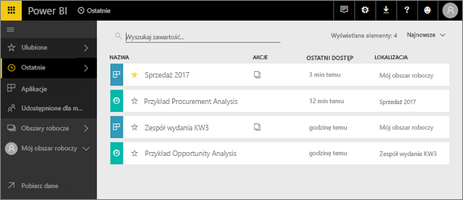
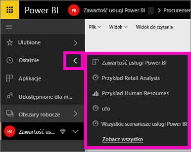
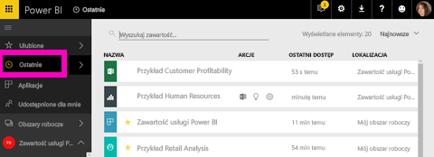

# **Ostatnia** zawartość w usłudze Power BI
Ostatnia zawartość to ostatnio wyświetlane elementy w usłudze Power BI, maksymalnie 20 elementów.  Obejmują one: pulpity nawigacyjne, raporty, aplikacje i skoroszyty we wszystkich Twoich obszarach roboczych.

Zobacz, jak Amanda demonstruje, jak w usłudze Power BI wypełniane są listy **ostatnio używanej** zawartości, a następnie wykonaj instrukcje krok po kroku umieszczone poniżej wideo, aby samodzielnie wypróbować tę funkcję.

<iframe width="560" height="315" src="https://www.youtube.com/embed/G26dr2PsEpk" frameborder="0" allowfullscreen></iframe>

## Wyświetlanie ostatniej zawartości
Aby wyświetlić pięć ostatnio odwiedzonych elementów, w lewym obszarze nawigacji wybierz strzałkę z prawej strony pozycji **Ostatnie**.  W tym miejscu można wybrać ostatnią zawartość, aby ją otworzyć. Wyświetlane jest tylko pięć najnowszych elementów.

Jeśli masz więcej niż pięć ostatnio odwiedzonych elementów, wybierz pozycję **Zobacz wszystko**, aby otworzyć ekran Ostatnie (patrz poniżej). Możesz też wybrać pozycję **Ostatnie** lub ikonę Ostatnie  w lewym okienku nawigacji.

W tym miejscu można wchodzić w interakcje z zawartością w taki sam sposób, jak na poszczególnych kartach [**Pulpity nawigacyjne**](end-user-dashboards.md), [**Raporty**](end-user-reports.md) i **Skoroszyty** oraz na ekranie aplikacji <!--[**Apps**](end-user-apps.md)-->.

## Następne kroki
<!--[Power BI service Apps](end-user-apps.md)-->

Masz więcej pytań? [Odwiedź społeczność usługi Power BI](http://community.powerbi.com/)

