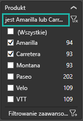
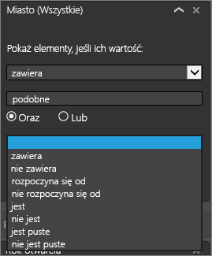

# Zapoznaj się z przewodnikiem dotyczącym okienka filtrów raportu
Ten artykuł opisuje okienko Filtry raportu w usłudze Power BI.

Istnieje wiele sposobów, aby filtrować dane w usłudze Power BI i zalecamy zapoznać się najpierw z artykułem [Informacje o filtrach i wyróżnianiu](../power-bi-reports-filters-and-highlighting.md).

## Praca z okienkiem Filtry raportu
Gdy współpracownik udostępni Ci raport, poszukaj okienka **Filtry**. Czasami jest ono zwinięte wzdłuż prawej krawędzi raportu. Wybierz je, aby je rozwinąć.   

Okienko Filtry zawiera filtry, które zostały dodane do raportu przez *projektanta* raportów. *Klienci* tacy jak Ty mogą wchodzić w interakcje z filtrami i zapisywać swoje zmiany, nie mogą jednak dodawać nowych filtrów do raportu.

W usłudze Power BI raporty zachowują wszelkie zmiany wprowadzone w okienku Filtry. Te zmiany są przekazywane do mobilnej wersji raportu. Aby zresetować okienko Filtry do wartości domyślnych projektanta, wybierz pozycję **Przywróć domyślne** z górnego paska menu.     

## Otwieranie okienka Filtry
Po otwarciu raportu okienko Filtry jest wyświetlane wzdłuż prawej strony kanwy raportu. Jeśli okienko nie jest widoczne, wybierz strzałkę w prawym górnym rogu, aby je rozwinąć.  

W tym przykładzie wybraliśmy wizualizację, która ma 6 filtrów. Strona raportu ma także filtry wyświetlane w pozycji **Filtry na poziomie strony**. Istnieje też jeden [filtr przeglądania szczegółowego](../power-bi-report-add-filter.md), zaś cały raport ma też filtr: **FiscalYear** to 2013 lub 2014.

Obok nazwy niektórych filtrów wyświetla się słowo **Wszystkie**, co oznacza, że filtr uwzględnia wszystkie wartości.  Na przykład wartość **Chain (Wszystkie)** na poniższym zrzucie ekranu informuje nas, że ta strona raportu uwzględnia dane dotyczące wszystkich sieci sklepów.  Z drugiej strony filtr na poziomie strony **FiscalYear to 2013 lub 2014** informuje nas, że raport uwzględnia tylko dane za lata obrachunkowe 2013 i 2014.

Każda osoba wyświetlająca ten raport może wchodzić w interakcje z tymi filtrami.

* Wyświetlenie szczegółów filtru przez umieszczenie nad nim kursora i wybranie strzałki obok filtru.
  
   
* Zmiana filtru, na przykład zmiana sieci z **Lindseys** na **Fashions Direct**.
  
     

* Zresetowanie filtrów do pierwotnego stanu przez wybranie pozycji **Przywróć domyślne** z górnego paska menu.    
    
    
* Usunięcie filtru przez wybranie symbolu **x** obok jego nazwy.
  
  Usunięcie filtru spowoduje usunięcie go z listy, ale nie spowoduje usunięcia danych z raportu.  Jeśli na przykład usuniesz filtr **FiscalYear to 2013 lub 2014**, dane roku obrachunkowego pozostaną w raporcie, ale nie będzie on już filtrowany, aby wyświetlać tylko dane dla roku 2013 i 2014. Będą wyświetlane dane dostępne dla wszystkich lat obrachunkowych.  Jednak po usunięciu filtru nie będzie można go modyfikować, ponieważ zostanie usunięty z listy. Lepszym rozwiązaniem jest wyczyszczenie filtru przy użyciu ikony gumki .
  
  

## Czyszczenie filtru
 W zaawansowanym lub podstawowym trybie filtrowania wybierz ikonę gumki   aby wyczyścić filtr. 

## Typy filtrów: filtry pól tekstowych
### Tryb listy
Zaznaczenie pola wyboru powoduje wybranie lub anulowanie wyboru wartości. Pola wyboru **Wszystkie** można użyć do przełączenia stanu (zaznaczenia lub usunięcia zaznaczenia) wszystkich pól wyboru. Pola wyboru reprezentują wszystkie dostępne wartości dla danego pola.  Dostosowanie filtru powoduje aktualizację instrukcji w oparciu o wybrane opcje. 

Zwróć uwagę na zmianę instrukcji na „to Amarilla lub Carretera”

### Tryb zaawansowany
Wybierz pozycję **Filtrowanie zaawansowane**, aby przejść do trybu zaawansowanego. Wskaż pola do uwzględnienia za pomocą kontrolek list rozwijanych i pól tekstowych. Wybierając pozycję **I** albo **Lub**, można tworzyć złożone wyrażenia filtrowania. Po ustawieniu odpowiednich wartości wybierz przycisk **Zastosuj filtr**.  

## Typy filtrów: filtry pól liczbowych
### Tryb listy
Jeśli wartości są wartościami skończonymi, po wybraniu nazwy pola zostanie wyświetlona lista.  Zobacz **Filtry pól testowych** &gt; **Tryb listy** powyżej, aby uzyskać pomoc dotyczącą używania pól wyboru.   

### Tryb zaawansowany
Jeśli wartości są wartościami nieskończonymi lub reprezentują zakres, po wybraniu nazwy pola zostanie otwarty zaawansowany tryb filtru. Określ zakres wartości, które mają być wyświetlane, za pomocą listy rozwijanej i pól tekstowych. 

Wybierając pozycję **I** albo **Lub**, można tworzyć złożone wyrażenia filtrowania. Po ustawieniu odpowiednich wartości wybierz przycisk **Zastosuj filtr**.

## Typy filtrów: data i godzina
### Tryb listy
Jeśli wartości są wartościami skończonymi, po wybraniu nazwy pola zostanie wyświetlona lista.  Zobacz **Filtry pól testowych** &gt; **Tryb listy** powyżej, aby uzyskać pomoc dotyczącą używania pól wyboru.   

### Tryb zaawansowany
Jeśli wartości pól reprezentują datę lub godzinę, przy użyciu filtrów daty/godziny można określić czas rozpoczęcia i zakończenia.  

## Następne kroki
[Dowiedz się, jak i dlaczego dochodzi do wzajemnego filtrowania i wyróżniania krzyżowego wizualizacji na stronie raportu](end-user-interactions.md)