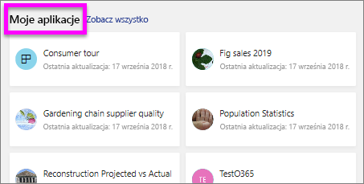

# Wyświetlanie raportu w usłudze Power BI dla *użytkowników*
Raport zawiera co najmniej jedną stronę wizualizacji. Raporty są tworzone przez *projektantów raportów* usługi Power BI i [udostępniane *użytkownikom* bezpośrednio](end-user-shared-with-me.md) lub jako część [aplikacji](end-user-apps.md). 

Istnieje wiele różnych sposobów otwierania raportu, a my przedstawimy dwa z nich: otwieranie ze strony głównej i otwieranie z pulpitu nawigacyjnego. 

<!-- add art-->

## Otwieranie raportu ze strony głównej
Otworzymy raport, który został Ci udostępniony bezpośrednio, a następnie otworzymy raport, który został udostępniony jako część aplikacji.

   

### Otwieranie raportu, który został Tobie udostępniony
*Projektanci* usługi Power BI mogą udostępnić raport bezpośrednio, klikając przycisk **Udostępnij** na pasku menu u góry. Zawartość udostępniona w ten sposób zostaje wyświetlona w kontenerze **Udostępnione mi** na lewym pasku nawigacji oraz w sekcji **Udostępnione mi** na Twojej stronie głównej.

1. Otwórz usługę Power BI (app.powerbi.com).

2. Na pasku nawigacji po lewej stronie wybierz pozycję **Strona główna (wersja zapoznawcza)**, aby otworzyć stronę główną.  

   
   
3. Przewiń w dół, aż zobaczysz pozycję **Udostępnione mi**. Poszukaj ikony raportu . Na tym zrzucie ekranu znajdują się dwa raporty: *Financial* i *Northwind*. 
   
   

4. Aby otworzyć raport wystarczy wybrać jedną z *kart* raportu.

   

5. Zwróć uwagę na karty u dołu. Każda karta reprezentuje *stronę* raportu. Obecnie mamy otwartą stronę *IT Spend Trend* (Trend dotyczący wydatków informatycznych). Wybierz inną kartę, aby otworzyć kolejną stronę raportu. 

   

6. Teraz możemy zobaczyć jedynie część strony raportu. Aby zmienić sposób wyświetlania strony (powiększenie), wybierz pozycje **Widok** > **Dopasuj do strony**.

   

   

### Otwieranie raportu, który jest częścią aplikacji
W przypadku otrzymania aplikacji od współpracowników lub z usługi AppSource te aplikacje są dostępne ze strony głównej oraz z kontenera **Aplikacje** na pasku nawigacji po lewej stronie. [Aplikacja](end-user-apps.md) to pakiet pulpitów nawigacyjnych i raportów.

1. Wróć do strony głównej, wybierając pozycję **Strona główna (wersja zapoznawcza)** na pasku nawigacji po lewej stronie.

7. Przewiń w dół, aż zobaczysz pozycję **Moje aplikacje**.

   

8. Wybierz jedną z aplikacji, aby ją otworzyć. W zależności od opcji ustawionych przez *projektanta* aplikacji, aplikacja otworzy pulpit nawigacyjny, raport lub listę zawartości aplikacji. Jeśli wybranie aplikacji:
    - powoduje otwarcie raportu, wszystko jest gotowe.
    - powoduje otwarcie pulpitu nawigacyjnego, zobacz [Otwieranie raportu z poziomu pulpitu nawigacyjnego](#Open-a-report-from-a-dashboard) poniżej.
    - powoduje otwarcie listy zawartości aplikacji, w obszarze **Raporty** wybierz raport, aby go otworzyć.

## Otwieranie raportu z poziomu pulpitu nawigacyjnego
Raporty można otwierać z poziomu pulpitu nawigacyjnego. Większość kafelków pulpitu nawigacyjnego jest *przypiętych* z raportów. Wybranie kafelka powoduje otwarcie raportu, który został użyty do utworzenia kafelka. 

1. Na pulpicie nawigacyjnym wybierz kafelek. W tym przykładzie wybraliśmy kafelek wykresu kolumnowego „Total Units YTD...”.

    

2.  Skojarzony raport zostanie otwarty. Zwróć uwagę, że jesteśmy na stronie „YTD Category”. Jest to strona raportu zawierająca wykres kolumnowy, który wybraliśmy na pulpicie nawigacyjnym.

    

> [!NOTE]
> Nie wszystkie kafelki prowadzą do raportu. Jeśli wybierzesz kafelek, który został [utworzone za pomocą opcji Pytania i odpowiedzi](end-user-q-and-a.md), zostanie otwarty ekran Pytania i odpowiedzi. Jeśli wybierzesz kafelek, który został [utworzony za pomocą widżetu pulpitu nawigacyjnego **Dodaj kafelek**](../service-dashboard-add-widget.md), może się zdarzyć kilka różnych rzeczy.  

##  Jeszcze więcej sposobów otwierania raportu
Gdy oswoisz się z nawigowaniem po usłudze Power BI, znajdziesz przepływy pracy, które najlepiej Ci odpowiadają. Oto kilka innych sposobów uzyskiwania dostępu do raportów:
- Z poziomu lewego okienka nawigacji przy użyciu opcji **Ulubione** i **Ostatnie**    
- Przy użyciu opcji [Wyświetl powiązane](end-user-related.md)    
- W wiadomości e-mail, gdy ktoś [udostępni Tobie](../service-share-reports.md) lub gdy [ustawisz alert](end-user-alerts.md)    
- Z poziomu [Centrum powiadomień](end-user-notification-center.md)    
- i nie tylko

## Następne kroki
Istnieje [wiele sposobów interakcji z raportem](end-user-reading-view.md).  Rozpocznij eksplorację od wybrania każdej karty w dolnej części kanwy raportu.

