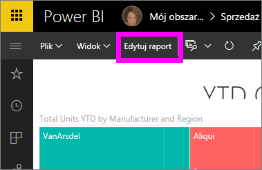

# Otwieranie raportu w usłudze Power BI (app.powerbi.com)
Raporty są dostępne w usłudze Power BI, programie Power BI Desktop, w usłudze Power BI dla urządzeń przenośnych, a nawet w usłudze Power BI Embedded. Ten artykuł dotyczy otwierania raportów w ***usłudze Power BI***.

W usłudze Power BI są dostępne dwa tryby wyświetlania raportów i korzystania z nich: [widok do czytania i widok do edycji](end-user-reading-view.md). Widok do czytania jest dostępny dla wszystkich użytkowników i jest w szczególności przeznaczony dla *konsumentów* raportu, natomiast widok do edycji jest dostępny tylko dla *twórców* i właścicieli raportu. 

## Otwieranie raportu z poziomu obszaru roboczego (za pośrednictwem listy widoku zawartości **Raporty**)

1. Rozpocznij w obszarze roboczym i wybierz kartę **Raporty**, aby wyświetlić wszystkie raporty w tym obszarze roboczym.  
   
   
2. Wybierz nazwę raportu, aby otworzyć go w widoku do czytania.  
   
    
3. Tak [wiele możesz zrobić w widoku do czytania](end-user-reading-view.md).  Ten przykładowy raport zawiera wiele stron, dlatego zacznij jego eksplorację od wybrania każdej karty w dolnej części kanwy raportu. 

## Otwieranie raportu z poziomu pulpitu nawigacyjnego
Istnieje wiele innych sposobów otwierania raportu, na przykład możesz rozpocząć na pulpicie nawigacyjnym i wybrać kafelek, który został utworzony na podstawie raportu.  Wybranie kafelka powoduje otwarcie raportu w widoku do czytania. Aby z tego skorzystać, [otwórz przykładowy pulpit nawigacyjny Sprzedaż i marketing (Sales and Marketing)](../sample-datasets.md).

1. Otwórz pulpit nawigacyjny i wybierz kafelek.

   Jeśli wybierzesz kafelek, który został [utworzone za pomocą opcji Pytania i odpowiedzi](../service-dashboard-pin-tile-from-q-and-a.md), zostanie otwarty ekran Pytania i odpowiedzi. Jeśli wybierzesz kafelek, który został [utworzony za pomocą widgetu **Dodaj kafelek** pulpitu nawigacyjnego](../service-dashboard-add-widget.md), w celu edytowania tego widgetu zostanie otwarty kreator.  

2.  W tym przykładzie wybraliśmy kafelek wykresu kolumnowego „Total Units YTD...”.

    

3.  Skojarzony raport zostanie otwarty w widoku do czytania. Zwróć uwagę, że jesteśmy na stronie „YTD Category”. Jest to strona raportu zawierająca wykres kolumnowy, który wybraliśmy na pulpicie nawigacyjnym.

    

4. Pozostań w widoku do czytania lub wybierz pozycję **Edytuj raport**, aby otworzyć raport w widoku do edycji. Pamiętaj, że tylko osoby z uprawnieniami do edycji tego raportu mogą go otworzyć w widoku do edycji.

    

## Tworzenie całkiem nowego raportu z zestawu danych
Raport można także otworzyć z poziomu zestawu danych. Gdy zaczynasz od zestawu danych, kanwa raportu będzie pusta, więc ta metoda jest zalecana dla *twórców* raportu, którzy są zainteresowani utworzeniem nowego raportu na podstawie posiadanego zestawu danych. Tak jak w powyższym przykładzie, aby wykonywać opisane tu czynności, pobierz [aplikację przykładową Sprzedaż i marketing (Sales and Marketing)](../sample-datasets.md).

1. Zacznij w obszarze roboczym zawierającym zestaw danych, którego chcesz użyć jako podstawy dla raportu.

   

2. Wybierz kartę **Zestawy danych**, aby wyświetlić listę wszystkich zestawów danych w tym obszarze roboczym. Jest to nazywane listą widoku zawartości **Zestawy danych**.
   
   

1. Znajdź odpowiedni zestaw danych i wybierz ikonę **Utwórz raport**, aby otworzyć zestaw danych w widoku do edycji. Jeśli nie masz uprawnień do edycji dla zestawu danych, nie możesz go otworzyć. 
   
    

3. Zestaw danych zostanie otwarty w edytorze raportów. Po prawej stronie zobaczysz pola danych gotowe do eksplorowania i tworzenia wizualizacji. 

   

##  Jeszcze więcej sposobów otwierania raportu
Gdy oswoisz się z nawigowaniem po usłudze Power BI, znajdziesz przepływy pracy, które najlepiej Ci odpowiadają. Oto kilka innych sposobów uzyskiwania dostępu do raportów:
- W lewym okienku nawigacji przy użyciu opcji **Ulubione**, **Ostatnie**, **Aplikacje** i **Udostępnione dla mnie**. 
- Przy użyciu opcji [Wyświetl powiązane](end-user-related.md)
- W wiadomości e-mail, gdy ktoś [udostępni Tobie](../service-share-reports.md) lub gdy [ustawisz alert](../service-set-data-alerts.md).    
- Z poziomu [Centrum powiadomień](end-user-notification-center.md)    
- i nie tylko

## Następne kroki
Przeczytaj więcej na temat [raportów w usłudze Power BI](end-user-reports.md)

Masz więcej pytań? [Odwiedź społeczność usługi Power BI](http://community.powerbi.com/)  

