# Zmiana rozmiaru strony raportu
W [poprzednim artykule i filmie wideo](../power-bi-report-display-settings.md) przedstawiono dwa różne sposoby kontrolowania wyświetlania strony w raportach usługi Power BI: **Widok** i **Rozmiar strony**. Pozycje Widok strony i Rozmiar strony są dostępne zarówno w usłudze Power BI, jak i w programie Power BI Desktop, a ich wygląd i funkcje są prawie takie same. W tym samouczku używamy usługi Power BI.

### Wymagania wstępne
- w usłudze Power BI   
- [Raport dla przykładu Retail Analysis](../sample-retail-analysis.md)

## Po pierwsze zmienimy ustawienie Widok strony

1. Otwórz raport w widoku do czytania lub widoku do edycji i wybierz kartę raportu **New Stores**. Domyślnie ta strona raportu jest wyświetlana przy użyciu ustawienia **Dopasuj do strony**.  W tym przypadku opcja Dopasuj do strony wyświetla stronę raportu bez pasków przewijania, ale niektóre szczegóły i tytuły są zbyt małe, żeby dało się je odczytać.

   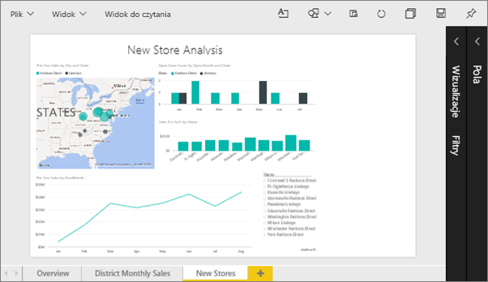
2. Upewnij się, że na kanwie nie wybrano żadnych wizualizacji. Wybierz opcję **Widok** i przejrzyj opcje wyświetlania.

   * Widok odczytu będzie następujący.

     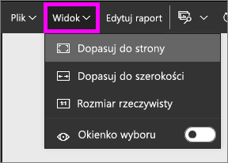
   * Widok edycji będzie następujący.

     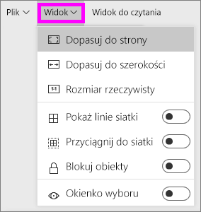

3. Zobaczmy, jak wygląda strona przy użyciu ustawienia **Rozmiar rzeczywisty**.

   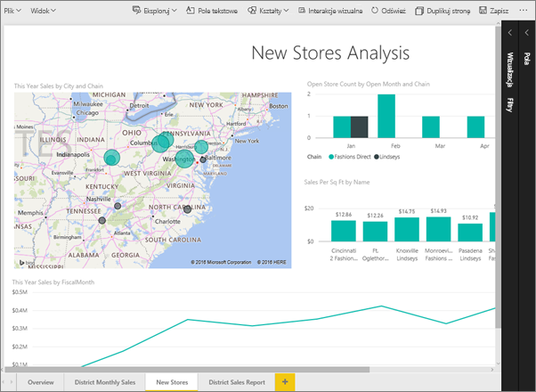

   Niezbyt dobrze. Pulpit nawigacyjny ma teraz podwójne paski przewijania.
4. Przełącz się na opcję **Dopasuj do szerokości**.

   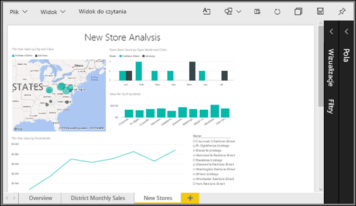

   Teraz strona wygląda lepiej. Dalej mamy jeden pasek przewijania, ale można łatwiej odczytać szczegóły.

## Zmiana domyślnego widoku strony raportu
Jeśli jesteś *twórcą* raportu, możesz zmienić domyślny widok stron raportu. Po udostępnieniu raportu innym osobom strony raportu zostaną otwarte w ustawionym widoku. *Użytkownicy* raportu będą mogli zmienić widok, ale nie będą mogli zapisać swoich zmian, wychodząc z raportu.

1. Na stronie **Nowe sklepy** raportu przełącz się z powrotem na widok **Rozmiar rzeczywisty**.

   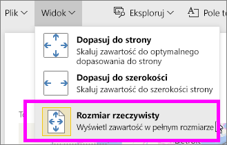

2. Na stronie raportu **District Monthly Sales** ustaw widok na **Dopasuj do szerokości**.

3. Na stronie raportu **Overview** pozostaw domyślne ustawienie widoku.

4. Teraz zapisz raport, wybierając pozycję **Plik > Zapisz**. Przy następnym otwarciu tego raportu strony będą wyświetlane przy użyciu nowych ustawień widoku. Sprawdźmy to.

   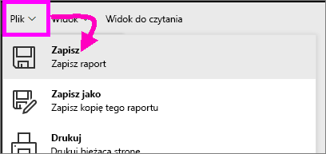
3. Wybierz nazwę bieżącego obszaru roboczego z górnego paska nawigacyjnego, aby powrócić do tego obszaru roboczego.  

   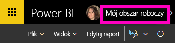
4. Wybierz kartę **Raporty** i wybierz ten sam raport (przykład Retail Analysis).

    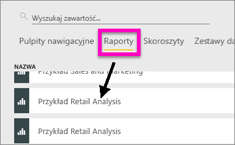
5. Otwórz każdą stronę raportu, aby zobaczyć nowe ustawienia.

   

## Teraz przyjrzymy się ustawieniom *rozmiaru strony*
Ustawienia rozmiaru strony są dostępne tylko w [Widoku do edycji](../service-interact-with-a-report-in-editing-view.md), więc musisz mieć uprawnienia do edycji raportu (*twórcy*), aby zmienić ustawienia rozmiaru strony. W przypadku połączenia z dowolnym z naszych [przykładów](../sample-datasets.md) będziesz mieć uprawnienia *twórcy* do tych raportów.

1. Otwórz stronę „Sprzedaż miesięczna regionu” [próbnych danych dotyczących analizy handlu detalicznego](../sample-retail-analysis.md) w widoku edycji.
2. Upewnij się, że na kanwie nie wybrano żadnych wizualizacji.  W okienku **Wizualizacje** wybierz ikonę wałka do malowania .
3. Wybierz opcję **Rozmiar strony** &gt; **Typ**, aby wyświetlić opcje rozmiaru strony.

   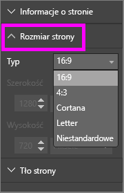
4. Wybierz opcję **Letter**.  Na białej części kanwy pozostanie tylko zawartość mieszcząca się w obszarze 816 × 1056 pikseli (rozmiar Letter).

   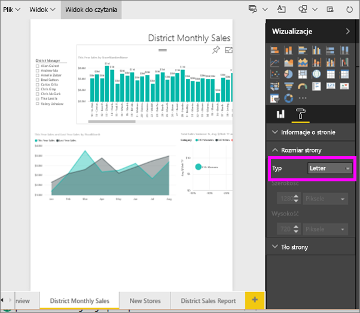
5. Wybierz współczynnik **Rozmiar strony** **16:9**.

   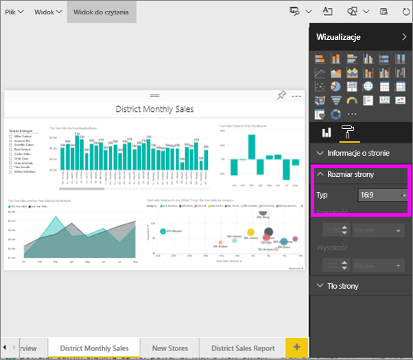

   Strona raportu będzie wyświetlana przy użyciu współczynnika 16 (szerokość) do 9 (wysokość). Aby wyświetlić faktyczny rozmiar w pikselach, przyjrzyj się wyszarzonym polom Szerokość i Wysokość (1280 × 720). Jest dużo wolnego miejsca wokół kanwy raportu, ponieważ wcześniej ustawiliśmy **Widok** na opcję „Dopasuj do szerokości”.
7. Kontynuuj eksplorowanie opcji **Rozmiar strony**.

## Używanie opcji widoku i rozmiaru strony jednocześnie
Użyj opcji widoku i rozmiaru strony razem, aby utworzyć raport, który będzie wyglądał doskonale po udostępnieniu współpracownikom lub osadzeniu w innej aplikacji.

W tym ćwiczeniu utworzysz stronę raportu, która będzie wyświetlana w aplikacji z dostępnym miejscem 500 pikseli (szerokość) na 750 pikseli (wysokość).

W poprzednim kroku zobaczyliśmy, że nasza strona raportu była wyświetlana w polu o rozmiarze 1280 pikseli (szerokość) na 720 pikseli (wysokość). Wiemy więc, że musimy wykonać wiele działań związanych ze zmianą rozmiaru i organizacją, jeśli chcemy, żeby wszystkie nasze elementy wizualne się zmieściły.

1. Zmień rozmiar i przesuń elementy wizualne tak, aby mieściły się w części mniejszej od połowy obecnego obszaru kanwy.

    
2. Wybierz opcję **Rozmiar strony** &gt; **Niestandardowy**.
3. Ustaw Szerokość na wartość 500, a Wysokość na wartość 750.

    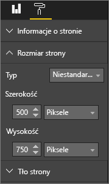
4. Dopasuj stronę raportu, aby wyglądała możliwie najlepiej. Przełącz się między opcjami **Widok > Rozmiar rzeczywisty** i **Widok > Dopasuj do strony**, aby wprowadzać usprawnienia.

    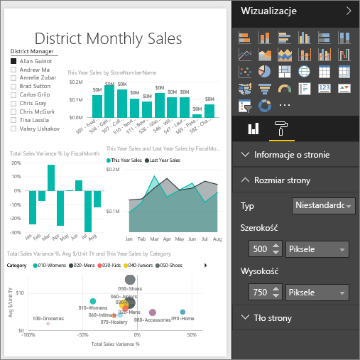

## Następne kroki
[Tworzenie raportów dla Cortany](../service-cortana-answer-cards.md)

Powrót do [Ustawienia wyświetlania strony w raporcie usługi Power BI](../power-bi-report-display-settings.md)

Masz więcej pytań? [Odwiedź społeczność usługi Power BI](http://community.powerbi.com/)
