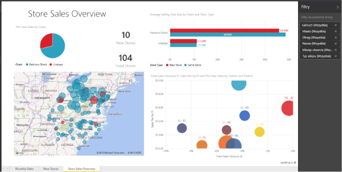

# Raporty w usłudze Power BI
## Co to jest raport usługi Power BI?
***Raport*** usługi Power BI to widok zestawu danych z wielu perspektyw z wizualizacjami przedstawiającymi różne wyniki, wnioski i szczegółowe informacje wynikające z tego zestawu danych.  Raport może zawierać jedną wizualizację lub kilka stron wypełnionych wizualizacjami. W zależności od Twojego stanowiska możesz być osobą, która *tworzy* raporty, lub osobą, która *korzysta* z raportów.

Ten raport zawiera 3 strony (czyli karty). Obecnie jest wyświetlana strona z podsumowaniem sprzedaży w sklepach. Na tej stronie znajduje się 6 różnych wizualizacji i tytuł strony. Wizualizacje mogą być *przypinane* do pulpitów nawigacyjnych. Po wybraniu takiej przypiętej wizualizacji otwierany jest raport, z którego została ona przypięta.

Jeśli jesteś nowym użytkownikiem usługi Power BI, zapoznaj się z podstawowymi informacjami w temacie [Power BI — podstawowe pojęcia](end-user-basic-concepts.md).

Raporty są funkcją usługi Power BI i programu Power BI Desktop. Środowisko pracy z raportami jest niemal identyczne. Jednak na urządzeniach przenośnych nie można tworzyć raportów — można je [wyświetlać, udostępniać i dodawać do nich adnotacje](mobile/mobile-reports-in-the-mobile-apps.md).

## Zalety raportów
Raporty są oparte na jednym zestawie danych. Każda wizualizacja w raporcie reprezentuje część informacji. Wizualizacje nie są statyczne — możesz dodawać i usuwać dane, zmieniać typy wizualizacji oraz stosować filtry i fragmentatory, analizując dane w celu wyciągania wniosków i szukania odpowiedzi. Podobnie jak pulpit nawigacyjny — ale jeszcze bardziej — raport jest wysoce interakcyjny i można go dostosowywać, a wizualizacje są aktualizowane, gdy ich bazowe dane zmieniają się.

## Pulpity nawigacyjne kontra raporty
[Pulpity nawigacyjne](end-user-dashboards.md) są często mylone z raportami, ponieważ także są kanwami wypełnionymi wizualizacjami. Istnieją jednak pewne podstawowe różnice.  

| **Funkcja** | **Pulpity nawigacyjne** | **Raporty** |
| --- | --- | --- |
| Strony |Jedna strona |Jedna lub kilka stron |
| Źródła danych |Co najmniej jeden raport i co najmniej jeden zestaw danych na pulpit nawigacyjny |Jeden zestaw danych na raport |
| Dostępność w programie Power BI Desktop |Nie |Tak, można tworzyć i wyświetlać raporty w programie Desktop |
| Przypinanie |Można przypinać istniejące wizualizacje (kafelki) tylko z bieżącego pulpitu nawigacyjnego do innych pulpitów nawigacyjnych |Można przypinać wizualizacje (jako kafelki) do wszystkich swoich pulpitów nawigacyjnych. Można przypinać całe strony raportów do wszystkich swoich pulpitów nawigacyjnych. |
| Subskrypcja |Nie można subskrybować pulpitu nawigacyjnego |Można subskrybować strony raportu |
| Filtrowanie |Nie można filtrować ani wycinać |Wiele różnych sposobów filtrowania, wyróżniania i wycinania |
| Ustawianie alertów |Można tworzyć alerty wysyłające wiadomość e-mail, gdy zostaną spełnione określone warunki |Nie |
| Promowanie |Można ustawić jeden pulpit nawigacyjny jako „proponowany” |Nie można tworzyć proponowanych raportów |
| Zapytania w języku naturalnym |Dostępne z poziomu pulpitu nawigacyjnego |Niedostępne z poziomu raportów |
| Zmienianie typu wizualizacji |Nie. W rzeczywistości, jeśli właściciel raportu zmieni typ wizualizacji w raporcie, wizualizacja przypięta na pulpicie nawigacyjnym nie zostanie zaktualizowana |Tak |
| Wyświetlanie tabel i pól bazowego zestawu danych |Nie. Można eksportować dane, ale nie można wyświetlać tabel i pól na pulpicie nawigacyjnym. |Tak. Można wyświetlać tabele, pola i wartości zestawu danych. |
| Tworzenie wizualizacji |Ograniczone do dodawania widgetów na pulpicie nawigacyjnym przy użyciu opcji „Dodaj kafelek” |Można tworzyć wiele różnych typów wizualizacji, dodawać niestandardowe wizualizacje, edytować wizualizacje i wykonywać inne czynności, mając uprawnienia do edycji |
| Dostosowywanie |Można wykonywać różne czynności na wizualizacjach (kafelkach), na przykład przenosić i rozmieszczać, zmieniać rozmiar, dodawać linki, zmieniać nazwę, usuwać i wyświetlać na pełnym ekranie. Jednak dane i same wizualizacje są tylko do odczytu. |W widoku do czytania można publikować, osadzać, filtrować, eksportować, pobierać jako plik pbix, wyświetlać powiązaną zawartość, generować kody QR, analizować w programie Excel i nie tylko.  W widoku do edycji można wykonywać wszystkich wymienione już czynności i wiele innych. |

## ***Twórcy*** i ***użytkownicy*** raportów
W zależności od Twojej roli możesz być osobą, która tworzy raporty na własny użytek lub w celu udostępniania ich współpracownikom. Warto zatem dowiedzieć się, jak tworzyć i udostępniać raporty. Możesz być też osobą, która otrzymuje raporty od innych. W takim przypadku warto dowiedzieć się, jak czytać raporty i jak z nich korzystać.

Poniżej przedstawiono kilka tematów według roli, które pomogą Ci w rozpoczęciu pracy.

### Jeśli będziesz tworzyć i udostępniać raporty
* Zacznij od [przewodnika po usłudze Power BI](end-user-basic-concepts.md), aby dowiedzieć się, gdzie można znaleźć raporty i narzędzia raportów.
* Zapoznaj się z [edytorem raportów](../service-the-report-editor-take-a-tour.md).
* Dowiedz się, jak [utworzyć raport na podstawie zestawu danych](../service-report-create-new.md).
* [Dowiedz się, jak używać wizualizacji, stron i filtrów na poziomie raportu](end-user-report-filter.md)
* Poznaj różne sposoby [udostępniania raportu współpracownikom](../service-share-dashboards.md).

### Jeśli będziesz otrzymywać raporty i korzystać z nich
* Zacznij od [przewodnika po usłudze Power BI](end-user-basic-concepts.md), aby dowiedzieć się, gdzie można znaleźć raporty i narzędzia raportów.
* Dowiedz się, jak [otworzyć raport](end-user-report-open.md) i poznaj wszystkie interakcje dostępne w [widoku do czytania](end-user-reading-view.md).
* Dobrze poznaj raporty, eksperymentując na jednym z naszych [przykładów](../sample-tutorial-connect-to-the-samples.md).  
* Nie potrzebujesz już raportu? Możesz go [usunąć](end-user-delete.md).
* Aby sprawdzić, którego zestawu danych używa raport i które pulpity nawigacyjne zawierają kafelki przypięte z danego raportu, [wyświetl powiązaną zawartość](end-user-related.md).

> [!TIP]
> Jeśli nie ma tutaj tego, czego szukasz, skorzystaj ze spisu treści po lewej stronie, aby przejrzeć wszystkie tematy dotyczące *raportów*.
> 
> 

## Następne kroki
[Co to jest usługa Power BI?](../power-bi-overview.md) 

[Power BI — podstawowe pojęcia](end-user-basic-concepts.md)

Masz więcej pytań? [Odwiedź społeczność usługi Power BI](http://community.powerbi.com/)

