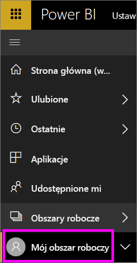
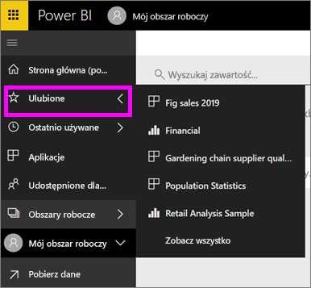

# Nawigacja: wyszukiwanie, znajdowanie i sortowanie treści w usłudze Power BI
Istnieje wiele sposobów nawigowania po zawartości w usłudze Power BI. Zawartość jest posortowana w obszarach roboczych według typów: pulpity nawigacyjne, raporty, skoroszyty i zestawy danych.  Ponadto zawartość jest posortowana według użycia: ulubione, ostatnio używane, aplikacje, udostępnione dla mnie i polecane. W przypadku nawigacji w jednym miejscu cała treść jest organizowana na jednej stronie — stronie głównej. Te różne sposoby uzyskiwania dostępu do zawartości pozwalają na szybkie znajdowanie potrzebnych informacji w usłudze Power BI.  

## Nawigowanie w obszarach roboczych

*Konsumenci* usługi Power BI zwykle mają tylko jeden obszar roboczy: **Mój obszar roboczy**. **Mój obszar roboczy** będzie miał zawartość tylko po pobraniu przykładów firmy Microsoft lub utworzeniu bądź pobraniu własnej zawartości.  

W ramach opcji **Mój obszar roboczy** usługa Power BI dzieli zawartość według typu: pulpity nawigacyjne, raporty, skoroszyty i zestawy danych. Ten podział jest widoczny po wybraniu obszaru roboczego. W tym przykładzie **Mój obszar roboczy** zawiera jeden pulpit nawigacyjny, dwa raporty, dwa zestawy danych i nie zawiera żadnych skoroszytów.

________________________________________

## Nawigowanie przy użyciu lewego paska nawigacyjnego
Lewy pasek nawigacyjny klasyfikuje zawartość w sposób, który jeszcze bardziej ułatwia szybkie odnajdowanie potrzebnych informacji.  

- Zawartość, która jest Tobie udostępniana, jest dostępna w ramach opcji **Udostępnione dla mnie**.
- Ostatnio wyświetlana zawartość jest dostępna w ramach opcji **Ostatnie**. 
- Aplikacje można znaleźć, wybierając opcję **Aplikacje**.
- **Strona główna** jest widokiem jednostronicowym najważniejszej zawartości, zawartości sugerowanej i źródeł szkoleniowych.

Ponadto możesz tagować zawartość jako [ulubioną](end-user-favorite.md) i [polecaną](end-user-featured.md). Wybierz jeden pulpit nawigacyjny, który powinien być najczęściej oglądany, i ustaw go jako swój *polecany* pulpit nawigacyjny. Po każdym otwarciu usługi Power BI polecany pulpit nawigacyjny będzie wyświetlany jako pierwszy. Czy masz pewną liczbę pulpitów nawigacyjnych i aplikacji, które często odwiedzasz? Jeśli ustawisz je jako ulubione, będą zawsze dostępne na lewym pasku nawigacyjnym.

.

## Istotne zagadnienia i rozwiązywanie problemów
* W przypadku zestawów danych pozycja **Sortuj według** nie jest dostępna dla wartości według właściciela.

## Następne kroki
[Power BI — podstawowe pojęcia](end-user-basic-concepts.md)

Masz więcej pytań? [Odwiedź społeczność usługi Power BI](http://community.powerbi.com/)