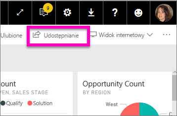
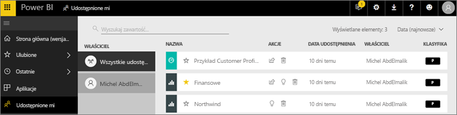
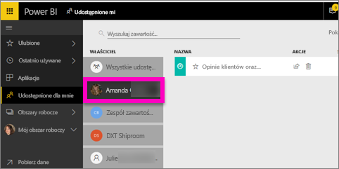

# Wyświetlanie pulpitów nawigacyjnych i raportów, które zostały mi udostępnione
## Udostępnione mi

Gdy współpracownik udostępni Tobie zawartość przy użyciu przycisku **Udostępnij**, zostaje ona wyświetlona w Twoim kontenerze **Udostępnione mi**. Pulpit nawigacyjny i raport jest dostępny wyłącznie z listy **Udostępnione mi** i nie jest dostępny z **Aplikacji**.

Obejrzyj, jak Amanda wyjaśnia zawartość listy **Udostępnione mi** i pokazuje, jak filtrować listę i nawigować po niej. Następnie postępuj zgodnie ze szczegółowymi instrukcjami poniżej wideo, aby wypróbować to samodzielnie. Aby wyświetlać udostępnione mi pulpity nawigacyjne, musisz mieć licencję usługi Power BI Pro. Przeczytaj artykuł [Co to jest usługa Power BI Premium?](../service-premium.md), aby zapoznać się ze szczegółowymi informacjami.

<iframe width="560" height="315" src="https://www.youtube.com/embed/G26dr2PsEpk" frameborder="0" allowfullscreen></iframe>

Opcje interakcji z pulpitami nawigacyjnymi i raportami są dostępne w zależności od uprawnień, które nadał Ci projektant. Obejmują one możliwość tworzenia kopii pulpitu nawigacyjnego, otwieranie raportu [w widoku czytania](end-user-reading-view.md) i ponownie udostępnianie innym współpracownikom.

## Akcje dostępne z kontenera **Udostępnione mi**
* Wybór ikony gwiazdki pozwala [ustawić pulpit nawigacyjny lub raport jako ulubiony](end-user-favorite.md).
* Usuwanie pulpitu nawigacyjnego lub raportu  
* Niektóre pulpity nawigacyjne i raporty mogą być ponownie udostępnione  
* Ponadto, jeśli listy są długie, [użyj pola wyszukiwania i sortowania, aby odnaleźć to, czego potrzebujesz](end-user-search-sort.md).
  
  > [!NOTE]
  > Aby uzyskać informacje o klasyfikacjach EGRC, wybierz przycisk klasyfikacji lub [odwiedź klasyfikację danych pulpitu nawigacyjnego ](../service-data-classification.md).
  > 
  > 
* Wybierz nazwę pulpitu nawigacyjnego, aby otworzyć go i zbadać. Po otwarciu udostępnionego pulpitu nawigacyjnego możesz użyć funkcji pytań i odpowiedzi oraz zadać pytania dotyczące danych źródłowych lub wybrać kafelek, aby otworzyć i wejść w interakcję z raportem w widoku do czytania.

## Filtrowanie udostępnionych pulpitów nawigacyjnych przez właściciela
Zawartość ekranu **Udostępnione mi** może być dalej filtrowana według właściciela zawartości. Na przykład, jeśli wybiorę **Amandę**, zobaczę tylko pulpit nawigacyjny, który Amanda mi udostępniła.

