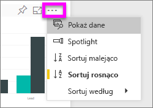
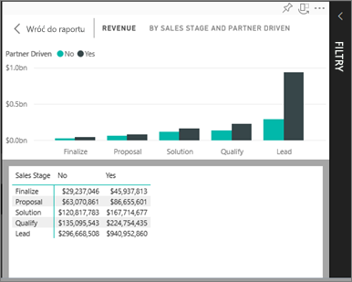
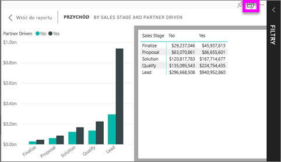

# Wyświetlanie danych użytych podczas tworzenia wizualizacji
## Pokaż dane
Wizualizację usługi Power BI tworzy się przy użyciu danych z podstawowych zestawów danych. Jeśli interesują Cię informacje niewidoczne na pierwszym planie, usługa Power BI umożliwia *wyświetlenie* danych używanych do tworzenia wizualizacji. Po wybraniu pozycji **Pokaż dane** usługa Power BI wyświetli dane poniżej (lub obok) wizualizacji.

## Korzystanie z opcji *Pokaż dane* w usłudze Power BI
1. W usłudze Power BI otwórz raport, a następnie wybierz wizualizację.  
2. Aby wyświetlić dane, na których wizualizacja jest oparta, wybierz wielokropek (...), a następnie wybierz pozycję **Pokaż dane**.
   
   
3. Domyślnie dane są wyświetlane poniżej wizualizacji.
   
   

4. Aby zmienić orientację, wybierz układ pionowy  w prawym górnym rogu wizualizacji.
   
   

### Następne kroki
[Wizualizacje w raportach usługi Power BI](../visuals/power-bi-report-visualizations.md)    
[Raporty usługi Power BI](end-user-reports.md)    
