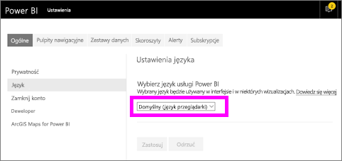
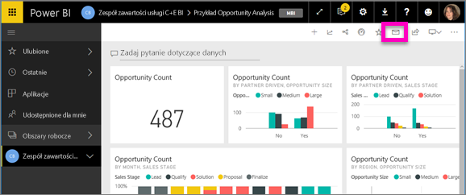
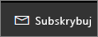
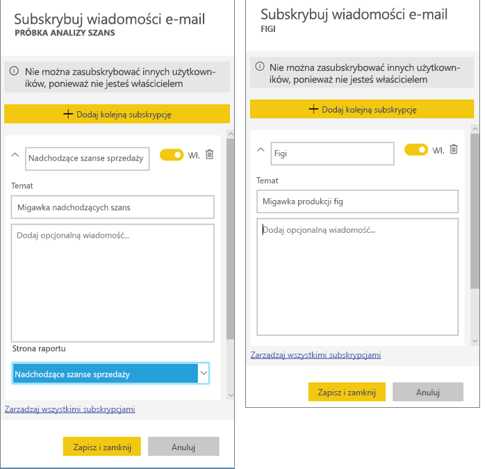
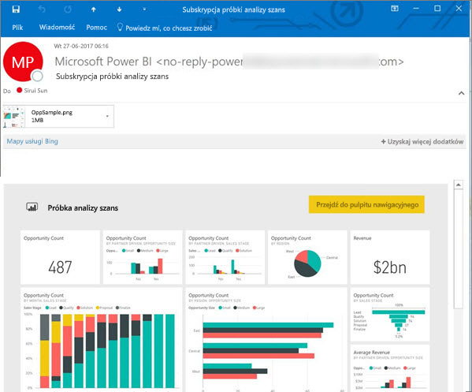
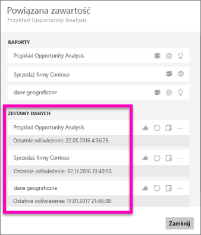
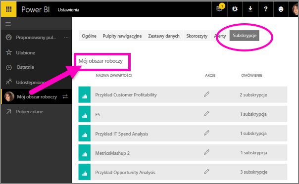

# Subskrybowanie raportu i pulpitu nawigacyjnego w usłudze Power BI 
Nigdy nie było łatwiej być na czasie w przypadku najważniejszych pulpitów nawigacyjnych i raportów. Subskrybuj strony raportów i pulpity nawigacyjne, które są najważniejsze dla Ciebie, a usługa Power BI wyśle wiadomość e-mail z migawką do Twojej skrzynki odbiorczej. Poinformuj usługę Power BI, jak często chcesz otrzymywać wiadomości e-mail: od raz dziennie do raz w tygodniu. 

W wiadomości e-mail i migawce będzie używany język skonfigurowany w ustawieniach usługi Power BI (zobacz temat [Języki i kraje/regiony obsługiwane w usłudze Power BI](../supported-languages-countries-regions.md)). Jeśli żaden język nie zostanie zdefiniowany, usługa Power BI będzie używać języka zgodnie z ustawieniami regionalnymi w bieżącej przeglądarce. Aby zobaczyć lub ustawić preferencję języka, wybierz ikonę z kołem zębatym  > **Ustawienia > Ogólne > Język**. 

Po otrzymaniu wiadomości e-mail będzie ona zawierała link „przejdź do raportu lub pulpitu nawigacyjnego”. Na urządzeniach przenośnych z zainstalowanymi aplikacjami usługi Power BI zaznaczenie tego linku powoduje uruchomienie aplikacji (w przeciwieństwie do domyślnej akcji otwierania raportu lub pulpitu nawigacyjnego w witrynie internetowej usługi Power BI).

## Wymagania
- **Tworzenie** subskrypcji jest funkcją usługi Power BI Pro. 
- Ponieważ wiadomości e-mail subskrypcji są wysyłane tylko podczas aktualizowania lub odświeżania źródłowego zestawu danych, subskrypcje nie działają w przypadku zestawów danych, które nie są aktualizowane lub odświeżane.

## Subskrybowanie pulpitu nawigacyjnego lub strony raportu
Niezależnie od tego, czy subskrybowany jest pulpit nawigacyjny, czy raport, wykonywane działania są bardzo podobne. Ten sam przycisk umożliwia subskrybowanie pulpitów nawigacyjnych i raportów usługi Power BI.
 
.

1. Otwórz pulpit nawigacyjny lub raport.
2. Z górnego menu wybierz pozycję **Subskrybuj** lub wybierz ikonę koperty .
   
   

3. Aby włączyć/wyłączyć subskrypcję, użyj żółtego suwaka.  Ustawienie suwaka w pozycji Wył. nie spowoduje usunięcia subskrypcji. Aby usunąć subskrypcję, wybierz ikonę śmietnika.

4. Możesz również dodać szczegóły wiadomości e-mail. 

    Na poniższych zrzutach ekranu widać, że subskrybowanie raportu polega w rzeczywistości na zasubskrybowaniu *strony* raportu.  Aby zasubskrybować więcej niż jedną stronę raportu, wybierz pozycję **Dodaj kolejną subskrypcję** i wybierz inną stronę. 
      
   

5. Wybierz pozycję **Zapisz i zamknij**, aby zapisać subskrypcję. Otrzymasz wiadomość e-mail z migawką pulpitu nawigacyjnego lub strony raportu po każdej zmianie dowolnych danych w źródłowym zestawie danych. Jeśli pulpit nawigacyjny lub raport jest odświeżany częściej niż raz dziennie, wiadomość e-mail jest wysyłana tylko po pierwszym odświeżeniu.  
   
   
   
Odświeżenie strony raportu nie powoduje odświeżenia zestawu danych. Tylko właściciel zestawu danych może ręcznie odświeżyć zestaw danych. Aby wyszukać nazwy źródłowych zestawów danych, wybierz opcję **Wyświetl powiązane** na górnym pasku menu.
   

## Jak jest określany harmonogram wiadomości e-mail
W poniższej tabeli opisano, jak często będzie wysyłana wiadomość e-mail. Zależy to od metody połączenia zestawu danych, na którym jest oparty pulpit nawigacyjny lub raport (zapytanie bezpośrednie, połączenie na żywo, import do usługi Power BI lub plik programu Excel w usłudze OneDrive lub SharePoint Online), a także od dostępnych i wybranych opcji subskrypcji (codziennie, co tydzień lub brak).

|  | **Zapytanie bezpośrednie** | **Połączenie na żywo** | **Zaplanowane odświeżenie (import)** | **Plik programu Excel w usłudze OneDrive/SharePoint Online** |
| --- | --- | --- | --- | --- |
| **Jak często raport/pulpit nawigacyjny jest odświeżany?** |Co 15 min |Usługa Power BI sprawdza co 15 minut, a jeśli zestaw danych został zmieniony, odświeża raport. |Użytkownik może wybrać brak, codziennie lub co tydzień. Codziennie może oznaczać do 8 razy dziennie. Co tydzień to w rzeczywistości harmonogram tygodniowy utworzony przez użytkownika z możliwością ustawienia odświeżenia od jednego razu na tydzień nawet do odświeżania codziennego. |Co godzinę |
| **Jaką kontrolę ma użytkownik nad harmonogramem subskrypcji wiadomości e-mail?** |Opcje to: codziennie lub co tydzień |Brak opcji: do użytkownika są wysyłane wiadomości e-mail, jeśli raport zostanie odświeżony, ale nie więcej niż raz dziennie. |Jeśli został ustawiony codzienny harmonogram odświeżania, dostępne opcje to codziennie i co tydzień.  W przypadku cotygodniowego harmonogramu odświeżania jedyną opcją jest co tydzień. |Brak opcji: do użytkownika jest wysyłana wiadomość e-mail przy każdej aktualizacji zestawu danych, ale nie więcej niż raz dziennie. |

## Zarządzanie subskrypcjami
Tylko Ty możesz zarządzać swoimi subskrypcjami. Wybierz ponownie pozycję **Subskrybuj** i wybierz opcję **Zarządzaj wszystkimi subskrypcjami** (zobacz zrzuty ekranu poniżej wcześniejszego kroku 4). 

Subskrypcje zostaną zakończone po wygaśnięciu licencji wersji Pro, po usunięciu pulpitu nawigacyjnego lub raportu przez właściciela lub po usunięciu konta użytkownika użytego do utworzenia subskrypcji.

## Istotne zagadnienia i rozwiązywanie problemów
* Jeśli w przypadku subskrypcji wiadomości e-mail dla pulpitu nawigacyjnego do pewnych kafelków zastosowano zabezpieczenia na poziomie wiersza, te kafelki nie będą wyświetlane.  Jeśli w przypadku subskrypcji wiadomości e-mail dla raportu zestaw danych używa zabezpieczeń na poziomie wiersza, nie będzie można utworzyć subskrypcji.
* Subskrypcje stron raportów są związane z nazwą danej strony raportu. Jeśli zasubskrybujesz stronę raportu, a następnie jej nazwa zostanie zmieniona, trzeba będzie ponownie utworzyć subskrypcję
* Niektóre ustawienia mogły zostać skonfigurowane przez Twoją organizację w usłudze Azure Active Directory i mogło to ograniczyć możliwość korzystania z subskrypcji wiadomości e-mail w usłudze Power BI.  Dotyczy to m.in. konieczności używania uwierzytelniania wieloskładnikowego lub ograniczeń zakresu adresów IP podczas uzyskiwania dostępu do zasobów.
* Dla subskrypcji wiadomości e-mail dla zestawów danych połączenia na żywo otrzymasz wiadomości e-mail tylko po zmianie danych. Jeśli więc nastąpi odświeżanie bez żadnej zmiany danych, usługa Power BI nie wyśle wiadomości e-mail.
* Subskrypcje e-mail nie obsługują większości [niestandardowych elementów wizualnych](../power-bi-custom-visuals.md).  Jedynym wyjątkiem są te niestandardowe elementy wizualne, które zostały [certyfikowane](../power-bi-custom-visuals-certified.md).  
* Subskrypcje e-mail nie obsługują obecnie wizualizacji niestandardowych bazujących na języku R.  
* Jeśli do niektórych kafelków zastosowano zabezpieczenia na poziomie wiersza, te kafelki nie będą wyświetlane.
* Subskrypcje wiadomości e-mail są wysyłane wraz z domyślnymi stanami filtru i fragmentatora raportu. Wszelkie zmiany w wartościach domyślnych wprowadzone po rozpoczęciu subskrypcji nie będą uwzględniane w wiadomości e-mail.    
* W szczególności dla subskrypcji pulpitów nawigacyjnych niektóre typy kafelków nie są jeszcze obsługiwane.  Należą do nich: kafelki przesyłania strumieniowego, kafelki wideo, kafelki niestandardowej zawartości internetowej.     
* Subskrypcje mogą zakończyć się niepowodzeniem dla pulpitów nawigacyjnych i raportów z wyjątkowo dużymi obrazami, co wynika z ograniczeń rozmiarów wiadomości e-mail.    
* Usługa Power BI automatycznie wstrzymuje odświeżanie zestawów danych skojarzonych z pulpitami nawigacyjnymi i raportami, które nie były odwiedzane przez więcej niż 2 miesiące.  Jeśli jednak dodasz subskrypcję do pulpitu nawigacyjnego lub raportu, nie zostanie ona wstrzymana nawet wtedy, gdy nie jest odwiedzany.    

## Następne kroki
* Masz więcej pytań? [Zadaj pytanie społeczności usługi Power BI](http://community.powerbi.com/)    
* [Przeczytaj wpis na blogu](https://powerbi.microsoft.com/blog/introducing-dashboard-email-subscriptions-a-360-degree-view-of-your-business-in-your-inbox-every-day/)

