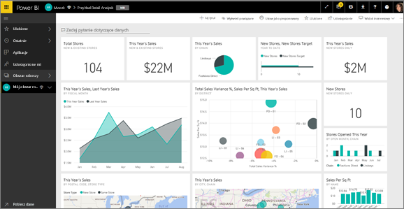

# Kafelki pulpitu nawigacyjnego w usłudze Power BI
Pulpity nawigacyjne i kafelki pulpitu nawigacyjnego są funkcjami usługi Power BI, a nie programu Power BI Desktop. Chociaż kafelków pulpitów nawigacyjnych nie można tworzyć ani przypinać w usłudze Power BI dla urządzeń mobilnych, [można je wyświetlać i udostępniać](mobile/mobile-tiles-in-the-mobile-apps.md). Ponadto w usłudze Power BI dla urządzeń mobilnych można [dodawać zdjęcia do pulpitu nawigacyjnego za pomocą aplikacji dla telefonu iPhone](mobile/mobile-iphone-app-get-started.md).

## Aktualizacja kafelków

Kafelek to migawka danych przypięta do pulpitu nawigacyjnego przez *projektanta*. Kafelek można utworzyć z raportu, zestawu danych, pulpitu nawigacyjnego, pola pytania funkcji pytań i odpowiedzi, programu Excel, a także usług SQL Server Reporting Services (SSRS) i innych.  Ten zrzut ekranu przedstawia wiele różnych kafelków przypiętych do pulpitu nawigacyjnego.

Oprócz kafelków przypiętych z raportów *projektanci* mogą dodawać autonomiczne kafelki bezpośrednio do pulpitu nawigacyjnego przy użyciu pozycji **Dodaj kafelek**. Autonomiczne kafelki obejmują: pola tekstowe, obrazy, klipy wideo, dane przesyłane strumieniowo oraz treści internetowe.

Potrzebujesz pomocy dotyczącej bloków konstrukcyjnych tworzących usługę Power BI?  Zobacz [Power BI — podstawowe pojęcia](end-user-basic-concepts.md).

## Interakcja z kafelkami na pulpicie nawigacyjnym

### Najeżdżanie kursorem na kafelek w celu zmiany wyglądu i zachowania
1. Najedź kursorem na kafelek, aby wyświetlić wielokropek.
   
    
2. Wybierz symbol wielokropka, aby otworzyć menu akcji kafelka. Dostępne opcje są zależne od typu wizualizacji i metody użytej do utworzenia kafelka. Oto kilka przykładów tego, co możesz zobaczyć.

    - kafelek utworzony za pomocą funkcji pytań i odpowiedzi
   
        

    - kafelek utworzony na podstawie skoroszytu
   
        

    - kafelek utworzony na podstawie raportu
   
        
   
    W tym miejscu można wykonać następujące czynności:
   
   * [Otworzyć raport, który został użyty do utworzenia tego kafelka ](end-user-reports.md)   
   
   * [Otworzyć pytanie funkcji pytań i odpowiedzi, którego użyto do utworzenia kafelka](end-user-reports.md)   
   

   * [Otworzyć skoroszyt, który został użyty do utworzenia tego kafelka ](end-user-reports.md)   
    * [Wyświetlić tytuł w trybie koncentracji uwagi](end-user-focus.md)   
     * [Uruchomić szczegółowe informacje](end-user-insights.md) 
    * [Dodać komentarz i rozpocząć dyskusję](end-user-comment.md) 

3. Aby zamknąć menu akcji, wybierz pusty obszar na kanwie.

### Wybieranie (klikanie) kafelka
To co dzieje się po wybraniu kafelka, zależy od sposobu, w jaki kafelek został utworzony, a także od tego, czy ma on [niestandardowy link](../service-dashboard-edit-tile.md). Jeśli ma on niestandardowy link, wybranie kafelka spowoduje przejście do tego linku. W przeciwnym razie wybranie kafelka spowoduje przejście do raportu, skoroszytu programu Excel Online, raportu lokalnej usługi SSRS lub do pytania sekcji pytań i odpowiedzi, które zostały użyte do utworzenia kafelka.

> [!NOTE]
> Wyjątek stanowią kafelki wideo utworzone bezpośrednio na pulpicie nawigacyjnym za pomocą polecenia **Dodaj kafelek**. Wybranie kafelka wideo (utworzonego w ten sposób) spowoduje odtworzenie filmu wideo bezpośrednio na pulpicie nawigacyjnym.   
> 
> 

## Zagadnienia i rozwiązywanie problemów
* Jeśli raport, który został użyty do utworzenia wizualizacji, nie został zapisany, wybranie kafelka nie wywoła żadnej akcji.
* Jeśli kafelek został utworzony na podstawie skoroszytu w usłudze Excel Online, a nie masz co najmniej uprawnień do odczytu tego skoroszytu, wybranie kafelka nie spowoduje otwarcia skoroszytu w usłudze Excel Online.
* W przypadku kafelków utworzonych bezpośrednio na pulpicie nawigacyjnym za pomocą polecenia **Dodaj kafelek**, jeśli został ustawiony niestandardowy hiperlink, wybranie tytułu, podtytułu lub kafelka spowoduje otwarcie tego adresu URL.  W przeciwnym razie domyślnie wybranie jednego z kafelków utworzonych bezpośrednio na pulpicie nawigacyjnym dla obrazu, kodu internetowego lub pola tekstowego nie wywoła żadnej akcji.
* Jeśli nie masz uprawnień do raportu w ramach usługi SSRS, wybranie kafelka utworzonego na bazie usługi SSRS spowoduje wyświetlenie strony informującej o braku dostępu (rsAccessDenied).
* Jeśli nie masz dostępu do sieci, w której znajduje się serwer usługi SSRS, wybranie kafelka utworzonego na bazie usługi SSRS spowoduje wyświetlenie strony informującej o braku możliwości zlokalizowania serwera (HTTP 404). Urządzenie musi mieć dostęp do sieci i serwera raportów, aby wyświetlić raport.
* Jeśli zmienia się oryginalna wizualizacja użyta do utworzenia kafelka, kafelek nie ulegnie zmianie.  Jeśli na przykład *projektant* przypiął wykres liniowy z raportu, a następnie zmienił ten wykres liniowy na wykres słupkowy, kafelek pulpitu nawigacyjnego w dalszym ciągu wyświetlać będzie wykres liniowy. Dane zostaną odświeżone, ale typ wizualizacji nie ulegnie zmianie.

## Następne kroki
[Odświeżanie danych](../refresh-data.md)

[Power BI — podstawowe pojęcia](end-user-basic-concepts.md)
