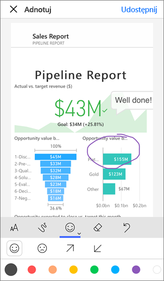
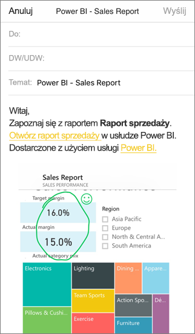

# Dodawanie adnotacji i udostępnianie kafelka, raportu lub wizualizacji w aplikacjach mobilnych usługi Power BI
Dotyczy:

|  |  |  |  |
|:--- |:--- |:--- |:--- |
| Telefony iPhone |Urządzenia iPad |Telefony z systemem Android |Tablety z systemem Android |

W aplikacji mobilnej Power BI dla urządzeń z systemem iOS i Android możesz udostępniać migawki kafelków, raportów i wizualizacji oraz dodawać do nich adnotacje. Adresaci widzą je dokładnie w takiej postaci, jaką miały w chwili wysyłania wiadomości e-mail, i otrzymają link. Migawki kafelków możesz wysyłać do wszystkich — nie tylko do współpracowników w tej samej domenie poczty e-mail. Przed udostępnieniem możesz dodać adnotacje — linie, tekst lub znaczki.

*Raport z adnotacjami*

Wiadomość e-mail z migawką kafelka, raportu lub wizualizacji zawiera również link do rzeczywistego obiektu w usłudze Power BI ([https://powerbi.com](https://powerbi.com)). Adresaci mogą kliknąć link i przejść bezpośrednio do tego kafelka, raportu lub wizualizacji, jeśli wszyscy macie licencje usługi Power BI Pro lub zawartość jest przechowywana w [pojemności Premium](../../service-premium.md), a element został już im przez Ciebie udostępniony. 

Możesz również [udostępnić kafelek z aplikacji mobilnej Power BI dla urządzeń z systemem Windows 10](mobile-windows-10-phone-app-get-started.md), ale w takim przypadku nie można dodawać adnotacji.

## Otwieranie kafelka w celu dodania adnotacji
1. Naciśnij kafelek, aby otworzyć go w trybie koncentracji uwagi.
2. Naciśnij ikonę Adnotacja  w prawym górnym rogu kafelka.
3. Teraz możesz [dodać adnotacje i udostępnić kafelek](mobile-annotate-and-share-a-tile-from-the-mobile-apps.md#annotate-and-share-the-tile-report-or-visual).

## Otwieranie raportu w celu dodania adnotacji
1. Otwórz raport. 
2. Naciśnij ikonę Adnotacja  w prawym górnym rogu raportu.
3. Teraz możesz [dodać adnotacje i udostępnić raport](mobile-annotate-and-share-a-tile-from-the-mobile-apps.md#annotate-and-share-the-tile-report-or-visual).

## Otwieranie wizualizacji w celu dodania adnotacji
1. W raporcie naciśnij wizualizację, a następnie naciśnij ikonę rozwijania, aby otworzyć ją w trybie koncentracji uwagi. 
   
    
2. Naciśnij ikonę Adnotacja  w prawym górnym rogu wizualizacji.
3. Teraz możesz [dodać adnotacje i udostępnić wizualizację](mobile-annotate-and-share-a-tile-from-the-mobile-apps.md#annotate-and-share-the-tile-report-or-visual).

## Dodawanie adnotacji i udostępnianie kafelka, raportu lub wizualizacji
1. Poniżej przedstawiono sposób dodawania adnotacji:  
   
   
   
   *Pasek adnotacji na telefonach iPhone i tabletach iPad*
   
   
   
   *Pasek adnotacji na urządzeniach z systemem Android*
   
   * Aby rysować linie w różnych kolorach i o różnej grubości, naciśnij ikonę falistej linii, wybierz grubość i kolor i rysuj.  
   * Aby wpisać komentarze, naciśnij przycisk **AA**, wybierz rozmiar i kolor tekstu, a następnie wpisz tekst.  
   * Aby wkleić znaczki (na przykład emotikony) na kafelku, naciśnij ikonę uśmiechniętej buźki, wybierz kolor, a następnie naciśnij miejsce, w którym chcesz je umieścić.   
2. Po dodaniu adnotacji naciśnij przycisk **Udostępnij** w prawym górnym rogu.
3. Otwórz aplikację poczty, wpisz nazwy adresatów i zmodyfikuj wiadomość, jeśli chcesz.  
   
   
   
   Wiadomość e-mail zawiera obraz i link do konkretnego kafelka, raportu lub wizualizacji. 
4. Naciśnij przycisk **Wyślij**.

## Następne kroki
* [Udostępnianie pulpitu nawigacyjnego z aplikacji mobilnych Power BI](mobile-share-dashboard-from-the-mobile-apps.md)
* Masz pytania? [Zadaj pytanie społeczności usługi Power BI](http://community.powerbi.com/)

