# Wyświetlanie lokalnych raportów serwera raportów i wskaźników KPI w aplikacjach mobilnych usługi Power BI

Aplikacje mobilne usługi Power BI zapewniają mobilny dostęp na żywo z obsługą dotykową do lokalnych informacji biznesowych na serwerze raportów usługi Power BI i w usługach SQL Server 2016 Reporting Services (SSRS).

Dotyczy:

|  |  |  |  |
|:--- |:--- |:--- |:--- |
| Telefony iPhone |Urządzenia iPad |Telefony z systemem Android |Tablety z systemem Android |

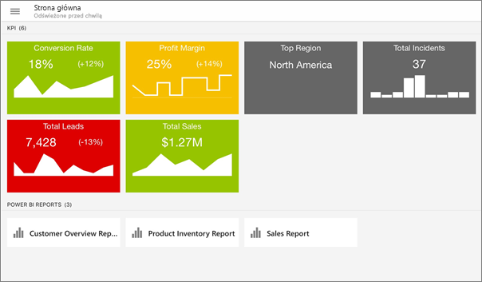

## Wszystko po kolei
**Aplikacje mobilne są tym miejscem, gdzie przeglądasz zawartość usługi Power BI, a nie tym, gdzie ją tworzysz.**

* Ty i inni twórcy raportów w Twojej organizacji [tworzycie raporty usługi Power BI za pomocą programu Power BI Desktop, a następnie publikujecie je na portalu internetowym serwera raportów usługi Power BI](../../report-server/quickstart-create-powerbi-report.md). 
* Tworzysz [wskaźniki KPI bezpośrednio na portalu internetowym](https://docs.microsoft.com/sql/reporting-services/working-with-kpis-in-reporting-services), porządkujesz je w folderach i oznaczasz swoje ulubione, aby móc je łatwo odnaleźć. 
* [Tworzysz mobilne raporty usług Reporting Services](https://docs.microsoft.com/sql/reporting-services/mobile-reports/create-mobile-reports-with-sql-server-mobile-report-publisher) za pomocą programu SQL Server 2016 Enterprise Edition Mobile Report Publisher i publikujesz je na [portalu internetowym usług Reporting Services](https://docs.microsoft.com/sql/reporting-services/web-portal-ssrs-native-mode).  

Następnie w aplikacjach mobilnych usługi Power BI możesz połączyć do pięciu serwerów raportów, aby wyświetlić raporty i wskaźniki KPI usługi Power BI uporządkowane w folderach lub zgromadzone jako ulubione. 

## Badanie próbek w aplikacjach mobilnych bez połączenia z serwerem
Nawet jeśli nie masz dostępu do portalu internetowego usług Reporting Services, możesz nadal badać funkcje mobilnych raportów i wskaźników KPI usług Reporting Services. 

1. Naciśnij przycisk nawigacji globalnej  w lewym górnym rogu, a następnie naciśnij ikonę koła zębatego w prawym górnym rogu .
2. Naciśnij pozycję **Przykłady usług Reporting Services**, a następnie przejdź do interakcji z przykładowymi wskaźnikami KPI i raportami mobilnymi.
   
   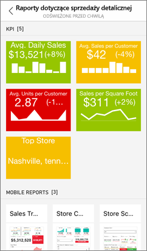

## Nawiązywanie połączenia z lokalnym serwerem raportów
W aplikacjach mobilnych usługi Power Bi możesz wyświetlić lokalne raporty usługi Power BI, mobilne raporty usług Reporting Services i wskaźniki KPI. 

1. Na urządzeniu przenośnym otwórz aplikację usługi Power BI.
2. Jeżeli jeszcze nie było logowania w usłudze Power BI, naciśnij przycisk **Serwer raportów**.
   
   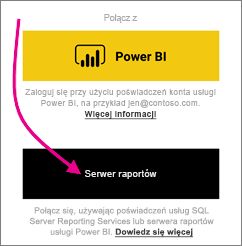
   
   Jeśli było już logowanie w aplikacji usługi Power BI, naciśnij przycisk nawigacji globalnej , a następnie naciśnij ikonę koła zębatego  w prawym górnym rogu.
3. Naciśnij pozycję **Połącz z serwerem**.
   
    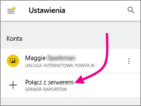

     Aplikacja mobilna musi w jakiś sposób uzyskiwać dostęp do serwera. Istnieje kilka sposobów wykonania tej czynności:

    - Najprostszy sposób to umieszczenie jej w tej samej sieci/korzystanie z sieci VPN.
    - Istnieje możliwość nawiązania połączenia spoza organizacji za pomocą serwera proxy aplikacji internetowej. Więcej informacji można znaleźć w temacie [Łączenie się z usługami Reporting Services za pomocą protokołu OAuth](mobile-oauth-ssrs.md). 
    - Otwórz połączenie (port) w zaporze.

1. Wprowadź adres serwera oraz swoją nazwę użytkownika i hasło. Do adresu serwera użyj następującego formatu:
   
     `http://<servername>/reports`
   
     LUB
   
     `https://<servername>/reports`
   
   Wpisz **http** lub **https** przed parametrami połączenia.
   
    
5. (Opcjonalnie) W obszarze **Opcje zaawansowane** możesz, jeśli chcesz, nadać serwerowi przyjazną nazwę.
6. Teraz serwer zostanie wyświetlony na pasku nawigacyjnym po lewej stronie — w tym przykładzie serwer o nazwie „serwer raportów usługi power bi”.
   
   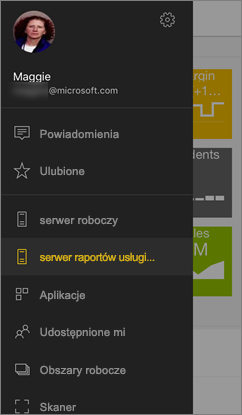

## Nawiązywanie połączenia z lokalnym serwerem raportów w systemie iOS

Jeśli wyświetlasz usługę Power BI w aplikacji mobilnej systemu iOS, administrator IT mógł zdefiniować zasady konfiguracji aplikacji. W takiej sytuacji środowisko łączenia się z serwerem raportów jest uproszczone i nie trzeba podawać tak wielu informacji podczas łączenia się z serwerem raportów. 

1. Zostanie wyświetlony komunikat z informacją o tym, że aplikacja mobilna jest skonfigurowana przy użyciu serwera raportów. Naciśnij pozycję **Zaloguj się**.

    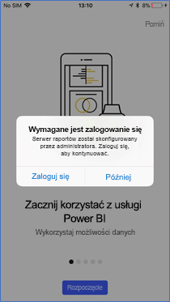

2.  Na stronie **Łączenie z serwerem** będą już wypełnione szczegóły serwera raportów. Naciśnij pozycję **Połącz**.

    

3. Wpisz hasło, aby się uwierzytelnić, a następnie naciśnij pozycję **Zaloguj się**. 

    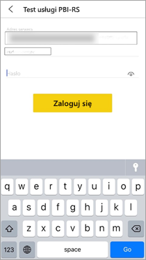

Teraz możesz wyświetlać i stosować wskaźniki KPI oraz raporty usługi Power BI przechowywane na serwerze raportów.

## Wyświetlanie raportów i wskaźników KPI usługi Power BI w aplikacji usługi Power BI
Raporty usługi Power BI, mobilne raporty usług Reporting Services i wskaźniki KPI są wyświetlane w tych samych folderach, w których występują w portalu internetowym usług Reporting Services. 

* Naciśnij raport usługi Power BI . Zostanie on otwarty w orientacji poziomej i możesz wejść z nim w interakcję w aplikacji usługi Power BI.

    > [!NOTE]
  > Funkcje przechodzenia do szczegółów i uogólniania nie są obecnie włączone w raportach usługi Power BI na serwerze raportów usługi Power BI.
  
    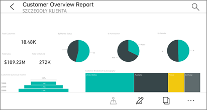
* W programie Power BI Desktop właściciele raportu mogą [zoptymalizować raport](../../desktop-create-phone-report.md) dla aplikacji mobilnych usługi Power BI. W telefonie komórkowym zoptymalizowane raporty mają specjalną ikonę, , i układ.
  
    
* Naciśnij wskaźnik KPI, aby zobaczyć go w trybie ostrości.
  
    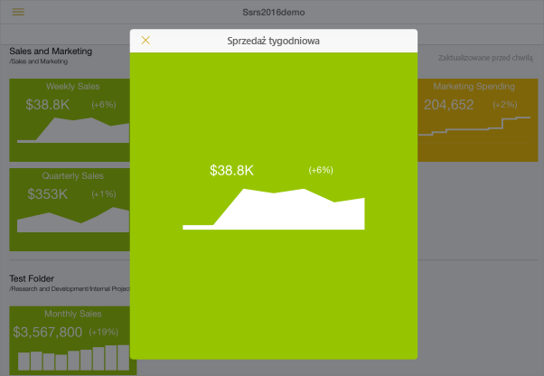

## Wyświetlanie ulubionych wskaźników KPI i raportów
Wskaźniki KPI i raporty można oznaczyć jako ulubione w portalu internetowym, a następnie wyświetlać je w jednym wygodnym folderze na swoim urządzeniu przenośnym wraz z ulubionymi pulpitami nawigacyjnymi usługi Power BI.

* Naciśnij pozycję **Ulubione**.
  
   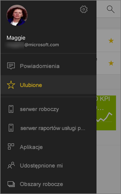
  
   Twoje ulubione wskaźniki KPI i raporty z portalu internetowego znajdują się już wszystkie na tej stronie wraz z pulpitami nawigacyjnymi usługi Power BI w usłudze Power BI:
  
   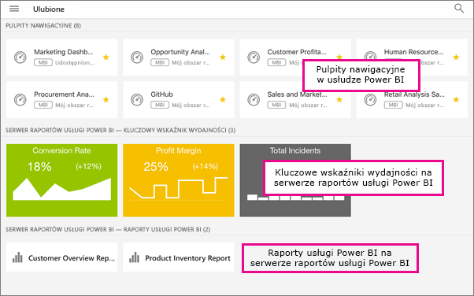

## Usuwanie połączenia z serwerem raportów
1. U dołu lewego paska nawigacyjnego naciśnij pozycję **Ustawienia**.
2. Naciśnij nazwę serwera, z którym nie chcesz być połączony.
3. Naciśnij pozycję **Usuń serwer**.

## Następne kroki
* [Co to jest usługa Power BI?](../../power-bi-overview.md)  
* Masz pytania? [Zadaj pytanie społeczności usługi Power BI](http://community.powerbi.com/)

