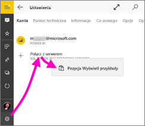
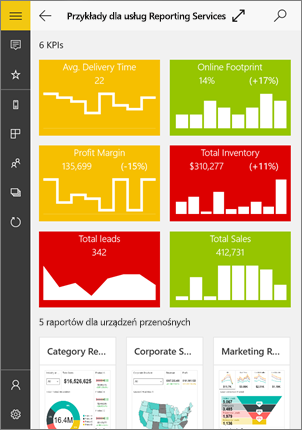
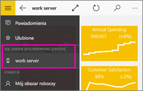
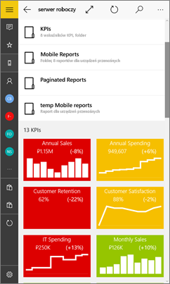
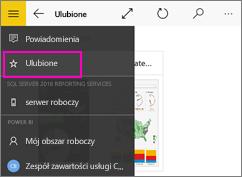
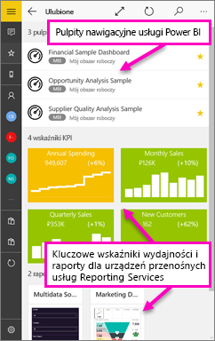
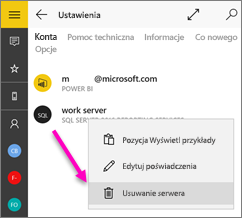

# Wyświetlanie raportów dla urządzeń przenośnych i kluczowych wskaźników wydajności usług Reporting Services (SSRS) w aplikacji mobilnej usługi Power BI dla systemu Windows 10
Aplikacja mobilna usługi Power BI dla systemu Windows 10 zapewnia mobilny dostęp na żywo z obsługą dotykową do ważnych lokalnych informacji biznesowych w usługach SQL Server 2016 Reporting Services. 

## Wszystko po kolei
[Utwórz raporty usług Reporting Services dla urządzeń przenośnych](https://msdn.microsoft.com/library/mt652547.aspx) za pomocą programu SQL Server 2016 Enterprise Edition Mobile Report Publisher i opublikuj je w [portalu internetowym usług Reporting Services](https://msdn.microsoft.com/library/mt637133.aspx). Utwórz kluczowe wskaźniki wydajności bezpośrednio w portalu internetowym. Uporządkuj je w folderach i oznacz swoje ulubione, aby móc je łatwo odnaleźć. 

Następnie w aplikacji mobilnej Power BI dla systemu Windows 10 wyświetl raporty dla urządzeń przenośnych i kluczowe wskaźniki wydajności uporządkowane w folderach lub zebrane jako ulubione. 

> [!NOTE]
> Na urządzeniu musi działać system Windows 10. Aplikacja działa najlepiej na urządzeniach z co najmniej 1 GB pamięci RAM i 8 GB pamięci wewnętrznej.
> 
> 

## Eksplorowanie przykładów bez serwera usług SQL Server 2016 Reporting Services
Nawet jeśli nie masz dostępu do portalu internetowego usług Reporting Services, możesz nadal eksplorować funkcje raportów usług Reporting Services dla urządzeń przenośnych.

1. Na urządzeniu z systemem Windows 10 otwórz aplikację usługi Power BI.
2. Naciśnij przycisk nawigacji globalnej  w lewym górnym rogu.
3. Naciśnij ikonę **Ustawienia** , kliknij prawym przyciskiem myszy lub naciśnij i przytrzymaj pozycję **Połącz z serwerem**, a następnie naciśnij pozycję **Wyświetl przykłady**.
   
   
4. Otwórz folder Raporty sprzedaży detalicznej lub Raporty sprzedaży, aby zapoznać się z kluczowymi wskaźnikami wydajności i raportami dla urządzeń przenośnych.
   
   

Przeglądaj przykłady, aby korzystać z kluczowych wskaźników wydajności i raportów dla urządzeń przenośnych.

## Łączenie się z serwerem raportów usług Reporting Services
1. U dołu lewego paska nawigacyjnego naciśnij pozycję **Ustawienia** 
2. Naciśnij pozycję **Połącz z serwerem**.
3. Wprowadź adres serwera oraz swoją nazwę użytkownika i hasło. Adres serwera podaj w następującym formacie:
   
     `http://<servername>/reports` lub `https://<servername>/reports`
   
   > [!NOTE]
   > Uwzględnij ciąg **http** lub **https** na początku parametrów połączenia.
   > 
   > 
   
    Naciśnij pozycję **Opcja zaawansowana**, jeśli chcesz nadać serwerowi nazwę.
4. Naciśnij znacznik wyboru, aby nawiązać połączenie. 
   
   Spowoduje to wyświetlenie serwera na lewym pasku nawigacyjnym.
   
   
   
   >[!TIP]
   >W dowolnym momencie naciśnij przycisk nawigacji globalnej , aby przejść między raportami usług Reporting Services dla urządzeń przenośnych i pulpitami nawigacyjnymi w usłudze Power BI. 
   > 

## Wyświetlanie raportów dla urządzeń przenośnych i kluczowych wskaźników wydajności usług Reporting Services w aplikacji Power BI
Raporty dla urządzeń przenośnych i kluczowe wskaźniki wydajności usług Reporting Services są wyświetlane w tych samych folderach, w których się znajdują w portalu internetowym usług Reporting Services.

* Naciśnij kluczowy wskaźnik wydajności, aby zobaczyć go w trybie koncentracji uwagi.
  
    
* Naciśnij raport dla urządzeń przenośnych, aby otworzyć go i korzystać z niego w aplikacji Power BI.
  
    

## Wyświetlanie ulubionych kluczowych wskaźników wydajności i raportów
Kluczowe wskaźniki wydajności i raporty dla urządzeń przenośnych można oznaczyć jako ulubione w portalu internetowym usług Reporting Services, a następnie wyświetlać je w jednym wygodnym folderze na swoim urządzeniu z systemem Windows 10 wraz z ulubionymi pulpitami nawigacyjnymi i raportami usługi Power BI.

* Naciśnij pozycję **Ulubione**.
  
   
  
   Wszystkie ulubione elementy z portalu internetowego zostaną wyświetlone na tej stronie.
  
   

Dowiedz się więcej na temat [ulubionych w aplikacjach mobilnych Power BI](mobile-apps-favorites.md).

## Usuwanie połączenia z serwerem raportów
Aplikacja mobilna Power BI w danym momencie może być połączona tylko z jednym serwerem raportów. Jeśli chcesz się połączyć z innym serwerem, musisz rozłączyć połączenie z obecnym.

1. U dołu lewego paska nawigacyjnego naciśnij pozycję **Ustawienia** .
2. Naciśnij i przytrzymaj nazwę serwera, z którym nie chcesz mieć nawiązanego połączenia.
3. Naciśnij pozycję **Usuń serwer**.
   
    

## Tworzenie raportów dla urządzeń przenośnych i kluczowych wskaźników wydajności usług Reporting Services
Raporty dla urządzeń przenośnych i kluczowe wskaźniki wydajności usług Reporting Services nie są tworzone w aplikacji mobilnej Power BI. Można je utworzyć w programie SQL Server Mobile Report Publisher i portalu internetowym usług SQL Server 2016 Reporting Services.

* [Utwórz własne raporty usług Reporting Services dla urządzeń przenośnych](https://msdn.microsoft.com/library/mt652547.aspx) i opublikuj je w portalu internetowym usług Reporting Services.
* Utwórz [kluczowe wskaźniki wydajności w portalu internetowym usług Reporting Services](https://msdn.microsoft.com/library/mt683632.aspx)

## Następne kroki
* [Wprowadzenie do aplikacji mobilnej Power BI dla systemu Windows 10](mobile-windows-10-phone-app-get-started.md)  
* [Co to jest usługa Power BI?](../../power-bi-overview.md)  
* Masz pytania? [Zadaj pytanie społeczności usługi Power BI](http://community.powerbi.com/)

