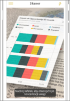
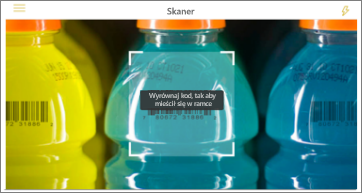

# Pobieranie danych ze środowisk rzeczywistych za pomocą aplikacji mobilnych usługi Power BI
Aplikacje mobilne usługi Power BI umożliwiają połączenie środowisk rzeczywistych bezpośrednio z powiązanymi informacjami analizy biznesowej na wiele różnych sposobów. 

## Kody QR dla kafelków
Utwórz kod QR dla raportu lub kafelka na pulpicie nawigacyjnym i umieść go, gdzie tylko chcesz. Gdy współpracownicy zeskanują kod za pomocą swoich telefonów iPhone, telefonów z systemem Android lub aplikacji usługi Power BI dla rzeczywistości mieszanej, zobaczą kafelek skojarzony z tym kodem QR. Na telefonie iPhone kafelek zostanie wyświetlony w rzeczywistości rozszerzonej.

Więcej informacji na temat:

* [Tworzenie kodu QR kafelka w usłudze Power BI](../../service-create-qr-code-for-tile.md)
* [Skanowanie kodu QR usługi Power BI z urządzenia przenośnego](mobile-apps-qr-code.md)
* [Skanowanie kodu QR za pomocą aplikacji usługi Power BI dla rzeczywistości mieszanej](mobile-mixed-reality-app.md#scan-a-report-qr-code-in-holographic-view).

## Kody QR dla raportów
Utwórz kod QR dla raportu.  Gdy współpracownicy zeskanują kod za pomocą swoich telefonów iPhone (telefony z systemem Android już wkrótce), zobaczą raport skojarzony z tym kodem QR. 

Więcej informacji o [Tworzenie kodu QR dla raportu w usłudze Power BI](../../service-create-qr-code-for-report.md)

## Kody kreskowe
Oznakuj kod kreskowy w swoim raporcie, aby współpracownicy mogli zeskanować kod kreskowy na produkcie i przejść bezpośrednio do raportu odfiltrowanego dla tego produktu.

Więcej informacji na temat:

* [TZnakowanie danych kodu kreskowego w raporcie](../../desktop-mobile-barcodes.md) 
* [Skanowanie kodu kreskowego z aplikacji usługi Power BI na telefonie iPhone](mobile-apps-scan-barcode-iphone.md)

## Filtrowanie według lokalizacji
Klasyfikowanie danych geograficznych w raporcie w programie Power BI Desktop. Następnie Twoi współpracownicy wyświetlą ten raport w aplikacji mobilnej usługi Power BI dla systemu iOS, a usługa Power BI automatycznie udostępni filtry geograficzne, które pasują do miejsca, gdzie oni się znajdują.

Więcej informacji o [filtrowaniu według lokalizacji](mobile-apps-geographic-filtering.md).

## Następne kroki
* [Tworzenie kodu QR kafelka w usłudze Power BI](../../service-create-qr-code-for-tile.md)
* [Tworzenie kodu QR raportu w usłudze Power BI](../../service-create-qr-code-for-report.md)

