# Szybki start: eksplorowanie pulpitów nawigacyjnych i raportów w aplikacjach mobilnych usługi Power BI
W tym samouczku zapoznasz się z przykładowym pulpitem nawigacyjnym i raportem w aplikacji mobilnej usługi Power BI w telefonie z systemem Android. Możesz również wykonać opisane czynności w innych aplikacjach mobilnych. 

Dotyczy:

|  |  |  |  |
|:--- |:--- |:--- |:--- |
| Telefon iPhone | iPad | Android | Windows 10 |

Pulpity nawigacyjne to portal zapewniający dostęp do operacji i procesów mających miejsce w Twojej firmie. Pulpit nawigacyjny zapewnia przegląd tych danych i stanowi centrum monitorowania bieżącego stanu firmy. Raporty to interaktywny widok danych z wizualizacjami reprezentującymi różne wyniki i szczegółowe informacje uzyskane na podstawie tych danych. 

## Wymagania wstępne

### Tworzenie konta w usłudze Power BI
Jeśli nie masz konta usługi Power BI, na początku [zacznij korzystać z bezpłatnej wersji próbnej](https://app.powerbi.com/signupredirect?pbi_source=web).

### Instalowanie usługi Power BI dla aplikacji systemu Android
[Pobierz aplikację usługi Power BI dla systemu Android](http://go.microsoft.com/fwlink/?LinkID=544867) ze sklepu Google Play.

Usługa Power BI działa na urządzeniach z systemem operacyjnym Android w wersji 5.0 lub nowszej. Aby sprawdzić urządzenie, przejdź do pozycji **Ustawienia** > **Informacje o urządzeniu** > **Wersja systemu Android**.

### Pobieranie przykładu Retail Analysis
W pierwszym kroku przewodnika Szybki start należy pobrać przykład Retail Analysis w usłudze Power BI.

1. Otwórz usługę Power BI w przeglądarce (app.powerbi.com) i zaloguj się.

1. Wybierz ikonę nawigacji globalnej, aby otworzyć obszar nawigacji po lewej stronie.

    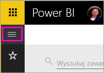

2. W lewym okienku nawigacji wybierz pozycję **Obszary robocze** > **Mój obszar roboczy**.

    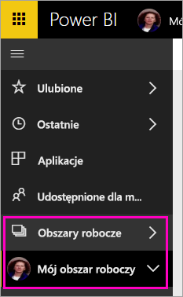

3. W lewym dolnym rogu wybierz pozycję **Pobierz dane**.
   
    

3. Na stronie Pobieranie danych wybierz ikonę **Przykłady**.
   
   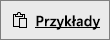

4. Wybierz pozycję **Retail Analysis Sample**.
 
    
 
8. Wybierz pozycję **Połącz**.  
  
   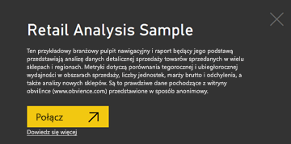
   
5. Usługa Power BI zaimportuje przykład i doda nowy pulpit nawigacyjny, raport oraz zestaw danych do Twojego obszaru roboczego.
   
   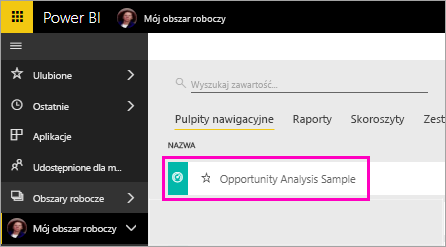

Wszystko jest teraz gotowe do wyświetlenia przykładu na urządzeniu z systemem Android.

## Wyświetlanie pulpitu nawigacyjnego na urządzeniu z systemem Android
1. Otwórz aplikację Power BI na urządzeniu z systemem Android i zaloguj się przy użyciu poświadczeń konta usługi Power BI używanych w usłudze Power BI w przeglądarce.

1.  Naciśnij przycisk nawigacji globalnej .

2.  Wybieranie pozycji **Obszary robocze** > **Mój obszar roboczy**

    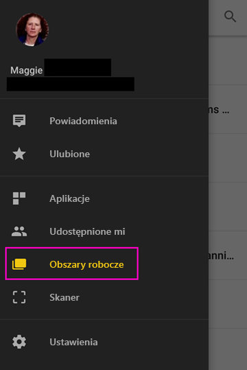

3. Wybierz pulpit nawigacyjny przykładu Retail Analysis, aby go otworzyć.
 
    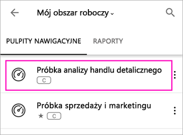
   
    Oznaczenie pod nazwą pulpitu nawigacyjnego (w tym przypadku litera „C”) pokazuje, jak są klasyfikowane dane na poszczególnych pulpitach nawigacyjnych. Przeczytaj więcej na temat [klasyfikowania danych w usłudze Power BI](../../service-data-classification.md).

    Pulpity nawigacyjne usługi Power BI wyglądają nieco inaczej na telefonie z systemem Android. Wszystkie kafelki mają taką samą szerokość i są ułożone jeden za drugim od góry do dołu.

4. Wybierz ikonę gwiazdki  na pasku tytułu, aby oznaczyć ten pulpit nawigacyjny jako ulubiony.

    Oznaczenie elementu jako ulubionego w aplikacji mobilnego spowoduje, że będzie on ulubiony w usłudze Power BI, i odwrotnie.

4. Przewiń w dół i wybierz wypełniony wykres liniowy „This Year's Sales, Last Year's Sales” (Sprzedaż w tym roku, sprzedaż w poprzednim roku).

    

    Zostanie on otwarty w trybie koncentracji uwagi.

7. W trybie koncentracji uwagi wybierz na wykresie pozycję Apr (Kwiecień). Wartości dotyczące kwietnia są wyświetlane w górnej części wykresu.

    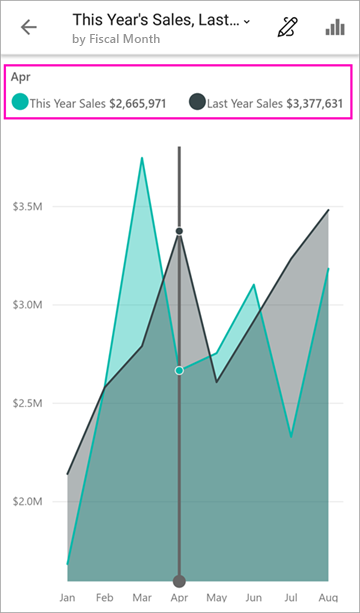

8. Wybierz ikonę Raport  w prawym górnym rogu. Raport powiązany z tym kafelkiem zostanie otwarty w orientacji poziomej.

    

9. Wybierz żółty bąbelek „040 - Juniors” na wykresie bąbelkowym. Widzisz, jak powiązane wartości są wyróżniane na innych wykresach? 

    

10. Szybko przesuń ekran do góry, aby wyświetlić pasek narzędzi na dole, a następnie wybierz ikonę ołówka.

    

11. Wybierz ikonę buźki na pasku narzędzi Adnotacja i dodaj kilka uśmiechniętych buziek na stronie raportu.
 
    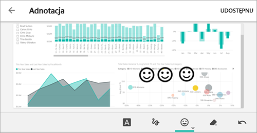

12. Wybierz pozycję **Udostępnij** w prawym górnym rogu.

1. Wprowadź adresy e-mail i w razie potrzeby dodaj wiadomość.  

    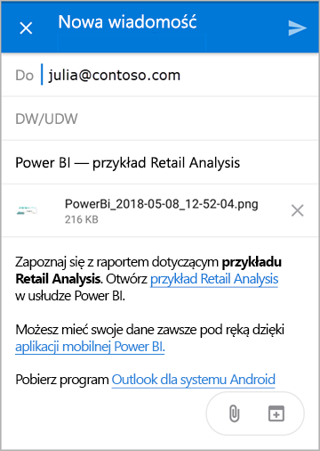

    Tę migawkę można udostępnić dowolnej osobie, w organizacji lub poza nią. Jeśli te osoby są członkami organizacji i mają własne konta usługi Power BI, będą mogły również otworzyć raport dotyczący przykładu Retail Analysis.

## Czyszczenie zasobów

Jeśli chcesz, po zakończeniu tego przewodnika Szybki start możesz usunąć pulpit nawigacyjny, raport i zestaw danych przykładu Retail Analysis.

1. Otwórz usługę Power BI (app.powerbi.com) i zaloguj się.

2. W lewym okienku nawigacji wybierz pozycję **Obszary robocze** > **Mój obszar roboczy**.

    Widzisz żółtą gwiazdkę informującą o tym, że jest to element ulubiony?

3. Na karcie **Pulpity nawigacyjne** wybierz ikonę kosza na śmieci **Usuń** obok pulpitu nawigacyjnego Retail Analysis.

    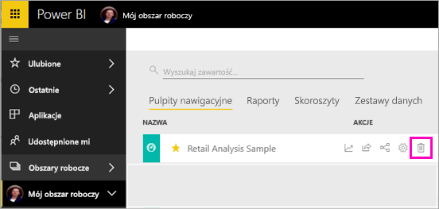

4. Wybierz kartę **Raporty** i zrób to samo dla raportu Retail Analysis.

5. Wybierz kartę **Zestawy danych** i zrób to samo dla zestawu danych Retail Analysis.

## Następne kroki

W tym przewodniku Szybki start zapoznano się z przykładowym pulpitem nawigacyjnym i raportem na urządzeniu z systemem Android. Dowiedz się więcej na temat pracy w usłudze Power BI. 

> [!div class="nextstepaction"]
> [Szybki start: poruszanie się po usłudze Power BI](../end-user-experience.md)

