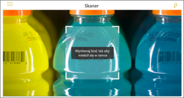
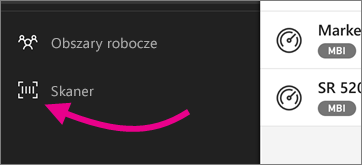

# Skanowanie kodu kreskowego za pomocą swojego telefonu iPhone z aplikacji mobilnej usługi Power BI
Skanowanie kodów kreskowych w świecie rzeczywistym, aby przejść bezpośrednio do odfiltrowanych informacji analizy biznesowej w aplikacji mobilnej usługi Power BI.

Powiedzmy, że współpracownik ma [oznakowane pole kodu kreskowego w raporcie programu Power BI Desktop](../../desktop-mobile-barcodes.md) i udostępnił je Tobie. 

Podczas skanowania kodu kreskowego produktu przy użyciu skanera w aplikacji usługi Power BI na telefonie iPhone zobaczysz raport (lub listę raportów) z tym kodem kreskowym. Możesz otworzyć ten raport na swoim telefonie iPhone po odfiltrowaniu tego kodu kreskowego.

## Skanowanie kodu kreskowego za pomocą skanera usługi Power BI
1. W aplikacji mobilnej usługi Power BI otwórz główne menu nawigacji  w lewym górnym rogu. 
2. Przewiń w dół do pozycji **Skaner** i zaznacz ją. 
   
    
3. Jeśli aparat fotograficzny nie jest włączony, musisz najpierw zezwolić aplikacji usługi Power BI na używanie aparatu. Jest to jednorazowe zezwolenie. 
4. Skieruj skaner na kod kreskowy na produkcie. 
   
    Zobaczysz listę raportów skojarzonych z tym kodem kreskowym.
5. Naciśnij nazwę raportu, aby otworzyć go na telefonie iPhone po automatycznym odfiltrowaniu do tego kodu kreskowego.

## Filtrowanie według innych kodów kreskowych będąc w raporcie
Podczas wyszukiwania w raporcie odfiltrowanym według kodu kreskowego na telefonie iPhone możesz chcieć odfiltrować ten sam raport według innego kodu kreskowego.

* Jeśli ikona kodu kreskowego ma filtr , filtr jest aktywny i raport jest już filtrowany według kodu kreskowego. 
* Jeśli ikona kodu kreskowego nie ma filtra , filtr nie jest aktywny i raport nie jest filtrowany według kodu kreskowego. 

W obu przypadkach naciśnij ikonę, aby otworzyć małe menu z przestawnym skanerem.

* Zogniskuj skaner na nowy elemencie, aby zmienić filtr raportu na inną wartość kodu kreskowego. 
* Wybierz pozycję **Wyczyść filtr kodu kreskowego**, aby powrócić do niefiltrowanego raportu.
* Wybierz pozycję **Filtruj według ostatnich kodów kreskowych**, aby zmienić filtr raportu na jeden z kodów kreskowych, które zostały zeskanowane podczas bieżącej sesji.

## Problemy ze skanowaniem kodów kreskowych
Poniżej przedstawiono niektóre komunikaty, które mogą zostać wyświetlone podczas skanowania kodu kreskowego na produkcie.

### „Nie można odfiltrować raportu...”
Raport, który chcesz odfiltrować, jest oparty na modelu danych, który nie zawiera tej wartości kodu kreskowego. Na przykład produkt „woda mineralna” nie jest zawarty w raporcie.  

### Wszystkie/niektóre elementy wizualne w raporcie nie zawierają żadnej wartości
Wartość zeskanowanego kodu kreskowego istnieje w modelu, ale wszystkie/niektóre elementy wizualne raportu nie zawierają tej wartości i w związku z tym filtrowanie zwróci stan pusty. Spróbuj przejrzeć inne strony raportu lub zmodyfikować swoje raporty w programie Power BI Desktop tak, aby zawierały tę wartość 

### „Prawdopodobnie nie masz żadnych raportów, które można filtrować według kodów kreskowych”.
Oznacza to, że nie masz żadnych raportów z włączonymi kodami kreskowymi. Skaner kodów kreskowych może filtrować tylko te raporty, które mają kolumnę oznaczoną jako **Kod kreskowy**.  

Upewnij się, że Ty lub właściciel raportu oznaczyliście kolumnę jako **Kod kreskowy** w programie Power BI Desktop. Dowiedz się więcej o [znakowaniu pola kodu kreskowego w programie Power BI Desktop](../../desktop-mobile-barcodes.md)

### „Nie można filtrować raportu — wygląda, że ten kod kreskowy nie istnieje w danych raportu”.
Raport, który chcesz odfiltrować, jest oparty na modelu danych, który nie zawiera tej wartości kodu kreskowego. Na przykład produkt „woda mineralna” nie jest zawarty w raporcie. Możesz zeskanować inny produkt, wybrać inny raport (jeśli jest dostępny więcej niż jeden raport) lub wyświetlić niefiltrowany raport. 

## Następne kroki
* [Znakowanie pola kodu kreskowego w programie Power BI Desktop](../../desktop-mobile-barcodes.md)
* [Kafelki pulpitu nawigacyjnego w usłudze Power BI](../end-user-tiles.md)
* [Pulpity nawigacyjne w usłudze Power BI](../end-user-dashboards.md)

