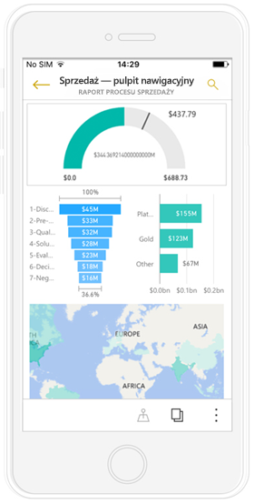
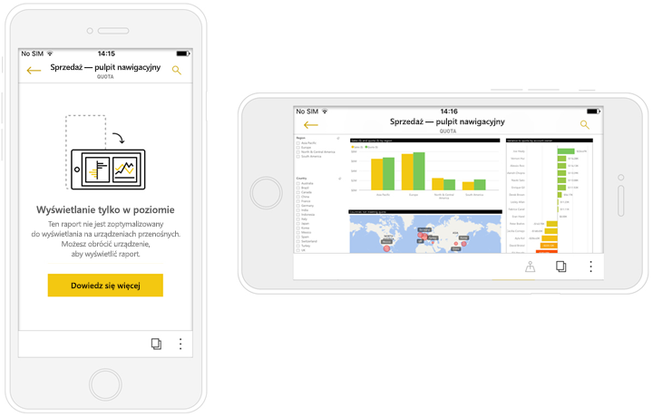
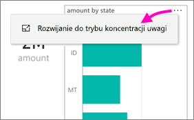
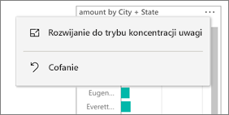
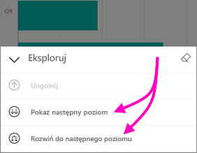
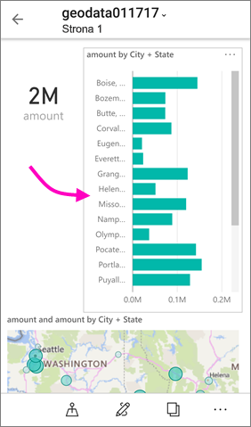

# Wyświetlanie raportów usługi Power BI zoptymalizowanych pod kątem telefonu

Dotyczy:

|  |  |
|:--- |:--- |
| Telefony iPhone |Telefony z systemem Android |

Podczas tworzenia raportu usługi Power BI w programie Power BI Desktop lub w usłudze możesz również [utworzyć wersję tego raportu zoptymalizowaną pod kątem wyświetlania](../../desktop-create-phone-report.md) w aplikacji Power BI na telefonie.

W takim przypadku po otwarciu raportu usługi Power BI na telefonie usługa wykrywa, czy raport został zoptymalizowany pod kątem korzystania z niego na telefonie, i automatycznie otwiera zoptymalizowany raport w widoku pionowym.

Jeśli nie jest dostępny raport zoptymalizowany pod kątem telefonu, raporty będą mimo wszystko otwierane, ale w niezoptymalizowanym widoku poziomym. Nawet jeśli raport został zoptymalizowany pod kątem telefonu, po obróceniu telefonu na bok raport zostanie otwarty w niezoptymalizowanym widoku i w oryginalnym układzie. Jeśli zoptymalizowane są tylko niektóre strony, w widoku pionowym wyświetlony zostanie komunikat informujący, że raport jest dostępny w widoku poziomym.

Wszystkie pozostałe funkcje raportów usługi Power BI działają w raportach zoptymalizowanych pod kątem telefonu. Dowiedz się, jakie funkcje są dostępne w:

* [Raportach na telefonach iPhone](mobile-reports-in-the-mobile-apps.md). 
* [Raportach na telefonach z systemem Android](mobile-reports-in-the-mobile-apps.md).

## Filtrowanie strony raportu w telefonie
Jeśli raport zoptymalizowany pod kątem telefonu ma zdefiniowane filtry, możesz użyć tych filtrów podczas wyświetlania raportu w telefonie. W telefonie zostanie otwarty raport odfiltrowany do wartości filtrowanych w raporcie w Internecie z komunikatem informującym o aktywnych filtrach na stronie. Filtry można zmienić w telefonie.

1. Naciśnij ikonę filtru  w dolnej części strony. 
2. Użyj filtrowania podstawowego lub zaawansowanego, aby wyświetlić interesujące Cię wyniki.
   
    

## Krzyżowe wyróżnianie wizualizacji
Krzyżowe wyróżnianie wizualizacji w raportach na telefonach działa podobnie jak w usłudze Power BI i w raportach wyświetlanych na telefonach w widoku poziomym: po wybraniu danych w jednej wizualizacji wyróżniane są powiązane dane w pozostałych wizualizacjach na tej stronie.

Dowiedz się więcej na temat [filtrowania i wyróżniania w usłudze Power BI](../../power-bi-reports-filters-and-highlighting.md).

## Wybieranie wizualizacji
W raportach na telefonach po wybraniu wizualizacji zostaje ona wyróżniona i zostaje na niej umieszczony fokus, co neutralizuje gesty wykonywane na kanwie.

Po wybraniu wizualizacji możesz na przykład przewijać wizualizację. Aby cofnąć zaznaczenie wizualizacji, po prostu dotknij dowolny obszar poza wizualizacją.

## Otwieranie wizualizacji w trybie koncentracji uwagi
Raporty na telefonach mają także tryb koncentracji uwagi, który umożliwia powiększenie wizualizacji w celu zapoznania się z nią oraz z raportem.

* W raporcie na telefonie naciśnij ikonę wielokropka (**...**) w prawym górnym rogu wizualizacji i wybierz polecenie **Rozwiń do trybu koncentracji uwagi**.
  
    

Czynności wykonane w trybie koncentracji uwagi są stosowane do kanwy raportu i odwrotnie, co umożliwia bezproblemowe korzystanie z raportu. Jeśli na przykład w wizualizacji wyróżnisz wartość, a następnie wrócisz do całego raportu, cały raport będzie filtrowany pod kątem wartości wyróżnionej w wizualizacji.

Niektóre czynności można wykonać wyłącznie w trybie koncentracji uwagi z powodu ograniczeń związanych z rozmiarem ekranu:

* **Przechodzenie do szczegółów** informacji wyświetlanych w wizualizacji. Więcej informacji na temat [przechodzenia do szczegółów i uogólniania](mobile-apps-view-phone-report.md#drill-down-in-a-visual)w raporcie na telefon znajduje się poniżej.
* **Sortowanie** wartości w wizualizacji.
* **Cofanie**: usuwanie czynności wykonanych w wizualizacji i przywracanie definicji skonfigurowanej podczas tworzenia raportu.
  
    Aby wyczyścić wszystkie czynności wykonane na wizualizacji, naciśnij ikonę wielokropka (**...**), a następnie wybierz polecenie **Cofnij**.
  
    
  
    Funkcja Cofanie jest dostępna na poziomie raportu — wówczas usuwa wszystkie czynności wykonane na wszystkich wizualizacjach — lub na poziomie wizualizacji, gdzie usuwa wszystkie czynności z wybranej wizualizacji.   

## Przechodzenie do szczegółów w wizualizacji
Jeśli w wizualizacji zdefiniowano poziomy hierarchii, możesz przejść do informacji szczegółowych wyświetlonych w wizualizacji, a następnie wrócić do informacji ogólnych. Możesz dodać [możliwość przejścia do szczegółów wizualizacji](../end-user-drill.md) w usłudze Power BI lub programie Power BI Desktop. Przechodzenie do szczegółów działa w raportach usługi Power BI zoptymalizowanych pod kątem korzystania z telefonu tylko podczas wyświetlania ich na telefonie. 

1. W raporcie wyświetlonym na telefonie naciśnij ikonę wielokropka (**...**) w prawym górnym rogu, a następnie wybierz opcję **Rozwiń do trybu koncentracji uwagi**.
   
    
   
    W tym przykładzie słupki pokazują wartości dla stanów.
2. Naciśnij ikonę Eksploruj  w lewym dolnym rogu.
   
    
3. Naciśnij opcję **Pokaż następny poziom** lub **Rozwiń do następnego poziomu**.
   
    
   
    Teraz słupki pokazują wartości dla miast.
   
    
4. Naciśnięcie strzałki w lewym górnym rogu spowoduje powrót do raportu na telefonie, w którym wartości niższego poziomu nadal będą rozwinięte.
   
    
5. Aby wrócić do oryginalnego poziomu, naciśnij ponownie ikonę wielokropka (**...** ), a następnie wybierz opcję **Cofnij**.
   
    

## Następne kroki
* [Tworzenie raportów zoptymalizowanych pod kątem aplikacji Power BI na telefony](../../desktop-create-phone-report.md)
* [Tworzenie widoku pulpitu nawigacyjnego dla telefonu w usłudze Power BI](../../service-create-dashboard-mobile-phone-view.md)
* [Tworzenie elastycznych wizualizacji zoptymalizowanych pod kątem dowolnego rozmiaru](../../visuals/desktop-create-responsive-visuals.md)
* Masz więcej pytań? [Zadaj pytanie społeczności usługi Power BI](http://community.powerbi.com/)

