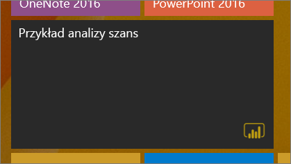

# Przypinanie pulpitu nawigacyjnego do ekranu startowego systemu Windows 10 przy użyciu aplikacji mobilnej Power BI
Aplikacja mobilna Power BI dla systemu Windows 10 umożliwia przypinanie pulpitów nawigacyjnych do ekranu startowego systemu Windows. Staną się one *dynamicznymi kafelkami*. Po naciśnięciu kafelka na ekranie startowym odpowiedni pulpit nawigacyjny zostanie otwarty w aplikacji mobilnej Power BI dla systemu Windows 10.

## Przypinanie pulpitu nawigacyjnego do ekranu startowego jako dynamicznego kafelka
1. Otwórz pulpit nawigacyjny.
2. Naciśnij ikonę **Przypnij do ekranu startowego** .
   
   
   
   Przejdź do ekranu startowego urządzenia, aby zobaczyć dynamiczny kafelek.
   
   

## Następne kroki
* [Pobieranie aplikacji mobilnej Power BI dla systemu Windows 10](http://go.microsoft.com/fwlink/?LinkID=526478) ze Sklepu Windows  
* [Wprowadzenie do aplikacji mobilnej Power BI dla systemu Windows 10](mobile-windows-10-phone-app-get-started.md)  
* [Co to jest usługa Power BI?](../../power-bi-overview.md)
* Masz pytania? [Zadaj pytanie społeczności usługi Power BI](http://community.powerbi.com/)

