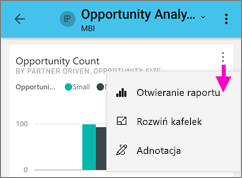

# Eksplorowanie raportów w aplikacjach mobilnych Power BI
Dotyczy:

|  |  |  |  |  |
|:--- |:--- |:--- |:--- |:--- |
| Telefony iPhone |Urządzenia iPad |Telefony z systemem Android |Tablety z systemem Android |Urządzenia z systemem Windows 10 |

Raport usługi Power BI to interaktywny widok danych z wizualizacjami reprezentującymi różne wyniki i szczegółowe informacje uzyskane na podstawie tych danych. Wyświetlanie raportów w aplikacjach mobilnych Power BI to trzeci krok w procesie składającym się z trzech kroków.

1. [Tworzenie raportów w programie Power BI Desktop](../../desktop-report-view.md). Możesz nawet [zoptymalizować raport pod kątem telefonów](mobile-apps-view-phone-report.md) w programie Power BI Desktop. 
2. Publikowanie tych raportów w usłudze Power BI [(https://powerbi.com)](https://powerbi.com) lub na [Serwerze raportów usługi Power BI](../../report-server/get-started.md).  
3. Korzystanie z tych raportów w aplikacjach mobilnych Power BI.

## Otwieranie raportu usługi Power BI w aplikacji mobilnej
Raporty usługi Power BI są przechowywane w różnych miejscach w aplikacji mobilnej, w zależności od tego, skąd pochodzą. Mogą znajdować się w sekcji Aplikacje, Udostępnione dla mnie lub Obszary robocze (w tym Mój obszar roboczy) albo na serwerze raportów. Czasami przejście do raportu odbywa się za pośrednictwem powiązanego pulpitu nawigacyjnego, a czasami jest on na liście.

* Na pulpicie nawigacyjnym naciśnij ikonę wielokropka (...) w prawym górnym rogu kafelka i wybierz polecenie **Otwórz raport**.
  
  
  
  Opcja otworzenia raportu nie jest dostępna dla wszystkich kafelków. Na przykład naciśnięcie kafelka utworzonego przez zadanie pytania w polu Pytania i odpowiedzi nie spowoduje otworzenia raportu. 
  
  Na telefonie raport zostanie otwarty w orientacji poziomej, chyba że jest on [zoptymalizowany pod kątem wyświetlania na telefonie](mobile-reports-in-the-mobile-apps.md#view-reports-optimized-for-phones).
  
  

## Wyświetlanie raportów zoptymalizowanych pod kątem telefonów
Autorzy raportów usługi Power BI mogą utworzyć układ raportu zoptymalizowany specjalnie pod kątem telefonów. Strony raportów zoptymalizowane pod kątem telefonów mają dodatkowe funkcje: na przykład można wyszczególniać i sortować wizualizacje oraz uzyskiwać dostęp do [filtrów, które autor raportu dodał do strony raportu](mobile-apps-view-phone-report.md#filter-the-report-page-on-a-phone). W telefonie zostanie otwarty raport odfiltrowany do wartości filtrowanych w raporcie w Internecie z komunikatem informującym o aktywnych filtrach na stronie. Filtry można zmienić w telefonie.

Zoptymalizowany raport ma na liście raportów specjalną ikonę :

Po wyświetleniu tego raportu na telefonie zostanie on otwarty w widoku pionowym.

 Raport może zawierać zarówno strony zoptymalizowane pod kątem telefonów, jak i niezoptymalizowane. W takim przypadku podczas przeglądania raportu widok będzie się zmieniać z pionowego na poziomy, odpowiednio dla każdej strony.

Dowiedz się więcej na temat [raportów zoptymalizowanych pod kątem wyświetlania na telefonach](mobile-apps-view-phone-report.md).

## Filtrowanie raportu za pomocą fragmentatorów
Podczas projektowania raportu w programie Power BI Desktop lub za pomocą usługi Power BI należy wziąć pod uwagę możliwość [dodania fragmentatorów do strony raportu](../../visuals/power-bi-visualization-slicers.md). Możesz razem ze współpracownikami korzystać z fragmentatorów do filtrowania strony w przeglądarce i w aplikacjach mobilnych. Po wyświetleniu raportu w telefonie możecie wyświetlać fragmentatory i korzystać z nich w orientacji poziomej oraz na stronie zoptymalizowanej pod kątem orientacji pionowej telefonu. Wartość wybrana w filtrze lub fragmentatorze w przeglądarce zostanie również wybrana w przypadku wyświetlenia strony w aplikacji mobilnej. Zobaczysz komunikat informujący o aktywnych filtrach na stronie.  

* Wybranie wartości we fragmentatorze na stronie raportu spowoduje przefiltrowanie innych wizualizacji na tej stronie.
  
  
  
  Na tej ilustracji fragmentator filtruje wykres kolumnowy, aby wyświetlić tylko wartości z lipca.

## Filtrowanie krzyżowe i wyróżnianie raportu
Po wybraniu wartości w wizualizacji inne wizualizacje nie są filtrowane. Zamiast tego wyróżniane są powiązane wartości w innych wizualizacjach.

* Naciśnij wartość w wizualizacji.
  
  
  
  Po naciśnięciu kolumny Large w jednej wizualizacji wyróżniane są powiązane wartości w innych wizualizacjach. 

## Sortowanie wizualizacji na urządzeniu iPad lub tablecie
* Naciśnij wykres, ikonę wielokropka (**...**), a następnie nazwę pola.
  
   
* Aby odwrócić porządek sortowania, ponownie naciśnij ikonę wielokropka (**...**) i tę samą nazwę pola.

## Przechodzenie do szczegółów i uogólnianie w wizualizacji
Jeśli autor raportu dodał możliwość przechodzenia do szczegółów wizualizacji, możesz przejść do szczegółów w wizualizacji, aby zobaczyć wartości, które tworzą jedną jej część. [Możliwość przechodzenia do szczegółów możesz dodać do wizualizacji](../end-user-drill.md) w programie Power BI Desktop lub usłudze Power BI. 

* Naciśnij i przytrzymaj określony pasek lub punkt w wizualizacji, aby wyświetlić jego etykietkę narzędzia. Jeśli wizualizacja obsługuje przechodzenie do szczegółów, w dolnej części etykietki narzędzia są strzałki, które można nacisnąć. 
  
  

* Aby uogólnić, naciśnij strzałkę w górę w etykietce narzędzia.
  
  

* Można również przechodzić do szczegółów wszystkich punktów danych w wizualizacji. Otwórz wizualizację w trybie koncentracji uwagi, naciśnij ikonę Eksploruj, a następnie wybierz pokazywanie wszystkich następnych poziomów lub rozwiń, aby wyświetlić bieżący i następny poziom.

   

## Przeglądanie szczegółowe z jednej strony do innej

Podczas korzystania z funkcji *przeglądania szczegółowego* po naciśnięciu konkretnej części wizualizacji w usłudze Power BI jest wyświetlana inna strona raportu przefiltrowana według wartości, która została naciśnięta. Autor raportu może zdefiniować jedną lub kilka opcji przeglądania szczegółowego, z których każda może prowadzić do innej strony. W takim przypadku można wybrać, która opcja przeglądania szczegółowego ma zostać użyta. W poniższym przykładzie po naciśnięciu wartości miernika można wybrać, czy szczegółowo przeglądany ma być strona **wydatki według obszaru działalności**, czy **planowanie według obszaru działalności**.

Podczas przeglądania szczegółowego przycisk Wstecz powoduje powrót do poprzedniej strony raportu.

Przeczytaj informacje o sposobie [dodawania możliwości przeglądania szczegółowego w programie Power BI Desktop](../../desktop-drillthrough.md).

## Pokazywanie danych i kopiowanie wartości

Wybierając symbol wielokropka (**...**) opcji menu w prawym górnym rogu wizualizacji w raporcie na telefon, a następnie wybierając pozycję **Pokaż dane**, zobaczysz podstawowe dane wizualizacji.

Długie naciśnięcie komórki w przedstawionej tabeli spowoduje wyświetlenie natywnego menu zaznaczania i kopiowania, co umożliwi wybieranie opcji kopiowania danych z tabeli (lub całej tabeli).

## Następne kroki
* [Wyświetlanie raportów usługi Power BI zoptymalizowanych pod kątem telefonu i interakcje z nimi](mobile-apps-view-phone-report.md)
* [Tworzenie wersji raportu zoptymalizowanej pod kątem telefonów](../../desktop-create-phone-report.md)
* Masz pytania? [Zadaj pytanie społeczności usługi Power BI](http://community.powerbi.com/)

