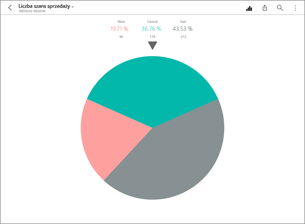
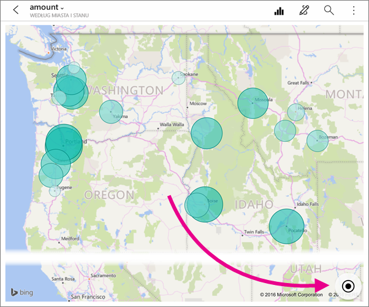
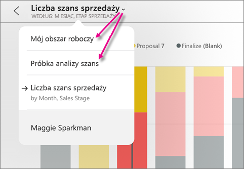
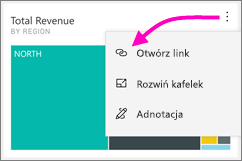
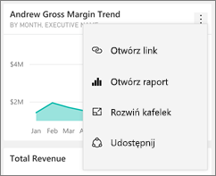
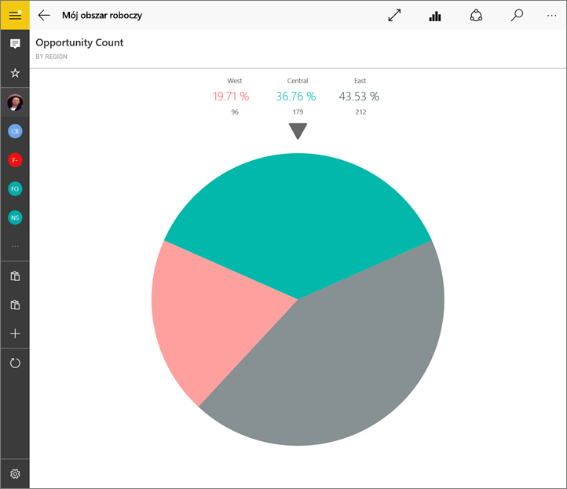
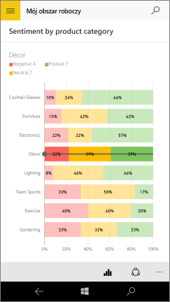

# Eksploruj kafelki w aplikacjach mobilnych usługi Power BI
Dotyczy:

|  |  |  |  |  |
|:--- |:--- |:--- |:--- |:--- |
| Telefony iPhone |Urządzenia iPad |Telefony z systemem Android |Tablety z systemem Android |Urządzenia z systemem Windows 10 |

Kafelki to żywe migawki Twoich danych przypięte do pulpitu nawigacyjnego. Ich wartości zmieniają się wraz ze zmianą danych. **Możesz [dodać kafelki do pulpitu nawigacyjnego w usłudze Power BI](../end-user-tiles.md).** 

Następnie w aplikacjach mobilnych usługi Power BI otwórz kafelki w trybie ostrości i wejdź z nimi w interakcję. Możesz otworzyć kafelki z wszelkiego rodzaju elementami wizualnymi, łącznie z kafelkami opartymi na usłudze Bing i języku R.

## Kafelki w aplikacjach systemu iOS

1. Otwórz [pulpit nawigacyjny w aplikacji mobilnej dla systemu iOS](mobile-apps-view-dashboard.md).
2. Naciśnij kafelek. Zostanie on otwarty w trybie ostrości, gdzie jest łatwiej wyświetlać i eksplorować dane kafelka. W trybie ostrości możesz wykonywać następujące czynności:
   
   Na wykresie liniowym, słupkowym lub kolumnowym naciśnij, aby wyświetlić wartości określonych części wizualizacji.
   
    
   
   *Na przykład na tym wykresie liniowym wybrane wartości dotyczą **Sprzedaży w tym roku** i **Sprzedaży w poprzednim roku** w **sierpniu**.*  
   
   Na wykresie kołowym naciśnij wycinek koła, aby wyświetlić wartość wycinka u góry koła.  
   
   
3. Na mapie naciśnij ikonę **Wyśrodkuj mapę** , aby wyśrodkować mapę dla swojej bieżącej lokalizacji.
   
     
4. Naciśnij ikonę udziału , aby [dodać adnotacje i udostępnić kafelek](mobile-annotate-and-share-a-tile-from-the-mobile-apps.md) innym.
5. [Dodaj alert do kafelka](mobile-set-data-alerts-in-the-mobile-apps.md). Jeśli wartości będą powyżej lub poniżej wartości docelowych, usługa Power BI Cię powiadomi.
6. Czasami twórcy pulpitu nawigacyjnego dodawali link do kafelka. Jeśli tak, ma on ikonę linku , gdy jest w trybie ostrości:
   
    
   
    Linki mogą prowadzić do innych pulpitów nawigacyjnych usługi Power BI lub do zewnętrznego adresu URL. Możesz [nacisnąć link](../../service-dashboard-edit-tile.md#hyperlink), aby otworzyć go w aplikacji usługi Power BI. Jeśli jest to witryna zewnętrzna, usługa Power BI wyświetli prośbę o zezwolenie.
   
    
   
    Po otwarciu linku w aplikacji usługi Power BI możesz zamiast tego skopiować link i otworzyć go w oknie przeglądarki.
7. [Otwórz raport](mobile-reports-in-the-mobile-apps.md) , na którym jest oparty kafelek.
8. Aby wyjść z trybu ostrości, naciśnij nazwę kafelka, a następnie naciśnij nazwę pulpitu nawigacyjnego lub pozycję **Mój obszar roboczy**.
   
    

## Kafelki w aplikacji mobilnej dla telefonów i tabletów z systemem Android
1. Otwórz [pulpit nawigacyjny w aplikacji mobilnej usługi Power BI](mobile-apps-view-dashboard.md).
2. Naciśnij kafelek, aby otworzyć go w trybie ostrości, gdzie jest łatwiej wyświetlać i eksplorować dane kafelka.
   
   
   
    W trybie ostrości możesz wykonywać następujące czynności:
   
   * Naciśnij wykres, aby przenieść słupek w linii, słupku, kolumnie lub wykresie bąbelkowym, aby wyświetlić wartości dla określonego punktu w wizualizacji.  
   * Naciśnij ikonę migawki udziału , aby [dodać adnotacje i udostępnić kafelek](mobile-annotate-and-share-a-tile-from-the-mobile-apps.md) innym.
   * Naciśnij ikonę Otwórz raport , aby [wyświetlić raport](mobile-reports-in-the-mobile-apps.md) w aplikacji mobilnej.
3. Czasami twórcy pulpitu nawigacyjnego dodawali link do kafelka. Jeśli tak, po naciśnięciu przycisku pionowego wielokropka (**...**) zostanie wyświetlona pozycja **Otwórz link** :
   
    
   
    Linki mogą prowadzić do innych pulpitów nawigacyjnych usługi Power BI lub do zewnętrznego adresu URL. Możesz [nacisnąć link](../../service-dashboard-edit-tile.md#hyperlink), aby otworzyć go w aplikacji usługi Power BI. Jeśli jest to witryna zewnętrzna, usługa Power BI wyświetli prośbę o zezwolenie.
   
    
   
    Po otwarciu linku w aplikacji usługi Power BI możesz zamiast tego skopiować link i otworzyć go w oknie przeglądarki.
4. Naciśnij strzałkę w lewym górnym rogu, aby zamknąć kafelek i wrócić do pulpitu nawigacyjnego.

## Kafelki w aplikacji mobilnej systemu Windows 10
1. Otwórz [pulpit nawigacyjny w aplikacji mobilnej usługi Power BI](mobile-apps-view-dashboard.md) dla systemu Windows 10.
2. Naciśnij wielokropek pionowy na kafelku. W tym miejscu można wykonać następujące czynności: 
   
    
   
    [Udostępnić migawki kafelka](mobile-windows-10-phone-app-get-started.md).
   
    Nacisnąć pozycję **Otwórz raport** , aby [wyświetlić raport źródłowy](mobile-reports-in-the-mobile-apps.md).
   
    [Otwórz link](../../service-dashboard-edit-tile.md#hyperlink), jeśli ma on link. Linki mogą prowadzić do pulpitów nawigacyjnych usługi Power BI lub do zewnętrznego adresu URL.
3. Wybierz pozycję **Rozwiń kafelek** . Zostanie on otwarty w trybie ostrości, gdzie jest łatwiej wyświetlać i eksplorować dane kafelka. W tym trybie możesz wykonywać następujące czynności:
   
   Obrócić wykres kołowy, aby wyświetlić wartości wycinka u góry koła.  
   
   
   
   Naciśnij wykres, aby przenieść słupek w linii, słupku, kolumnie lub wykresie bąbelkowym, aby wyświetlić wartości dla określonego punktu w wizualizacji.  
   
   
   
   *Na tym wykresie słupkowym wartości paska **Decor** są wyświetlane w górnej części wykresu.*
   
   Naciśnij ikonę **Pełny ekran** , aby otworzyć kafelek w trybie pełnoekranowym, bez pasków nawigacji i menu.
   
   > [!NOTE]
   > Możesz również [wyświetlać pulpity nawigacyjne i raporty w trybie pełnoekranowym](mobile-windows-10-app-presentation-mode.md) w aplikacji mobilnej usługi Power BI dla systemu Windows 10.
   > 
   > 
   
   Na mapie naciśnij ikonę **Wyśrodkuj mapę** , aby wyśrodkować mapę dla swojej bieżącej lokalizacji.
   
   
   
   Naciśnij ikonę udostępniania migawki , aby [udostępnić kafelek](mobile-windows-10-phone-app-get-started.md) innym.   
   
   Naciśnij ikonę Otwórz raport , aby [wyświetlić raport](mobile-reports-in-the-mobile-apps.md), na którym jest oparty kafelek. 
4. Naciśnij strzałkę Wstecz lub przycisk Wstecz, aby zamknąć kafelek i wrócić do pulpitu nawigacyjnego.

## Następne kroki
* [Co to jest usługa Power BI?](../../power-bi-overview.md)
* Masz pytania? [Zadaj pytanie społeczności usługi Power BI](http://community.powerbi.com/)

