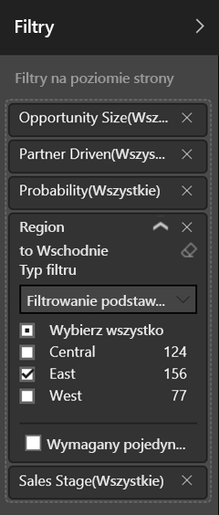

# Wyświetlanie raportów w trybie prezentacji na urządzeniu Surface Hub i urządzeniach z systemem Windows 10 — Power BI
Możesz wyświetlać raporty w trybie prezentacji na urządzeniu Surface Hub oraz wyświetlać pulpity nawigacyjne, raporty i kafelki w trybie pełnoekranowym na urządzeniach z systemem Windows 10. 

Tryb prezentacji i tryb pełnoekranowy przydają się do wyświetlania zawartości usługi Power BI podczas spotkań lub konferencji, na specjalnym projektorze w biurze lub po prostu wtedy, gdy chcesz maksymalnie wykorzystać obszar na małym ekranie. 

W trybie pełnoekranowym w aplikacji mobilnej Power BI wszystkie „elementy wykończeniowe”, takie jak pasek nawigacyjny i pasek menu, zostają usunięte, oprócz kart stron i okienka filtrowania w raportach.

Po wyświetleniu raportu w trybie prezentacji na urządzeniu Surface Hub można rysować na stronach różnokolorowym tuszem i nawigować między stronami raportu.

Można również [wyświetlać pulpity nawigacyjne i raporty w trybie pełnoekranowym z poziomu usługi Power BI](../../service-fullscreen-mode.md) w wersji internetowej.

> [!NOTE]
> Tryb prezentacji różni się od [trybu koncentracji uwagi dla kafelków](mobile-tiles-in-the-mobile-apps.md).
> 
> 

## Wyświetlanie pulpitów nawigacyjnych, raportów i kafelków w trybie pełnoekranowym
1. W aplikacji mobilnej Power BI na pulpicie nawigacyjnym, raporcie lub kafelku naciśnij ikonę **pełnego ekranu**, aby przejść do trybu pełnoekranowego.
2. W trybie prezentacji możesz filtrować raport lub wyszukać inne pulpity nawigacyjne i raporty.
   
    Rozwiń okienko Filtry, aby skonfigurować lub usunąć filtry.
   
    
   
     Naciśnij ikonę wyszukiwania  , aby wyszukać inne pulpity nawigacyjne.
   
    
3. Aby zamknąć tryb pełnoekranowy, naciśnij ikonę dwóch strzałek skierowanych do wewnątrz  na pasku narzędzi lub przesuń palcem z góry na dół i naciśnij ikonę dwóch strzałek skierowanych do wewnątrz .

## Włączanie trybu prezentacji na urządzeniu Surface Hub
Na urządzeniu Surface Hub tryb prezentacji jest domyślnie włączony, ale jeśli został wyłączony, można go włączyć ponownie.

1. Naciśnij ikonę Ustawienia  w dolnej części paska nawigacyjnego po lewej stronie.
2. Naciśnij pozycję **Opcje**, a następnie przesuń przełącznik **Włącz tryb prezentacji urządzenia Microsoft Surface Hub** do pozycji **Włączone**.
   
    

## Wyświetlanie i rysowanie w raportach na urządzeniu Surface Hub
1. W raporcie naciśnij ikonę **pełnego ekranu**, aby przejść do trybu prezentacji na urządzeniu Surface Hub.
   
    Zostanie wyświetlony zwijany pasek akcji po obu stronach ekranu. 
   
   * Aby go otworzyć, przesuń palcem do środka lub naciśnij uchwyt.
   * Aby go zamknąć, przesuń palcem na zewnątrz lub naciśnij ikonę X u góry.
2. Na urządzeniach, które obsługują pisanie piórem, można natychmiast rozpocząć pisanie. 
3. Aby zmienić kolor tuszu, naciśnij ikonę pióra na prawym lub lewym pasku akcji.
   
    
4. Naciśnij ikonę gumki lub strzałkę cofania, aby usunąć część lub całość pisma odręcznego.
5. Naciśnij strzałkę kolistą, aby odświeżyć zawartość raportu.
6. Naciśnij strzałki skierowane w bok, aby przejść do innych stron w raporcie.
   
    
7. Aby zamknąć tryb pełnoekranowy, przesuń palcem w dół od góry strony i naciśnij ikonę dwóch strzałek skierowanych do wewnątrz .

## Następne kroki
* [Wyświetlanie pulpitów nawigacyjnych i raportów w trybie pełnoekranowym w usłudze Power BI](../../service-fullscreen-mode.md)
* Masz pytania? [Zadaj pytanie społeczności usługi Power BI](http://community.powerbi.com/)

