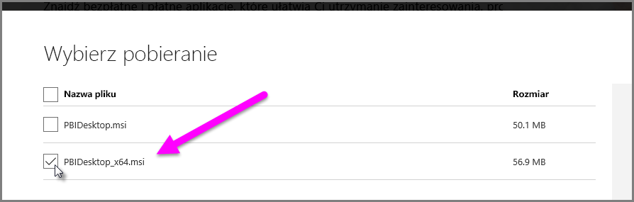

# Rozwiązywanie problemów z importowaniem plików programu Access i plików XLS w programie Power BI Desktop
W programie **Power BI Desktop**, zarówno **bazy danych programu Access**, jak i wczesne wersje **skoroszytów programu Excel** (pliki XLS programu Excel 97–2003), używają *aparatu bazy danych programu Access*. Istnieją trzy typowe sytuacje, które mogą uniemożliwić prawidłowe działanie aparatu bazy danych programu Access:

## Sytuacja 1. Aparat bazy danych programu Access nie został zainstalowany
Jeśli komunikat o błędzie programu Power BI Desktop wskazuje, że aparat bazy danych programu Access nie został zainstalowany, należy zainstalować taką wersję aparatu bazy danych programu Access (32-bitową lub 64-bitową), która jest zgodna z zainstalowaną wersją programu Power BI Desktop. Aparat bazy danych programu Access można zainstalować ze [strony plików do pobrania](http://www.microsoft.com/download/details.aspx?id=13255).

>[!NOTE]
>Jeśli zainstalowana wersja bitowa aparatu bazy danych programu Access różni się od wersji bitowej instalacji pakietu Microsoft Office, aplikacje pakietu Office nie będą mogły używać tego aparatu bazy danych programu Access.

## Sytuacja 2. Wersja bitowa aparatu bazy danych programu Access (32-bitowa lub 64-bitowa) różni się od wersji bitowej programu Power BI Desktop
Taka sytuacja często ma miejsce, gdy zainstalowana wersja pakietu Microsoft Office jest 32-bitowa, a zainstalowana wersja programu Power BI Desktop jest 64-bitowa. Może również wystąpić sytuacja odwrotna — niezgodność wersji bitowych dotyczy każdego z tych przypadków (jeśli korzystasz z subskrypcji usługi Office 365, zobacz **sytuację 3**, aby zapoznać się z innym problemem i rozwiązaniem). Każde z poniższych rozwiązań pozwala naprawić błąd dotyczący niezgodności wersji bitowych:

1. Zmień wersję programu Power BI Desktop, aby była zgodna z bitową wersją instalacji pakietu Microsoft Office. Aby zmienić bitową wersję programu Power BI Desktop, odinstaluj program Power BI Desktop, a następnie zainstaluj taką wersję tego programu, która jest zgodna z instalacją pakietu Office. Aby wybrać wersję programu Power BI Desktop, na stronie pobierania wybierz pozycję **Zaawansowane opcje pobierania**.
   
   
   
   Na wyświetlonej stronie pobierania wybierz język, a następnie wybierz przycisk **Pobierz**. Na wyświetlonym ekranie zaznacz pole wyboru obok pozycji PBIDesktop.msi, aby pobrać wersję 32-bitową, lub obok pozycji PBIDesktop_x64.msi, aby pobrać wersję 64-bitową. Na poniższym ekranie wybrano wersję 64-bitową.
   
   
   
   >[!NOTE]
   >Podczas tworzenia bardzo dużych modeli danych w 32-bitowej wersji programu Power BI Desktop mogą wystąpić problemy braku pamięci.
2. Zmień wersję pakietu Microsoft Office, aby była zgodna z bitową wersją instalacji programu Power BI Desktop. Aby zmienić bitową wersję pakietu Microsoft Office, odinstaluj pakiet Office, a następnie zainstaluj taką wersję pakietu, która jest zgodna z instalacją programu Power BI Desktop.
3. Jeśli błąd wystąpił podczas próby otwarcia pliku XLS (skoroszyt programu Excel 97–2003), możesz uniknąć używania aparatu bazy danych programu Access, otwierając plik XLS w programie Excel i zapisując go jako plik XLSX.
4. Jeśli poprzednie trzy rozwiązania nie są możliwe do wykonania, można zainstalować obie wersje aparatu bazy danych programu Access, ale *nie* jest to zalecane rozwiązanie. Zainstalowanie obu wersji rozwiąże ten problem dla dodatku Power Query dla programu Excel i programu Power BI Desktop, ale spowoduje błędy i problemy dla każdej aplikacji, która automatycznie (domyślnie) korzysta z bitowej wersji aparatu bazy danych programu Access, która została zainstalowana jako pierwsza. Aby zainstalować obydwie wersje bitowe aparatu bazy danych programu Access, [pobierz](http://www.microsoft.com/download/details.aspx?id=13255) obie wersje, a następnie uruchom każdą z nich przy użyciu przełącznika */passive*. Na przykład:
   
       c:\users\joe\downloads\AccessDatabaseEngine.exe /passive
   
       c:\users\joe\downloads\AccessDatabaseEngine_x64.exe /passive

## Sytuacja 3. Problemy z używaniem plików programu Access lub plików XLS z subskrypcją usługi Office 365
Jeśli używasz subskrypcji usługi Office 365, niezależnie od tego, czy jet to pakiet **Office 2013**, czy **Office 2016**, dostawca aparatu bazy danych programu Access jest zarejestrowany w wirtualnej lokalizacji rejestru, która jest dostępna *tylko* dla procesów pakietu Office. W związku z tym aparat programu Mashup (odpowiedzialny za działanie programów Excel i Power BI Desktop niebędących częścią usługi Office 365), który nie jest procesem pakietu Office, nie może używać dostawcy aparatu bazy danych programu Access.

Aby rozwiązać ten problem, możesz [pobrać i zainstalować pakiet redystrybucyjny aparatu bazy danych programu Access](http://www.microsoft.com/download/details.aspx?id=13255), który jest zgodny z bitową wersją instalacji programu Power BI Desktop (zobacz wcześniejsze sekcje, aby uzyskać więcej informacji o wersjach bitowych).

## Innych sytuacje powodujące problemy z importowaniem
Dokładamy wszelkich starań, aby zapewnić rozwiązania możliwie jak największej liczby problemów, które występują w związku z plikami programu Access i plikami XLS. W przypadku napotkania problemu, który nie został opisany w tym artykule, prosimy o przesłanie pytania do [pomocy technicznej usługi Power BI](https://powerbi.microsoft.com/support/). Regularnie badamy problemy, które mogą dotyczyć wielu klientów, i uwzględniamy je w naszych artykułach.

