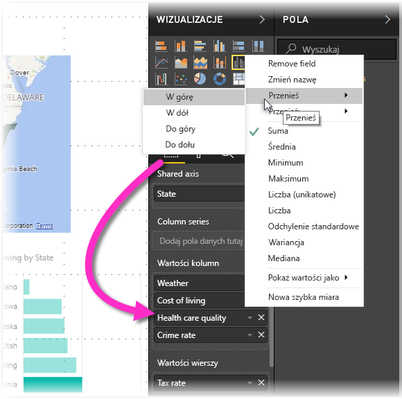

# Ułatwienia dostępu w raportach programu Power BI Desktop
Usługa Power BI zawiera funkcje, które umożliwiają osobom niepełnosprawnym łatwiejsze korzystanie z raportów usługi Power BI. Te funkcje obejmują możliwość korzystania z raportu za pomocą klawiatury lub czytnika ekranu, używania klawisza TAB do przenoszenia fokusu na różne obiekty na stronie oraz celowe używanie znaczników w wizualizacjach.

> [!NOTE]
> Te funkcje ułatwień dostępu są dostępne w programie **Power BI Desktop** w wersji z czerwca 2017 r. i nowszych. W następnych wersjach planowane jest wprowadzenie kolejnych funkcji ułatwień dostępu.
> 
> 

## Korzystanie z raportów programu Power BI Desktop za pomocą klawiatury lub czytnika ekranu
W wersji programu **Power BI Desktop** z września 2017 r. i nowszych możesz nacisnąć klawisz **?**, aby wyświetlić okno z opisem skrótów klawiaturowych ułatwień dostępu dostępnych w programie **Power BI Desktop**.

Dzięki udoskonalonym ułatwieniom dostępu można korzystać z raportu usługi Power BI za pomocą klawiatury lub czytnika zawartości ekranu, używając następujących technik:

Gdy jest wyświetlany raport, tryb skanowania powinien być wyłączony.

Możesz przełączać fokus między kartami stron raportu lub obiektami na dowolnej stronie raportu, używając kombinacji klawiszy **Ctrl+F6**.

* Gdy fokus jest ustawiony na *kartach stron raportu*, użyj klawisza *Tab* lub klawiszy *strzałek*, aby przenieść fokus z jednej strony raportu do kolejnej. Tytuł strony raportu i to, czy jest aktualnie zaznaczona, jest odczytywane przez czytnik ekranu. Aby załadować stronę raportu, na której umieszczono fokus, użyj klawisza *Enter* lub *Spacja*.
* Gdy fokus jest ustawiony na załadowaną *stronę raportu*, użyj klawisza *Tab*, aby przenieść fokus na kolejne obiekty na stronie, w tym pola tekstowe, obrazy, kształty lub wykresy. Czytnik zawartości ekranu odczytuje typ obiektu, tytuł obiektu (jeśli obiekt ma tytuł) oraz opis obiektu (jeśli został on podany przez autora raportu). 

Podczas nawigowania między wizualizacjami, jeśli chcesz wejść w głębszą interakcję, możesz nacisnąć klawisze **Alt+Shift+F10**, aby przenieść fokus na nagłówek wizualizacji, który zawiera różne opcje, w tym sortowanie, eksportowanie danych, na których oparto wykres, i tryb koncentracji uwagi. 

Naciskając klawisze **Alt+Shift+F11**, możesz wyświetlić dostępną wersję okna *Pokaż dane*. Umożliwi to eksplorowanie danych używanych w wizualizacji w formie tabeli HTML przy użyciu tych samych skrótów klawiaturowych, których normalnie używasz w swoim czytniku zawartości ekranu. 

> [!NOTE]
> Funkcja Pokaż dane jest dostępna dla czytnika zawartości ekranu jedynie za pośrednictwem tego skrótu klawiaturowego. Jeśli otworzysz okno Pokaż dane za pomocą opcji w nagłówku wizualizacji, nie będzie ono dostępne dla czytnika zawartości ekranu. Podczas korzystania z funkcją Pokaż dane włącz tryb skanowania, aby móc korzystać ze wszystkich klawiszy dostępu czytnika zawartości ekranu.

Począwszy od wersji programu **Power BI Desktop** z lipca 2018 r. fragmentatory mają również wbudowane funkcje ułatwień dostępu. Aby po wybraniu fragmentatora dostosować jego wartość, użyj klawiszy CTRL+strzałka w prawo w celu przechodzenia przez różne kontrolki w obrębie fragmentatora. Na przykład początkowe naciśnięcie klawiszy CTRL+strzałka w prawo powoduje ustawienie fokusu na gumce, a naciśnięcie klawisza SPACJA jest odpowiednikiem kliknięcia przycisku gumki, co powoduje usunięcie wszystkich wartości we fragmentatorze. 

Aby poruszać się między kontrolkami we fragmentatorze, można naciskać klawisz TAB. Naciśnięcie klawisza TAB po ustawieniu fokusu na gumce powoduje przejście do przycisku listy rozwijanej; kolejne naciśnięcie klawisza TAB powoduje przejście do pierwszej wartości fragmentatora (jeśli fragmentator, taki jak zakres, ma wiele wartości). 

Te dodatki ułatwień dostępu zostały utworzone, aby umożliwić użytkownikom pełne korzystanie z raportów usługi Power BI przy użyciu klawiatury i czytnika zawartości ekranu.

## Wskazówki dotyczące tworzenia raportów z ułatwieniami dostępu
Poniższe wskazówki mogą pomóc tworzyć bardziej dostępne raporty programu **Power BI Desktop**.

### Ogólne wskazówki dotyczące raportów z ułatwieniami dostępu

* W przypadku wizualizacji **liniowych**, **warstwowych**, **kombi**, **punktowych** i **bąbelkowych** włącz znaczniki i użyj innego *kształtu znacznika* dla każdego wiersza.
  
  * Aby włączyć *znaczniki*, wybierz sekcję **Formatowanie** w okienku **Wizualizacje**, rozwiń sekcję **Kształty**, a następnie przewiń w dół, aż znajdziesz przełącznik **Znaczniki**. Ustaw go w pozycji *Włączone*.
  * Następnie wybierz nazwy poszczególnych wierszy (lub obszarów, jeśli korzystasz z wykresu **warstwowego**) z pola listy rozwijanej w sekcji **Kształty**. Poniżej listy rozwijanej możesz dostosować wiele aspektów znacznika zastosowanego do wybranego wiersza, w tym jego kształt, kolor i rozmiar.
  
  
  
  * Używanie innego *kształtu znacznika* dla każdego wiersza ułatwia użytkownikowi raportu odróżnienie wierszy (lub obszarów).
* W nawiązaniu do poprzedniego punktu — nie należy używać koloru do przekazywania informacji. Oprócz używania kształtów na wykresach liniowych i punktowych, nie polegaj na formatowaniu warunkowym w celu zapewnienia szczegółowych danych w tabelach i macierzach. 
* Świadomie wybierz kolejność sortowania dla każdej wizualizacji w raporcie. Gdy użytkownicy czytników zawartości ekranu nawigują po danych, na których oparto wykres, będzie używana ta sama kolejność sortowania co w wizualizacji.
* Wybierz z galerii motywów *motyw*, który ma duży kontrast i jest przyjazny daltonistom, i zaimportuj go, używając funkcji [**Motywy** w wersji zapoznawczej](desktop-report-themes.md).
* Dla każdego obiektu w raporcie wprowadź *tekst alternatywny*. Daje to gwarancję. że użytkownicy raportu zrozumieją, co chcesz przekazać za pomocą wizualizacji, nawet jeśli nie widzą wizualizacji, obrazów, kształtów lub pól tekstowych. Możesz wprowadzić *tekst alternatywny* dla dowolnego obiektu w raporcie programu **Power BI Desktop**, zaznaczając ten obiekt (na przykład wizualizację, kształt itd.), a następnie w okienku **Wizualizacje** wybierając sekcję **Formatowanie**, rozwijając listę **Ogólne**, przewijając w dół i wypełniając pole tekstowe **Tekst alternatywny**.
  
  
* Upewnij się, że w raportach zastosowano odpowiedni kontrast pomiędzy kolorem tekstu a kolorem tła. Dostępnych jest kilka narzędzi, takich jak [Colour Contrast Analyser](https://developer.paciellogroup.com/resources/contrastanalyser/), za pomocą których możesz sprawdzić kolory raportu. 
* Użyj rozmiarów tekstu i czcionek, które można łatwo odczytać. Mały tekst lub czcionki, które trudno odczytać, nie ułatwiają dostępu.
* Do wszystkich wizualizacji dołącz tytuł, etykiety osi i etykiety danych.
* Podaj znaczące tytuły dla wszystkich stron raportu.
* W miarę możliwości unikaj dekoracyjnych kształtów i obrazów w raporcie, ponieważ są one uwzględniane w kolejności tabulacji raportu. Jeśli musisz umieścić dekoracyjne obiekty w raporcie, zaktualizuj tekst alternatywny obiektu, aby poinformować użytkowników czytników zawartości ekranu, że służy on wyłącznie do dekoracji.

### Rozmieszczanie elementów w zasobnikach Pole
Począwszy od wersji programu **Power BI Desktop** wydanej w październiku 2018 r., źródło **Pola** umożliwia nawigację za pomocą klawiatury oraz interakcję z czytnikami zawartości ekranu. 

Aby usprawnić proces tworzenia raportów za pomocą czytników zawartości ekranu, dostępne jest menu kontekstowe, które pozwala na przenoszenie pól w źródle w górę i w dół na liście **Pola** bądź przenoszenie pola do innych studni, np. **Legenda** bądź **Wartość** itp.

## Obsługa dużego kontrastu dla raportów

W przypadku korzystania z trybów dużego kontrastu w systemie Windows wybrane ustawienia i palety są również stosowane do raportów w programie **Power BI Desktop**. 

Program **Power BI Desktop** automatycznie wykrywa kompozycję o dużym kontraście, która jest używana w systemie Windows, i stosuje te ustawienia do raportów. Te kolory o dużym kontraście będą używane w raporcie po opublikowaniu w usłudze Power BI lub w innym miejscu.

Usługa Power BI próbuje również wykryć ustawienia dużego kontrastu wybrane dla systemu Windows, ale skuteczność i dokładność tego wykrywania zależy od przeglądarki używanej przez usługę Power BI. Jeśli chcesz ręcznie ustawić motyw w usłudze Power BI, możesz wybrać pozycje **Widok > Kolory o wysokim kontraście**, a następnie wybierz motyw, który chcesz zastosować do raportu.

Podczas pracy w programie **Power BI Desktop** zwróć uwagę, że niektóre obszary, takie jak pola **Wizualizacje** i **Pola**, nie odzwierciedlają wyboru schematów kolorów o dużym kontraście systemu Windows.

## Istotne zagadnienia i ograniczenia
Istnieje kilka znanych problemów i ograniczeń dotyczących funkcji ułatwień dostępu. Opisano je na poniższej liście:

* W przypadku używania czytników zawartości ekranu z programem **Power BI Desktop**, aby uzyskać najlepsze działanie, otwórz swój czytnik zawartości ekranu przed otworzeniem jakichkolwiek plików w programie Power BI Desktop.
* Jeśli używasz programu Narrator, istnieją pewne ograniczenia dotyczące nawigowania po oknie Pokaż dane jako tabeli HTML.

## Skróty klawiaturowe
### Często używane skróty
| Działanie           | Klawisze do naciśnięcia                |
| :------------------- | :------------------- |
| Przenieś fokus między sekcjami  | Ctrl + F6 |
| Przenieś fokus dalej w sekcji | Tab         |
| Przenieś fokus wstecz w sekcji | Shift + Tab |

### W wizualizacji
| Działanie           | Klawisze do naciśnięcia                |
| :------------------- | :------------------- |
| Przenieś fokus na menu wizualizacji | Alt + Shift + F10 |
| Pokaż dane | Alt + Shift + F11  |

### Nawigacja okienek
| Działanie           | Klawisze do naciśnięcia                |
| :------------------- | :------------------- |
| Otwórz menu kontekstowe | <ul><li>Klawiatura systemu Windows: klawisz kontekstowy systemu Windows + F10.  Klawisz kontekstowy systemu Windows znajduje się między lewym klawiszem Alt i klawiszem strzałki w lewo</li><li>Pozostałe klawiatury: Shift + F10</li></ul> |

### Fragmentator
| Działanie           | Klawisze do naciśnięcia                |
| :------------------- | :------------------- |
| Interakcja z fragmentatorem | Ctrl + Strzałka w prawo |

### Okienko zaznaczenia
| Działanie           | Klawisze do naciśnięcia                |
| :------------------- | :------------------- |
| Uaktywnij okienko wyboru | F6 |
| Przenieś obiekt w górę w kolejności warstw | Ctrl + Shift + F |
| Przenieś obiekt w dół w kolejności warstw | Ctrl + Shift + B |
| Ukryj/pokaż (przełącz) obiekt | Ctrl + Shift + S |

### Edytor języka DAX
| Działanie           | Klawisze do naciśnięcia                |
| :------------------- | :------------------- |
| Przenieś wiersz w górę/dół | Alt + Strzałka w górę/Strzałka w dół |
| Kopiuj wiersz w górę/dół | Shift + Alt + Strzałka w górę/Strzałka w dół |
| Wstaw wiersz poniżej | Ctrl + Enter |
| Wstaw wiersz powyżej | Ctrl + Shift + Enter |
| Przejdź do pasującego nawiasu | Ctrl + Shift + \ |
| Zwiększ/zmniejsz wcięcie wiersza | Ctrl + ] / [ |
| Wstaw kursor | Alt + kliknięcie |
| Wybierz bieżący wiersz | Ctrl + I |
| Zaznacz wszystkie wystąpienia bieżącego wyboru | Ctrl + Shift + L |
| Zaznacz wszystkie wystąpienia bieżącego słowa | Ctrl + F2 |

## Następne kroki
* [Używanie motywów raportów w programie Power BI Desktop (wersja zapoznawcza)](desktop-report-themes.md)

