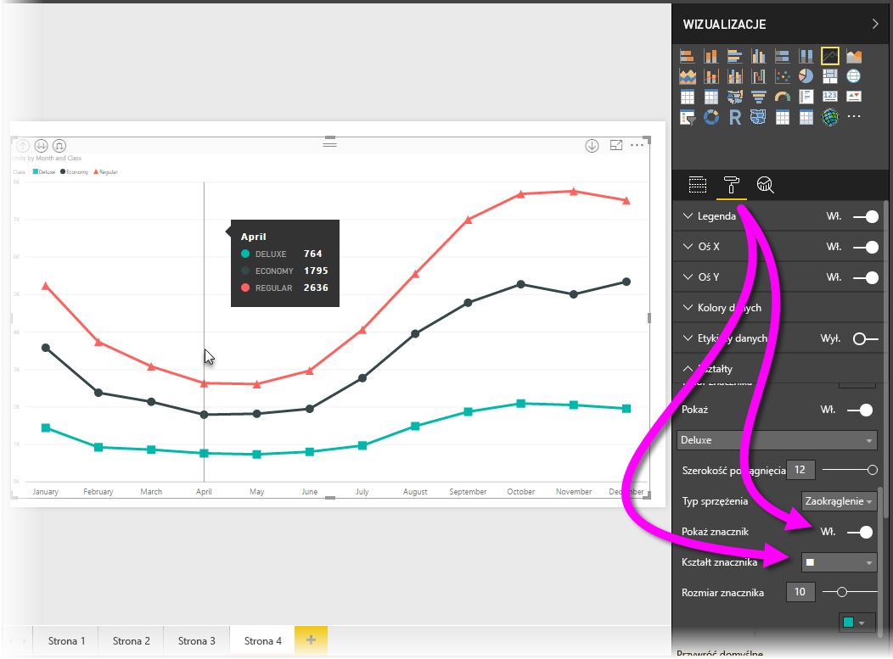
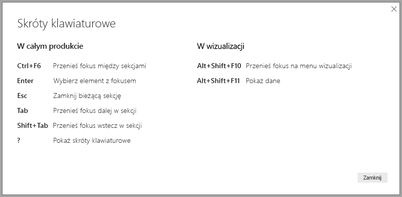
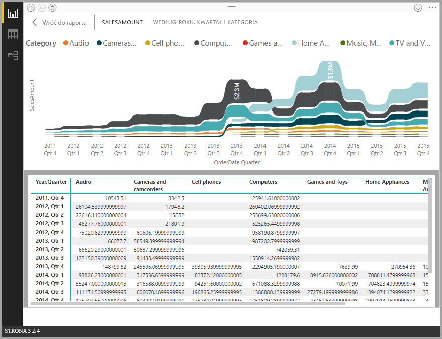
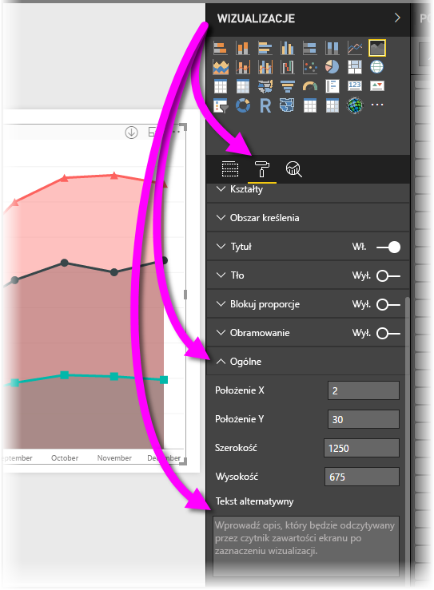

# Ułatwienia dostępu w raportach programu Power BI Desktop
Program **Power BI Desktop** zawiera funkcje, które umożliwiają osobom niepełnosprawnym łatwiejsze korzystanie z raportów programu **Power BI Desktop**. Te funkcje obejmują możliwość korzystania z raportu za pomocą klawiatury lub czytnika ekranu, używania klawisza TAB do przenoszenia fokusu na różne obiekty na stronie oraz celowe używanie znaczników w wizualizacjach.

> [!NOTE]
> Te funkcje ułatwień dostępu są dostępne w programie **Power BI Desktop** w wersji z czerwca 2017 r. i nowszych. W następnych wersjach planowane jest wprowadzenie kolejnych funkcji ułatwień dostępu.
> 
> 

## Korzystanie z raportów programu Power BI Desktop za pomocą klawiatury lub czytnika ekranu
W wersji programu **Power BI Desktop** z września 2017 r. i nowszych możesz nacisnąć klawisz **?**, aby wyświetlić okno z opisem skrótów klawiaturowych ułatwień dostępu dostępnych w programie **Power BI Desktop**.

Dzięki udoskonalonym ułatwieniom dostępu można korzystać z raportu programu **Power BI Desktop** za pomocą klawiatury lub czytnika ekranu, używając następujących technik:

Możesz przełączać fokus między kartami stron raportu lub obiektami na dowolnej stronie raportu, używając kombinacji klawiszy **Ctrl+F6**.

* Gdy fokus jest ustawiony na *kartach stron raportu*, użyj klawisza *Tab* lub klawiszy *strzałek*, aby przenieść fokus z jednej strony raportu do kolejnej. Tytuł strony raportu i to, czy jest aktualnie zaznaczona, jest odczytywane przez czytnik ekranu. Aby załadować stronę raportu, na której umieszczono fokus, użyj klawisza *Enter* lub *Spacja*.
* Gdy fokus jest ustawiony na załadowaną *stronę raportu*, użyj klawisza *Tab*, aby przenieść fokus na kolejne obiekty na stronie, w tym pola tekstowe, obrazy, kształty lub wykresy. Czytnik ekranu odczytuje typ obiektu i opis tego obiektu wprowadzony przez jego autora. 

Możesz nacisnąć klawisze**Alt+Shift+F10**, aby przenieść fokus na menu wizualizacji.

Możesz nacisnąć klawisze **Alt+Shift+F11**, aby zaprezentować dostępną wersję okna *Pokaż dane*.

Te dodatki ułatwień dostępu zostały utworzone, aby umożliwić użytkownikom pełne korzystanie z raportów programu **Power BI Desktop** przy użyciu klawiatury i czytnika ekranu.

## Wskazówki dotyczące tworzenia raportów z ułatwieniami dostępu
Poniższe wskazówki mogą pomóc tworzyć bardziej dostępne raporty programu **Power BI Desktop**.

* W przypadku wizualizacji **liniowych**, **warstwowych**, **kombi**, **punktowych** i **bąbelkowych** włącz znaczniki i użyj innego *kształtu znacznika* dla każdego wiersza.
  
  * Aby włączyć *znaczniki*, wybierz sekcję **Formatowanie** w okienku **Wizualizacje**, rozwiń sekcję **Kształty**, a następnie przewiń w dół, aż znajdziesz przełącznik **Znaczniki**. Ustaw go w pozycji *Włączone*.
  * Następnie wybierz nazwy poszczególnych wierszy (lub obszarów, jeśli korzystasz z wykresu **warstwowego**) z pola listy rozwijanej w sekcji **Kształty**. Poniżej listy rozwijanej możesz dostosować wiele aspektów znacznika zastosowanego do wybranego wiersza, w tym jego kształt, kolor i rozmiar.
  
  
  
  * Używanie innego *kształtu znacznika* dla każdego wiersza ułatwia użytkownikowi raportu odróżnienie wierszy (lub obszarów).
* W nawiązaniu do poprzedniego punktu — nie należy używać koloru do przekazywania informacji. Pomocne jest używanie kształtów w wierszach (znaczników, jak opisano w poprzednich punktach).
* Wybierz z galerii motywów *motyw*, który ma duży kontrast i jest przyjazny daltonistom, i zaimportuj go, używając funkcji [**Motywy** w wersji zapoznawczej](desktop-report-themes.md).
* Dla każdego obiektu w raporcie wprowadź *tekst alternatywny*. Daje to gwarancję. że użytkownicy raportu zrozumieją, co chcesz przekazać za pomocą wizualizacji, nawet jeśli nie widzą wizualizacji, obrazów, kształtów lub pól tekstowych. Możesz wprowadzić *tekst alternatywny* dla dowolnego obiektu w raporcie programu **Power BI Desktop**, zaznaczając ten obiekt (na przykład wizualizację, kształt itd.), a następnie w okienku **Wizualizacje** wybierając sekcję **Formatowanie**, rozwijając listę **Ogólne**, przewijając w dół i wypełniając pole tekstowe **Tekst alternatywny**.
  
  
* Upewnij się, że w raportach zastosowano odpowiedni kontrast pomiędzy kolorem tekstu a kolorem tła.
* Użyj rozmiarów tekstu i czcionek, które można łatwo odczytać. Mały tekst lub czcionki, które trudno odczytać, nie ułatwiają dostępu.
* Do wszystkich wizualizacji dołącz tytuł, etykiety osi i etykiety danych.

## Obsługa dużego kontrastu dla raportów

W przypadku korzystania z trybów dużego kontrastu w systemie Windows wybrane ustawienia i palety są również stosowane do raportów w programie **Power BI Desktop**. 

Program **Power BI Desktop** automatycznie wykrywa kompozycję o dużym kontraście, która jest używana w systemie Windows, i stosuje te ustawienia do raportów. Te kolory o dużym kontraście będą używane w raporcie po opublikowaniu w usłudze Power BI lub w innym miejscu.

Usługa Power BI próbuje również wykryć ustawienia dużego kontrastu wybrane dla systemu Windows, ale skuteczność i dokładność tego wykrywania zależy od przeglądarki używanej przez usługę Power BI. Jeśli chcesz ręcznie ustawić motyw w usłudze Power BI, możesz wybrać pozycje **Widok > Kolory o wysokim kontraście**, a następnie wybierz motyw, który chcesz zastosować do raportu.

Podczas pracy w programie **Power BI Desktop** zwróć uwagę, że niektóre obszary, takie jak pola **Wizualizacje** i **Pola**, nie odzwierciedlają wyboru schematów kolorów o dużym kontraście systemu Windows.

## Istotne zagadnienia i ograniczenia
Istnieje kilka znanych problemów i ograniczeń dotyczących funkcji ułatwień dostępu. Opisano je na poniższej liście:

* Oprogramowanie JAWS jest obsługiwane w raportach wyświetlanych w **usłudze Power BI**. Dotyczy to również osadzonych raportów. Oprogramowanie JAWS jest również obsługiwane w programie **Power BI Desktop**, należy jednak otworzyć czytnik ekranu przed otwarciem plików programu **Power BI Desktop**, aby czytnik ekranu działał poprawnie.

## Następne kroki
* [Używanie motywów raportów w programie Power BI Desktop (wersja zapoznawcza)](desktop-report-themes.md)

