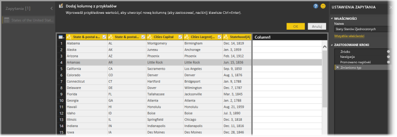

# Dodawanie kolumny z przykładu w programie Power BI Desktop
Wersja programu **Power BI Desktop** wydana w kwietniu 2017 r. umożliwia dodawanie nowych kolumn danych do modelu przy użyciu **Edytora zapytań** przez wprowadzenie co najmniej jednej przykładowej wartości dla nowej kolumny. Możesz utworzyć nową przykładową kolumnę na podstawie bieżącego zaznaczenia lub na podstawie danych wejściowych wprowadzonych w oparciu o wszystkie (lub wybrane) kolumny w danej tabeli.

To podejście umożliwia łatwe i szybkie tworzenie nowych kolumn i doskonale sprawdza się w następujących sytuacjach:

* Wiesz, jakie dane wynikowe chcesz uzyskać w nowej kolumnie, ale nie masz pewności, jakie przekształcenie (lub jaki zbiór przekształceń) umożliwi osiągnięcie takiego wyniku.
* Wiesz już, które przekształcenia są potrzebne, ale nie masz pewności, gdzie kliknąć lub jaką opcję interfejsu użytkownika wybrać, aby je zastosować.
* Wiesz już wszystko na temat przekształceń, które są Ci potrzebne podczas korzystania z wyrażenia *Kolumna niestandardowa* w języku **M**, ale co najmniej jedno z tych wyrażeń nie jest dostępne do kliknięcia lub dodania w interfejsie użytkownika.

Korzystanie z funkcji **dodawania kolumny z przykładu** jest proste i łatwe. Po zapoznaniu się z kolejnymi sekcjami przekonasz się, jak łatwe.

## Dodawanie nowej kolumny z przykładów w Edytorze zapytań
Aby utworzyć nową kolumnę z przykładu, uruchom **Edytor zapytań**. Możesz to zrobić, wybierając pozycję **Edytuj zapytania** ze wstążki **Narzędzia główne** w programie **Power BI Desktop**.

Aby pobrać dane ze strony internetowej, przejdź na kartę **Narzędzia główne**, kliknij pozycję **Pobierz dane > Internet**, a następnie wklej adres URL w wyświetlonym oknie dialogowym. W tym artykule są używane dane z artykułu w Wikipedii. Możesz kliknąć następujący link, aby samodzielnie uzyskać dane i podążać za instrukcjami:

* [**List of states and territories of the United States**](https://wikipedia.org/wiki/List_of_states_and_territories_of_the_United_States) (Lista stanów i terytoriów Stanów Zjednoczonych)

Po uruchomieniu **Edytora zapytań** i załadowaniu danych możesz rozpocząć dodawanie kolumny z przykładów. Aby dodać nową kolumnę, w **Edytorze zapytań** wybierz kartę **Dodaj kolumnę** na wstążce i wybierz opcję **Kolumna z przykładów**. Jeśli wybierzesz listę rozwijaną, możesz wybrać opcję **Ze wszystkich kolumn** (ustawienie domyślne, jeśli po prostu klikniesz przycisk zamiast listy rozwijanej) lub **Z zaznaczenia**. W tym artykule omówimy wariant **Ze wszystkich kolumn**.

## Okienko Dodaj kolumnę z przykładów
Po wybraniu opcji dodania nowej kolumny z przykładów zostanie wyświetlone nowe okienko z kolumnami bieżącej tabeli (konieczne może być przewinięcie w celu wyświetlenia ich wszystkich). Nowa pozycja **Column1** jest również wyświetlona po prawej stronie. Jest to kolumna, którą program **Power BI Desktop** tworzy w oparciu o przykłady. Poniżej nowego nagłówka **Column1** znajdują się puste komórki, w których można wpisać przykłady używane następnie przez usługę Power BI do utworzenia reguł i przekształceń w celu dopasowania do przykładu.

Należy zauważyć, że jest to **Zastosowany krok** w okienku **Ustawienia zapytania**. Jak zawsze **Edytor zapytań** będzie rejestrować czynności przekształceń i zastosuje je do zapytania w określonej kolejności.

Okienko **Dodaj kolumnę z przykładów** składa się z czterech podstawowych obszarów:

1. **Pasek poleceń** zawiera krótki opis funkcji lub przekształcenia.
2. Opcja **Prześlij opinię** pomaga w ulepszaniu tej funkcji usługi Power BI.
3. Przyciski **OK** i **Anuluj** umożliwiają zatwierdzenie przekształceń i dodanie kolumny lub anulowanie operacji.
4. Obszar nowej kolumny, w którym możesz wpisać w dowolnych wierszach przykładowe wartości odnoszące się do innych kolumn w tym wierszu, aby utworzyć przykład dla usługi Power BI.

Podczas wpisywania przykładu w nowej kolumnie usługa Power BI wyświetla podgląd kolumny, która zostanie utworzona, w oparciu o wykryte przekształcenia. Na przykład jeśli w pierwszym wierszu wpisaliśmy hasło *Alabama*, odpowiada ono wartości *Alabama* w pierwszej kolumnie tabeli. Po naciśnięciu klawisza *Enter* usługa Power BI uzupełni kolumnę na podstawie tej wartości.

Jednak następnie przeszliśmy do wiersza, w którym znajdowało się hasło *Massachusetts[E]* i usunęliśmy fragment *[E]* (ponieważ nie był potrzebny). Usługa Power BI wykrywa zmianę i używa tego przykładu, aby utworzyć przekształcenie. Zwróć uwagę na wyjaśnienie przekształcenia w środkowym okienku na górze.

W miarę dalszego dodawania przykładów**Edytor zapytań** uzupełnia przekształcenia. Jeśli uzyskano satysfakcjonujący rezultat, można wybrać przycisk **OK**, aby zatwierdzić zmiany.

## Zobacz, jak funkcja Dodaj kolumnę z przykładów działa w praktyce
Chcesz zobaczyć, jak to działa? Poniższy film wideo przedstawia użycie tej funkcji ze źródłem danych wskazanym wcześniej w tym przykładzie. Zapoznaj się z nim i spróbuj samodzielnie.

<iframe width="560" height="315" src="https://www.youtube.com/embed/-ykbVW9wQfw" frameborder="0" allowfullscreen></iframe>

## Istotne zagadnienia i ograniczenia
Istnieje wiele przekształceń, które są dostępne podczas korzystania z funkcji **Dodaj kolumnę z przykładów**, ale nie wszystkie przekształcenia są uwzględniane. Poniższa lista zawiera wszystkie obsługiwane przekształcenia.

* **Odwołanie**
  
  * Odwołanie do określonej kolumny (w tym przekształcenia przycinania, czyszczenia i wielkości liter)

* **Przekształcenia tekstu**
  
  * Połącz (obsługuje kombinację ciągów literałów i wartości całych kolumn)
  * Zastąp
  * Długość
  * Wyodrębnij   
    * Pierwsze znaki
    * Ostatnie znaki
    * Zakres
    * Tekst przed ogranicznikiem
    * Tekst po ograniczniku
    * Tekst pomiędzy ogranicznikami
    * Długość

* Następujące obsługiwane **przekształcenia tekstu** są dostępne od wersji programu **Power BI Desktop** udostępnionej w listopadzie 2017 r.:
    
  * Usuń znaki
  * Zachowaj znaki

> [!NOTE]
> Wszystkie przekształcenia *tekstu* uwzględniają ewentualną potrzebę przycięcia, wyczyszczenia lub zastosowania przekształcenia wielkości liter w wartości kolumny.
> 
> 

* **Przekształcenia daty**
  
  * Dzień
  * Dzień tygodnia
  * Nazwa dnia tygodnia
  * Dzień roku
  * Miesiąc
  * Nazwa miesiąca
  * Kwartał roku
  * Tydzień miesiąca
  * Tydzień roku
  * Rok
  * Wiek
  * Początek roku
  * Koniec roku
  * Początek miesiąca
  * Koniec miesiąca
  * Początek kwartału
  * Liczba dni w miesiącu
  * Koniec kwartału
  * Początek tygodnia
  * Koniec tygodnia
  * Dzień miesiąca
  * Początek dnia
  * Koniec dnia

* **Przekształcenia godziny**
  
  * Godzina
  * Minuta
  * Sekunda  
  * Na czas lokalny

> [!NOTE]
> Wszystkie przekształcenia *daty* i *godziny* uwzględniają ewentualną potrzebę przekonwertowania wartości kolumny na wartość typu *Data*, *Godzina* lub *Data/godzina*.
> 
> 

* **Przekształcenia liczb** 

  * Wartość bezwzględna
  * Arcus cosinus
  * Arcus sinus
  * Arcus tangens
  * Konwertowanie na liczbę
  * Cosinus
  * Sześcian
  * Dzielenie
  * Wykładnik
  * Silnia
  * Dzielenie liczby całkowitej
  * Jest parzysta
  * Jest nieparzysta
  * Logarytm naturalny
  * Logarytm dziesiętny
  * Modulo
  * Mnożenie
  * Zaokrąglenie w dół
  * Zaokrąglenie w górę
  * Znak
  * Sinus
  * Pierwiastek kwadratowy
  * Kwadrat
  * Odejmowanie
  * Suma
  * Tangens

* Następujące obsługiwane **przekształcenia liczbowe** są dostępne od wersji programu **Power BI Desktop** udostępnionej w listopadzie 2017 r.:

  * Tworzenie przedziałów/zakresy

* **Ogólne**
  
  * Kolumna warunkowa