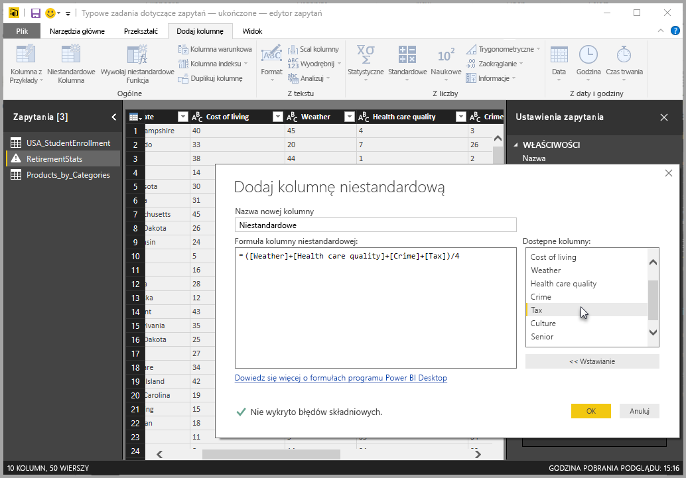
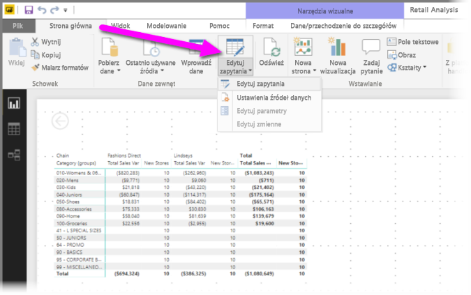
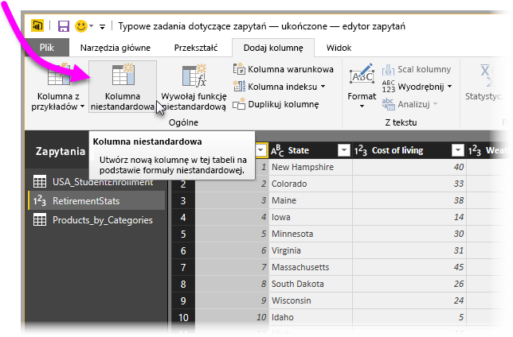
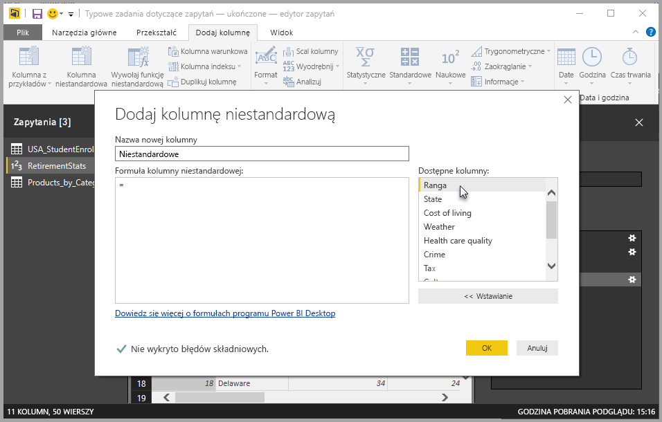
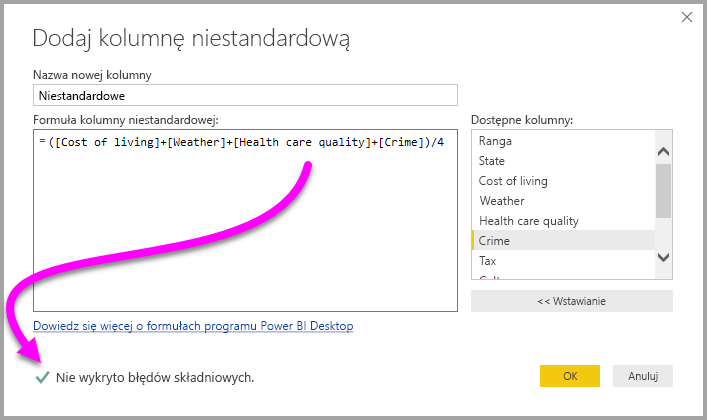
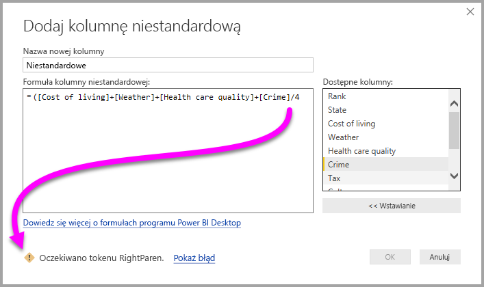
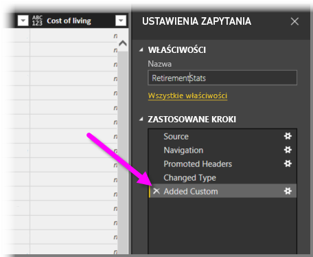
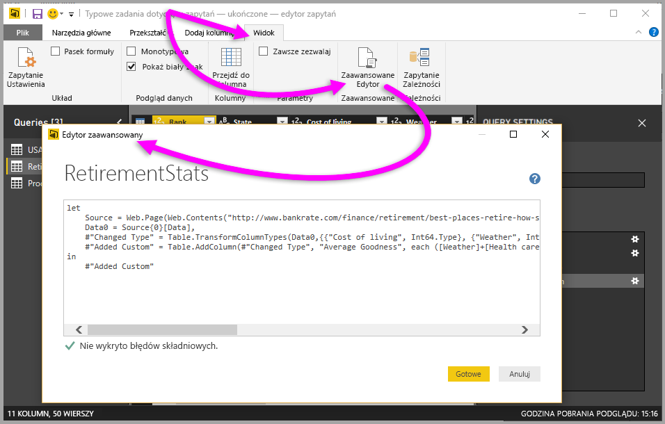

# Dodawanie kolumny niestandardowej w programie Power BI Desktop
Nową niestandardową kolumnę danych możesz łatwo dodać do swojego modelu, posługując się **Edytorem zapytań** w programie **Power BI Desktop**. Niestandardową kolumnę możesz utworzyć za pomocą łatwych przycisków do tworzenia [formuł M](https://msdn.microsoft.com/library/mt270235.aspx) definiujących kolumnę niestandardową. Formuła M ma [kompleksowy zestaw zawartości referencyjnej funkcji](https://msdn.microsoft.com/library/mt779182.aspx). 

Tworzenie kolumny niestandardowej jest kolejnym krokiem w okienku **Zastosowane kroki** dla zapytania tworzonego w **Edytorze zapytań**, co oznacza, że można go zmienić, przesunąć dalej lub wcześniej albo w dowolnym momencie zmodyfikować.

## Korzystanie z edytora zapytań w celu dodania nowej kolumny niestandardowej
Aby utworzyć nową kolumnę niestandardową, uruchom **Edytor zapytań**. Możesz to zrobić, wybierając pozycję **Edytuj zapytania** ze wstążki **Narzędzia główne** w programie **Power BI Desktop**.

Po uruchomieniu **Edytora zapytań** i załadowaniu do niego danych można dodać kolumnę niestandardową, wybierając kartę **Dodaj kolumnę** na wstążce, a następnie wybierając pozycję **Kolumna niestandardowa**.

Gdy to zrobisz, zostanie wyświetlone okno **Dodawanie kolumny niestandardowej**, które zostanie omówione w kolejnej sekcji.

## Okno Dodawanie kolumny niestandardowej
W oknie **Dodawanie kolumny niestandardowej** widoczne są: lista dostępnych pól w okienku po prawej, nazwa kolumny niestandardowej u góry (możesz zmienić jej nazwę, po prostu wpisując nową wartość w polu) i formuła [**M**](https://msdn.microsoft.com/library/mt779182.aspx) tworzona (lub pisana) na podstawie pól wstawianych z prawej strony, dodawanych operatorów i innych czynności tworzenia formuły, na której będzie bazować definicja nowej kolumny niestandardowej. 

## Tworzenie formuł dla kolumn niestandardowych
Możesz wybrać pole z listy **Dostępne kolumny:** z prawej strony i wybrać pozycję **<< Wstaw**, aby dodać je do formuły kolumny niestandardowej. Aby dodać kolumnę, możesz też po prostu dwukrotnie kliknąć ją na liście.

W trakcie wpisywania formuły i tworzenia kolumny u dołu okna będzie widoczny wskaźnik informujący w czasie rzeczywistym (w trakcie pisania), czy wykryto jakieś błędy składni. Jeśli wszystko jest w porządku, zobaczysz zielony znacznikiem wyboru.

Jeśli jednak w składni pojawią się jakieś błędy, zobaczysz żółtą ikoną ostrzeżenia wraz z wykrytym błędem i linkiem umieszczającym kursor w miejscu wystąpienia błędu w formule.

Po wybraniu przycisku **OK** Twoja kolumna niestandardowa zostanie dodana do modelu, a krok **Dodano kolumnę niestandardową** zostanie dodany do okienka **Zastosowane kroki** zapytania.

Jeśli dwukrotnie klikniesz krok **Dodano kolumnę niestandardową** w okienku **Zastosowane kroki**, okno **Dodawanie kolumny niestandardowej** zostanie wyświetlone ponownie z już załadowaną formułą tworzonej kolumny niestandardowej, gotową do ewentualnej modyfikacji.

## Używanie edytora zaawansowanego dla kolumn niestandardowych
Możesz też utworzyć kolumnę niestandardową (i zmodyfikować wszelkie kroki zapytania służącego do tego), używając **Edytora zaawansowanego**. W **Edytorze zapytań** wybierz kartę **Widok**, a następnie wybierz pozycję **Edytor zaawansowany** w celu wyświetlenia **Edytora zaawansowanego**.

**Edytor zaawansowany** daje pełną kontrolę nad zapytaniem.

## Następne kroki
Istnieją inne metody tworzenia kolumny niestandardowej, w tym tworzenie kolumny na podstawie przykładów dostarczanych **Edytorowi zapytań**. Więcej informacji na temat tworzenia kolumn niestandardowych na podstawie przykładów zawiera następujący artykuł:

* [Dodawanie kolumny z przykładu w programie Power BI Desktop](desktop-add-column-from-example.md)
* [Wprowadzenie do języka formuł M](https://msdn.microsoft.com/library/mt270235.aspx)
* [Dokumentacja funkcji M](https://msdn.microsoft.com/library/mt779182.aspx)  

