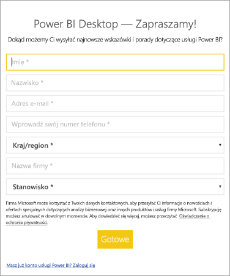

# <a name="how-administrators-can-manage-the-power-bi-desktop-sign-in-form"></a>Jak administratorzy mogą zarządzać formularzem logowania programu Power BI Desktop
Podczas pierwszego uruchomienia programu Power BI Desktop zostaje wyświetlony formularz logowania. Można uzupełnić informacje lub zalogować się do usługi Power BI, aby kontynuować. Administratorzy zarządzają tym formularzem przy użyciu klucza rejestru. 



Administratorzy używają następującego klucza rejestru w celu wyłączenia formularza logowania. Można go również wypchnąć do całej organizacji przy użyciu zasad globalnych.

```
Key: HKEY_LOCAL_MACHINE\SOFTWARE\Policies\Microsoft\Power BI Desktop
valueName: ShowLeadGenDialog
```

Wartość 0 spowoduje wyłączenie okna dialogowego.

Masz więcej pytań? [Zadaj pytanie społeczności usługi Power BI](http://community.powerbi.com/)

