# Agregacje w programie Power BI Desktop (wersja zapoznawcza)

Za pomocą **agregacji** usługa Power BI umożliwia przeprowadzanie interaktywnych analiz danych big data metodami, które wcześniej nie były możliwe. **Agregacje** mogą znacznie zmniejszyć koszt uwzględniania dużych zestawów danych przy podejmowaniu decyzji.

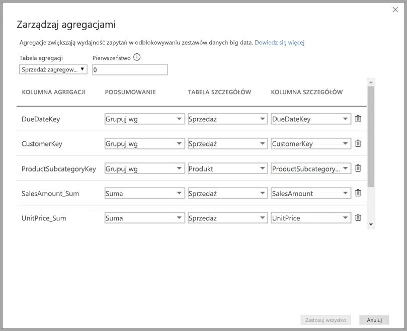

Na poniższej liście przedstawiono zalety korzystania z **agregacji**:

* **Wydajność zapytań w dużych zestawach danych** — gdy użytkownicy korzystają z wizualizacji w raportach usługi Power BI, zapytania języka DAX są przesyłane do zestawu danych. Zwiększ wydajność zapytań poprzez buforowanie danych na poziomie zagregowanym, korzystając z ułamka zasobów wymaganych na poziomie szczegółowym. Uwzględniaj dane big data w sposób, który inaczej nie byłby możliwy.
* **Optymalizacja odświeżania danych** — redukuj rozmiary pamięci podręcznej i czas odświeżania, buforując dane na poziomie zagregowanym. Przyspiesz czas udostępniania danych użytkownikom.
* **Osiągnięcie zrównoważonych architektur** — zezwól wewnątrzpamięciowej pamięci podręcznej usługi Power BI na skuteczną obsługę zagregowanych zapytań. Ogranicz zapytania wysyłane do źródła danych w trybie DirectQuery, dzięki czemu łatwiej będzie utrzymać limity współbieżności. Zapytania przedostające się dalej to zazwyczaj filtrowane zapytania na poziomie transakcyjnym, które zwykle są dobrze obsługiwane przez magazyny danych i systemy danych big data.

### Magazyn na poziomie tabeli
Magazyn na poziomie tabeli jest normalnie używany z funkcją agregacji. Zobacz artykuł opisujący [tryb przechowywania w programie Power BI Desktop (wersja zapoznawcza)](desktop-storage-mode.md), aby uzyskać więcej informacji.

### Typy źródeł danych
Agregacje są używane ze źródłami danych reprezentującymi modele wymiarowe, np. magazynami danych i składnicami danych, a także źródłami danych big data opartymi na usłudze Hadoop. W tym artykule opisano typowe różnice w modelowaniu w usłudze Power BI dla każdego typu źródła danych.

Wszystkie źródła usługi Power BI typu Import (inne niż wielowymiarowe) oraz DirectQuery współpracują z agregacjami.

## Włączanie funkcji agregacji w wersji zapoznawczej

Funkcja **agregacji** jest dostępna w wersji zapoznawczej i należy ją włączyć w programie **Power BI Desktop**. Aby włączyć **agregacje**, wybierz kolejno pozycje **Plik > Opcje i ustawienia > Opcje > Funkcje w wersji zapoznawczej**, a następnie zaznacz pola wyboru **Modele złożone** oraz **Zarządzanie agregacjami**. 

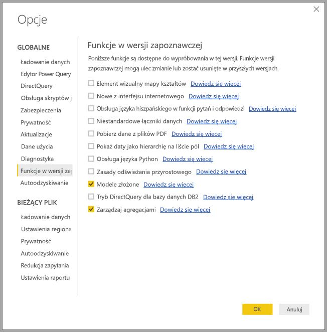

Aby funkcja została włączona, należy ponownie uruchomić program **Power BI Desktop**.

## Agregacje oparte na relacjach

**Agregacje** oparte na relacjach są zwykle używane z modelami wymiarowymi. Zestawy danych usługi Power BI ze źródłami w magazynach danych lub składnicach danych przypominają schematy gwiazdy/płatka śniegu z relacjami pomiędzy tabelami wymiarów i tabelami faktów.

Weź pod uwagę następujący model, który pochodzi z jednego źródła danych. Na początek załóżmy, że wszystkie tabele używają trybu DirectQuery. Tabela faktów **Sales** zawiera miliardy wierszy. Ustawienie trybu przechowywania tabeli **Sales** na **Import** dla buforowania spowoduje zużycie znacznej ilości pamięci oraz doprowadzi do powstania obciążeń związanych z zarządzaniem.

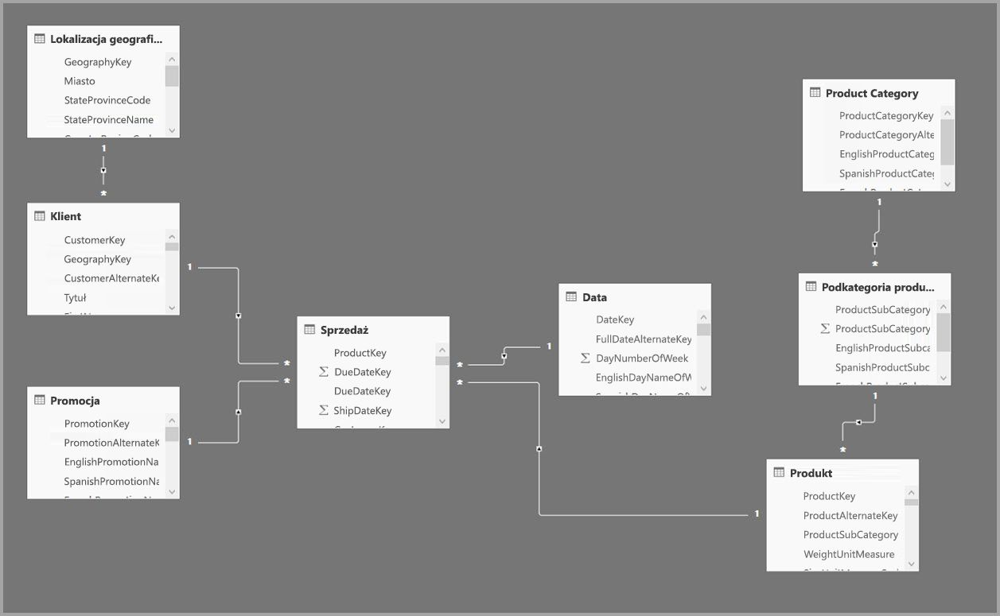

Zamiast tego możemy utworzyć tabelę **Sales Agg** jako tabelę agregacji. Jest ona na wyższym poziomie szczegółowości niż tabela **Sales**, a więc zawiera znacznie mniej wierszy. Liczba wierszy powinna być równa sumie wartości z kolumny **SalesAmount** pogrupowanych według kolumn **CustomerKey**, **DataKey** i **ProductSubcategoryKey**. Zamiast miliardów w tabeli mogą znaleźć się miliony wierszy, co jest już znacznie łatwiejsze w zarządzaniu.

Załóżmy, że następujące tabele wymiarów są najczęściej używane w przypadku zapytań o dużej wartości biznesowej. Są to tabele, które mogą filtrować tabelę **Sales Agg** przy użyciu relacji *jeden do wielu* (lub *wiele do jednego*). Inne typy relacji, np. *wiele do wielu* lub *wiele źródeł*, nie są obsługiwane w przypadku agregacji.

* Geography
* Customer
* Data
* Product Subcategory
* Product Category

Poniższa ilustracja obrazuje ten model.

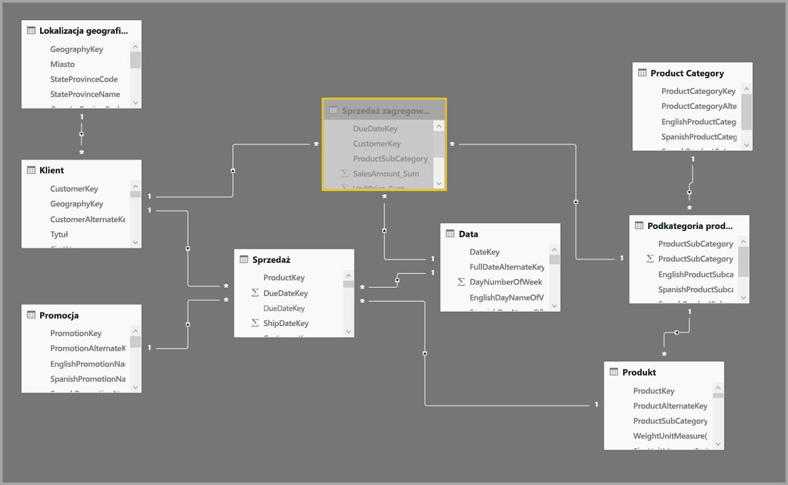

> [!NOTE]
> Tabela **Sales Agg** to po prostu kolejna tabela, więc można ją ładować na różne sposoby. Na przykład agregację można wykonać w źródłowej bazie danych przy użyciu procesów ETL/ELT lub przy użyciu [wyrażenia języka M](https://msdn.microsoft.com/query-bi/m/power-query-m-reference) dla tabeli. Tabela może korzystać z trybu przechowywania Import z [odświeżaniem przyrostowym w usłudze Power BI Premium](service-premium-incremental-refresh.md) lub bez niego, a także może korzystać z trybu DirectQuery i być zoptymalizowana pod kątem szybkich zapytań przy użyciu [indeksów magazynu kolumn](https://docs.microsoft.com/sql/relational-databases/indexes/columnstore-indexes-overview). Ta elastyczność umożliwia tworzenie zrównoważonych architektur, które będą rozprzestrzeniać obciążenia zapytań, aby unikać tworzenia wąskich gardeł.

### Tryb przechowywania 
Kontynuujmy pracę z naszym przykładem. Ustawiamy tryb przechowywania tabeli **Sales Agg** na **Import**, aby przyspieszyć zapytania.

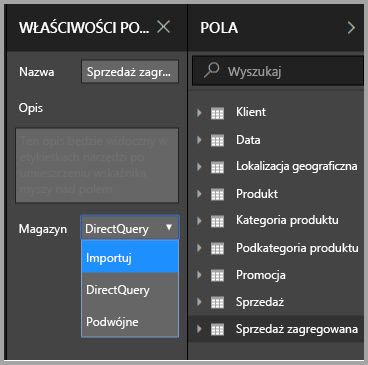

W takim przypadku zostanie wyświetlone następujące okno dialogowe, które informuje nas o tym, że powiązane tabele wymiarów będą ustawione w tryb przechowywania **Podwójny**. 

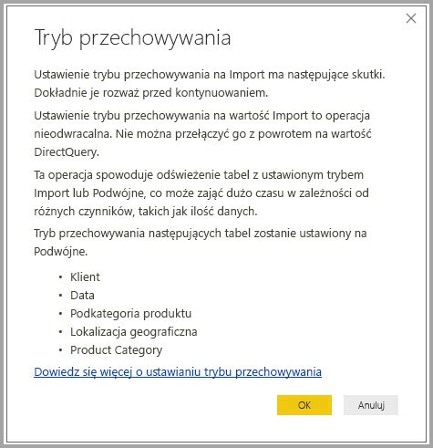

Ustawienie tabel na opcję **Podwójny** umożliwia powiązanym tabelom wymiarów działanie w trybie Import lub DirectQuery w zależności od podzapytania.

* Zapytania, które agregują metryki z tabeli **Sales Agg**, czyli tabeli trybu Import, i grupują je według atrybutów z powiązanych tabel podwójnych, mogą być zwracane z wewnątrzpamięciowej pamięci podręcznej.
* Zapytania, które agregują metryki w tabeli **Sales**, czyli tabeli trybu DirectQuery, i grupują je według atrybutów z powiązanych tabel podwójnych, mogą być zwracane w trybie DirectQuery. Logika zapytania wraz z operacją grupowania zostanie przekazana do źródłowej bazy danych.

Aby uzyskać więcej informacji o trybie przechowywania **Podwójny**, zobacz artykuł opisujący [tryb przechowywania](desktop-storage-mode.md).

> Uwaga: tabela **Sales Agg** jest ukryta. Tabele agregacji powinny być ukryte przed konsumentami zestawu danych. Konsumenci i zapytania odwołują się do tabeli szczegółowej, a nie tabeli agregacji. Nie muszą nawet wiedzieć, że tabela agregacji istnieje.

### Okno dialogowe Zarządzaj agregacjami
Następnie zdefiniujemy agregacje. Wybierz menu kontekstowe **Zarządzaj agregacjami** dla tabeli **Sales Agg**, klikając tabelę prawym przyciskiem myszy.

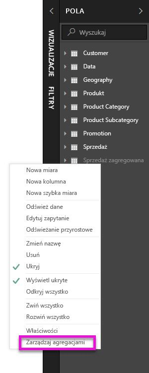

Zostanie wyświetlone okno dialogowe **Zarządzaj agregacjami**. Okno zawiera wiersz dla każdej kolumny w tabeli **Sales Agg**, w którym możesz określić zachowanie agregacji. Zapytania kierowane do zestawu danych usługi Power BI, które odwołują się do tabeli **Sales**, są wewnętrznie przekierowywane do tabeli **Sales Agg**. Konsumenci zestawu danych nie muszą nawet wiedzieć, że tabela **Sales Agg** w ogóle istnieje.

Następująca tabela przedstawia agregacje dla tabeli **Sales Agg**.

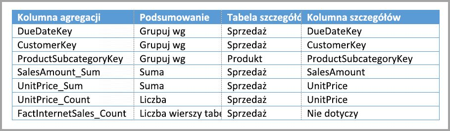

#### Funkcja podsumowywania

Lista rozwijana Podsumowanie oferuje następujące wartości do wyboru.
* Liczność
* Grupuj wg
* Maks.
* Min.
* Suma
* Liczba wierszy tabeli

#### Weryfikacje

Następujące istotne weryfikacje są wymuszane przez okno dialogowe:

* Wybrana kolumna szczegółów musi mieć ten sam typ danych co kolumna agregacji, poza funkcjami podsumowania Liczność i Liczba wierszy tabeli. Funkcje Liczność i Liczba wierszy tabeli są oferowane tylko w przypadku kolumn agregacji z liczbami całkowitymi i nie wymagają zgodnego typu danych.
* Agregacje łańcuchowe obejmujące trzy lub więcej tabel nie są dozwolone. Na przykład nie można ustawić agregacji w **tabeli A** odwołującej się do **tabeli B**, która zawiera agregacje odwołujące się do **tabeli C**.
* Zduplikowane agregacje, w których dwa wpisy używają tej samej funkcji podsumowania i odwołują się do tej samej tabeli/kolumny szczegółów, nie są dozwolone.

Podczas tej publicznej wersji zapoznawczej w przypadku **agregacji** wymuszone są również następujące weryfikacje. Zamierzamy usunąć te weryfikacje po wydaniu funkcji w wersji ogólnie dostępnej.

* Nie można używać agregacji z zabezpieczeniami na poziomie wiersza (RLS). *Ograniczenie publicznej wersji zapoznawczej.*
* Tabela szczegółów musi być tabelą DirectQuery, a nie Import. *Ograniczenie publicznej wersji zapoznawczej.*

Większość takich weryfikacji jest wymuszanych poprzez wyłączenie wartości list rozwijanych oraz wyświetlenie tekstu objaśnienia w etykietce narzędzia, jak przedstawiono na poniższej ilustracji.

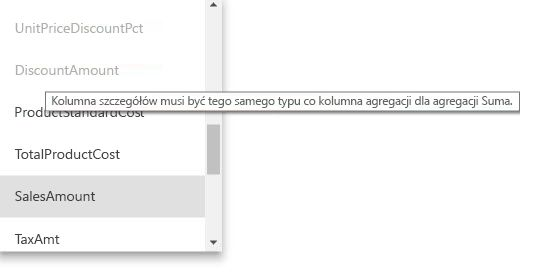

### Grupowanie według kolumn

W tym przykładzie trzy wpisy funkcji Grupuj według są opcjonalne; nie wpływają na zachowanie agregacji (poza przykładowym zapytaniem DISTINCTCOUNT przedstawionym na kolejnej ilustracji). Zostały dołączone głównie w celu zwiększenia czytelności. Bez tych wpisów Grupuj według agregacje nadal byłyby osiągane w oparciu o relacje. Jest to zachowanie inne niż w przypadku użycia agregacji bez relacji, które zostało omówione na przykładzie danych big data w dalszej części tego artykułu.

### Wykrywanie, czy agregacje są osiągane, czy pomijane przez zapytania

Aby uzyskać więcej informacji o sposobie wykrywania, czy zapytania są zwracane z wewnątrzpamięciowej pamięci podręcznej (aparat magazynu) czy funkcji DirectQuery (wypychane do źródła danych) przy użyciu programu SQL Profiler, zobacz artykuł opisujący [tryb przechowywania](desktop-storage-mode.md). Tego procesu można również użyć, aby wykryć, czy agregacje są osiągane.

Ponadto następujące rozszerzone zdarzenie zostanie dostarczone w programie SQL Profiler.

    Query Processing\Aggregate Table Rewrite Query

Poniższy fragment kodu JSON przedstawia przykład danych wyjściowych zdarzenia w przypadku użycia agregacji.

* **matchingResult** pokazuje, że agregacja została użyta w przypadku podzapytania.
* **dataRequest** pokazuje kolumny Grupuj według oraz kolumny agregowane używane przez podzapytanie.
* **mapping** pokazuje kolumny w tabeli agregacji, na które zostało wykonane mapowanie.

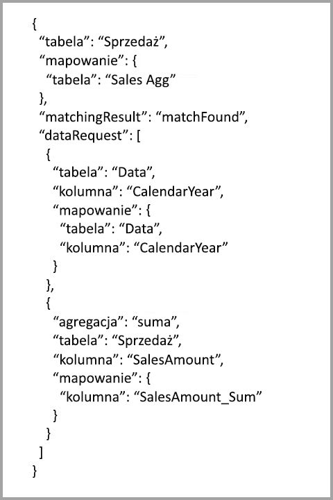

### Przykłady zapytań
Następujące zapytanie osiąga agregację, ponieważ kolumny w tabeli *Date* cechują się stopniem szczegółowości umożliwiającym osiągnięcie agregacji. Agregacja **Suma** zostanie użyta dla tabeli **SalesAmount**.

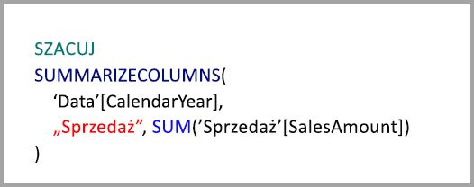

Następujące zapytanie nie osiągnie agregacji. Pomimo zażądania sumy tabeli **SalesAmount**, zapytanie wykonuje operację Grupuj według wobec kolumny w tabeli **Product**, która nie ma poziomu szczegółowości umożliwiającego osiągnięcie agregacji. Jeśli sprawdzisz relacje w modelu, zauważysz, że podkategoria produktu może mieć wiele wierszy **Product**. Zapytanie nie może określić produktu, do którego należy przeprowadzić agregację. W takim przypadku zapytanie powróci do trybu DirectQuery i prześle zapytanie SQL do źródła danych.

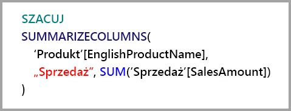

Agregacje nie są przeznaczone wyłącznie dla niezłożonych obliczeń wykonujących proste sumowanie. Mogą z nich również skorzystać obliczenia złożone. W założeniu obliczenia złożone są rozbijane na podzapytania dla każdej operacji SUM, MIN, MAX i COUNT, a każde podzapytanie jest oceniane, aby określić, czy można osiągnąć agregację. Ta logika nie jest stosowana we wszystkich przypadkach ze względu na optymalizację planu zapytania, ale ogólnie powinna być stosowana. Poniższy przykład osiągnie agregację:

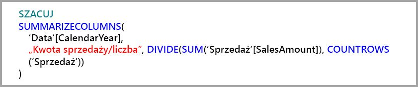

Funkcja COUNTROWS może skorzystać z agregacji. Następujące zapytanie osiągnie agregację, ponieważ istnieje agregacja **Liczba** wierszy tabeli zdefiniowana dla tabeli **Sales**.

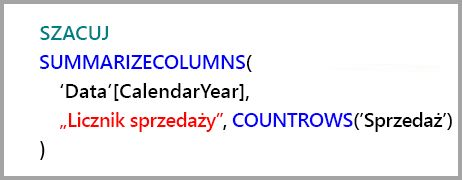

Funkcja AVERAGE może skorzystać z agregacji. Następujące zapytanie spowoduje osiągnięcie agregacji, ponieważ funkcja AVERAGE zostaje wewnętrznie zawinięta do funkcji SUM podzielonej przez COUNT. Ponieważ kolumna **UnitPrice** ma agregacje zdefiniowane dla obu funkcji SUM i COUNT, agregacja zostanie osiągnięta.

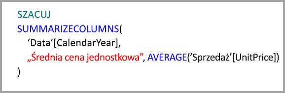

W niektórych przypadkach funkcja DISTINCTCOUNT może skorzystać z agregacji. Następujące zapytanie osiągnie agregację, ponieważ istnieje wpis Grupuj według dla kolumny **CustomerKey**, która przechowuje odrębności **CustomerKey** w tabeli agregacji. Ta technika jest nadal objęta progiem wydajności — około dwa do pięciu milionów odrębnych wartości może mieć wpływ na wydajność zapytania. Jednak może być użyteczna w scenariuszach, w których istnieją miliardy wierszy w tabeli szczegółów oraz dwa do pięciu milionów odrębnych wartości w kolumnie. W tym przypadku liczność unikatowych wartości może działać szybciej niż skanowanie tabeli z miliardami wierszy, nawet jeśli zostały one zbuforowane w pamięci.

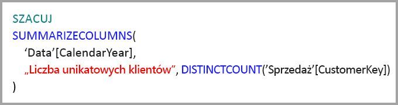

## Agregacje oparte na kolumnach Grupuj według 

Modele danych big data oparte na usłudze Hadoop mają inne cechy niż modele wymiarowe. Aby unikać połączeń pomiędzy dużymi tabelami, często nie polega się na relacjach. Zamiast tego atrybuty wymiaru są często denormalizowane do tabel faktów. Takie modele danych big data można odblokować na potrzeby interaktywnej analizy przy użyciu **agregacji** opartych na kolumnach Grupuj według.

Poniższa tabela zawiera kolumnę liczbową **Movement**, którą należy zagregować. Wszystkie inne kolumny są atrybutami, według których należy grupować. Tabela zawiera dane IoT i ogromną liczbę wierszy. Tryb przechowywania to DirectQuery. Zapytania w źródle danych, które są agregowane w całym zestawie danych, są powolne ze względu na ogromną objętość.

Aby włączyć interaktywną analizę tego zestawu danych, dodamy tabelę agregacji, która zapewnia grupowanie według większości atrybutów, ale wyklucza atrybuty o dużej kardynalności, np. długość i szerokość geograficzną. Spowoduje to znaczne zmniejszenie liczby wierszy, a wynik będzie na tyle mały, aby wygodnie zmieścił się w wewnątrzpamięciowej pamięci podręcznej. Tryb przechowywania tabeli **Driver Activity Agg** to Import.

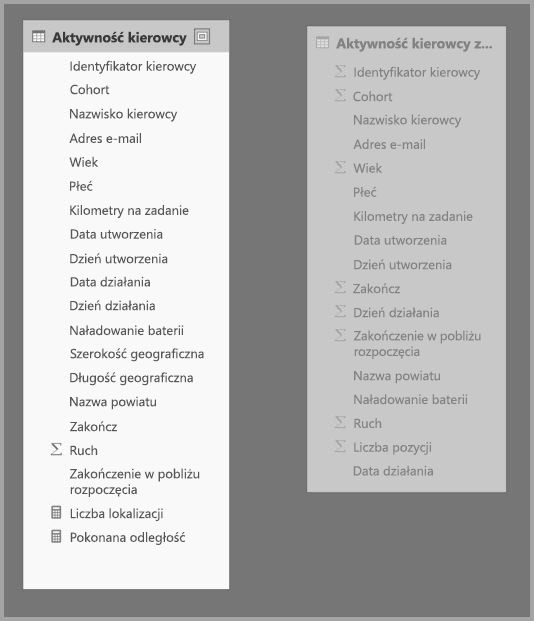

Następnie zdefiniujemy mapowania agregacji w oknie dialogowym **Zarządzaj agregacjami**. Okno wyświetla wiersz dla każdej kolumny w tabeli **Driver Activity Agg**, w którym możesz określić zachowanie agregacji.

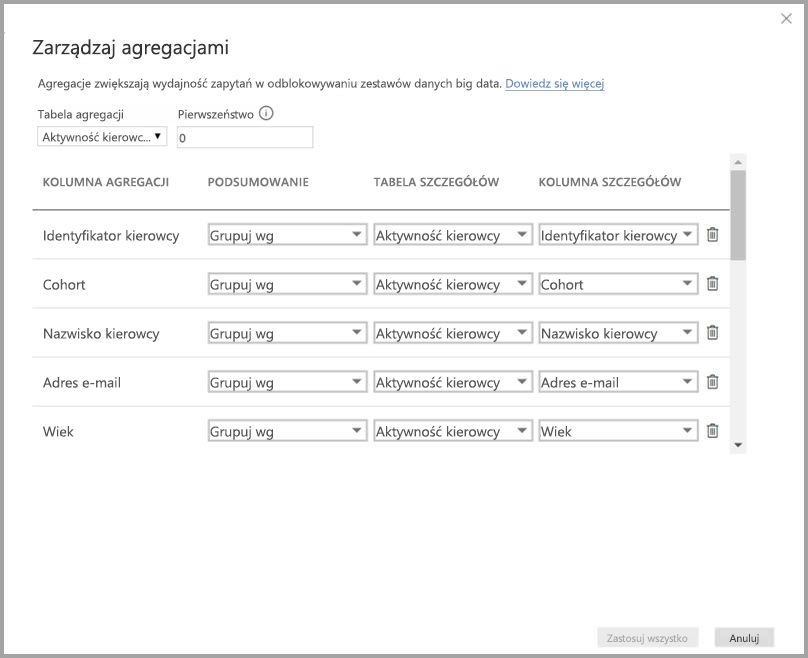

Następująca tabela przedstawia agregacje dla tabeli **Sales Agg**.

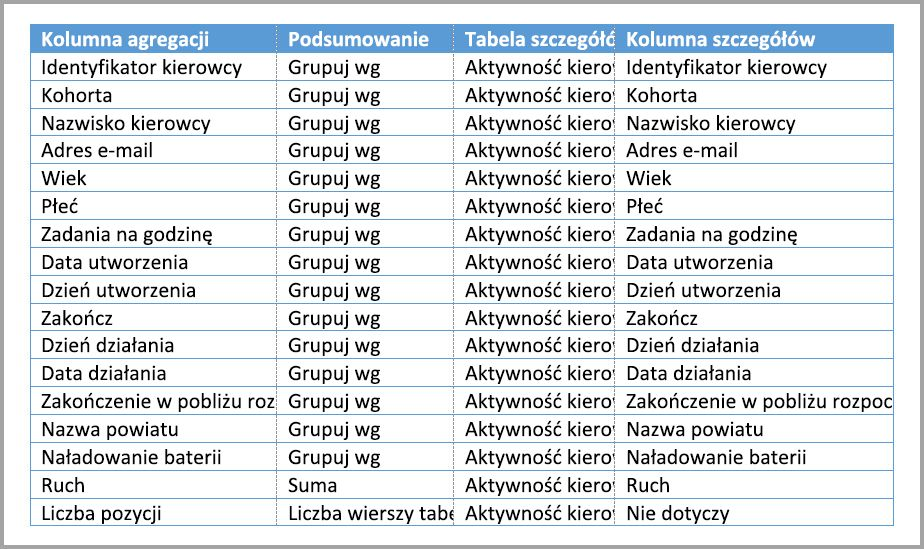

### Grupowanie według kolumn

W tym przykładzie wpisy **Grupuj według** **nie są opcjonalne**. Bez nich nie można osiągnąć agregacji. Jest to zachowanie inne niż w przypadku używania agregacji opartych na relacjach, które zostało omówione na przykładzie modelu wymiarowego wcześniej w tym artykule.

### Przykłady zapytań

Następujące zapytanie osiągnie agregację, ponieważ kolumna **Activity Date** jest objęta tabelą agregacji. Agregacja Liczba wierszy tabeli jest używana przez funkcję COUNTROWS.

Zwłaszcza w przypadku modeli, które zawierają atrybuty filtru w tabelach faktów, dobrym pomysłem będzie użycie agregacji Liczba wierszy tabeli. Usługa Power BI może przesyłać zapytania do zestawu danych przy użyciu funkcji COUNTROWS w przypadkach, w których nie jest to jawnie zażądane przez użytkownika. Na przykład okno dialogowe filtru pokazuje liczbę wierszy dla każdej wartości.

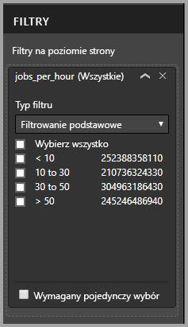

## Pierwszeństwo agregacji

Pierwszeństwo agregacji umożliwia uwzględnienie wielu tabel agregacji przez jedno podzapytanie.

Rozpatrzmy następujący przykład. Jest to [model złożony](desktop-composite-models.md) zawierający wiele źródeł DirectQuery.

* Tabela Importu **Driver Activity Agg2** cechuje się wysokim stopniem szczegółowości, ponieważ zawiera niewiele atrybutów Grupuj według oraz są to atrybuty o niskiej kardynalności. Wierszy może być zaledwie kilka tysięcy, więc z łatwością zmieszczą się w wewnątrzpamięciowej pamięci podręcznej. Te atrybuty są używane przez pulpit nawigacyjny kadry kierowniczej wysokiego poziomu, więc zapytania odwołujące się do nich powinny być możliwie szybkie.
* Tabela **Driver Activity Agg** jest pośrednią tabelą agregacji w trybie DirectQuery. Tabela zawiera ponad miliard wierszy i jest zoptymalizowana jako źródło przy użyciu indeksów magazynu kolumn.
* Tabela **Driver Activity** to tabela DirectQuery i zawiera ponad bilion wierszy danych IoT, które zostały pozyskane z systemu danych big data. Tabela służy zapytaniom przeglądania szczegółowego do wyświetlania poszczególnych odczytów IoT w kontekstach kontrolowanego filtrowania.

Zużycie pamięci w tym modelu jest względnie małe, ale daje dostęp do ogromnego zestawu danych. Reprezentuje on zrównoważoną architekturę, ponieważ rozprzestrzenia obciążenia zapytań wśród składników architektury, wykorzystując je w oparciu o silne strony.

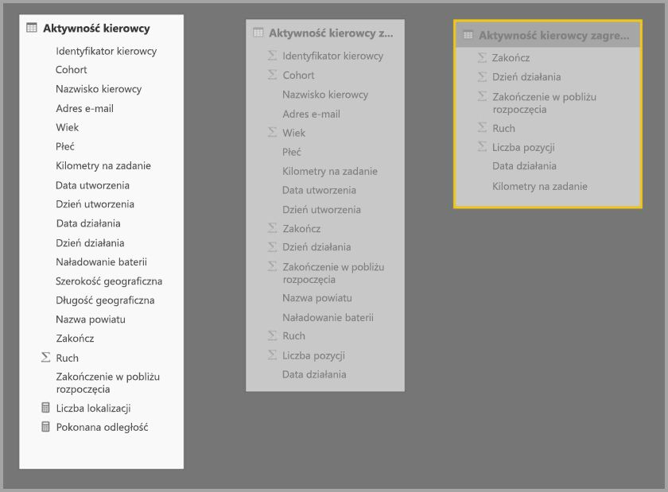

Okno dialogowe **Zarządzaj agregacjami** dla tabeli **Driver Activity Agg2** pokazuje, że pole *Pierwszeństwo* ma wartość 10, czyli więcej niż tabeli **Driver Activity Agg**, co oznacza, że tabela będzie uwzględniana jako pierwsza w zapytaniach używających agregacji. Podzapytania, które nie mają stopnia szczegółowości odpowiedniego dla tabeli **Driver Activity Agg2**, będą uwzględniać zamiast tego tabelę **Driver Activity Agg**. Zapytania szczegółowe, które nie mogą uzyskać odpowiedzi w żadnej tabeli agregacji, zostaną przekierowane do tabeli **Driver Activity**.

Tabela określona w kolumnie **Detail Table** to **Driver Activity**, a nie **Driver Activity Agg**, ponieważ agregacje łańcuchowe nie są dozwolone (patrz sekcja [Weryfikacje](#validations) we wcześniejszej części tego artykułu).

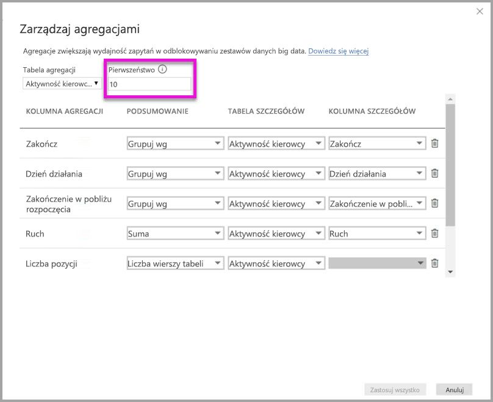

Następująca tabela przedstawia agregacje dla tabeli **Sales Agg**.

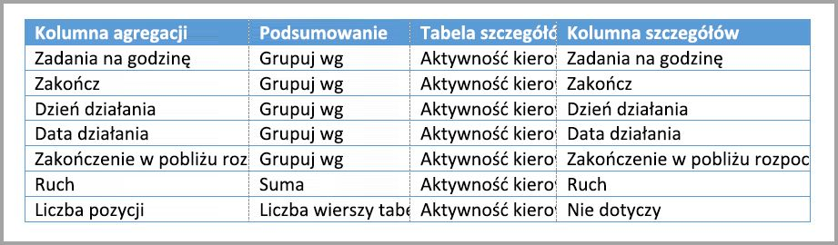

## Agregacje oparte na kolumnach Grupuj według w połączeniu z relacjami

Możesz też łączyć dwie techniki agregacji opisane we wcześniejszej części tego artykułu. **Agregacje** oparte na relacjach mogą wymagać podziału denormalizowanych tabel wymiarów na wiele tabel. Jeśli jest to kosztowne lub niepraktyczne w przypadku danych tabel wymiarów, wymagane atrybuty można replikować w tabeli agregacji dla danych wymiarów, a dla innych zastosować relacje.

Następujący model replikuje atrybuty *Month*, *Quarter*, *Semester* i *Year* w tabeli **Sales Agg**. Nie ma relacji pomiędzy tabelami **Sales Agg** i **Date**. Istnieją relacje z tabelami **Customer** i **Product Subcategory**. Tryb przechowywania tabeli **Sales Agg** to Import.

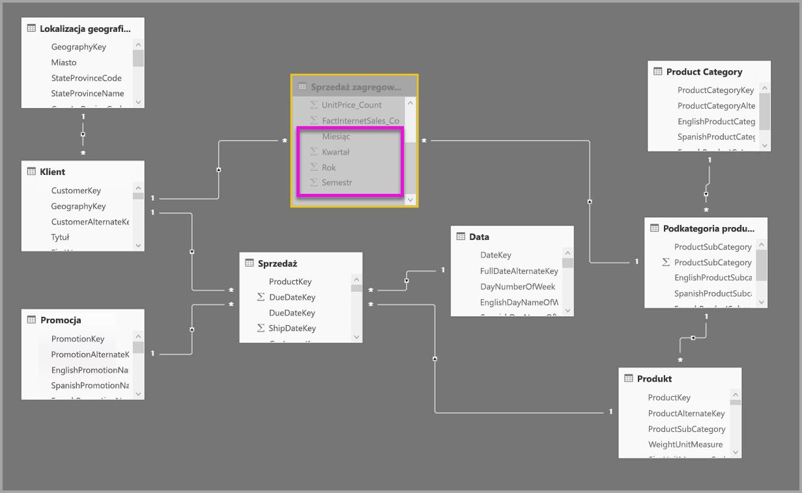

W poniższej tabeli przedstawiono zestaw wpisów w oknie dialogowym **Zarządzaj agregacjami** dla tabeli **Sales Agg**. Wpisy Grupuj według, w których tabela **Date** to tabela szczegółów, muszą osiągnąć agregacje w przypadku zapytań, które przeprowadzają grupowanie według atrybutów tabeli Date. Tak jak w poprzednim przykładzie, wpisy Grupuj według dla kolumn CustomerKey i ProductSubcategoryKey nie wpływają na trafienia agregacji ze względu na obecność relacji (ponownie za wyjątkiem funkcji DISTINCTCOUNT).

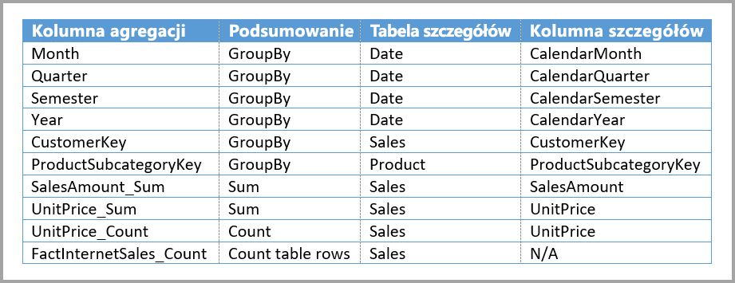

> Uwaga: ten model wymaga, żeby tabela **Date** była w trybie DirectQuery w oknie dialogowym zarządzania agregacjami, ponieważ jest to tabela szczegółów. Zamierzamy usunąć to ograniczenie wersji zapoznawczej w wersji ogólnie dostępnej.

### Przykłady zapytań

Następujące zapytanie osiąga agregację, ponieważ pozycja CalendarMonth jest objęta przez tabelę agregacji, a pozycja CategoryName jest dostępna za pośrednictwem relacji jeden do wielu. Agregacja Suma jest używana dla tabeli **SalesAmount**.

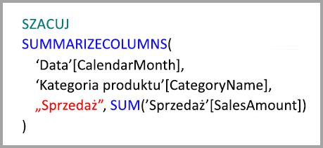

Następujące zapytanie nie osiągnie agregacji, ponieważ kolumna CalendarDay nie jest objęta tabelą agregacji.

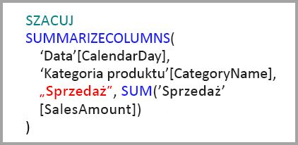

Następujące zapytanie analizy czasowej nie osiągnie agregacji, ponieważ funkcja DATESYTD generuje tabelę wartości CalendarDay, która nie jest objęta tabelą agregacji.

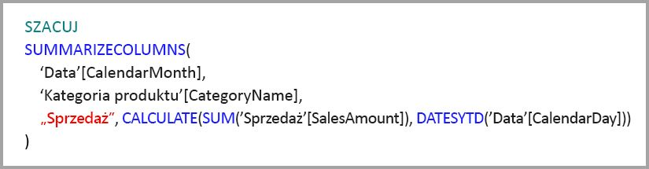

## Pamięci podręczne powinny być synchronizowane

**Agregacje** łączące tryb DirectQuery oraz Import i/lub Podwójny mogą zwracać inne dane, jeśli wewnątrzpamięciowa pamięć podręczna nie będzie zsynchronizowana z danymi źródłowymi. Podczas wykonywania zapytania nie zostanie podjęta próba maskowania problemów związanych z danych, na przykład filtrowania wyników zapytania DirectQuery, w celu dopasowania do wartości buforowanych. Te funkcje są optymalizacjami wydajności i powinny być używane tylko w sposób, który nie będzie negatywnie wpływać na zdolność spełnienia wymagań biznesowych. To Ty musisz znać przepływy swoich danych. Projektuj je odpowiednio. W razie potrzeby można skorzystać z opracowanych już technik postępowania w przypadku wystąpienia takich problemów.

## Następne kroki

W poniższych artykułach bardziej szczegółowo opisano modele złożone oraz przedstawiono szczegóły trybu DirectQuery.

* [Modele złożone w programie Power BI Desktop (wersja zapoznawcza)](desktop-composite-models.md)
* [Relacje wiele-do-wielu w programie Power BI Desktop (wersja zapoznawcza)](desktop-many-to-many-relationships.md)
* [Tryb przechowywania w programie Power BI Desktop (wersja zapoznawcza)](desktop-storage-mode.md)

Artykuły dotyczące trybu DirectQuery:

* [Używanie trybu DirectQuery w usłudze Power BI](desktop-directquery-about.md)
* [Źródła danych obsługiwane przez tryb DirectQuery w usłudze Power BI](desktop-directquery-data-sources.md)

