# Używanie zakładek w celu udostępniania szczegółowych informacji i tworzenia historii w usłudze Power BI (wersja zapoznawcza)
Przy użyciu **zakładek** w usłudze Power BI możesz przechwycić obecnie skonfigurowany widok strony raportu, wraz z filtrowaniem stanu wizualizacji, aby później powrócić do tego stanu poprzez wybranie zapisanej zakładki. 

Możesz też utworzyć kolekcję zakładek, uporządkować je w żądanej kolejności, a następnie przejść przez każdą zakładkę w prezentacji, aby podkreślić serię szczegółowych informacji lub historię, którą chcesz opowiedzieć przy użyciu wizualizacji i raportów. 

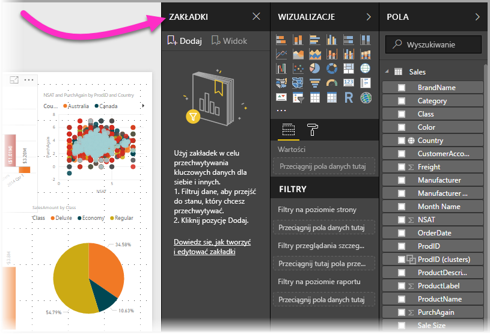

Istnieje wiele zastosowań zakładek. Możesz użyć ich do śledzenia własnych postępów w tworzeniu raportów (zakładki można łatwo dodawać i usuwać oraz zmieniać ich nazwy) lub utworzyć zakładki w celu opracowania prezentacji w stylu programu PowerPoint, która przechodzi przez zakładki w kolejności, opowiadając historię raportu. Mogą też istnieć inne zastosowania zależne od tego, jak chcesz wykorzystać zakładki.

### Włączanie zakładek — wersja zapoznawcza
Możesz wypróbować nową funkcję **zakładek**, począwszy od programu **Power BI Desktop** w wersji **z października 2017 r.**, oraz w przypadku raportów obsługujących zakładki w usłudze **Power BI**. Aby włączyć tę funkcję w wersji zapoznawczej, wybierz pozycję **Plik > Opcje i ustawienia > Opcje > Funkcje wersji zapoznawczej**, a następnie zaznacz pole wyboru obok pozycji **Zakładki**. Po zaznaczeniu należy uruchomić ponownie program Power BI Desktop.

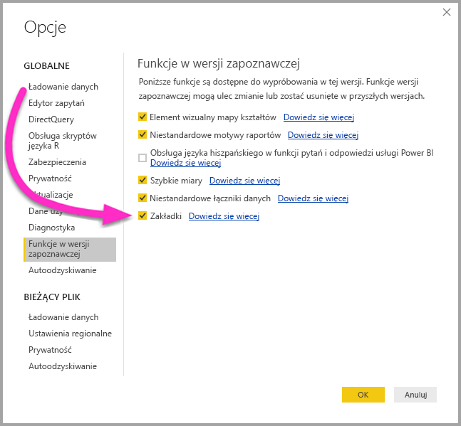

Po zaznaczeniu należy uruchomić ponownie program **Power BI Desktop**.

## Korzystanie z zakładek
Aby użyć zakładek, wybierz wstążkę **Widok**, a następnie zaznacz pole opcji **Okienko zakładek**. 

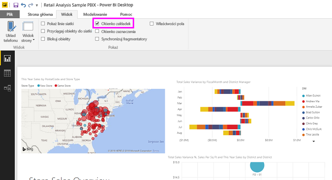

Podczas tworzenia zakładki są w niej zapisywane następujące elementy:

* Bieżąca strona
* Filtry
* Fragmentatory
* Kolejność sortowania
* Lokalizacja szczegółowych informacji
* Widoczność (obiektu przy użyciu okienka **Wybór**)
* Tryby koncentracji uwagi lub **w centrum uwagi** dowolnego widocznego obiektu

Zakładki obecnie nie zapisują stanu obejmującego wyróżnianie. 

Skonfiguruj stronę raportu w taki sposób, w jaki ma być wyświetlana w zakładce. Po odpowiednim ustawieniu strony raportu i wizualizacji wybierz opcję **Dodaj** w okienku **Zakładki**, aby dodać zakładkę. 

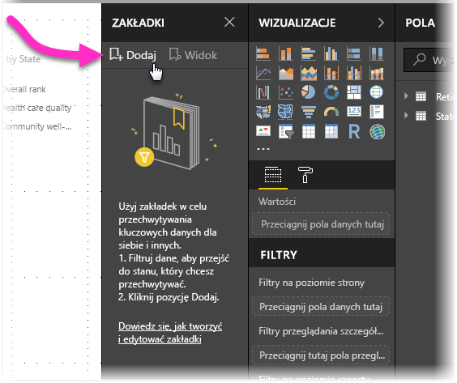

Program **Power BI Desktop** tworzy zakładkę i nadaje jej nazwę rodzajową. Możesz z łatwością *zmienić nazwę* zakładki, a także *usunąć* lub *zaktualizować* zakładkę, wybierając wielokropek obok nazwy zakładki, a następnie wybierając akcję z wyświetlonego menu.

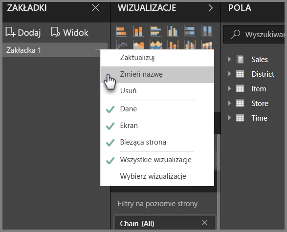

Po utworzeniu zakładki możesz wyświetlić ją, klikając zakładkę w okienku **Zakładki**. 

## Organizowanie zakładek
Podczas tworzenia zakładek możesz zorientować się, że kolejność ich tworzenia nie odpowiada kolejności prezentowania zakładek odbiorcom docelowym. Żaden problem — z łatwością możesz zmienić kolejność zakładek.

W okienku **Zakładki** przeciągnij i upuść zakładki, aby zmienić ich kolejność, jak pokazano na poniższej ilustracji. Żółty pasek między zakładkami wyznacza miejsce, w którym zostanie umieszczona przeciągana zakładka.

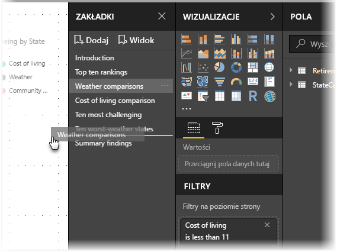

Kolejność zakładek może być ważna w przypadku użycia funkcji **Wyświetl** zakładek, jak opisano w następnej sekcji.

## Zakładki jako pokaz slajdów
Jeśli masz kolekcję zakładek, którą chcesz przedstawić odbiorcom w danej kolejności, możesz wybrać opcję **Wyświetl** w okienku **Zakładki**, aby rozpocząć pokaz slajdów.

W trybie **Wyświetl** należy zwrócić uwagę na kilka funkcji:

1. Nazwa zakładki pojawia się na pasku tytułowym zakładki, który jest wyświetlany u dołu kanwy.
2. Pasek tytułowy zakładki ma strzałki, które umożliwiają przejście do następnej lub poprzedniej zakładki
3. Możesz wyjść z trybu **Wyświetl**, wybierając opcję **Wyjdź** w okienku **Zakładki** lub znak **X** na pasku tytułowym zakładki. 

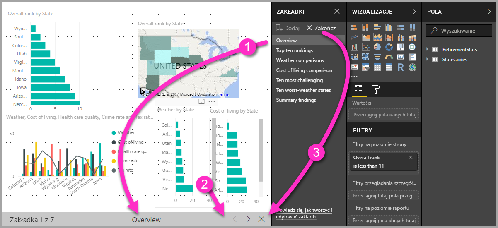

W trybie **Wyświetl** możesz zamknąć **Zakładki** (klikając znak X w okienku), aby zapewnić więcej miejsca dla prezentacji. W trybie **Wyświetl** wszystkie wizualizacje są interaktywne i dostępne do wyróżniania, tak jak podczas interakcji z nimi. 

## Widoczność — użycie okienka Wybór
Wraz z wydaniem zakładek została wprowadzona nowa wersja okienka **Wybór**. Okienko **Wybór** zapewnia listę wszystkich obiektów na bieżącej stronie i umożliwia wybranie obiektu oraz określenie, czy dany obiekt jest widoczny. 

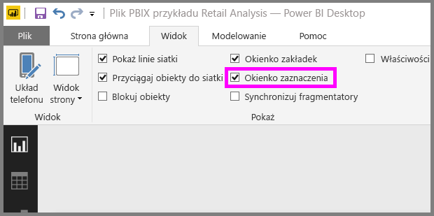

Możesz wybrać obiekt przy użyciu okienka **Wybór**. Ponadto możesz przełączyć widoczność obiektu, klikając ikonę oka po prawej stronie wizualizacji. 

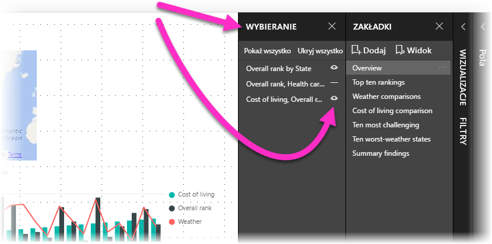

Po dodaniu zakładki widoczny stan każdego obiektu również jest zapisywany w oparciu o ustawienia w okienku **Wybór**. 

Należy zwrócić uwagę, że **fragmentatory** nadal filtrują stronę raportu, niezależnie od tego, czy są widoczne. Możesz utworzyć wiele różnych zakładek z różnymi ustawieniami fragmentatora, aby wyświetlić jedną stronę raportu w zupełnie inny sposób (podkreślając inne informacje szczegółowe) w różnych zakładkach.

## Zakładki kształtów i obrazów
Możesz też połączyć kształty i obrazy z zakładkami. Dzięki tej funkcji kliknięcie obiektu spowoduje wyświetlenie zakładki skojarzonej z tym obiektem. 

Aby przypisać zakładkę do obiektu, wybierz obiekt, a następnie wybierz opcję **Link** z okienka **Formatowanie kształtu**, jak pokazano na poniższej ilustracji.

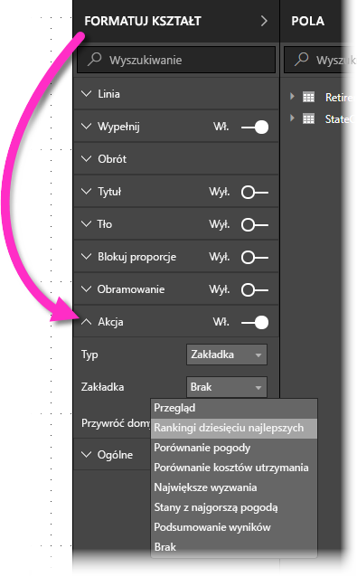

Po przełączeniu suwaka **Link** na opcję **Wł.** możesz wybrać, czy obiekt jest linkiem, czy zakładką. Jeśli wybierzesz zakładkę, możesz następnie wybrać zakładki, z którymi obiekt będzie połączony.

Istnieje wiele interesujących rzeczy, które można wykonać przy użyciu zakładek z połączonym obiektem. Możesz utworzyć wizualną tabelę zawartości na stronie raportu lub zapewnić inne widoki (np. typy wizualne) tych samych informacji, klikając obiekt.

W trybie edycji możesz użyć kombinacji Ctrl + kliknięcie, aby użyć linku. W trybie innym niż tryb edycji wystarczy kliknąć obiekt, aby użyć linku. 

## Użycie funkcji W centrum uwagi
Kolejną funkcją wprowadzoną wraz zakładkami jest funkcja **W centrum uwagi**. Funkcja **W centrum uwagi** umożliwia zwrócenie uwagi na konkretny wykres, np. podczas prezentowania zakładek w trybie **Wyświetl**.

Porównajmy funkcję **W centrum uwagi** do trybu **koncentracji uwagi**, aby zobaczyć, jak się różnią.

1. W trybie **koncentracji uwagi** możesz zastosować jedną wizualizację wypełniającą całą kanwę po wybraniu ikony **trybu koncentracji uwagi**.
2. Przy użyciu funkcji **W centrum uwagi** możesz wyróżnić jedną wizualizację w oryginalnym rozmiarze poprzez zanikanie wszystkich innych wizualizacji do poziomu zbliżonego do przezroczystości. 

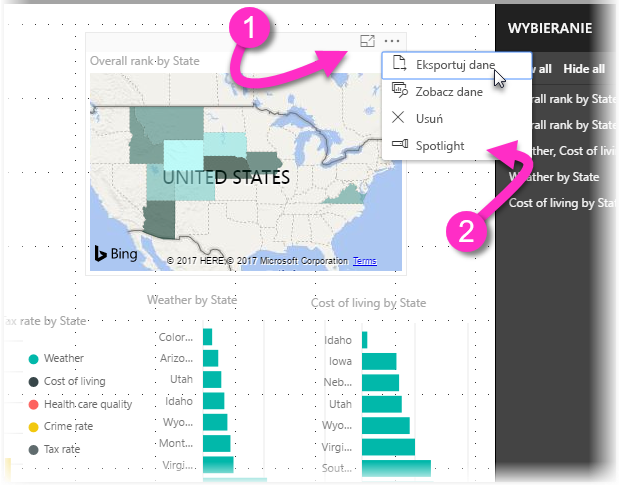

W przypadku kliknięcia ikony **koncentracji uwagi** wizualizacji na poprzedniej stronie strona będzie wyglądać podobnie do następującej:

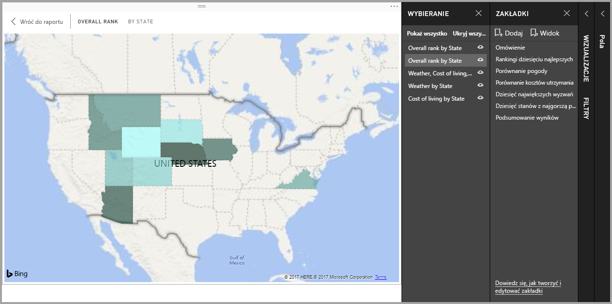

Natomiast w przypadku wybrania funkcji **W centrum uwagi** z menu wielokropka wizualizacji strona będzie wyglądać podobnie do następującej:

W przypadku wybrania dowolnego z trybów podczas dodawania zakładki ten tryb (Koncentracja uwagi lub W centrum uwagi) zostanie zachowany w zakładce.

## Zakładki w usłudze Power BI
Po opublikowaniu raportu w **usłudze Power BI** z co najmniej jedną zakładką możesz wyświetlić te zakładki i wejść z nimi w interakcje w **usłudze Power BI**. Dla każdego opublikowanego raportu musisz mieć co najmniej jedną zakładkę utworzoną w raporcie przed jego opublikowaniem, aby funkcja zakładek była dostępna w **usłudze Power BI**.

Jeśli zakładki są dostępne w raporcie, możesz wybrać opcję **Widok > Okienko wyboru** lub **Widok > Okienko zakładek**, aby wyświetlić te okienka.

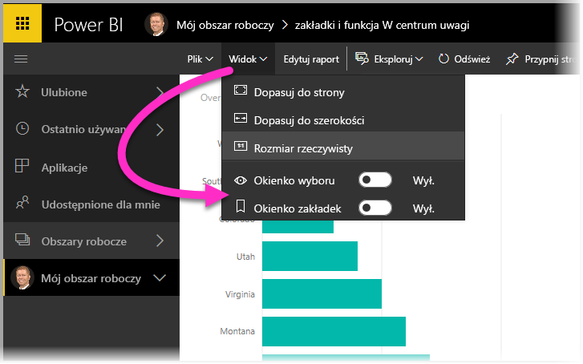

W **usłudze Power BI** **okienko zakładek** działa tak samo jak w programie **Power BI Desktop**, wliczając w to możliwość wybrania opcji **Wyświetl** w celu przedstawienia zakładek w kolejności, tak jak pokazu slajdów.

Pamiętaj, że należy użyć szarego paska tytułowego zakładki, aby nawigować wśród zakładek, zamiast czarnych strzałek (czarne strzałki powodują przechodzenie między stronami raportu, a nie zakładkami).

## Ograniczenia i istotne zagadnienia
W tej wersji zapoznawczej funkcji **zakładek** występują pewne ograniczenia i zagadnienia, które trzeba mieć na uwadze.

* Niestandardowe wizualizacje nie działają z zakładkami, jeśli są *źródłem* filtru. Jeśli używasz niestandardowych wizualizacji do filtrowania elementów na stronie (na przykład fragmentatora chiclet) i powracasz do tej strony przy użyciu zakładki, strona może zostać odfiltrowana, wizualizacja nie zostanie zaktualizowana, aby pokazać, jak strona jest filtrowana. 
* Stan wyróżniania między elementami w okienku raportu *nie* jest zapisywany, gdy tworzysz zakładkę. 
* Jeśli dodasz wizualizację na stronie raportu po utworzeniu zakładki, wizualizacja zostanie wyświetlona w stanie domyślnym. Oznacza to również, że w przypadku wprowadzenia fragmentatora do strony, w której poprzednio utworzono zakładki, fragmentator będzie zachowywać się zgodnie ze stanem domyślnym.
* Przenoszenie wizualizacji po utworzeniu zakładki zostanie odzwierciedlone w zakładce. 
* *Musisz* mieć co najmniej jedną zakładkę w raporcie podczas publikowania go w **usłudze Power BI**, aby zakładki były dostępne w usłudze. Jest to wymaganie dotyczące każdego publikowanego raportu.
* Ponieważ zakładki są obecnie funkcją w wersji zapoznawczej, nie są jeszcze dostępne w programie [**Power BI Desktop dla serwera raportów**](report-server/quickstart-create-powerbi-report.md).

## Następne kroki
Aby uzyskać więcej informacji o podobnych funkcjach lub interakcji z zakładkami, sprawdź następujące artykuły:

* [Używanie przeglądania szczegółowego w programie Power BI Desktop](desktop-drillthrough.md)
* [Wyświetlanie kafelka pulpitu nawigacyjnego lub wizualizacji raportu w trybie koncentracji uwagi](service-focus-mode.md)

