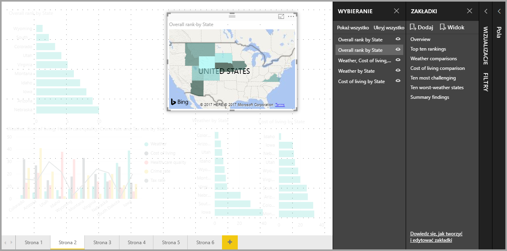

# Używanie zakładek w celu udostępniania szczegółowych informacji i tworzenia historii w usłudze Power BI 
Przy użyciu **zakładek** w usłudze Power BI możesz przechwycić obecnie skonfigurowany widok strony raportu wraz z filtrowaniem i stanem wizualizacji, aby później mieć możliwość powrotu do tego stanu poprzez wybranie zapisanej zakładki. 

Możesz też utworzyć kolekcję zakładek, uporządkować je w żądanej kolejności, a następnie przejść przez każdą zakładkę w prezentacji, aby podkreślić serię szczegółowych informacji lub historię, którą chcesz opowiedzieć przy użyciu wizualizacji i raportów. 

Istnieje wiele zastosowań zakładek. Możesz użyć ich do śledzenia swoich postępów w tworzeniu raportów (zakładki można łatwo dodawać i usuwać oraz zmieniać ich nazwy) lub utworzyć zakładki w celu opracowania prezentacji w stylu programu PowerPoint, która opowiada historię raportu zakładka po zakładce. Mogą też istnieć inne zastosowania zależne od tego, jak chcesz wykorzystać zakładki.

### Włączanie podglądu zakładek (wersje wydane przed marcem 2018 r.)
Zakładki są ogólnie dostępne w programie Power BI Desktop od marca 2018 r. 

Zawsze sugerujemy uaktualnienie do najnowszej wersji. Jednak jeśli Twoja wersja programu Power BI Desktop została wydana wcześniej, możesz wypróbować nową funkcję **zakładek** w programie **Power BI Desktop** od wersji **z października 2017 r.**, a także korzystając z raportów obsługujących zakładki w usłudze **Power BI**. Aby włączyć tę funkcję w wersji zapoznawczej, wybierz pozycję **Plik > Opcje i ustawienia > Opcje > Funkcje wersji zapoznawczej**, a następnie zaznacz pole wyboru obok pozycji **Zakładki**. 

Aby włączyć wersję zapoznawczą zakładek, po dokonaniu wyboru musisz ponownie uruchomić program **Power BI Desktop**.

## Korzystanie z zakładek
Aby użyć zakładek, wybierz wstążkę **Widok**, a następnie zaznacz pole opcji **Okienko zakładek**. 

Podczas tworzenia zakładki są w niej zapisywane następujące elementy:

* Bieżąca strona
* Filtry
* Fragmentatory
* Kolejność sortowania
* Lokalizacja szczegółowych informacji
* Widoczność (obiektu przy użyciu okienka **Wybór**)
* Tryby koncentracji uwagi lub **w centrum uwagi** dowolnego widocznego obiektu

Zakładki obecnie nie zapisują stanu obejmującego wyróżnianie. 

Skonfiguruj stronę raportu w taki sposób, w jaki ma być wyświetlana w zakładce. Po odpowiednim ustawieniu strony raportu i wizualizacji wybierz opcję **Dodaj** w okienku **Zakładki**, aby dodać zakładkę. 

Program **Power BI Desktop** tworzy zakładkę i nadaje jej nazwę rodzajową. Możesz z łatwością *zmienić nazwę* zakładki, a także ją *usunąć* lub *zaktualizować*, wybierając wielokropek obok nazwy zakładki, a następnie wybierając akcję z wyświetlonego menu.

Po utworzeniu zakładki możesz wyświetlić ją, klikając zakładkę w okienku **Zakładki**. 

Możesz też wybrać, czy każda zakładka będzie stosować właściwości *danych*, takie jak filtry i fragmentatory, właściwości *wyświetlania*, takie jak reflektor i jego widoczność, oraz zmiany strony, które prezentują stronę widoczną podczas dodawania zakładki. Te możliwości są przydatne, jeśli używasz zakładek do przełączania się między typami wizualizacji — w takim przypadku prawdopodobnie chcesz wyłączyć właściwości danych, więc filtry nie są resetowane, gdy użytkownicy zmieniają typy wizualizacji. 

Aby wprowadzić takie zmiany, wybierz wielokropek obok nazwy zakładki, jak pokazano na poprzedniej ilustracji, a następnie zaznacz pola wyboru obok kontrolek *Dane*, *Wyświetlanie* i innych albo usuń zaznaczenie tych pól. 

## Organizowanie zakładek
Podczas tworzenia zakładek możesz zorientować się, że kolejność ich tworzenia nie odpowiada kolejności prezentowania zakładek odbiorcom docelowym. Żaden problem — z łatwością możesz zmienić kolejność zakładek.

W okienku **Zakładki** przeciągnij i upuść zakładki, aby zmienić ich kolejność, jak pokazano na poniższej ilustracji. Żółty pasek między zakładkami wyznacza miejsce, w którym zostanie umieszczona przeciągana zakładka.

Kolejność zakładek może być ważna w przypadku użycia funkcji **Wyświetl** zakładek, jak opisano w następnej sekcji.

## Zakładki jako pokaz slajdów
Jeśli masz kolekcję zakładek, którą chcesz przedstawić odbiorcom w danej kolejności, możesz wybrać opcję **Wyświetl** w okienku **Zakładki**, aby rozpocząć pokaz slajdów.

W trybie **Wyświetl** należy zwrócić uwagę na kilka funkcji:

1. Nazwa zakładki pojawia się na pasku tytułowym zakładki, który jest wyświetlany u dołu kanwy.
2. Na pasku tytułowym zakładki znajdują się strzałki, które umożliwiają przejście do następnej lub poprzedniej zakładki.
3. Możesz wyjść z trybu **Wyświetl**, wybierając opcję **Wyjdź** w okienku **Zakładki** lub znak **X** na pasku tytułowym zakładki. 

W trybie **Wyświetl** możesz zamknąć **Zakładki** (klikając znak X w okienku), aby zapewnić więcej miejsca dla prezentacji. W trybie **Wyświetl** wszystkie wizualizacje są interaktywne i dostępne do wyróżniania krzyżowego, tak jak podczas interakcji z nimi. 

## Widoczność — użycie okienka Wybór
Wraz z wydaniem zakładek została wprowadzona nowa wersja okienka **Wybór**. W okienku **Wybór** znajduje się lista wszystkich obiektów na bieżącej stronie, z której można wybrać obiekt i określić, czy jest on widoczny. 

Możesz wybrać obiekt przy użyciu okienka **Wybór**. Ponadto możesz przełączyć widoczność obiektu, klikając ikonę oka po prawej stronie wizualizacji. 

Po dodaniu zakładki widoczny stan każdego obiektu również jest zapisywany w oparciu o ustawienia w okienku **Wybór**. 

Należy zwrócić uwagę, że **fragmentatory** nadal filtrują stronę raportu, niezależnie od tego, czy są widoczne. Możesz utworzyć wiele różnych zakładek z różnymi ustawieniami fragmentatora, aby wyświetlić jedną stronę raportu w zupełnie inny sposób (podkreślając inne informacje szczegółowe) w różnych zakładkach.

## Zakładki kształtów i obrazów
Możesz też połączyć kształty i obrazy z zakładkami. Dzięki tej funkcji kliknięcie obiektu spowoduje wyświetlenie zakładki skojarzonej z tym obiektem. Może być to przydatne podczas pracy z przyciskami; aby dowiedzieć się więcej, przeczytaj artykuł dotyczący [używania przycisków w usłudze Power BI](desktop-buttons.md). 

Aby przypisać zakładkę do obiektu, wybierz obiekt, a następnie rozwiń sekcję **Akcja** z okienka **Formatowanie kształtu**, jak pokazano na poniższej ilustracji.

Po przełączeniu suwaka **Akcja** do pozycji **Wł.** możesz wybrać, czy obiekt jest przyciskiem Wstecz, zakładką, czy poleceniem pytań i odpowiedzi. Jeśli wybierzesz zakładkę, możesz następnie wybrać zakładki, z którymi obiekt będzie połączony.

Istnieje wiele interesujących rzeczy, które można wykonać przy użyciu zakładek z połączonym obiektem. Możesz utworzyć wizualną tabelę zawartości na stronie raportu lub zapewnić inne widoki (np. typy wizualne) tych samych informacji, klikając obiekt.

W trybie edycji możesz użyć kombinacji Ctrl + kliknięcie, aby użyć linku. W trybie innym niż tryb edycji wystarczy kliknąć obiekt, aby użyć linku. 

## Grupy zakładek

Począwszy od wersji programu **Power BI Desktop** z sierpnia 2018 r., można tworzyć grupy zakładek i korzystać z nich. Grupa zakładek to kolekcja określonych zakładek, które mogą być wyświetlane i uporządkowane jako grupa. 

Aby utworzyć grupę zakładek, naciśnij i przytrzymaj klawisz CTRL, wybierz zakładki, które chcesz dołączyć do grupy, a następnie kliknij wielokropek obok wybranej zakładki i wybierz pozycję **Grupuj** z wyświetlonego menu.

Program **Power BI Desktop** automatycznie nadaje grupie nazwę *Grupa 1*. Można jednak kliknąć dwukrotnie nazwę i zmienić ją na dowolną inną nazwę.

Kliknięcie nazwy dowolnej grupy zakładek powoduje tylko rozwinięcie lub zwinięcie grupy zakładek — sama nazwa nie reprezentuje zakładki. 

Użycie funkcji zakładek **Wyświetl** powoduje wykonanie następujących działań:

* Jeśli wybrana zakładka znajduje się w grupie po wybraniu pozycji **Wyświetl** z poziomu zakładek, w sesji przeglądania są wyświetlane tylko zakładki *z tej grupy*. 

* Jeśli wybrana zakładka nie należy do grupy lub znajduje się na najwyższym poziomie (na przykład nazwa grupy zakładek), są odtwarzane wszystkie zakładki w całym raporcie, w tym zakładki z każdej grupy. 

Aby rozgrupować zakładki, wybierz zakładkę w grupie, kliknij wielokropek, a następnie wybierz pozycję **Rozgrupuj** z wyświetlonego menu. 

Wybranie pozycji **Rozgrupuj** dla dowolnej zakładki z grupy powoduje usunięcie wszystkich zakładek z grupy (zostanie usunięta grupa, a nie same zakładki). Aby więc usunąć pojedynczą zakładkę z grupy, musisz **rozgrupować** dowolny element członkowski z tej grupy (spowoduje to usunięcie grupowania), a następnie wybrać elementy członkowskie, które chcesz dodać do nowej grupy (klikając poszczególne zakładki z wciśniętym klawiszem CTRL), i wybrać ponownie pozycję  **Grupuj**. 

## Użycie funkcji W centrum uwagi
Kolejną funkcją wprowadzoną wraz zakładkami jest funkcja **W centrum uwagi**. Funkcja **W centrum uwagi** umożliwia zwrócenie uwagi na konkretny wykres, np. podczas prezentowania zakładek w trybie **Wyświetl**.

Porównajmy funkcję **W centrum uwagi** do trybu **koncentracji uwagi**, aby zobaczyć, jak się różnią.

1. W trybie **koncentracji uwagi** możesz zastosować jedną wizualizację wypełniającą całą kanwę po wybraniu ikony **trybu koncentracji uwagi**.
2. Przy użyciu funkcji **W centrum uwagi** możesz wyróżnić jedną wizualizację w oryginalnym rozmiarze przez zanikanie wszystkich innych wizualizacji do poziomu zbliżonego do przezroczystości. 

W przypadku kliknięcia ikony **koncentracji uwagi** wizualizacji na poprzedniej stronie strona będzie wyglądać podobnie do następującej:

Natomiast w przypadku wybrania funkcji **W centrum uwagi** z menu wielokropka wizualizacji strona będzie wyglądać podobnie do następującej:

W przypadku wybrania dowolnego z trybów podczas dodawania zakładki ten tryb (Koncentracja uwagi lub W centrum uwagi) zostanie zachowany w zakładce.

## Zakładki w usłudze Power BI
Po opublikowaniu raportu w **usłudze Power BI** z co najmniej jedną zakładką możesz wyświetlić te zakładki i wejść z nimi w interakcje w **usłudze Power BI**. Jeśli zakładki są dostępne w raporcie, możesz wybrać opcję **Widok > Okienko wyboru** lub **Widok > Okienko zakładek**, aby wyświetlić te okienka.

W **usłudze Power BI** **okienko zakładek** działa tak samo jak w programie **Power BI Desktop**, wliczając w to możliwość wybrania opcji **Wyświetl** w celu przedstawienia zakładek w kolejności, tak jak pokazu slajdów.

Pamiętaj, że należy użyć szarego paska tytułowego zakładki, aby nawigować wśród zakładek, zamiast czarnych strzałek (czarne strzałki powodują przechodzenie między stronami raportu, a nie zakładkami).

## Ograniczenia i istotne zagadnienia
W tej wersji funkcji **zakładek** występują pewne ograniczenia i zagadnienia, które trzeba mieć na uwadze.

* Większość wizualizacji niestandardowych powinna działać prawidłowo w przypadku tworzenia zakładek. Jeśli wystąpią problemy z tworzeniem zakładek i wizualizacją niestandardową, skontaktuj się z autorem tej wizualizacji i poproś o dodanie do niej opcji obsługi zakładek. 
* Jeśli dodasz wizualizację na stronie raportu po utworzeniu zakładki, wizualizacja zostanie wyświetlona w stanie domyślnym. Oznacza to również, że w przypadku wprowadzenia fragmentatora do strony, w której poprzednio utworzono zakładki, fragmentator będzie zachowywać się zgodnie ze stanem domyślnym.
* Przenoszenie wizualizacji po utworzeniu zakładki zostanie odzwierciedlone w zakładce. 

## Następne kroki
Aby uzyskać więcej informacji o podobnych funkcjach lub interakcji z zakładkami, sprawdź następujące artykuły:

* [Używanie przeglądania szczegółowego w programie Power BI Desktop](desktop-drillthrough.md)
* [Wyświetlanie kafelka pulpitu nawigacyjnego lub wizualizacji raportu w trybie koncentracji uwagi](service-focus-mode.md)

