# Formatowanie warunkowe w tabelach 
Za pomocą formatowania warunkowego dla tabel można określić niestandardowe kolory komórek, w tym gradienty kolorów, na podstawie wartości komórek lub na podstawie innych wartości bądź pól. Można również wyświetlić wartości komórek ze słupkami danych. 

Aby uzyskać dostęp do formatowania warunkowego, w obszarze **Pola** w okienku **Wizualizacje** programu Power BI Desktop w obszarze **Wartości** wybierz strzałkę w dół obok wartości, którą chcesz sformatować (lub kliknij to pole prawym przyciskiem myszy). Można zarządzać tylko formatowaniem warunkowym pól w obszarze **Wartości** w obszarze **Pola**.

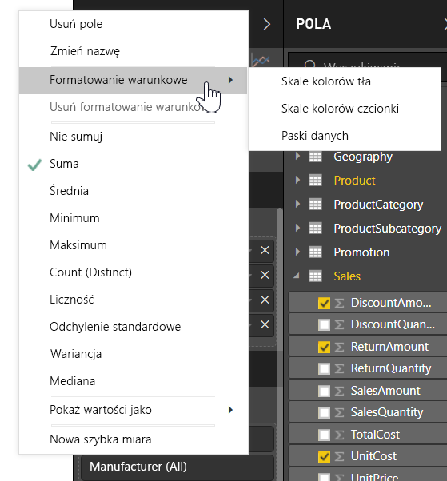

W poniższych sekcjach opisano każdą z tych opcji formatowania warunkowego. W jednej kolumnie tabeli można zastosować więcej niż jedną opcję.

> [!NOTE]
> Formatowanie warunkowe zastosowane do tabeli zastępuje wszystkie niestandardowe style tabeli zastosowane do sformatowanych warunkowo komórek.

Aby usunąć formatowanie warunkowe z wizualizacji, wystarczy ponownie kliknąć pole prawym przyciskiem myszy i wybrać pozycję **Usuń formatowanie warunkowe** oraz typ formatowania do usunięcia.

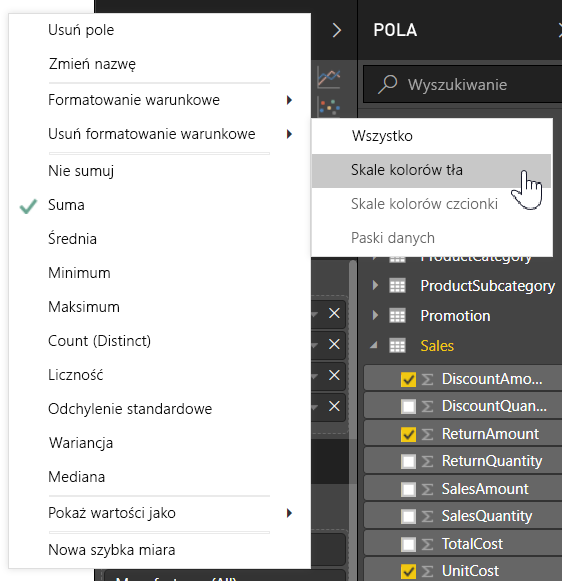

## Skale kolorów tła

Wybranie pozycji **Formatowanie warunkowe**, a następnie pozycji **Skale kolorów tła** powoduje wyświetlenie następującego okna dialogowego.

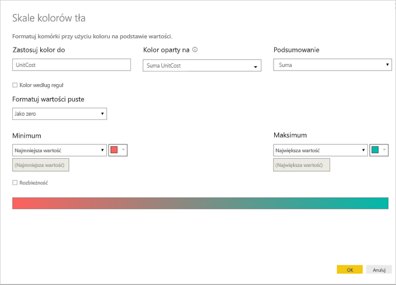

Aby kolor był oparty na polu wybranym z modelu danych, możesz ustawić wartość **Kolor oparty na** na to pole. Ponadto możesz określić typ agregacji dla wybranego pola za pomocą wartości **Podsumowanie**. Pole do pokolorowania jest podane w polu **Zastosuj kolor do** dla przypomnienia. Formatowanie warunkowe można zastosować do pól tekstowych i pól daty, pod warunkiem, że jako podstawę formatowania wybierzesz wartość liczbową.

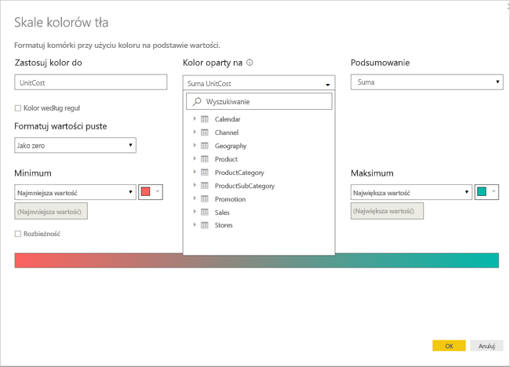

Aby użyć odrębnych wartości kolorów dla danych zakresów wartości, wybierz pozycję **Kolor według reguł**. Aby zastosować spektrum kolorów, pozostaw pozycję **Kolor według reguł** niezaznaczoną. 

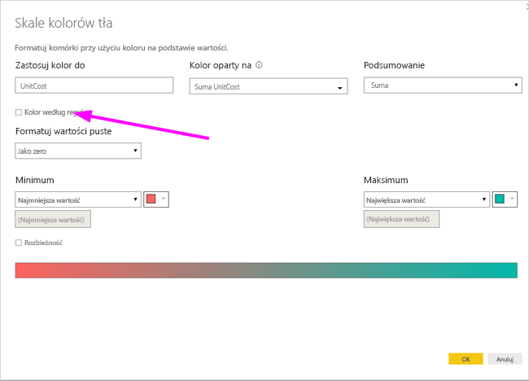

### Kolor według reguł

Po wybraniu pozycji **Kolor według reguł** możesz wprowadzić jeden lub większą liczbę zakresów wartości i dla każdego z nich ustawić kolor.  Każdy zakres wartości rozpoczyna się od warunku *Jeśli wartość*, a także zawiera warunek wartości *i* oraz kolor.

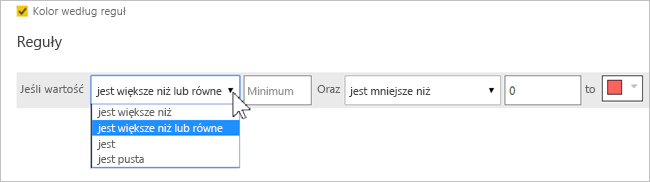

Komórki tabeli zawierające wartości z każdego zakresu zostaną wypełnione odpowiednimi kolorami. Na poniższym rysunku przedstawiono trzy reguły.

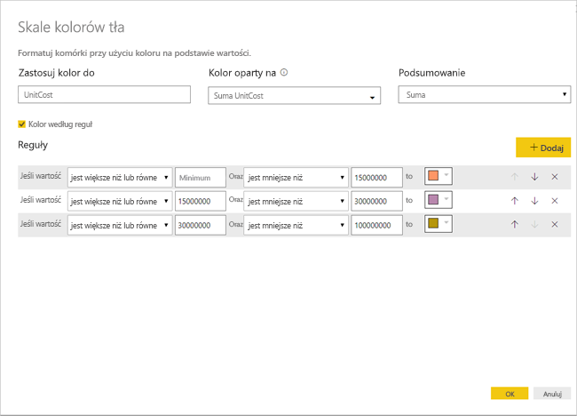

Przykładowa tabela teraz wygląda następująco:

### Kolor od wartości minimalnej do maksymalnej

Skonfigurować możesz wartości *Minimum* i *Maksimum* oraz ich kolory. W przypadku wybrania pola **Rozbieżność** można skonfigurować też wartość opcjonalną *Środek*.

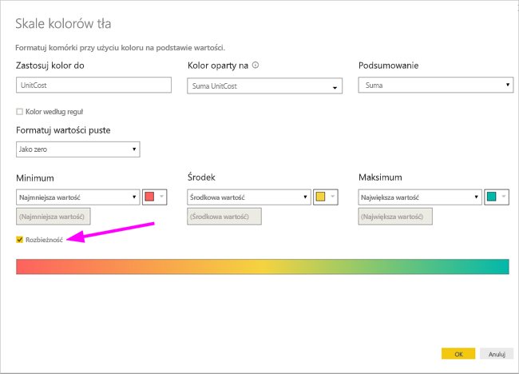

Przykładowa tabela teraz wygląda następująco:

## Skale kolorów czcionki

Wybranie pozycji **Formatowanie warunkowe**, a następnie pozycji **Skale kolorów czcionki** powoduje wyświetlenie następującego okna dialogowego. To okno dialogowe jest podobne do okna dialogowego **Skale kolorów tła**, ale zmienia kolor czcionki zamiast koloru tła komórki.

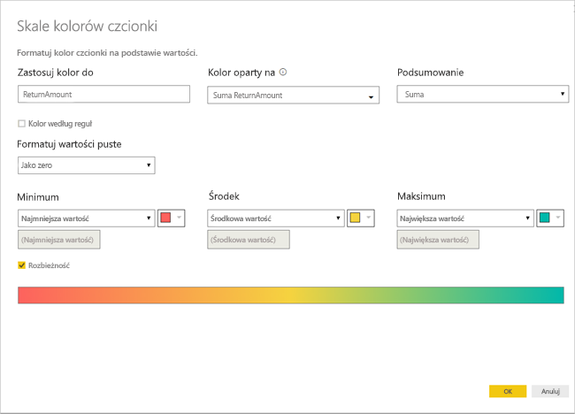

Przykładowa tabela teraz wygląda następująco:

## Paski danych

Wybranie pozycji **Formatowanie warunkowe**, a następnie pozycji **Paski danych** powoduje wyświetlenie następującego okna dialogowego. 

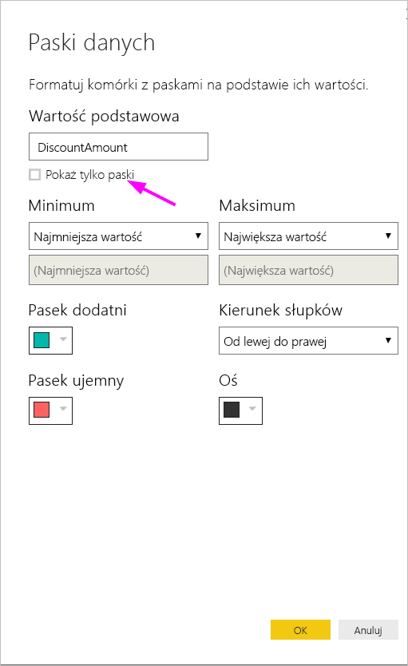

Domyślnie opcja **Pokaż tylko paski** nie jest zaznaczona, więc w komórce tabeli jest wyświetlany zarówno pasek, jak i rzeczywista wartość.

Jeśli opcja **Pokaż tylko paski** jest zaznaczona, w komórce tabeli jest wyświetlany tylko pasek.

## Formatowanie koloru według wartości pola

Miara lub kolumna z kolorem określonym za pomocą wartości tekstowej lub kodu szesnastkowego umożliwia zastosowanie tego koloru do tła koloru czcionki tabeli albo wizualizacji macierzy. Można również utworzyć niestandardową logikę dla danego pola i zastosować za jej pomocą żądany kolor do czcionki lub tła.

Na przykład poniższa tabela zawiera kolor skojarzony z każdym modelem produktu. 

Aby sformatować komórkę na podstawie jej wartości pola, wybierz okno dialogowe **Formatowanie warunkowe**, klikając prawym przyciskiem myszy kolumnę *Kolor* dla tej wizualizacji — w tym przypadku wybierz z menu pozycję **Kolor tła**. 

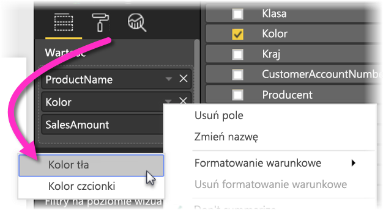

W wyświetlonym oknie dialogowym wybierz pozycję **Wartość pola** w obszarze rozwijanym **Formatuj według**, jak pokazano na poniższej ilustracji.

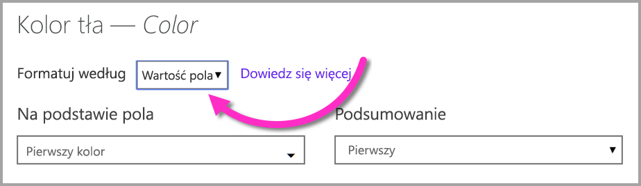

Możesz powtórzyć ten proces dla koloru czcionki — wynikiem w wizualizacji będzie jednolity kolor w kolumnie **Kolor**, jak pokazano na poniższym ekranie.

Możesz też utworzyć obliczenie w języku DAX oparte na logice biznesowej, którego wynikiem są różne kody szesnastkowe oparte na Twoich warunkach. Jest to zazwyczaj łatwiejsze niż tworzenie wielu reguł w oknie dialogowym formatowania warunkowego. Zwróć uwagę na pole *ColorKPI* na poniższej przykładowej ilustracji.

Następnie możesz ustawić wartość pola **Kolor tła** w poniższy sposób.

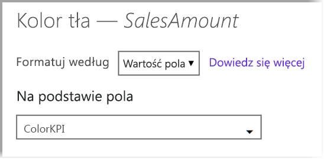

Możesz uzyskać takie wyniki jak w poniższej macierzy.

Utworzyć można znacznie więcej odmian, używając wyobraźni i języka DAX.

## Następne kroki
Aby uzyskać więcej informacji, zobacz następujący artykuł:  

* [Porady i wskazówki dotyczące formatowania kolorów w usłudze Power BI](visuals/service-tips-and-tricks-for-color-formatting.md)  

