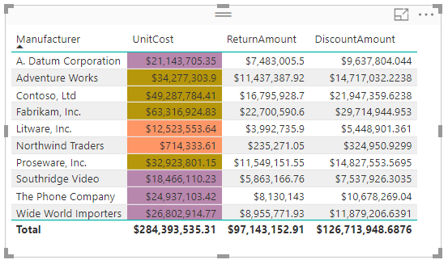
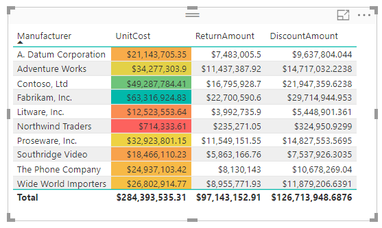
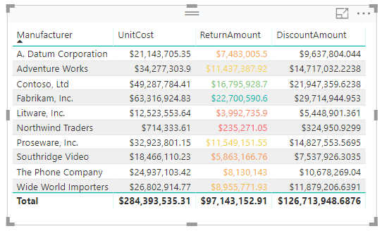
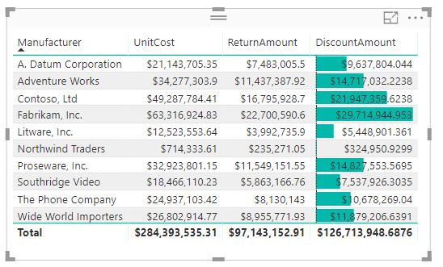
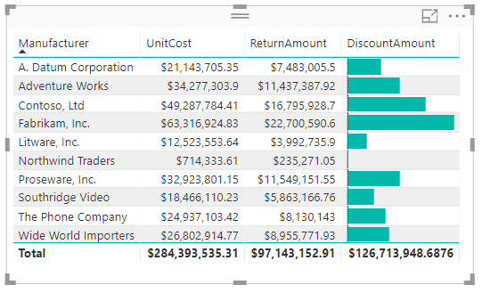

# Formatowanie warunkowe w tabelach 
Za pomocą formatowania warunkowego dla tabel można określić niestandardowe kolory komórek, w tym gradienty kolorów, na podstawie wartości komórek lub na podstawie innych wartości bądź pól. Można również wyświetlić wartości komórek ze słupkami danych. 

Aby uzyskać dostęp do formatowania warunkowego, w obszarze **Pola** w okienku **Wizualizacje** programu Power BI Desktop w obszarze **Wartości** wybierz strzałkę w dół obok wartości, którą chcesz sformatować (lub kliknij to pole prawym przyciskiem myszy). Można zarządzać tylko formatowaniem warunkowym pól w obszarze **Wartości** w obszarze **Pola**.

W poniższych sekcjach opisano każdą z tych trzech opcji formatowania warunkowego. W jednej kolumnie tabeli można zastosować więcej niż jedną opcję.

> [!NOTE]
> Formatowanie warunkowe zastosowane do tabeli zastępuje wszystkie niestandardowe style tabeli zastosowane do sformatowanych warunkowo komórek.

Aby usunąć formatowanie warunkowe z wizualizacji, wystarczy ponownie kliknąć pole prawym przyciskiem myszy i wybrać pozycję **Usuń formatowanie warunkowe** oraz typ formatowania do usunięcia.

## Skale kolorów tła

Wybranie pozycji **Formatowanie warunkowe**, a następnie pozycji **Skale kolorów tła** powoduje wyświetlenie następującego okna dialogowego.

Aby kolor był oparty na polu wybranym z modelu danych, możesz ustawić wartość **Kolor oparty na** na to pole. Ponadto możesz określić typ agregacji dla wybranego pola za pomocą wartości **Podsumowanie**. Pole do pokolorowania jest podane w polu **Zastosuj kolor do** dla przypomnienia. Formatowanie warunkowe można zastosować do pól tekstowych i pól daty, pod warunkiem, że jako podstawę formatowania wybierzesz wartość liczbową.

Aby użyć odrębnych wartości kolorów dla danych zakresów wartości, wybierz pozycję **Kolor według reguł**. Aby zastosować spektrum kolorów, pozostaw pozycję **Kolor według reguł** niezaznaczoną. 

### Kolor według reguł

Po wybraniu pozycji **Kolor według reguł** możesz wprowadzić jeden lub większą liczbę zakresów wartości i dla każdego z nich ustawić kolor.  Każdy zakres wartości rozpoczyna się od warunku *Jeśli wartość*, a także zawiera warunek wartości *i* oraz kolor.

Komórki tabeli zawierające wartości z każdego zakresu zostaną wypełnione odpowiednimi kolorami. Na poniższym rysunku przedstawiono trzy reguły.

Przykładowa tabela teraz wygląda następująco:

### Kolor od wartości minimalnej do maksymalnej

Skonfigurować możesz wartości *Minimum* i *Maksimum* oraz ich kolory. W przypadku wybrania pola **Rozbieżność** można skonfigurować też wartość opcjonalną *Środek*.

Przykładowa tabela teraz wygląda następująco:

## Skale kolorów czcionki

Wybranie pozycji **Formatowanie warunkowe**, a następnie pozycji **Skale kolorów czcionki** powoduje wyświetlenie następującego okna dialogowego. To okno dialogowe jest podobne do okna dialogowego **Skale kolorów tła**, ale zmienia kolor czcionki zamiast koloru tła komórki.

Przykładowa tabela teraz wygląda następująco:

## Paski danych

Wybranie pozycji **Formatowanie warunkowe**, a następnie pozycji **Paski danych** powoduje wyświetlenie następującego okna dialogowego. 

Domyślnie opcja **Pokaż tylko paski** nie jest zaznaczona, więc w komórce tabeli jest wyświetlany zarówno pasek, jak i rzeczywista wartość.

Jeśli opcja **Pokaż tylko paski** jest zaznaczona, w komórce tabeli jest wyświetlany tylko pasek.

