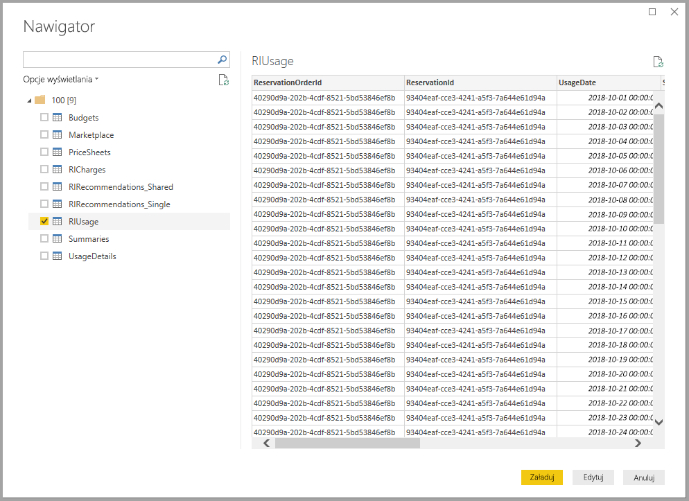

# Nawiązywanie połączenia z łącznikiem Azure Consumption Insights za pomocą programu Power BI Desktop (wersja beta)
Korzystając z łącznika **Azure Consumption Insights**, można za pomocą usługi **Power BI Desktop** połączyć się z platformą Azure i uzyskać szczegółowe dane oraz informacje użyciu usług Azure w danej organizacji. Informacje o użyciu platformy Azure w organizacji można także prezentować w raportach i udostępniać, tworząc miary, kolumny niestandardowe i wizualizacje. To wydanie łącznika **Azure Consumption Insights** jest w wersji beta i może ulec zmianom.

W tym artykule dowiesz się, jak nawiązać połączenie z łącznikiem **Azure Consumption Insights** i uzyskać potrzebne dane, a także jak przeprowadzić migrację za pomocą łącznika Azure Enterprise Connector. Artykuł zawiera również mapowanie *kolumn ze szczegółami użycia* dostępnych w interfejsie API łącznika **Azure Consumption Insights**.

## Nawiązywanie połączenia z łącznikiem Azure Consumption Insights
Aby pomyślnie nawiązać połączenie za pomocą łącznika **Azure Consumption Insights**, potrzebny jest dostęp do funkcji dla przedsiębiorstw w witrynie Azure Portal.

W celu nawiązania połączenia za pomocą łącznika **Azure Consumption Insights**, wybierz pozycję **Pobierz dane** na wstążce **Narzędzia główne** w programie **Power BI Desktop**. Wybierz pozycję **Usługi online** z listy kategorii po lewej stronie. Zostanie wyświetlona pozycja **Microsoft Azure Consumption Insights (Beta) (beta)**. Wybierz pozycję **Połącz**.

W wyświetlonym oknie dialogowym wybierz pozycję *Numer rejestracji*.

* Numer rejestracji można uzyskać w portalu [Azure Enterprise Portal](https://ea.azure.com), w lokalizacji przedstawionej na poniższym obrazie:
  
  
  
  Ta wersja łącznika obsługuje tylko rejestracje przedsiębiorstw z adresu https://ea.azure.com. Rejestracje z terenu Chin nie są obecnie obsługiwane.

Następnie podaj *Klucz dostępu* do nawiązania połączenia.

* Klucz dostępu na potrzeby rejestracji znajduje się w portalu [Azure Enterprise Portal](https://ea.azure.com).
  
  

Kiedy podasz swój *Klucz dostępu* i wybierzesz pozycję **Połącz**, zostanie wyświetlone okno **Nawigator** z dziewięcioma dostępnymi tabelami: 
* **Budgets**. Dostarcza szczegóły budżetu, pozwalając wyświetlić faktyczne koszty lub użycie względem istniejących celów budżetu. 
* **MarketPlace**. Dostarcza oparte na użyciu opłaty platformy Azure Marketplace.
* **PriceSheets**. Dostarcza odpowiednie stawki według miernika w ramach rejestracji.
* **RICharges**. Dostarcza opłaty powiązane z wystąpieniami zarezerwowanymi w ciągu 24 ostatnich miesięcy.
* **RIRecommendations_Single**. Dostarcza rekomendacje zakupu wystąpienia zarezerwowanego na podstawie Twoich trendów użycia w ramach jednej subskrypcji w ciągu ostatnich 7, 30 do 60 dni.
* **RIRecommendations_Shared**. Dostarcza rekomendacje zakupu wystąpienia zarezerwowanego na podstawie Twoich trendów użycia w ramach wszystkich Twoich subskrypcji w ciągu ostatnich 7, 30 do 60 dni.
* **RIUsage**. Dostarcza szczegóły użycia dla istniejących wystąpień zarezerwowanych w ciągu ostatniego miesiąca.
* **Summaries**. Dostarcza miesięczne podsumowanie dotyczące salda, nowych zakupów, opłat za usługę Azure Marketplace, korekt i opłat za nadwyżki.
* **UsageDetails**. Dostarcza podział wykorzystanych ilości i szacowanych opłat w ramach rejestracji.

Zaznacz pole wyboru obok danej tabeli, aby wyświetlić jej podgląd. Możesz zaznaczyć co najmniej jedną tabelę, zaznaczając pole obok jej nazwy i wybierając pozycję **Load** (Załaduj).

> [!NOTE]
> Tabele *Summary* (Podsumowanie) i *PriceSheet* (Cennik) są dostępne tylko w przypadku klucza interfejsu API na poziomie rejestracji. Ponadto dane w tabelach *Usage* (Użycie) i *PriceSheet* (Cennik) domyślnie zawierają dane z bieżącego miesiąca. Zawartości tabel *Summary* (Podsumowanie) i *MarketPlace* nie jest ograniczona do bieżącego miesiąca.
> 
> 

Po wybraniu pozycji **Load** (Załaduj) dane zostają załadowane do programu **Power BI Desktop**.

Po załadowaniu wybranych danych odpowiednie tabele i pola są widoczne w okienku **Pola**.

## Korzystanie z łącznika Azure Consumption Insights
Aby można było korzystać z łącznika **Azure Consumption Insights**, potrzebny jest dostęp do funkcji dla przedsiębiorstw w witrynie Azure Portal.

Po pomyślnym załadowaniu danych za pomocą łącznika **Azure Consumption Insights** możesz tworzyć własne miary i kolumny, korzystając z **edytora zapytań**. Możesz też tworzyć wizualizacje, raporty i pulpity nawigacyjne oraz udostępniać je w **usłudze Power BI**.

Platforma Azure zawiera kolekcję przykładowych zapytań niestandardowych, które można pobierać za pomocą pustego zapytania. Aby to zrobić, na karcie **Narzędzia główne** w programie **Power BI Desktop** wybierz strzałkę listy rozwijanej **Pobierz dane**, a następnie wybierz pozycję **Puste zapytanie**. Można to także zrobić w **edytorze zapytań**, klikając prawym przyciskiem myszy w okienku **Zapytania** po lewej stronie i wybierając z wyświetlonego menu pozycję **Nowe zapytanie > Puste zapytanie**.

Na **pasku formuły** wpisz następujący ciąg:

    = MicrosoftAzureConsumptionInsights.Contents

Zostanie wyświetlona kolekcja przykładów, jak na poniższym obrazie:

Podczas pracy z raportami i tworzenia zapytań korzystaj z następujących wskazówek:

* Aby zdefiniować liczbę miesięcy, zaczynając od dnia dzisiejszego, użyj parametru *numberOfMonth*.
  * Aby określić liczbę miesięcy (od dnia dzisiejszego) do zaimportowania, podaj wartość od zera do 36. Ze względu na ograniczenia dotyczące importowania i ilości danych obsługiwanych przez zapytania w usłudze Power BI zalecamy, aby nie importować więcej niż 12 miesięcy danych.
* Aby zdefiniować zakres miesięcy z przeszłości, użyj parametrów *startBillingDataWindow* i *endBillingDataWindow*.
* *Nie* używaj parametru *numberOfMonth* w połączeniu z parametrem *startBillingDataWindow* ani *endBillingDataWindow*.

## Migrowanie danych z łącznika Azure Enterprise Connector
Część klientów ma wizualizacje utworzone za pomocą łącznika *Azure Enterprise Connector (beta)*, który w przyszłości przestanie być obsługiwany i jest obecnie zastępowany łącznikiem **Azure Consumption Insights**. Łącznik **Azure Consumption Insights** obejmuje następujące funkcje i udoskonalenia:

* Dodatkowe źródła danych dla parametrów *Balance Summary* i *Marketplace Purchases*
* Nowe zaawansowane parametry, takie jak *startBillingDataWindow* i *endBillingDataWindow*
* Wyższa wydajność i szybsze reagowanie

Poniższa procedura pomoże klientom w przejściu na nowszy łącznik **Azure Consumption Insights** i zachowaniu utworzonych zasobów, takich jak niestandardowe pulpity nawigacyjne oraz raporty.

### Krok 1. Połączenie z platformą Azure przy użyciu nowego łącznika
Pierwszym krokiem jest nawiązanie połączenia przy użyciu łącznika **Azure Consumption Insights**, co opisano szczegółowo wcześniej w tym artykule. Wybierz pozycję **Pobierz dane > Puste zapytanie** na wstążce **Narzędzia główne** w programie **Power BI Desktop**.

### Krok 2. Utworzenie zapytania za pomocą edytora zaawansowanego
W **edytorze zapytań** wybierz pozycję **Edytor zaawansowany** dostępną w sekcji **Zapytanie** na wstążce **Narzędzia główne**. W oknie **Edytor zaawansowany** wprowadź poniższe zapytanie:

    let    
        enrollmentNumber = "100",
        optionalParameters = [ numberOfMonth = 6, dataType="DetailCharges" ],
        data = MicrosoftAzureConsumptionInsights.Contents(enrollmentNumber, optionalParameters)   
    in     
        data

Wartość *enrollmentNumber* należy oczywiście zastąpić własnym numerem rejestracji, który można uzyskać w portalu [Azure Enterprise Portal](https://ea.azure.com). Parametr *numberOfMonth* określa liczbę miesięcy wstecz (od bieżącego dnia), z których mają zostać uwzględnione dane. Wartość (0) oznacza bieżący miesiąc.

Wybranie pozycji **Gotowe** w oknie **Edytor zaawansowany** spowoduje odświeżenie podglądu i wyświetlenie w tabeli danych z określonego zakresu. Wybierz pozycję **Zamknij i zastosuj** i wróć do poprzedniego okna.

### Krok 3. Przeniesienie miar i kolumn niestandardowych do nowego raportu
Następnym krokiem jest przeniesienie wszelkich utworzonych miar lub kolumn niestandardowych do nowej tabeli szczegółów. Oto odpowiednia procedura:

1. Otwórz Notatnik (lub inny edytor tekstu).
2. Zaznacz miarę, którą chcesz przenieść, skopiuj tekst z pola *Formula* i umieść go w Notatniku.
   
   
3. Zmień nazwę *Query1* na oryginalną nazwę tabeli szczegółów.
4. Utwórz w tabeli nowe miary i kolumny niestandardowe, klikając prawym przyciskiem myszy tabelę i wybierając pozycję **Nowa miara**, a następnie wycinaj i wklejaj przechowywane miary i kolumny, aż będą gotowe.

### Krok 4. Ponowne połączenie tabel, które miały relacje
Wiele pulpitów nawigacyjnych posiada dodatkowe tabele używane do przeszukiwania lub filtrowania (np. tabele danych lub tabele używane w projektach niestandardowych). Ponowne ustanowienie tych relacji rozwiązuje większość pozostałych problemów. Oto odpowiednie czynności:

- Na karcie **Modelowanie** w programie **Power BI Desktop** wybierz pozycję **Zarządzaj relacjami**, aby wyświetlić okno umożliwiające zarządzanie relacjami w modelu. Połącz ponownie odpowiednie tabele.
   
    

### Krok 5. Zweryfikowanie wizualizacji i odpowiednie dostosowanie formatowania pól
W tym momencie większość oryginalnych wizualizacji i poziomów szczegółów powinna działać prawidłowo. Mogą być jednak wymagane pewne dostosowania w zakresie formatowania, aby wszystko wyglądało w odpowiedni sposób. Poświęć chwilę, aby przejrzeć poszczególne pulpity nawigacyjne i wizualizacje i sprawdzić, czy wyglądają tak, jak powinny.

## Pobieranie danych użycia za pomocą łącznika Azure Consumption Insights (ACI)
Platforma Azure udostępnia [**interfejs API Azure Consumption Insights (ACI)**](https://azure.microsoft.com/blog/announcing-general-availability-of-consumption-and-charge-apis-for-enterprise-azure-customers/). Korzystając z interfejsu API ACI, można tworzyć własne rozwiązania niestandardowe umożliwiające gromadzenie i wizualizowanie za pomocą interfejsu API ACI informacji o użyciu platformy Azure, a także tworzenie raportów na ten temat.

### Mapowanie nazw i szczegółów użycia między portalem, łącznikiem i interfejsem API
Kolumny i nazwy szczegółowych informacji w witrynie Azure Portal są podobne zarówno w interfejsie API, jak i w łączniku, ale nie zawsze są identyczne. Aby ułatwić korzystanie z nich, w poniższej tabeli przedstawiamy mapowanie między kolumnami z witryny Azure Portal, interfejsem API oraz łącznikiem. Oznaczyliśmy kolumny, które są przestarzałe. Aby uzyskać więcej informacji i definicji tych terminów, zobacz [Słownik dotyczący danych rozliczeniowych platformy Azure](https://docs.microsoft.com/azure/billing/billing-enterprise-api-usage-detail).

| Łącznik ACI / ContentPack ColumnName | Nazwa kolumny w interfejsie API ACI | Nazwa kolumny EA | Przestarzałe / Obecne ze względu na obsługę starszych wersji |
| --- | --- | --- | --- |
| AccountName |accountName |Account Name |Nie |
| AccountId |accountId | |Tak |
| AcccountOwnerId |accountOwnerEmail |AccountOwnerId |Nie |
| AdditionalInfo |additionalInfo |AdditionalInfo |Nie |
| AdditionalInfold | | |Tak |
| Consumed Quantity |consumedQuantity |Consumed Quantity |Nie |
| Consumed Service |consumedService |Consumed Service |Nie |
| ConsumedServiceId |consumedServiceId | |Tak |
| Cost |cost |ExtendedCost |Nie |
| Cost Center |costCenter |Cost Center |Nie |
| Date |date |Date |Nie |
| Day | |Day |Nie |
| DepartmentName |departmentName |Department Name |Nie |
| DepartmentID |departmentId | |Tak |
| Instance ID | | |Tak |
| InstanceId |instanceId |Instance ID |Nie |
| Location | | |Tak |
| Meter Category |meterCategory |Meter Category |Nie |
| Meter ID | | |Tak |
| Meter Name |meterName |Meter Name |Nie |
| Meter Region |meterRegion |Meter Region |Nie |
| Meter Sub-Category |meterSubCategory |Meter Sub-Category |Nie |
| MeterId |meterId |Meter ID |Nie |
| Month | |Month |Nie |
| Product |product |Product |Nie |
| ProductId |productId | |Tak |
| Resource Group |resourceGroup |Resource Group |Nie |
| Resource Location |resourceLocation |Resource Location |Nie |
| ResourceGroupId | | |Tak |
| ResourceLocationId |resourceLocationId | |Tak |
| ResourceRate |resourceRate |ResourceRate |Nie |
| ServiceAdministratorId |serviceAdministratorId |ServiceAdministratorId |Nie |
| ServiceInfo1 |serviceInfo1 |ServiceInfo1 |Nie |
| ServiceInfo1Id | | |Tak |
| ServiceInfo2 |serviceInfo2 |ServiceInfo2 |Nie |
| ServiceInfo2Id | | |Tak |
| Store Service Identifier |storeServiceIdentifier |Store Service Identifier |Nie |
| StoreServiceIdentifierId | | |Tak |
| Subscription Name |subscriptionName |Subscription Name |Nie |
| Tags |tags |Tags |Nie |
| TagsId | | |Tak |
| Unit Of Measure |unitOfMeasure |Unit Of Measure |Nie |
| Year | |Year |Nie |
| SubscriptionId |subscriptionId |SubscriptionId |Tak |
| SubscriptionGuid |subscriptionGuid |SubscriptionGuid |Nie |

## Następne kroki
Z poziomu programu Power BI Desktop możesz łączyć się z danymi różnego rodzaju. Więcej informacji na temat źródeł danych znajdziesz w następujących zasobach:

* [Co to jest Power BI Desktop?](desktop-what-is-desktop.md)
* [Źródła danych w programie Power BI Desktop](desktop-data-sources.md)
* [Kształtowanie i łączenie danych w programie Power BI Desktop](desktop-shape-and-combine-data.md)
* [Łączenie się ze skoroszytami programu Excel w programie Power BI Desktop](desktop-connect-excel.md)   
* [Wprowadzanie danych bezpośrednio w programie Power BI Desktop](desktop-enter-data-directly-into-desktop.md)   

